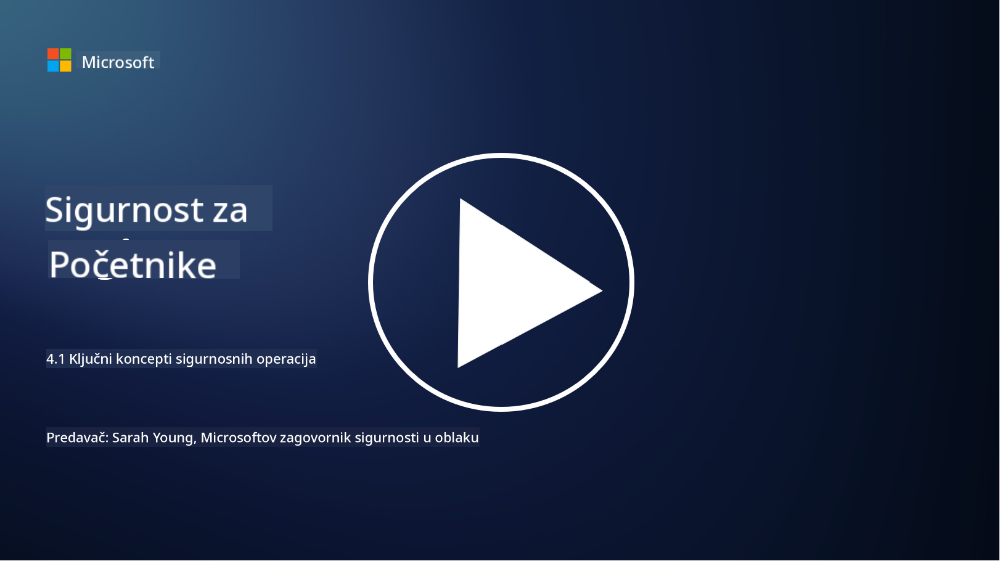

<!--
CO_OP_TRANSLATOR_METADATA:
{
  "original_hash": "6a55b31df9eebf550d040cef0ef7dff3",
  "translation_date": "2025-09-03T22:15:58+00:00",
  "source_file": "4.1 SecOps key concepts.md",
  "language_code": "hr"
}
-->
# Ključni koncepti sigurnosnih operacija

Sigurnosne operacije ključna su komponenta ukupne sigurnosne funkcije organizacije. U ovoj lekciji saznat ćemo više o sljedećem:

- Što je funkcija sigurnosnih operacija unutar poslovanja?

- Kakav oblik mogu imati sigurnosne operacije?

- Kako se sigurnosne operacije razlikuju od tradicionalnih IT operacija?

## Što je funkcija sigurnosnih operacija unutar poslovanja?

Funkcija sigurnosnih operacija unutar poslovanja odnosi se na posvećeni tim ili odjel odgovoran za praćenje, otkrivanje, istraživanje i reagiranje na prijetnje i incidente u području kibernetičke sigurnosti. Primarni cilj funkcije sigurnosnih operacija je osigurati povjerljivost, integritet i dostupnost digitalnih resursa organizacije proaktivnim identificiranjem i ublažavanjem sigurnosnih rizika te učinkovitim reagiranjem na sigurnosne incidente.

## Kakav oblik mogu imati sigurnosne operacije?

Sigurnosne operacije mogu poprimiti različite oblike ovisno o veličini i složenosti organizacije. Neki uobičajeni oblici uključuju:

**Centar za sigurnosne operacije (SOC):** Centralizirani tim odgovoran za 24/7 praćenje, analizu i reagiranje na sigurnosne događaje. SOC-ovi često koriste napredne alate i tehnologije za identifikaciju i reagiranje na prijetnje u stvarnom vremenu.

**Tim za reagiranje na incidente:** Specijalizirani tim fokusiran na reagiranje na sigurnosne incidente i povrede. Provode istrage, koordiniraju napore za reagiranje i olakšavaju oporavak.

**Tim za lov na prijetnje:** Tim koji proaktivno traži znakove naprednih prijetnji i skrivenih ranjivosti koje tradicionalni sigurnosni alati možda neće otkriti.

**Crveni tim/Plavi tim:** Crveni tim simulira napade kako bi identificirao ranjivosti, dok plavi tim brani od tih napada. Oba tima surađuju kako bi poboljšali sigurnosne mjere.

**Pružatelj usluga upravljanih sigurnosnih operacija (MSSP):** Neke organizacije svoje sigurnosne operacije prepuštaju vanjskim pružateljima usluga specijaliziranim za praćenje sigurnosti i reagiranje na incidente.

## Kako se sigurnosne operacije razlikuju od tradicionalnih IT operacija?

Sigurnosne operacije i tradicionalne IT operacije povezane su, ali različite funkcije:

**Fokus:** IT operacije fokusiraju se na upravljanje i održavanje IT infrastrukture organizacije, osiguravajući njezinu funkcionalnost i dostupnost. Sigurnosne operacije, s druge strane, prioritet daju identificiranju i ublažavanju sigurnosnih rizika te reagiranju na incidente.

**Odgovornosti:** IT operacije obuhvaćaju zadatke poput održavanja sustava, ažuriranja softvera i korisničke podrške. Sigurnosne operacije obuhvaćaju otkrivanje prijetnji, reagiranje na incidente, upravljanje ranjivostima i praćenje sigurnosti.

**Pravovremenost:** IT operacije naglašavaju trenutnu dostupnost i performanse sustava. Sigurnosne operacije fokusiraju se na identificiranje i otklanjanje prijetnji, što možda neće uvijek biti u skladu s trenutnom dostupnošću.

**Vještine:** Sigurnosne operacije zahtijevaju specijalizirane vještine u analizi prijetnji, reagiranju na incidente i korištenju alata za kibernetičku sigurnost. IT operacije zahtijevaju stručnost u administraciji sustava, upravljanju mrežom i podršci aplikacijama.

## Tijek reagiranja na incidente

NIST-ov okvir za kibernetičku sigurnost navodi pet glavnih funkcija koje bi se trebale kontinuirano provoditi kao dio operativnog okruženja organizacije kako bi se smanjio rizik od kibernetičke sigurnosti.

Važno je razumjeti da ove aktivnosti trebaju postojati kao dio šireg kruga koji se povezuje i usklađuje s općim procesima kibernetičke sigurnosti organizacije.

**Napomena:** Više o NIST-ovom okviru za kibernetičku sigurnost možete pročitati na [https://www.nist.gov/cybersecurity](https://www.nist.gov/cybersecurity)

## Dodatno čitanje

- [Sigurnosne operacije | Microsoft Learn](https://learn.microsoft.com/security/operations/overview?WT.mc_id=academic-96948-sayoung)
- [Implementacija procesa sigurnosnih operacija | Microsoft Learn](https://learn.microsoft.com/security/operations/?WT.mc_id=academic-96948-sayoung)
- [Što je centar za sigurnosne operacije (SOC)? | Microsoft Security](https://www.microsoft.com/security/business/security-101/what-is-a-security-operations-center-soc?WT.mc_id=academic-96948-sayoung)
- [Što je centar za sigurnosne operacije | Kibernetička sigurnost | CompTIA](https://www.comptia.org/content/articles/what-is-a-security-operations-center)

---

**Odricanje od odgovornosti**:  
Ovaj dokument je preveden pomoću AI usluge za prevođenje [Co-op Translator](https://github.com/Azure/co-op-translator). Iako nastojimo osigurati točnost, imajte na umu da automatski prijevodi mogu sadržavati pogreške ili netočnosti. Izvorni dokument na izvornom jeziku treba smatrati autoritativnim izvorom. Za ključne informacije preporučuje se profesionalni prijevod od strane ljudskog prevoditelja. Ne preuzimamo odgovornost za nesporazume ili pogrešne interpretacije koje mogu proizaći iz korištenja ovog prijevoda.