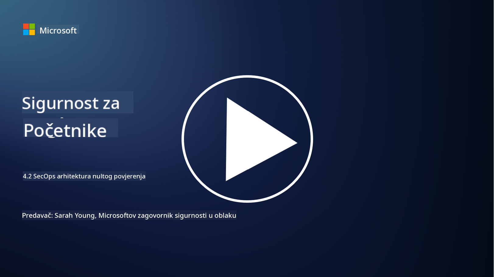

<!--
CO_OP_TRANSLATOR_METADATA:
{
  "original_hash": "45bbdc114e70936816b0b3e7c40189cf",
  "translation_date": "2025-09-03T21:20:31+00:00",
  "source_file": "4.2 SecOps zero trust architecture.md",
  "language_code": "hr"
}
-->
# SecOps arhitektura nulte povjerenja

Sigurnosne operacije čine dva dijela arhitekture nulte povjerenja, a u ovoj lekciji ćemo naučiti o oba:

- Kako IT arhitekture trebaju biti izgrađene da omogućuju centralizirano prikupljanje logova?

- Koje su najbolje prakse za sigurnosne operacije u modernim IT okruženjima?

## Kako IT arhitekture trebaju biti izgrađene da omogućuju centralizirano prikupljanje logova?

Centralizirano prikupljanje logova ključna je komponenta modernih sigurnosnih operacija. Omogućuje organizacijama da prikupljaju logove i podatke iz različitih izvora, poput servera, aplikacija, mrežnih uređaja i sigurnosnih alata, u centralizirani repozitorij za analizu, praćenje i odgovore na incidente. Evo nekoliko najboljih praksi za izgradnju IT arhitektura koje podržavaju centralizirano prikupljanje logova:

1. **Integracija izvora logova**:

- Osigurajte da su svi relevantni uređaji i sustavi konfigurirani za generiranje logova. To uključuje servere, firewalle, rutere, switcheve, aplikacije i sigurnosne uređaje.

- Konfigurirajte izvore logova da prosljeđuju logove centraliziranom kolektoru ili sustavu za upravljanje.

2. **Odabir pravog SIEM alata**:

- Odaberite SIEM (Security Information and Event Management) rješenje koje odgovara potrebama i veličini vaše organizacije.

- Osigurajte da odabrano rješenje podržava prikupljanje, agregaciju, analizu i izvještavanje logova.

3. **Skalabilnost i redundancija**:

- Dizajnirajte arhitekturu za skalabilnost kako bi podržala rastući broj izvora logova i povećan volumen logova.

- Implementirajte redundanciju za visoku dostupnost kako biste spriječili prekide zbog kvarova hardvera ili mreže.

4. **Siguran prijenos logova**:

- Koristite sigurne protokole poput TLS/SSL ili IPsec za prijenos logova od izvora do centraliziranog repozitorija.

- Implementirajte autentifikaciju i kontrolu pristupa kako biste osigurali da samo ovlašteni uređaji mogu slati logove.

5. **Normalizacija**:

- Standardizirajte formate logova i normalizirajte podatke kako biste osigurali dosljednost i olakšali analizu.

6. **Pohrana i zadržavanje**:

- Odredite odgovarajući period zadržavanja logova na temelju zahtjeva za usklađenost i sigurnost.

- Sigurno pohranite logove, štiteći ih od neovlaštenog pristupa i manipulacije.

## Koje su najbolje prakse za sigurnosne operacije u modernim IT okruženjima?

Osim centraliziranog prikupljanja logova, evo nekoliko najboljih praksi za sigurnosne operacije u modernim IT okruženjima:

1. **Kontinuirano praćenje**: Implementirajte kontinuirano praćenje mrežnih i sustavskih aktivnosti kako biste otkrili i odgovorili na prijetnje u stvarnom vremenu.

2. **Obavještavanje o prijetnjama**: Budite informirani o novim prijetnjama i ranjivostima koristeći izvore i usluge obavještavanja o prijetnjama.

3. **Obuka korisnika**: Provodite redovitu obuku o sigurnosnoj svijesti za zaposlenike kako biste smanjili rizike povezane s socijalnim inženjeringom i phishing napadima.

4. **Plan odgovora na incidente**: Razvijte i testirajte plan odgovora na incidente kako biste osigurali brz i učinkovit odgovor na sigurnosne incidente.

5. **Automatizacija sigurnosti**: Koristite alate za automatizaciju i orkestraciju sigurnosti kako biste pojednostavili odgovore na incidente i ponavljajuće zadatke.

6. **Backup i oporavak**: Implementirajte robusna rješenja za backup i oporavak od katastrofa kako biste osigurali dostupnost podataka u slučaju gubitka podataka ili ransomware napada.

## Dodatno čitanje

- [Microsoft Security Best Practices module: Security operations | Microsoft Learn](https://learn.microsoft.com/security/operations/security-operations-videos-and-decks?WT.mc_id=academic-96948-sayoung)
- [Security operations - Cloud Adoption Framework | Microsoft Learn](https://learn.microsoft.com/azure/cloud-adoption-framework/secure/security-operations?WT.mc_id=academic-96948-sayoung)
- [What is Security Operations and Analytics Platform Architecture? A Definition of SOAPA, How It Works, Benefits, and More (digitalguardian.com)](https://www.digitalguardian.com/blog/what-security-operations-and-analytics-platform-architecture-definition-soapa-how-it-works#:~:text=All%20in%20all%2C%20security%20operations%20and%20analytics%20platform,become%20more%20efficient%20and%20operative%20with%20your%20security.)

---

**Odricanje od odgovornosti**:  
Ovaj dokument je preveden pomoću AI usluge za prevođenje [Co-op Translator](https://github.com/Azure/co-op-translator). Iako nastojimo osigurati točnost, imajte na umu da automatski prijevodi mogu sadržavati pogreške ili netočnosti. Izvorni dokument na izvornom jeziku treba smatrati autoritativnim izvorom. Za ključne informacije preporučuje se profesionalni prijevod od strane čovjeka. Ne preuzimamo odgovornost za bilo kakva nesporazuma ili pogrešna tumačenja koja proizlaze iz korištenja ovog prijevoda.