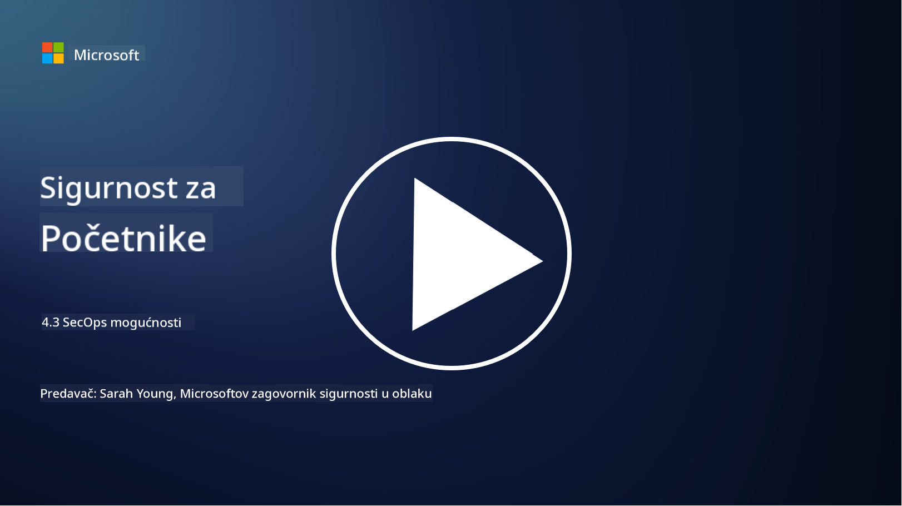

<!--
CO_OP_TRANSLATOR_METADATA:
{
  "original_hash": "553eb694c89f1caca0694e8d8ab89e0e",
  "translation_date": "2025-09-03T21:46:33+00:00",
  "source_file": "4.3 SecOps capabilities.md",
  "language_code": "hr"
}
-->
# SecOps mogućnosti

U ovom dijelu ćemo detaljnije obraditi osnovne alate i mogućnosti koje se mogu koristiti u sigurnosnim operacijama.

U ovoj lekciji ćemo obraditi:

- Što je alat za upravljanje sigurnosnim informacijama i događajima (SIEM)?

- Što je XDR?

- Koje mogućnosti se mogu koristiti za poboljšanje sigurnosnih operacija?

## Što je alat za upravljanje sigurnosnim informacijama i događajima (SIEM)?

Alat za upravljanje sigurnosnim informacijama i događajima (SIEM) koristi se za analizu sigurnosnih upozorenja generiranih u IT okruženju organizacije. Prikupljaju, agregiraju, povezuju i analiziraju podatke iz dnevnika i sigurnosne događaje iz različitih izvora, poput mrežnih uređaja, poslužitelja, aplikacija i sigurnosnih sustava.

Ključne funkcije i mogućnosti SIEM alata uključuju:

1. **Prikupljanje dnevnika**: SIEM alati prikupljaju podatke iz dnevnika i sigurnosne događaje s raznih uređaja, sustava i aplikacija, uključujući vatrozide, sustave za otkrivanje upada, antivirusni softver i druge.

2. **Normalizacija podataka**: Normaliziraju podatke iz dnevnika u zajednički format kako bi olakšali analizu i povezivanje.

3. **Povezivanje događaja**: SIEM alati povezuju događaje kako bi identificirali obrasce i anomalije koje mogu ukazivati na sigurnosne incidente ili prijetnje.

4. **Upozorenja i obavijesti**: Generiraju upozorenja i obavijesti u stvarnom vremenu kada se otkriju sumnjive aktivnosti ili sigurnosna kršenja, omogućujući trenutnu reakciju.

5. **Otkrivanje incidenata**: Olakšavaju otkrivanje sigurnosnih incidenata, uključujući neovlašteni pristup, proboje podataka, infekcije zlonamjernim softverom i prijetnje iznutra.

6. **Analitika ponašanja korisnika i entiteta (UEBA)**: Neki SIEM alati uključuju UEBA mogućnosti za identifikaciju abnormalnog ponašanja korisnika i entiteta koje može ukazivati na ugrožene račune ili prijetnje iznutra.

7. **Integracija s obavještajnim podacima o prijetnjama**: SIEM alati mogu se integrirati s obavještajnim podacima o prijetnjama kako bi poboljšali otkrivanje prijetnji usporedbom poznatih indikatora kompromitacije (IOC) s mrežnom aktivnošću.

8. **Automatizacija i orkestracija**: Automatizacijske značajke omogućuju SIEM alatima da automatiziraju odgovore na uobičajene sigurnosne incidente, smanjujući vrijeme reakcije i ručni rad.

9. **Nadzorna ploča i vizualizacija**: Nude nadzorne ploče i alate za vizualizaciju za praćenje sigurnosnih podataka i izradu prilagođenih izvještaja.

10. **Integracija s drugim sigurnosnim alatima**: SIEM alati često se integriraju s drugim sigurnosnim alatima i tehnologijama, poput rješenja za otkrivanje i odgovor na prijetnje na krajnjim točkama (EDR), kako bi pružili cjelovit pregled sigurnosnog stanja organizacije.

## Što je XDR?

XDR (Prošireno otkrivanje i odgovor) je tehnologija koja proširuje mogućnosti tradicionalnog otkrivanja i odgovora na prijetnje na krajnjim točkama (EDR) i kombinira ih s širim sigurnosnim telemetrijskim podacima iz različitih izvora kako bi pružila sveobuhvatniji pregled sigurnosnog stanja organizacije. XDR ima za cilj poboljšati otkrivanje prijetnji, odgovor na incidente i ukupnu sigurnost rješavanjem ograničenja oslanjanja isključivo na EDR, SIEM ili druge pojedinačne sigurnosne alate.

Ključne karakteristike i komponente XDR-a uključuju:

1. **Integracija podataka**: XDR integrira podatke iz više izvora, uključujući krajnje točke, mrežni promet, usluge u oblaku, e-poštu i druge. Ova sveobuhvatna agregacija podataka pruža širi kontekst za otkrivanje i analizu prijetnji.

2. **Napredna analitika**: XDR koristi naprednu analitiku, strojno učenje i analizu ponašanja za identifikaciju i prioritizaciju sigurnosnih prijetnji. Traži obrasce i anomalije u integriranim podacima kako bi otkrio poznate i nepoznate prijetnje.

3. **Automatizirano otkrivanje prijetnji**: XDR automatizira otkrivanje sigurnosnih prijetnji i anomalija povezivanjem informacija iz različitih izvora. Može identificirati složene napade koji se protežu kroz više vektora.

4. **Istraživanje i odgovor na incidente**: XDR pruža alate za istraživanje i odgovor na incidente, pomažući sigurnosnim timovima da brzo procijene opseg i utjecaj incidenata te poduzmu odgovarajuće mjere.

5. **Integracija obavještajnih podataka o prijetnjama**: Integrira obavještajne podatke o prijetnjama kako bi poboljšao otkrivanje prijetnji usporedbom poznatih indikatora kompromitacije (IOC) s aktivnostima mreže i krajnjih točaka organizacije.

6. **Jedinstvena konzola**: XDR obično nudi jedinstvenu konzolu ili nadzornu ploču gdje sigurnosni timovi mogu pregledavati i upravljati sigurnosnim upozorenjima i incidentima iz različitih izvora na centraliziran način.

7. **Pokrivenost više platformi**: XDR rješenja pokrivaju širok raspon platformi, uključujući krajnje točke, poslužitelje, okruženja u oblaku i mobilne uređaje, čineći ih prikladnima za moderna, višestruka IT okruženja.

## Koje mogućnosti se mogu koristiti za poboljšanje sigurnosnih operacija?

Za poboljšanje sigurnosnih operacija, organizacije mogu koristiti nekoliko mogućnosti uz SIEM alate:

1. **Strojno učenje i umjetna inteligencija**: Implementirajte naprednu analitiku, strojno učenje i AI za otkrivanje prijetnji u razvoju i automatizaciju lova na prijetnje.

2. **Analitika ponašanja korisnika i entiteta (UEBA)**: Analizirajte ponašanje korisnika i entiteta kako biste otkrili anomalije i prijetnje iznutra.

3. **Obavještajni podaci o prijetnjama**: Integrirajte obavještajne podatke o prijetnjama kako biste ostali informirani o najnovijim prijetnjama i indikatorima kompromitacije.

4. **Orkestracija, automatizacija i odgovor na sigurnosne incidente (SOAR)**: Implementirajte SOAR platforme za automatizaciju odgovora na incidente i pojednostavljenje tijeka rada sigurnosnih operacija.

5. **Tehnologije obmane**: Koristite tehnologije obmane za zavaravanje i otkrivanje napadača unutar mreže.

## Dodatno čitanje

- [What is SIEM? | Microsoft Security](https://www.microsoft.com/security/business/security-101/what-is-siem?WT.mc_id=academic-96948-sayoung)
- [What Is SIEM? - Security Information and Event Management - Cisco](https://www.cisco.com/c/en/us/products/security/what-is-siem.html)
- [Security information and event management - Wikipedia](https://en.wikipedia.org/wiki/Security_information_and_event_management)
- [What Is XDR? | Microsoft Security](https://www.microsoft.com/security/business/security-101/what-is-xdr?WT.mc_id=academic-96948-sayoung)
- [XDR & XDR Security (kaspersky.com.au)](https://www.kaspersky.com.au/resource-center/definitions/what-is-xdr)
- [The Power of SecOps: Redefining Core Security Capabilities - The New Stack](https://thenewstack.io/the-power-of-secops-redefining-core-security-capabilities/)
- [Seven Steps to Improve Your Security Operations and Response (securityintelligence.com)](https://securityintelligence.com/seven-steps-to-improve-your-security-operations-and-response/)

---

**Odricanje od odgovornosti**:  
Ovaj dokument je preveden pomoću AI usluge za prevođenje [Co-op Translator](https://github.com/Azure/co-op-translator). Iako nastojimo osigurati točnost, imajte na umu da automatski prijevodi mogu sadržavati pogreške ili netočnosti. Izvorni dokument na izvornom jeziku treba smatrati autoritativnim izvorom. Za ključne informacije preporučuje se profesionalni prijevod od strane čovjeka. Ne preuzimamo odgovornost za bilo kakva nesporazuma ili pogrešna tumačenja koja proizlaze iz korištenja ovog prijevoda.