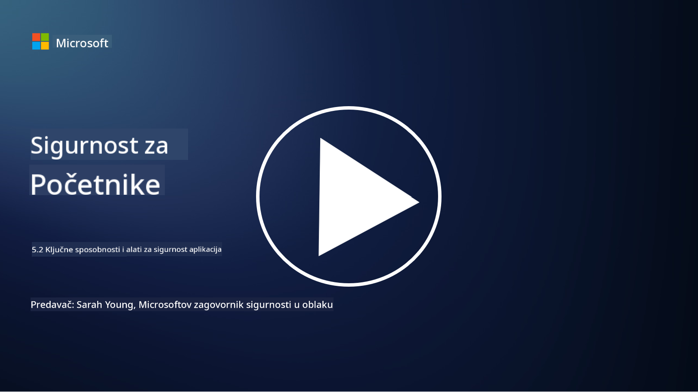

<!--
CO_OP_TRANSLATOR_METADATA:
{
  "original_hash": "790a3fa7e535ec60bb51bde13e759781",
  "translation_date": "2025-09-03T21:25:23+00:00",
  "source_file": "5.2 AppSec key capabilities.md",
  "language_code": "hr"
}
-->
## Uvod

U ovoj lekciji obradit ćemo ključne mogućnosti i alate koji se koriste u sigurnosti aplikacija.

## Ključne mogućnosti i alati za sigurnost aplikacija

Ključne mogućnosti i alati koji se koriste u sigurnosti aplikacija ključni su za prepoznavanje, ublažavanje i sprječavanje sigurnosnih ranjivosti i prijetnji u softverskim aplikacijama. Evo nekih od najvažnijih:

**1. Statičko testiranje sigurnosti aplikacija (SAST)**:

- **Mogućnosti**: Analizira izvorni kod, bajtkod ili binarni kod kako bi identificirao sigurnosne ranjivosti u kodnoj bazi aplikacije.

- **Alati**: Primjeri uključuju Fortify, Checkmarx i Veracode.

**2. Dinamičko testiranje sigurnosti aplikacija (DAST)**:

- **Mogućnosti**: Skenira aplikaciju u radu kako bi identificirao ranjivosti slanjem ulaznih zahtjeva i analizom odgovora.

- **Alati**: Primjeri uključuju ZAP, Burp Suite i Qualys Web Application Scanning.

**3. Interaktivno testiranje sigurnosti aplikacija (IAST)**:

- **Mogućnosti**: Kombinira elemente SAST-a i DAST-a za analizu koda tijekom izvođenja, pružajući preciznije rezultate i smanjujući lažne pozitivne rezultate.

- **Alati**: Primjeri uključuju Contrast Security i HCL AppScan.

**4. Samozaštita aplikacija u stvarnom vremenu (RASP)**:

- **Mogućnosti**: Prati i štiti aplikacije u stvarnom vremenu, otkrivajući i reagirajući na sigurnosne prijetnje dok se događaju.

- **Alati**: Primjeri uključuju Veracode Runtime Protection i F5 Advanced WAF s RASP-om.

**5. Vatrozidi za web aplikacije (WAF)**:

- **Mogućnosti**: Pruža zaštitni sloj između aplikacije i interneta, filtrirajući dolazni promet i blokirajući zlonamjerne zahtjeve.

- **Alati**: Primjeri uključuju ModSecurity, AWS WAF i Akamai Kona Site Defender.

**6. Skeniranje ovisnosti**:

- **Mogućnosti**: Identificira ranjivosti u bibliotekama i komponentama trećih strana koje se koriste u aplikaciji.

- **Alati**: Primjeri uključuju OWASP Dependency-Check i Snyk.

**7. Penetracijsko testiranje (Pen Testing)**:

- **Mogućnosti**: Simulira stvarne napade kako bi otkrio ranjivosti i procijenio sigurnost aplikacije.

- **Alati**: Provode ga certificirani etički hakeri i sigurnosni stručnjaci koristeći razne alate poput Metasploit i Nmap.

**8. Skeniranje i analiza sigurnosti**:

- **Mogućnosti**: Skenira poznate ranjivosti, pogreške u konfiguraciji i sigurnosne nepravilnosti.

- **Alati**: Primjeri uključuju Nessus, Qualys Vulnerability Management i OpenVAS.

**9. Alati za sigurnost kontejnera**:

- **Mogućnosti**: Fokusiraju se na osiguranje aplikacija u kontejnerima i njihovih okruženja.

- **Alati**: Primjeri uključuju Docker Security Scanning i Aqua Security.

**10. Obuka za siguran razvoj**:

- **Mogućnosti**: Pruža programe obuke i podizanja svijesti za razvojne timove kako bi se potaknule sigurne prakse kodiranja.

- **Alati**: Prilagođeni programi obuke i platforme.

**11. Okviri za testiranje sigurnosti**:

- **Mogućnosti**: Pruža sveobuhvatne okvire za testiranje za različite potrebe testiranja sigurnosti aplikacija.

- **Alati**: OWASP Amass, OWASP OWTF i FrAppSec.

**12. Alati za pregled sigurnosti koda**:

- **Mogućnosti**: Pregledava izvorni kod radi sigurnosnih ranjivosti i najboljih praksi kodiranja.

- **Alati**: Primjeri uključuju SonarQube i Checkmarx.

**13. Alati za sigurnost API-ja i mikroservisa**:

- **Mogućnosti**: Fokusiraju se na osiguranje API-ja i mikroservisa, uključujući autentifikaciju, autorizaciju i zaštitu podataka.

- **Alati**: Primjeri uključuju Apigee, AWS API Gateway i Istio.

## Dodatno čitanje

- [What Is Application Security? Concepts, Tools & Best Practices | HackerOne](https://www.hackerone.com/knowledge-center/what-application-security-concepts-tools-best-practices)
- [What is IAST? (Interactive Application Security Testing) (comparitech.com)](https://www.comparitech.com/net-admin/what-is-iast/)
- [10 Types of Application Security Testing Tools: When and How to Use Them (cmu.edu)](https://insights.sei.cmu.edu/blog/10-types-of-application-security-testing-tools-when-and-how-to-use-them/)
- [Shifting the Balance of Cybersecurity Risk: Principles and Approaches for Security-by-Design and Default | Cyber.gov.au](https://www.cyber.gov.au/about-us/view-all-content/publications/principles-and-approaches-for-security-by-design-and-default)

---

**Odricanje od odgovornosti**:  
Ovaj dokument je preveden pomoću AI usluge za prevođenje [Co-op Translator](https://github.com/Azure/co-op-translator). Iako nastojimo osigurati točnost, imajte na umu da automatski prijevodi mogu sadržavati pogreške ili netočnosti. Izvorni dokument na izvornom jeziku treba smatrati autoritativnim izvorom. Za ključne informacije preporučuje se profesionalni prijevod od strane ljudskog prevoditelja. Ne preuzimamo odgovornost za bilo kakve nesporazume ili pogrešne interpretacije koje proizlaze iz korištenja ovog prijevoda.