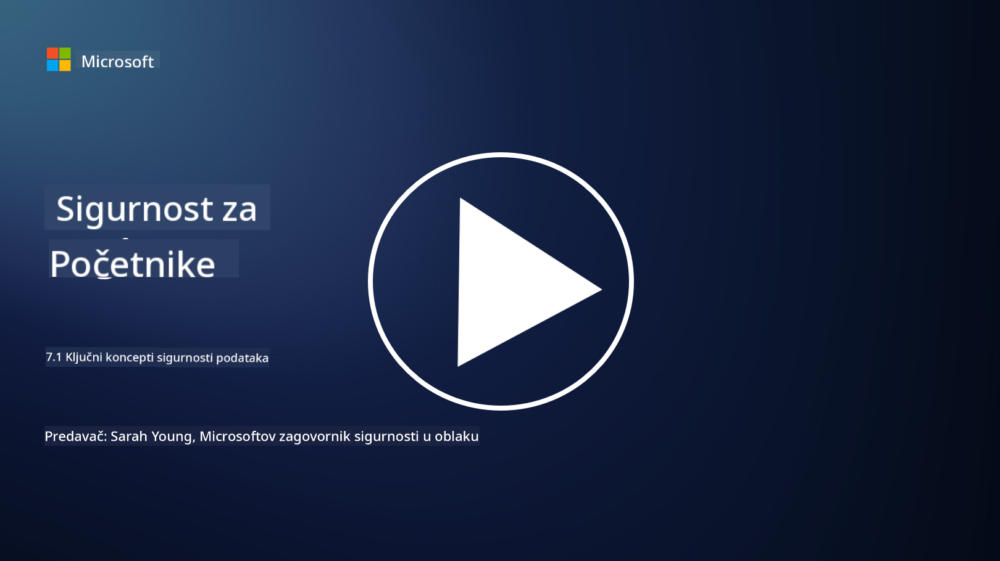

<!--
CO_OP_TRANSLATOR_METADATA:
{
  "original_hash": "9703868f41dcddd5a98dea9ea6fcd94d",
  "translation_date": "2025-09-03T20:40:11+00:00",
  "source_file": "7.1 Data security key concepts.md",
  "language_code": "hr"
}
-->
# Ključni koncepti sigurnosti podataka

Već smo spomenuli sigurnost podataka i dotaknuli se ove teme nekoliko puta tijekom ovog tečaja. Sada ćemo se detaljnije pozabaviti ovom temom. U ovoj lekciji naučit ćete:

- Što je sigurnost podataka?

- Što je klasifikacija podataka?

- Što je upravljanje životnim ciklusom podataka?

- Što je sprječavanje gubitka podataka (DLP)?

- Zašto je sigurnost podataka važna za organizaciju?

## Što je sigurnost podataka?

**Sigurnost podataka** odnosi se na praksu zaštite digitalnih podataka, poput baza podataka, datoteka i osjetljivih informacija, od neovlaštenog pristupa, otkrivanja, izmjene ili uništenja. Primarni cilj sigurnosti podataka je osigurati povjerljivost, integritet i dostupnost podataka. To uključuje primjenu kombinacije tehničkih, administrativnih i fizičkih sigurnosnih mjera za zaštitu podataka od raznih prijetnji i ranjivosti, uključujući kibernetičke napade, unutarnje prijetnje i povrede podataka. Sigurnosne mjere mogu uključivati enkripciju, kontrolu pristupa, autentifikaciju, revizijske tragove i sigurnosne politike.

## Što je klasifikacija podataka?

**Klasifikacija podataka** je proces kategorizacije podataka na temelju njihove osjetljivosti, vrijednosti i važnosti za organizaciju. Cilj klasifikacije podataka je pomoći organizacijama da identificiraju i prioritiziraju zaštitu i rukovanje različitim vrstama podataka. Uobičajene kategorije klasifikacije podataka uključuju "javno," "interno," "povjerljivo" i "ograničeno" ili "visoko povjerljivo." Nakon što se podaci klasificiraju, organizacije mogu primijeniti odgovarajuće sigurnosne kontrole i ograničenja pristupa kako bi osigurale da su osjetljivi podaci adekvatno zaštićeni i da se poštuju regulatorni zahtjevi.

## Što je upravljanje životnim ciklusom podataka?

**Upravljanje životnim ciklusom podataka** je strukturirani pristup upravljanju podacima tijekom cijelog njihovog životnog ciklusa, od stvaranja ili pribavljanja do arhiviranja ili brisanja. Životni ciklus podataka obično se sastoji od faza poput stvaranja, pohrane, obrade, prijenosa, arhiviranja i uklanjanja. Upravljanje životnim ciklusom podataka uključuje definiranje politika i procedura za svaku fazu životnog ciklusa podataka, uključujući zadržavanje podataka, kontrolu pristupa, sigurnosne kopije i čišćenje podataka. Učinkovito upravljanje životnim ciklusom podataka pomaže organizacijama optimizirati pohranu podataka, poboljšati kvalitetu podataka i osigurati usklađenost s propisima o zaštiti podataka.

## Što je sprječavanje gubitka podataka (DLP)?

**Sprječavanje gubitka podataka (DLP)** odnosi se na skup tehnologija, politika i praksi osmišljenih za sprječavanje neovlaštenog pristupa, dijeljenja ili curenja osjetljivih ili povjerljivih podataka. DLP rješenja koriste inspekciju sadržaja i kontekstualnu analizu za praćenje i kontrolu podataka u pokretu (npr. e-pošta, web promet), podataka u mirovanju (npr. pohranjene datoteke i baze podataka) i podataka u upotrebi (npr. podaci koje korisnici pristupaju ili obrađuju). Cilj DLP-a je identificirati i blokirati ili šifrirati osjetljive podatke kako bi se spriječile povrede podataka, osigurala usklađenost s propisima o zaštiti podataka i zaštitila reputacija organizacije.

## Zašto je sigurnost podataka važna za organizaciju?

Sigurnost podataka je od ključne važnosti za organizacije iz nekoliko razloga:

- **Zaštita osjetljivih informacija**: Organizacije često pohranjuju osjetljive podatke, poput podataka o klijentima, intelektualnog vlasništva, financijskih podataka i informacija o zaposlenicima. Sigurnost podataka štiti ove osjetljive informacije od neovlaštenog pristupa ili krađe.

- **Usklađenost**: Mnoge industrije i jurisdikcije imaju stroge propise o zaštiti podataka i privatnosti. Sigurnost podataka pomaže organizacijama da se pridržavaju ovih zakona, izbjegavajući pravne kazne i štetu reputaciji.

- **Sprječavanje povreda podataka**: Povrede podataka mogu rezultirati financijskim gubicima, štetom za reputaciju i pravnim posljedicama. Učinkovite mjere sigurnosti podataka pomažu u sprječavanju povreda podataka ili ograničavanju njihovog utjecaja.

- **Očuvanje povjerenja**: Klijenti i dionici vjeruju organizacijama s njihovim podacima. Povrede sigurnosti podataka narušavaju povjerenje. Održavanje snažne sigurnosti podataka pomaže očuvanju povjerenja i povjerenja klijenata.

- **Konkurentska prednost**: Pokazivanje predanosti sigurnosti podataka može biti konkurentska prednost. Klijenti i partneri vjerojatnije će surađivati s organizacijama koje ozbiljno shvaćaju sigurnost podataka.

- **Operativni kontinuitet**: Mjere sigurnosti podataka, uključujući sigurnosne kopije podataka i planiranje oporavka od katastrofa, pomažu u osiguravanju dostupnosti ključnih podataka i kontinuiteta poslovanja u slučaju gubitka podataka ili katastrofa.

- **Zaštita od unutarnjih prijetnji**: Mjere sigurnosti podataka također se bave prijetnjama unutar organizacije, uključujući slučajno izlaganje podataka od strane zaposlenika i zlonamjerne radnje od strane unutarnjih osoba.

Ukratko, sigurnost podataka je ključna za zaštitu osjetljivih informacija, usklađenost s propisima, sprječavanje povreda podataka, očuvanje povjerenja i osiguranje kontinuiranog uspjeha i reputacije organizacije.

## Dodatno čitanje

- [What Is Data Security? | Microsoft Security](https://www.microsoft.com/en-au/security/business/security-101/what-is-data-security?WT.mc_id=academic-96948-sayoung)
- [Automatically Classify & Protect Documents & Data | Microsoft Purview Information Protection](https://youtu.be/v8LqmzBUaOo)
- [Example data classification policy](https://www.cmu.edu/data/guidelines/data-classification.html)
- [What is Data Security? Data Security Definition and Overview | IBM](https://www.ibm.com/topics/data-security)
- [Data Lifecycle Management: A 2023 Guide for Your Business (cloudwards.net)](https://www.cloudwards.net/data-lifecycle-management/)
- [What is data loss prevention (DLP)? | Microsoft Security](https://www.microsoft.com/security/business/security-101/what-is-data-loss-prevention-dlp?WT.mc_id=academic-96948-sayoung)
- [What is DLP? How data loss prevention software works and why you need it | CSO Online](https://www.csoonline.com/article/569559/what-is-dlp-how-data-loss-prevention-software-works-and-why-you-need-it.html)

---

**Odricanje od odgovornosti**:  
Ovaj dokument je preveden pomoću AI usluge za prevođenje [Co-op Translator](https://github.com/Azure/co-op-translator). Iako nastojimo osigurati točnost, imajte na umu da automatski prijevodi mogu sadržavati pogreške ili netočnosti. Izvorni dokument na izvornom jeziku treba smatrati autoritativnim izvorom. Za ključne informacije preporučuje se profesionalni prijevod od strane stručnjaka. Ne preuzimamo odgovornost za nesporazume ili pogrešna tumačenja koja mogu proizaći iz korištenja ovog prijevoda.