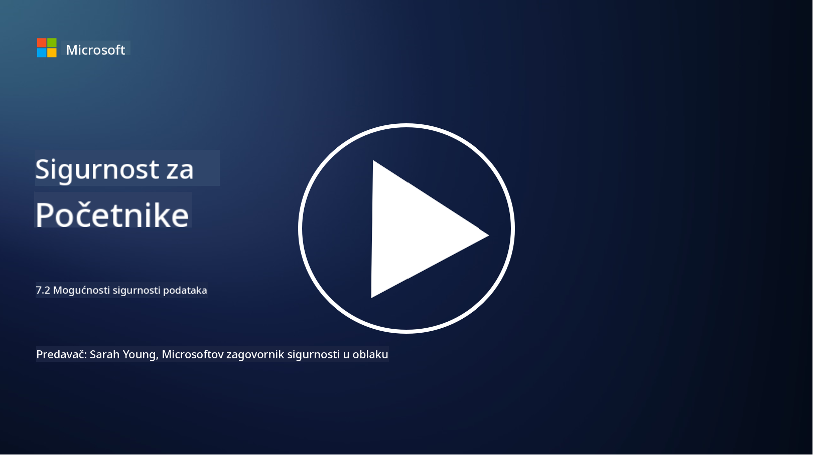

<!--
CO_OP_TRANSLATOR_METADATA:
{
  "original_hash": "50697add9758e54693442d502d2d5f8a",
  "translation_date": "2025-09-03T21:29:32+00:00",
  "source_file": "7.2 Data security capabilities.md",
  "language_code": "hr"
}
-->
# Mogućnosti zaštite podataka

U ovom odjeljku detaljnije ćemo obraditi osnovne alate i mogućnosti koji se koriste za zaštitu podataka:

**Uvod**

U ovoj lekciji obradit ćemo:

- Što su alati za sprječavanje gubitka podataka?

- Što su alati za upravljanje rizicima od insajdera?

- Koji alati za zadržavanje podataka su dostupni?

## Što su alati za sprječavanje gubitka podataka?

Alati za sprječavanje gubitka podataka (Data Loss Prevention - DLP) odnose se na skup softverskih rješenja i tehnologija osmišljenih za sprječavanje neovlaštenog pristupa, dijeljenja ili curenja osjetljivih ili povjerljivih podataka unutar organizacije. Ovi alati koriste inspekciju sadržaja, provođenje pravila i praćenje kako bi identificirali i zaštitili osjetljive podatke od izlaganja ili zloupotrebe. Primjeri DLP proizvoda uključuju: Symantec Data Loss Prevention, McAfee Total Protection for Data Loss Prevention, Microsoft 365 DLP**: Integrira se s Microsoft 365 aplikacijama kako bi pomogao organizacijama u identificiranju i zaštiti osjetljivih podataka unutar e-mailova, dokumenata i poruka.

## Što su alati za upravljanje rizicima od insajdera?

Alati za upravljanje rizicima od insajdera pomažu organizacijama u identificiranju i ublažavanju rizika koje predstavljaju zaposlenici, vanjski suradnici ili partneri koji mogu namjerno ili nenamjerno ugroziti sigurnost podataka. Ovi alati prate ponašanje korisnika, obrasce pristupa i korištenje podataka kako bi otkrili sumnjive aktivnosti i potencijalne prijetnje od insajdera. Primjeri proizvoda za upravljanje rizicima od insajdera uključuju: Microsoft Insider Risk Management (dio Microsoft 365), Forcepoint Insider Threat Data Protection, Varonis Insider Threat Detection.

## Koji alati za zadržavanje podataka su dostupni?

Alati za zadržavanje podataka uključuju softver i rješenja osmišljena za upravljanje zadržavanjem i brisanjem podataka u skladu s politikama zadržavanja podataka organizacije i zakonskim zahtjevima. Ovi alati pomažu automatizirati proces zadržavanja podataka na određeno vrijeme i sigurno ih brisati kada više nisu potrebni. Primjeri proizvoda za zadržavanje podataka uključuju: Veritas Enterprise Vault, Commvault Complete Data Protection, Microsoft data lifecycle management. Ova rješenja pomažu organizacijama u održavanju kontrole nad zadržavanjem i odlaganjem podataka, osiguravajući usklađenost s propisima o zaštiti podataka dok učinkovito upravljaju podacima tijekom njihovog životnog ciklusa.

## Dodatno čitanje

- [Vodič za upravljanje sigurnosnim položajem podataka (DSPM) | CSA (cloudsecurityalliance.org)](https://cloudsecurityalliance.org/blog/2023/03/31/the-big-guide-to-data-security-posture-management-dspm/)
- [Sprječavanje gubitka podataka na uređajima, aplikacijama i uslugama | Microsoft Purview](https://youtu.be/hvqq8L_0kgI)
- [18 najboljih alata za sprječavanje gubitka podataka 2023 (besplatni + plaćeni) (comparitech.com)](https://www.comparitech.com/data-privacy-management/data-loss-prevention-tools-software/)
- [Sprječavanje gubitka podataka (nist.gov)](https://tsapps.nist.gov/publication/get_pdf.cfm?pub_id=904672)
- [Saznajte više o upravljanju rizicima od insajdera | Microsoft Learn](https://learn.microsoft.com/purview/insider-risk-management?WT.mc_id=academic-96948-sayoung)
- [Upravljanje životnim ciklusom podataka | IBM](https://www.ibm.com/topics/data-lifecycle-management)
- [Što je upravljanje životnim ciklusom podataka (DLM)? | Najbolje prakse za 2023. (selecthub.com)](https://www.selecthub.com/big-data-analytics/data-lifecycle-management/)

---

**Odricanje od odgovornosti**:  
Ovaj dokument je preveden pomoću AI usluge za prevođenje [Co-op Translator](https://github.com/Azure/co-op-translator). Iako nastojimo osigurati točnost, imajte na umu da automatski prijevodi mogu sadržavati pogreške ili netočnosti. Izvorni dokument na izvornom jeziku treba smatrati autoritativnim izvorom. Za ključne informacije preporučuje se profesionalni prijevod od strane ljudskog prevoditelja. Ne preuzimamo odgovornost za bilo kakve nesporazume ili pogrešne interpretacije koje proizlaze iz korištenja ovog prijevoda.