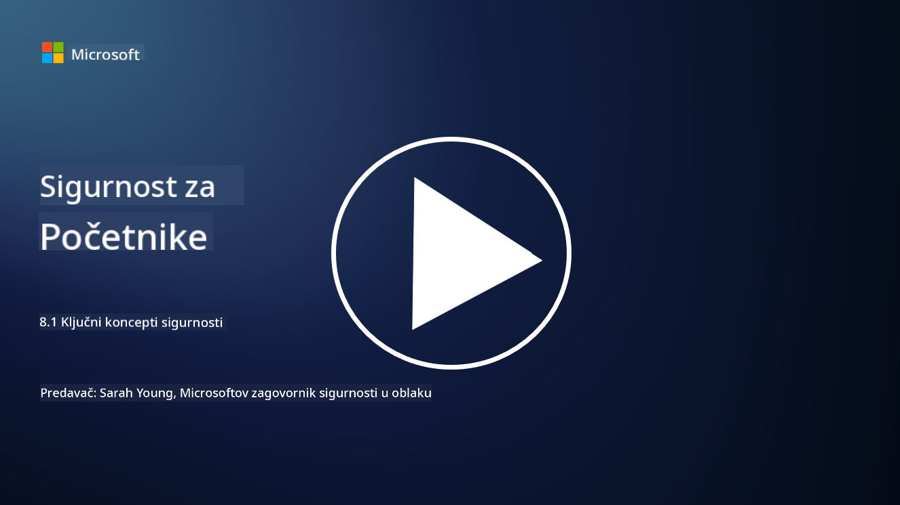

<!--
CO_OP_TRANSLATOR_METADATA:
{
  "original_hash": "66b61d96936cf25d20fcb411d4ce5227",
  "translation_date": "2025-09-03T19:43:09+00:00",
  "source_file": "8.1 AI security key concepts.md",
  "language_code": "hr"
}
-->
# Ključni koncepti sigurnosti AI-a

## Kako se sigurnost AI-a razlikuje od tradicionalne kibernetičke sigurnosti?

Osiguravanje AI sustava donosi jedinstvene izazove u usporedbi s tradicionalnom kibernetičkom sigurnošću, uglavnom zbog prirode sposobnosti učenja i procesa donošenja odluka AI-a. Evo nekih ključnih razlika:

-   **Integritet podataka**: AI sustavi uvelike ovise o podacima za učenje. Osiguravanje integriteta tih podataka je ključno, jer napadači mogu manipulirati podacima kako bi utjecali na ponašanje AI-a, taktika poznata kao trovanje podataka.
-   **Sigurnost modela**: Sam model donošenja odluka AI-a može biti meta. Napadači mogu pokušati reverzno inženjeringirati model ili iskoristiti njegove slabosti kako bi donio pogrešne ili štetne odluke.
-   **Adversarijalni napadi**: AI sustavi mogu biti osjetljivi na adversarijalne napade, gdje male, često neprimjetne promjene ulaznih podataka mogu uzrokovati pogreške ili netočne predikcije AI-a.
-   **Sigurnost infrastrukture**: Iako se tradicionalna kibernetička sigurnost također fokusira na zaštitu infrastrukture, AI sustavi mogu imati dodatne slojeve složenosti, poput usluga temeljenih na oblaku ili specijaliziranog hardvera, koji zahtijevaju specifične sigurnosne mjere.
-   **Etička razmatranja**: Korištenje AI-a u sigurnosti donosi etička razmatranja, poput zabrinutosti za privatnost i potencijalne pristranosti u donošenju odluka, koja se moraju adresirati u sigurnosnoj strategiji.

Sveukupno, osiguravanje AI sustava zahtijeva drugačiji pristup koji uzima u obzir jedinstvene aspekte AI tehnologije, uključujući zaštitu podataka, modela i procesa učenja AI-a, uz istovremeno rješavanje etičkih implikacija primjene AI-a.

Sigurnost AI-a i tradicionalna kibernetička sigurnost dijele mnoge sličnosti, ali također imaju neke značajne razlike zbog jedinstvenih karakteristika i sposobnosti sustava umjetne inteligencije. Evo kako se razlikuju:

- **Složenost prijetnji**: AI sustavi uvode nove slojeve složenosti u kibernetičku sigurnost. Tradicionalna kibernetička sigurnost primarno se bavi prijetnjama poput zlonamjernog softvera, phishing napada i upada u mrežu. Međutim, AI sustavi mogu biti osjetljivi na napade poput adversarijalnih napada, trovanja podataka i izbjegavanja modela, koji ciljaju same algoritme strojnog učenja.

- **Površina napada**: AI sustavi često imaju veću površinu napada u usporedbi s tradicionalnim sustavima. To je zato što se ne oslanjaju samo na softver, već i na podatke i modele. Napadači mogu ciljati podatke za treniranje, manipulirati modelima ili iskorištavati ranjivosti u samim algoritmima.

- **Prilagodljivost prijetnji**: AI sustavi mogu se prilagoditi i učiti iz svoje okoline, što ih može učiniti osjetljivijima na prilagodljive i evoluirajuće prijetnje. Tradicionalne mjere kibernetičke sigurnosti možda neće biti dovoljne za obranu od napada koji se stalno razvijaju na temelju ponašanja AI sustava.

- **Interpretacija i objašnjivost**: Razumijevanje zašto je AI sustav donio određenu odluku često je izazovnije u usporedbi s tradicionalnim softverskim sustavima. Ovaj nedostatak interpretacije i objašnjivosti može otežati učinkovito otkrivanje i ublažavanje napada na AI sustave.

- **Zabrinutost za privatnost podataka**: AI sustavi često se oslanjaju na velike količine podataka, što može dovesti do rizika za privatnost ako se ne pravilno upravlja. Tradicionalne mjere kibernetičke sigurnosti možda neće adekvatno adresirati ove zabrinutosti za privatnost podataka specifične za AI sustave.

- **Regulatorna usklađenost**: Regulatorni okvir za sigurnost AI-a još se razvija, s posebnim propisima i standardima koji se pojavljuju kako bi se adresirali jedinstveni izazovi koje postavljaju AI sustavi. Tradicionalni okviri kibernetičke sigurnosti možda će trebati biti prošireni ili prilagođeni kako bi se osigurala usklađenost s ovim novim propisima.

- **Etička razmatranja**: Sigurnost AI-a uključuje ne samo zaštitu sustava od zlonamjernih napada, već i osiguravanje da se AI sustavi koriste na etičan i odgovoran način. To uključuje razmatranja poput pravednosti, transparentnosti i odgovornosti, koja možda nisu toliko istaknuta u tradicionalnoj kibernetičkoj sigurnosti.

## Kako je sigurnost AI-a ista kao osiguravanje tradicionalnih IT sustava?

Osiguravanje AI sustava dijeli nekoliko temeljnih principa s tradicionalnom kibernetičkom sigurnošću:

-   **Zaštita od prijetnji**: I AI i tradicionalni sustavi moraju biti zaštićeni od neovlaštenog pristupa, izmjene podataka i uništenja, kao i drugih uobičajenih prijetnji.
-   **Upravljanje ranjivostima**: Mnoge ranjivosti koje utječu na tradicionalne sustave, poput softverskih grešaka ili pogrešnih konfiguracija, mogu također utjecati na AI sustave.
-   **Sigurnost podataka**: Zaštita obrađenih podataka ključna je u oba područja kako bi se spriječili proboji podataka i osigurala povjerljivost.
-   **Sigurnost opskrbnog lanca**: Obje vrste sustava osjetljive su na napade na opskrbni lanac, gdje kompromitirani komponenti mogu ugroziti sigurnost cijelog sustava.

Ove sličnosti naglašavaju da, iako AI sustavi donose nove sigurnosne izazove, također zahtijevaju primjenu ustaljenih praksi kibernetičke sigurnosti kako bi se osigurala robusna zaštita. To je kombinacija korištenja tradicionalne sigurnosne mudrosti uz prilagodbu jedinstvenim aspektima AI tehnologije.

## Dodatno čitanje

 - [Not with a Bug, But with a Sticker [Book] (oreilly.com)](https://www.oreilly.com/library/view/not-with-a/9781119883982/)
   
 - [Intro to AI Security Part 1: AI Security 101 | by HarrietHacks | Medium](https://medium.com/@harrietfarlow/intro-to-ai-security-part-1-ai-security-101-b8662a9efe5)
   
- [Best practices for AI security risk management | Microsoft Security Blog](https://www.microsoft.com/en-us/security/blog/2021/12/09/best-practices-for-ai-security-risk-management/?WT.mc_id=academic-96948-sayoung)
   
- [OWASP AI Security and Privacy Guide | OWASP Foundation](https://owasp.org/www-project-ai-security-and-privacy-guide/)

---

**Odricanje od odgovornosti**:  
Ovaj dokument je preveden pomoću AI usluge za prevođenje [Co-op Translator](https://github.com/Azure/co-op-translator). Iako nastojimo osigurati točnost, imajte na umu da automatski prijevodi mogu sadržavati pogreške ili netočnosti. Izvorni dokument na izvornom jeziku treba smatrati autoritativnim izvorom. Za ključne informacije preporučuje se profesionalni prijevod od strane čovjeka. Ne preuzimamo odgovornost za bilo kakve nesporazume ili pogrešne interpretacije koje proizlaze iz korištenja ovog prijevoda.