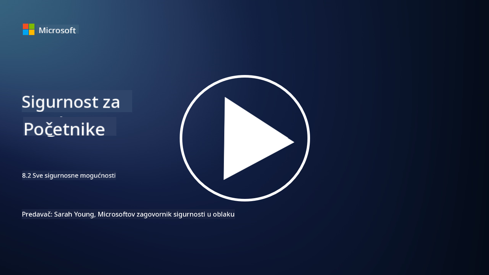

<!--
CO_OP_TRANSLATOR_METADATA:
{
  "original_hash": "b6bb7175672298d1e2f73ba7e0006f95",
  "translation_date": "2025-09-03T21:36:34+00:00",
  "source_file": "8.2 AI security capabilities.md",
  "language_code": "hr"
}
-->
# Sigurnosne mogućnosti AI-a

## Koje alate i mogućnosti trenutno imamo za osiguranje AI sustava?

Trenutno postoji nekoliko alata i mogućnosti za osiguranje AI sustava:

-   **Counterfit**: Alat otvorenog koda za automatizaciju sigurnosnog testiranja AI sustava, osmišljen kako bi pomogao organizacijama u provođenju procjena sigurnosnih rizika AI-a i osiguranju otpornosti njihovih algoritama.
-   **Alati za suzbijanje napada na strojno učenje**: Ovi alati procjenjuju otpornost modela strojnog učenja na napade, pomažući u identificiranju i ublažavanju ranjivosti.
-   **Sigurnosni kompleti za AI**: Dostupni su kompleti otvorenog koda koji pružaju resurse za osiguranje AI sustava, uključujući biblioteke i okvire za implementaciju sigurnosnih mjera.
-   **Suradničke platforme**: Partnerstva između tvrtki i AI zajednica za razvoj specifičnih sigurnosnih skenera i drugih alata za osiguranje lanca opskrbe AI-a.

Ovi alati i mogućnosti dio su rastućeg područja posvećenog poboljšanju sigurnosti AI sustava protiv različitih prijetnji. Predstavljaju kombinaciju istraživanja, praktičnih alata i industrijske suradnje usmjerene na rješavanje jedinstvenih izazova koje donose AI tehnologije.

## Što je s AI red teamingom? Kako se razlikuje od tradicionalnog sigurnosnog red teaminga?

AI red teaming se razlikuje od tradicionalnog sigurnosnog red teaminga u nekoliko ključnih aspekata:

-   **Usmjerenost na AI sustave**: AI red teaming posebno se fokusira na jedinstvene ranjivosti AI sustava, poput modela strojnog učenja i podatkovnih tokova, umjesto na tradicionalnu IT infrastrukturu.
-   **Testiranje ponašanja AI-a**: Uključuje testiranje kako AI sustavi reagiraju na neobične ili neočekivane ulaze, što može otkriti ranjivosti koje bi napadači mogli iskoristiti.
-   **Istraživanje neuspjeha AI-a**: AI red teaming razmatra i zlonamjerne i benigne neuspjehe, uzimajući u obzir širi spektar scenarija i potencijalnih neuspjeha sustava, ne samo sigurnosne povrede.
-   **Ubrizgavanje upita i generiranje sadržaja**: Uključuje ispitivanje neuspjeha poput ubrizgavanja upita, gdje napadači manipuliraju AI sustavima kako bi generirali štetan ili neutemeljen sadržaj.
-   **Etički i odgovorni AI**: Dio je osiguravanja odgovornog AI-a kroz dizajn, osiguravajući da su AI sustavi otporni na pokušaje da ih se navede na neželjeno ponašanje.

Sveukupno, AI red teaming je proširena praksa koja ne obuhvaća samo ispitivanje sigurnosnih ranjivosti, već i testiranje drugih vrsta neuspjeha specifičnih za AI tehnologije. To je ključni dio razvoja sigurnijih AI sustava kroz razumijevanje i ublažavanje novih rizika povezanih s primjenom AI-a.

## Dodatno čitanje

 - [Microsoft AI Red Team gradi budućnost sigurnijeg AI-a | Microsoft Security Blog](https://www.microsoft.com/en-us/security/blog/2023/08/07/microsoft-ai-red-team-building-future-of-safer-ai/?WT.mc_id=academic-96948-sayoung)
 - [Najava Microsoftovog otvorenog okvira za automatizaciju red teaminga generativnih AI sustava | Microsoft Security Blog](https://www.microsoft.com/en-us/security/blog/2024/02/22/announcing-microsofts-open-automation-framework-to-red-team-generative-ai-systems/?WT.mc_id=academic-96948-sayoung)
 - [Alati za sigurnost AI-a: Komplet otvorenog koda | Wiz](https://www.wiz.io/academy/ai-security-tools)

---

**Odricanje od odgovornosti**:  
Ovaj dokument je preveden pomoću AI usluge za prevođenje [Co-op Translator](https://github.com/Azure/co-op-translator). Iako nastojimo osigurati točnost, imajte na umu da automatski prijevodi mogu sadržavati pogreške ili netočnosti. Izvorni dokument na izvornom jeziku treba smatrati autoritativnim izvorom. Za ključne informacije preporučuje se profesionalni prijevod od strane čovjeka. Ne preuzimamo odgovornost za nesporazume ili pogrešna tumačenja koja mogu proizaći iz korištenja ovog prijevoda.