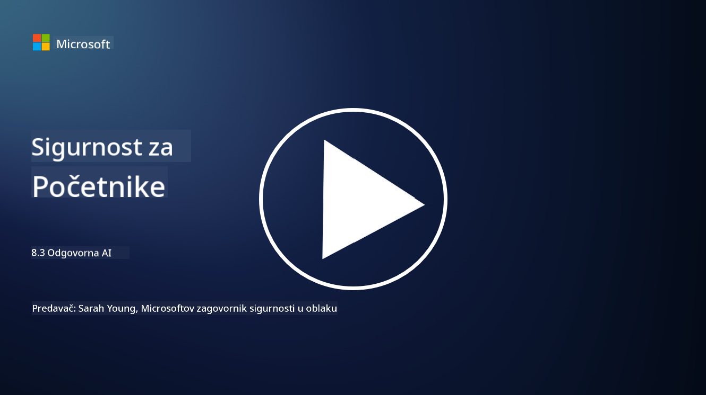

<!--
CO_OP_TRANSLATOR_METADATA:
{
  "original_hash": "5e9775ee91bde7d44577891d5f11c4c5",
  "translation_date": "2025-09-03T20:47:21+00:00",
  "source_file": "8.3 Responsible AI.md",
  "language_code": "hr"
}
-->
# Odgovorna umjetna inteligencija

## Što je odgovorna umjetna inteligencija i kako se odnosi na sigurnost umjetne inteligencije?

Odgovorna umjetna inteligencija odnosi se na razvoj i korištenje umjetne inteligencije na način koji je etičan, transparentan i usklađen s društvenim vrijednostima. Obuhvaća principe poput pravednosti, odgovornosti i otpornosti, osiguravajući da su sustavi umjetne inteligencije dizajnirani i upravljani kako bi koristili pojedincima, zajednicama i društvu u cjelini.

Odnos između odgovorne umjetne inteligencije i sigurnosti umjetne inteligencije je značajan jer:

-   **Etička razmatranja**: Odgovorna umjetna inteligencija uključuje etička razmatranja koja izravno utječu na sigurnost, poput zaštite privatnosti i podataka. Osiguravanje da sustavi umjetne inteligencije poštuju privatnost korisnika i štite osobne podatke ključni je aspekt odgovorne umjetne inteligencije.
-   **Otpornost i pouzdanost**: Sustavi umjetne inteligencije moraju biti otporni na manipulacije i napade, što je temeljni princip i odgovorne umjetne inteligencije i sigurnosti umjetne inteligencije. To uključuje zaštitu od napada i osiguranje integriteta procesa donošenja odluka umjetne inteligencije.
-   **Transparentnost i objašnjivost**: Dio odgovorne umjetne inteligencije je osiguravanje da su sustavi umjetne inteligencije transparentni i da se njihove odluke mogu objasniti. To je ključno za sigurnost jer dionici moraju razumjeti kako sustavi umjetne inteligencije funkcioniraju kako bi im vjerovali.
-   **Odgovornost**: Sustavi umjetne inteligencije trebaju biti odgovorni za svoje postupke, što znači da moraju postojati mehanizmi za praćenje odluka i ispravljanje problema. To je u skladu sa sigurnosnim praksama koje prate i provjeravaju aktivnosti sustava kako bi spriječile i reagirale na povrede.

U suštini, odgovorna umjetna inteligencija i sigurnost umjetne inteligencije su međusobno povezane, pri čemu prakse odgovorne umjetne inteligencije poboljšavaju sigurnost sustava umjetne inteligencije i obrnuto. Primjena principa odgovorne umjetne inteligencije pomaže u stvaranju sustava umjetne inteligencije koji su ne samo etički ispravni, već i sigurniji od potencijalnih prijetnji.

## Kako mogu osigurati da je moj sustav umjetne inteligencije i siguran i etičan?

Osiguravanje da je vaš sustav umjetne inteligencije i siguran i etičan zahtijeva višestrani pristup koji uključuje sljedeće korake:

- **Pridržavajte se etičkih principa**: Slijedite utvrđene etičke smjernice koje naglašavaju dobrobit ljudi, društva i okoliša; pravednost; zaštitu privatnosti; pouzdanost; transparentnost; mogućnost osporavanja; i odgovornost.

- **Primijenite robusne sigurnosne mjere**: Koristite proaktivno testiranje sigurnosti i programe za upravljanje povjerenjem, rizicima i sigurnošću umjetne inteligencije kako biste se zaštitili od prijetnji i ranjivosti.

- **Uključite raznolike dionike**: Uključite širok raspon sudionika u proces razvoja umjetne inteligencije, uključujući etičare, društvene znanstvenike i predstavnike pogođenih zajednica kako biste osigurali raznolike perspektive i vrijednosti.

- **Osigurajte transparentnost i objašnjivost**: Pobrinite se da su procesi donošenja odluka umjetne inteligencije transparentni i da se mogu objasniti, omogućujući veće povjerenje i lakše prepoznavanje potencijalnih pristranosti ili pogrešaka.

- **Održavajte privatnost podataka**: Zaštitite privatnost i autentičnost podataka putem enkripcije i drugih mjera zaštite podataka kako biste poštovali prava korisnika na privatnost.

- **Omogućite ljudski nadzor**: Implementirajte mehanizme za ljudski nadzor kako biste omogućili osporavanje odluka koje donosi umjetna inteligencija i osigurali odgovornost.

- **Budite informirani o sigurnosti umjetne inteligencije**: Pratite najnovija istraživanja i rasprave o sigurnosti umjetne inteligencije kako biste razumjeli promjenjivi krajolik sigurnosti i etike umjetne inteligencije.

- **Poštujte propise**: Osigurajte da vaš sustav umjetne inteligencije poštuje sve relevantne zakone i propise, koji mogu uključivati zakone o zaštiti podataka, zakone protiv diskriminacije i smjernice specifične za industriju.

## Možete li mi dati primjere sigurnosnih problema uzrokovanih neetičnom upotrebom umjetne inteligencije?

Evo nekoliko primjera sigurnosnih problema koji mogu nastati zbog neetične upotrebe umjetne inteligencije:

- **Pristrano donošenje odluka**: Sustavi umjetne inteligencije mogu održavati i pojačavati postojeće pristranosti ako su trenirani na pristranim skupovima podataka. Na primjer, ako je tražilica trenirana na podacima koji odražavaju društvene stereotipe, može prikazivati pristrane rezultate pretraživanja, što može dovesti do nepoštenog postupanja ili diskriminacije.

- **Umjetna inteligencija u pravosudnim sustavima**: Korištenje umjetne inteligencije u donošenju pravnih odluka može izazvati etičke zabrinutosti, posebno ako proces donošenja odluka umjetne inteligencije nije transparentan ili je pod utjecajem pristranih podataka. To može rezultirati nepravdenim pravnim ishodima i narušiti prava pojedinaca.

- **Manipulacija sustavima umjetne inteligencije**: Sustavi umjetne inteligencije mogu biti podložni napadima, gdje male izmjene ulaznih podataka mogu uzrokovati netočne rezultate. Na primjer, autonomna vozila mogla bi biti zavedena da pogrešno interpretiraju prometne znakove, što bi moglo dovesti do sigurnosnih rizika.

- **Nadzor pomoću umjetne inteligencije**: Primjena umjetne inteligencije u svrhe nadzora može dovesti do kršenja privatnosti, posebno ako se koristi bez odgovarajućeg pristanka ili na načine koji narušavaju slobode pojedinaca. To može biti posebno problematično u autoritarnim režimima koji mogu koristiti umjetnu inteligenciju za praćenje i suzbijanje neslaganja.

Ovi primjeri naglašavaju važnost etičkih razmatranja u razvoju i primjeni sustava umjetne inteligencije kako bi se spriječili sigurnosni problemi i zaštitila prava i privatnost pojedinaca.

## Dodatno čitanje

 - [Microsoft Responsible AI Standard v2 General Requirements](https://query.prod.cms.rt.microsoft.com/cms/api/am/binary/RE5cmFl?culture=en-us&country=us&WT.mc_id=academic-96948-sayoung)
 - [Responsible AI (mit.edu)](https://sloanreview.mit.edu/big-ideas/responsible-ai/)
 - [13 Principles for Using AI Responsibly (hbr.org)](https://hbr.org/2023/06/13-principles-for-using-ai-responsibly)

---

**Odricanje od odgovornosti**:  
Ovaj dokument je preveden korištenjem AI usluge za prevođenje [Co-op Translator](https://github.com/Azure/co-op-translator). Iako nastojimo osigurati točnost, imajte na umu da automatski prijevodi mogu sadržavati pogreške ili netočnosti. Izvorni dokument na izvornom jeziku treba smatrati mjerodavnim izvorom. Za ključne informacije preporučuje se profesionalni prijevod od strane stručnjaka. Ne preuzimamo odgovornost za bilo kakve nesporazume ili pogrešne interpretacije proizašle iz korištenja ovog prijevoda.