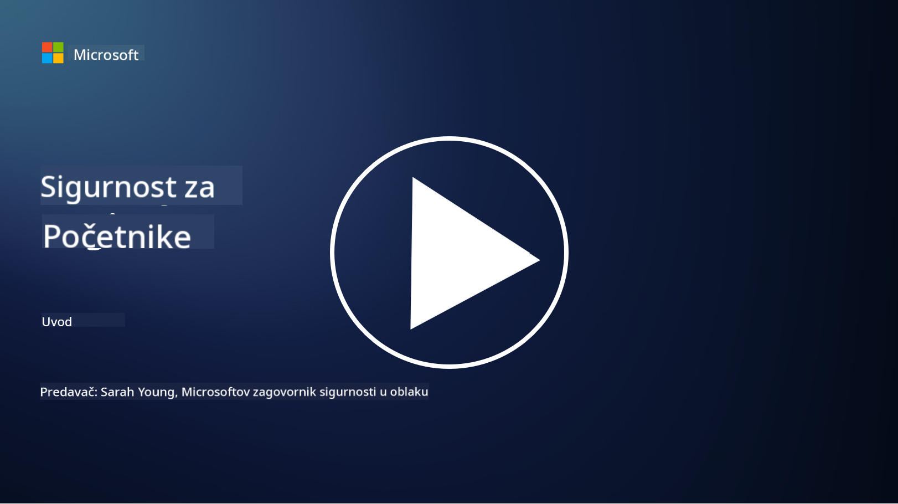

<!--
CO_OP_TRANSLATOR_METADATA:
{
  "original_hash": "79a7e63fa60f649eb3560e1cd7246272",
  "translation_date": "2025-11-18T17:49:18+00:00",
  "source_file": "README.md",
  "language_code": "hr"
}
-->
  
  
  
  
  
  

### 🌐 Podrška za više jezika

#### Podržano putem GitHub Action (Automatizirano i uvijek ažurirano)

<!-- CO-OP TRANSLATOR LANGUAGES TABLE START -->
[Arapski](../ar/README.md) | [Bengalski](../bn/README.md) | [Bugarski](../bg/README.md) | [Burmanski (Mjanmar)](../my/README.md) | [Kineski (pojednostavljeni)](../zh/README.md) | [Kineski (tradicionalni, Hong Kong)](../hk/README.md) | [Kineski (tradicionalni, Macau)](../mo/README.md) | [Kineski (tradicionalni, Tajvan)](../tw/README.md) | [Hrvatski](./README.md) | [Češki](../cs/README.md) | [Danski](../da/README.md) | [Nizozemski](../nl/README.md) | [Estonski](../et/README.md) | [Finski](../fi/README.md) | [Francuski](../fr/README.md) | [Njemački](../de/README.md) | [Grčki](../el/README.md) | [Hebrejski](../he/README.md) | [Hindski](../hi/README.md) | [Mađarski](../hu/README.md) | [Indonezijski](../id/README.md) | [Talijanski](../it/README.md) | [Japanski](../ja/README.md) | [Korejski](../ko/README.md) | [Litvanski](../lt/README.md) | [Malajski](../ms/README.md) | [Marathi](../mr/README.md) | [Nepalski](../ne/README.md) | [Nigerijski pidžin](../pcm/README.md) | [Norveški](../no/README.md) | [Perzijski (Farsi)](../fa/README.md) | [Poljski](../pl/README.md) | [Portugalski (Brazil)](../br/README.md) | [Portugalski (Portugal)](../pt/README.md) | [Pandžapski (Gurmukhi)](../pa/README.md) | [Rumunjski](../ro/README.md) | [Ruski](../ru/README.md) | [Srpski (ćirilica)](../sr/README.md) | [Slovački](../sk/README.md) | [Slovenski](../sl/README.md) | [Španjolski](../es/README.md) | [Svahili](../sw/README.md) | [Švedski](../sv/README.md) | [Tagalog (Filipinski)](../tl/README.md) | [Tamilski](../ta/README.md) | [Tajlandski](../th/README.md) | [Turski](../tr/README.md) | [Ukrajinski](../uk/README.md) | [Urdu](../ur/README.md) | [Vijetnamski](../vi/README.md)  
<!-- CO-OP TRANSLATOR LANGUAGES TABLE END -->

**Ako želite dodati podršku za dodatne jezike, popis podržanih jezika možete pronaći [ovdje](https://github.com/Azure/co-op-translator/blob/main/getting_started/supported-languages.md)**

#### Pridružite se našoj zajednici  

# 🚀 Kibernetička sigurnost za početnike – kurikulum

U ovom brzom razdoblju usvajanja AI tehnologije, još je važnije razumjeti kako osigurati IT sustave. Ovaj tečaj osmišljen je kako bi vas naučio osnovnim konceptima kibernetičke sigurnosti i započeo vaše učenje o sigurnosti. Tečaj je neutralan prema dobavljačima i podijeljen je u male lekcije koje bi trebale trajati oko 30-60 minuta za dovršetak. Svaka lekcija uključuje mali kviz i poveznice za dodatno čitanje ako želite dublje istražiti temu.

Što ovaj tečaj pokriva 📚

- 🔐 Osnovni koncepti kibernetičke sigurnosti poput CIA triade, razlike između rizika, prijetnji itd.
- 🛡️ Razumijevanje što je sigurnosna kontrola i u kojim oblicima se pojavljuje.
- 🌐 Razumijevanje što je zero trust i zašto je važan u modernoj kibernetičkoj sigurnosti.
- 🔑 Razumijevanje ključnih koncepata i tema vezanih uz identitet, mreže, sigurnosne operacije, infrastrukturu i sigurnost podataka.
- 🔧 Primjeri alata koji se koriste za implementaciju sigurnosnih kontrola.

Što ovaj tečaj ne pokriva 🙅‍♂️

- 🚫 Kako koristiti specifične sigurnosne alate.
- 🚫 Kako "hakirati" ili provoditi crvene timove/ofenzivnu sigurnost.
- 🚫 Učenje o specifičnim standardima usklađenosti.

Kada završite ovaj tečaj, možete nastaviti s nekim od naših Microsoft Learn modula. Preporučujemo da nastavite svoje učenje s [Microsoft Security, Compliance, and Identity Fundamentals.](https://learn.microsoft.com/training/paths/describe-concepts-of-security-compliance-identity/?WT.mc_id=academic-96948-sayoung)  

Na kraju, možete razmisliti o polaganju [Ispita SC-900: Microsoft Security, Compliance, and Identity Fundamentals.](https://learn.microsoft.com/credentials/certifications/exams/sc-900/?WT.mc_id=academic-96948-sayoung)

> 💁 Ako imate povratne informacije ili prijedloge o ovom tečaju i sadržaju koji nedostaje, voljeli bismo čuti vaše mišljenje!

## Pregled modula 📝  
| **Broj modula** | **Naziv modula**                           | **Podučeni koncepti**                  | **Ciljevi učenja**                                                                                          |
|-------------------|-------------------------------------------|--------------------------------------|-----------------------------------------------------------------------------------------------------------------|
| **1.1**           | Osnovni koncepti sigurnosti                   | [CIA triada](https://github.com/microsoft/Security-101/blob/main/1.1%20The%20CIA%20triad%20and%20other%20key%20concepts.md)                        | Naučite o povjerljivosti, dostupnosti i integritetu. Također o autentičnosti, neporecivosti i privatnosti. |
| **1.2**           | Osnovni koncepti sigurnosti                   | [Uobičajene prijetnje kibernetičkoj sigurnosti](https://github.com/microsoft/Security-101/blob/main/1.2%20Common%20cybersecurity%20threats.md)        | Naučite o uobičajenim prijetnjama kibernetičkoj sigurnosti koje pogađaju pojedince i organizacije.                             |
| **1.3**           | Osnovni koncepti sigurnosti                   | [Razumijevanje upravljanja rizikom](https://github.com/microsoft/Security-101/blob/main/1.3%20Understanding%20risk%20management.md)       | Naučite o procjeni i razumijevanju rizika – utjecaj/vjerojatnost i implementacija kontrola.                                                                                                               | |
| **1.4**           | Osnovni koncepti sigurnosti                   | [Sigurnosne prakse i dokumentacija](https://github.com/microsoft/Security-101/blob/main/1.4%20Security%20practices%20and%20documentation.md) | Naučite o razlici između politika, procedura, standarda i regulacija/zakona.                         |
| **1.5**           | Osnovni koncepti sigurnosti                   | [Zero trust](https://github.com/microsoft/Security-101/blob/main/1.5%20Zero%20trust.md)                           | Naučite što je zero trust i kako utječe na arhitekturu? Što je obrana u dubini?                   |
| **1.6**           | Osnovni koncepti sigurnosti                   | [Model zajedničke odgovornosti](https://github.com/microsoft/Security-101/blob/main/1.6%20Shared%20responsibility%20model.md)                           | Što je model zajedničke odgovornosti i kako utječe na kibernetičku sigurnost?                  |
| **1.7**           | [Kviz na kraju modula](https://github.com/microsoft/Security-101/blob/main/1.7%20End%20of%20module%20quiz.md)                        |                                      |                                                                                                                 |
| **2.1**           | Osnove upravljanja identitetom i pristupom | [Ključni koncepti IAM-a](https://github.com/microsoft/Security-101/blob/main/2.1%20IAM%20key%20concepts.md)                     | Naučite o principu najmanjih privilegija, razdvajanju dužnosti, kako IAM podržava zero trust.               |
| **2.2**           | Osnove upravljanja identitetom i pristupom | [IAM zero trust arhitektura](https://github.com/microsoft/Security-101/blob/main/2.2%20IAM%20zero%20trust%20architecture.md)          | Naučite kako je identitet nova granica za moderne IT okoline i prijetnje koje mitigira.          |
| **2.3**           | Osnove upravljanja identitetom i pristupom | [IAM mogućnosti](https://github.com/microsoft/Security-101/blob/main/2.3%20IAM%20capabilities.md)                     | Naučite o mogućnostima IAM-a i kontrolama za osiguranje identiteta                                                  |
| **2.4**           | [Kviz na kraju modula](https://github.com/microsoft/Security-101/blob/main/2.4%20End%20of%20module%20quiz.md)                        |                                      |                                                                                                                 |
| **3.1**           | Osnove sigurnosti mreže             | [Ključni koncepti mreža](https://github.com/microsoft/Security-101/blob/main/3.1%20Networking%20key%20concepts.md)              | Naučite o konceptima mreža (IP adresiranje, brojevi portova, enkripcija itd.)                                 |
| **3.2**           | Osnove sigurnosti mreže             | [Zero trust arhitektura mreža](https://github.com/microsoft/Security-101/blob/main/3.2%20Networking%20zero%20trust%20architecture.md)   | Naučite kako mreže doprinose E2E ZT arhitekturi i prijetnje koje mitigiraju.                  |
| **3.3**           | Osnove sigurnosti mreže             | [Mogućnosti sigurnosti mreže](https://github.com/microsoft/Security-101/blob/main/3.3%20Network%20security%20capabilities.md)        | Naučite o alatima za sigurnost mreže – vatrozidi, WAF, zaštita od DDoS napada itd.                                    |
| **3.4**           | [Kviz na kraju modula](https://github.com/microsoft/Security-101/blob/main/3.4%20End%20of%20module%20quiz.md)                        |                                      |                                                                                                                 |
| **4.1**           | Osnove sigurnosnih operacija          | [Ključni koncepti SecOps-a](https://github.com/microsoft/Security-101/blob/main/4.1%20SecOps%20key%20concepts.md)                  | Naučite zašto su sigurnosne operacije važne i kako se razlikuju od uobičajenih IT operacija.                  |
| **4.2**           | Osnove sigurnosnih operacija          | [Zero trust arhitektura SecOps-a](https://github.com/microsoft/Security-101/blob/main/4.2%20SecOps%20zero%20trust%20architecture.md)       | Naučite kako SecOps doprinosi E2E ZT arhitekturi i prijetnje koje mitigira.                      |
| **4.3**           | Osnove sigurnosnih operacija          | [Mogućnosti SecOps-a](https://github.com/microsoft/Security-101/blob/main/4.3%20SecOps%20capabilities.md)                  | Naučite o alatima za SecOps – SIEM, XDR itd.                                                                    |
| **4.4**           | [Kviz na kraju modula](https://github.com/microsoft/Security-101/blob/main/4.4%20End%20of%20module%20quiz.md)                        |                                      |                                                                                                                 |
| **5.1**           | Osnove sigurnosti aplikacija         | [Ključni koncepti AppSec-a](https://github.com/microsoft/Security-101/blob/main/5.1%20AppSec%20key%20concepts.md)                  | Naučite o konceptima AppSec-a poput sigurnosti kroz dizajn, validacije unosa itd.                                    |
| **5.2**           | Osnove sigurnosti aplikacija             | [AppSec mogućnosti](https://github.com/microsoft/Security-101/blob/main/5.2%20AppSec%20key%20capabilities.md)                  | Naučite o alatima za sigurnost aplikacija: alati za sigurnost u pipelineu, skeniranje koda, skeniranje tajni itd.                       |
| **5.3**           | [Kviz na kraju modula](https://github.com/microsoft/Security-101/blob/main/5.3%20End%20of%20module%20quiz.md)                        |                                      |                                                                                                                 |
| **6.1**           | Osnove sigurnosti infrastrukture         | [Ključni koncepti sigurnosti infrastrukture](https://github.com/microsoft/Security-101/blob/main/6.1%20Infrastructure%20security%20key%20concepts.md) | Naučite o jačanju sustava, zakrpama, sigurnosnoj higijeni, sigurnosti kontejnera.                                  |
| **6.2**           | Osnove sigurnosti infrastrukture         | [Mogućnosti sigurnosti infrastrukture](https://github.com/microsoft/Security-101/blob/main/6.2%20Infrastructure%20security%20capabilities.md) | Naučite o alatima koji mogu pomoći u sigurnosti infrastrukture, npr. CSPM, sigurnost kontejnera itd.            |
| **6.3**           | [Kviz na kraju modula](https://github.com/microsoft/Security-101/blob/main/6.3%20End%20of%20module%20quiz.md)                        |                                      |                                                                                                                 |
| **7.1**           | Osnove sigurnosti podataka               | [Ključni koncepti sigurnosti podataka](https://github.com/microsoft/Security-101/blob/main/7.1%20Data%20security%20key%20concepts.md)           | Naučite o klasifikaciji i zadržavanju podataka te zašto je to važno za organizaciju.                     |
| **7.2**           | Osnove sigurnosti podataka               | [Mogućnosti sigurnosti podataka](https://github.com/microsoft/Security-101/blob/main/7.2%20Data%20security%20capabilities.md)           | Naučite o alatima za sigurnost podataka – DLP, upravljanje unutarnjim rizicima, upravljanje podacima itd.                          |
| **7.3**           | [Kviz na kraju modula](https://github.com/microsoft/Security-101/blob/main/7.3%20End%20of%20module%20quiz.md)                        |
| **8.1**           | Osnove sigurnosti umjetne inteligencije  | [Ključni koncepti sigurnosti AI](https://github.com/microsoft/Security-101/blob/main/8.1%20AI%20security%20key%20concepts.md)          | Naučite o razlikama i sličnostima između tradicionalne sigurnosti i sigurnosti AI.                 |
| **8.2**           | Osnove sigurnosti umjetne inteligencije  | [Mogućnosti sigurnosti AI](https://github.com/microsoft/Security-101/blob/main/8.2%20AI%20security%20capabilities.md)           | Naučite o alatima za sigurnost AI i kontrolama koje se mogu koristiti za osiguranje AI-a.                         |
| **8.3**           | Osnove sigurnosti umjetne inteligencije  | [Odgovorna AI](https://github.com/microsoft/Security-101/blob/main/8.3%20Responsible%20AI.md)          | Naučite što je odgovorna AI i o specifičnim štetama vezanim uz AI koje sigurnosni stručnjaci trebaju znati.                          |
| **8.4**           | [Kviz na kraju modula](https://github.com/microsoft/Security-101/blob/main/8.4%20End%20of%20module%20quiz.md)     

## 🎒 Ostali tečajevi 

Naš tim proizvodi i druge tečajeve! Pogledajte:

### Azure / Edge / MCP / Agenti

---

### Serija o generativnoj AI

[-9333EA?style=for-the-badge&labelColor=E5E7EB&color=9333EA)](https://github.com/microsoft/Generative-AI-for-beginners-dotnet?WT.mc_id=academic-105485-koreyst)
[-C084FC?style=for-the-badge&labelColor=E5E7EB&color=C084FC)](https://github.com/microsoft/generative-ai-for-beginners-java?WT.mc_id=academic-105485-koreyst)
[-E879F9?style=for-the-badge&labelColor=E5E7EB&color=E879F9)](https://github.com/microsoft/generative-ai-with-javascript?WT.mc_id=academic-105485-koreyst)

---

### Osnovno učenje

---

### Serija o Copilotu

## Dobivanje pomoći

Ako zapnete ili imate pitanja o izradi AI aplikacija, pridružite se zajednici učenika i iskusnih programera u raspravama o MCP-u. To je podržavajuća zajednica gdje su pitanja dobrodošla, a znanje se slobodno dijeli.

Ako imate povratne informacije o proizvodu ili naiđete na pogreške tijekom izrade, posjetite:

---

<!-- CO-OP TRANSLATOR DISCLAIMER START -->
**Odricanje od odgovornosti**:  
Ovaj dokument je preveden pomoću AI usluge za prevođenje [Co-op Translator](https://github.com/Azure/co-op-translator). Iako težimo točnosti, imajte na umu da automatski prijevodi mogu sadržavati pogreške ili netočnosti. Izvorni dokument na izvornom jeziku treba smatrati mjerodavnim izvorom. Za ključne informacije preporučuje se profesionalni prijevod od strane čovjeka. Ne preuzimamo odgovornost za bilo kakve nesporazume ili pogrešne interpretacije proizašle iz korištenja ovog prijevoda.
<!-- CO-OP TRANSLATOR DISCLAIMER END -->