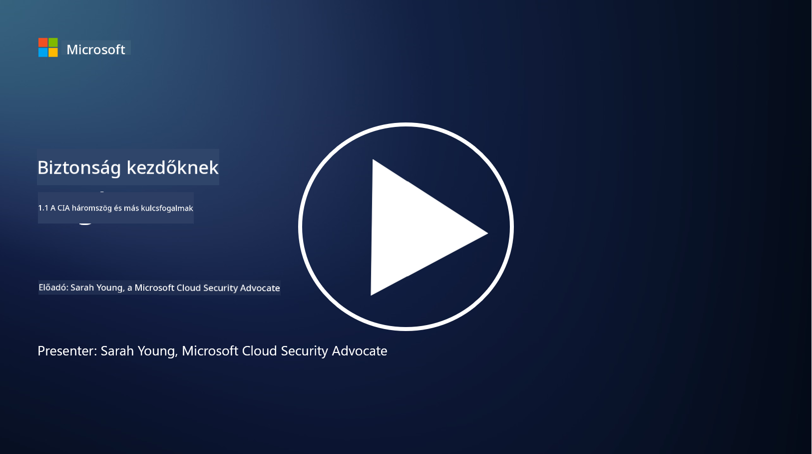
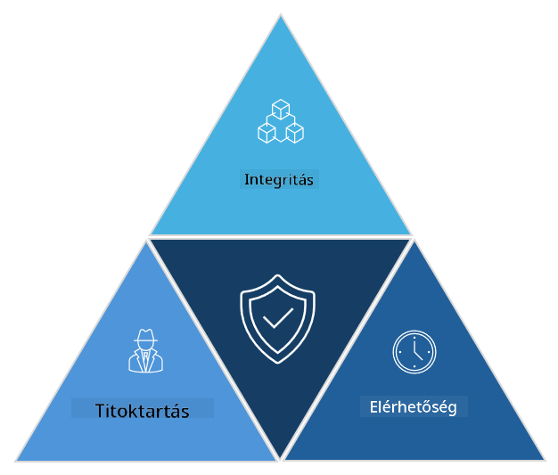

<!--
CO_OP_TRANSLATOR_METADATA:
{
  "original_hash": "16a76f9fa372fb63cffb6d76b855f023",
  "translation_date": "2025-09-03T21:40:45+00:00",
  "source_file": "1.1 The CIA triad and other key concepts.md",
  "language_code": "hu"
}
-->
# A CIA-hármas és más kulcsfogalmak

## Bevezetés

Ebben a leckében az alábbi témákat tárgyaljuk:

 - Mi az a kiberbiztonság?
   
 
 - Mi az a kiberbiztonsági CIA-hármas?

   

 - Mit jelentenek az autentikusság, a visszautasíthatatlanság és a magánélet a kiberbiztonság kontextusában?

## Mi az a kiberbiztonság?

A kiberbiztonság, más néven információbiztonság, a számítógépes rendszerek, hálózatok, eszközök és adatok védelmének gyakorlata a digitális támadásokkal, jogosulatlan hozzáféréssel, károkozással vagy lopással szemben. A kiberbiztonság elsődleges célja a digitális eszközök és információk bizalmasságának, sértetlenségének és elérhetőségének biztosítása. A kiberbiztonsági szakemberek biztonsági intézkedéseket terveznek és hajtanak végre az eszközök, adatok és információk védelme érdekében. Ahogy életünk egyre inkább digitalizálódik és online térbe kerül, a kiberbiztonság kiemelt fontosságúvá vált mind magánszemélyek, mind szervezetek számára.

## Mi az a kiberbiztonsági CIA-hármas?

A kiberbiztonsági hármas egy olyan modell, amely a kiberbiztonsági munka vagy egy rendszer/környezet tervezése során figyelembe veendő három fő szempontot foglalja magában:

### Bizalmasság

Ez az a szempont, amelyet a legtöbben ismernek, amikor a „kiberbiztonságra” gondolnak: a bizalmasság az adatok és információk védelmének folyamata a jogosulatlan hozzáférési kísérletekkel szemben, azaz csak azok férhetnek hozzá az információkhoz, akiknek szükségük van rá. Az adatok azonban nem egyformák, és általában kategorizálják és védik őket annak alapján, hogy mekkora kárt okozna, ha illetéktelenek hozzáférnének.

### Sértetlenség

Az adatok pontosságának és megbízhatóságának védelmét jelenti, valamint azt, hogy az adatok ne legyenek jogosulatlan személyek által módosíthatók vagy megváltoztathatók. Például: egy diák megváltoztatja a születési dátumát a DMV nyilvántartásában, hogy idősebbnek tűnjön, és újra kiállíttassa a jogosítványát korábbi születési dátummal, hogy alkoholt vásárolhasson.

### Elérhetőség

Ez egy fontos szempont az operatív IT területén, de az elérhetőség a kiberbiztonság szempontjából is lényeges. Vannak olyan támadások, amelyek kifejezetten az elérhetőséget célozzák, és amelyeket a biztonsági szakembereknek meg kell akadályozniuk (pl. elosztott szolgáltatásmegtagadás – DDoS – támadások).

**Kiberbiztonsági CIA-hármas**

## Mit jelentenek az autentikusság, a visszautasíthatatlanság és a magánélet a kiberbiztonság kontextusában?

Ezek további fontos fogalmak, amelyek a rendszerek és adatok biztonságának és megbízhatóságának biztosításához kapcsolódnak:

**Autentikusság** - annak biztosítása, hogy az információ, kommunikáció vagy entitás, amellyel kapcsolatba lépünk, valódi, és nem módosították vagy manipulálták jogosulatlan felek.

**Visszautasíthatatlanság** - annak biztosítása, hogy egy fél ne tagadhassa meg részvételét vagy egy tranzakció vagy kommunikáció hitelességét. Ez megakadályozza, hogy valaki azt állítsa, nem küldött üzenetet vagy nem hajtott végre egy adott cselekvést, amikor bizonyíték van az ellenkezőjére.

**Magánélet** - az érzékeny és személyazonosításra alkalmas információk védelme a jogosulatlan hozzáférés, használat, közzététel vagy manipuláció ellen. Ez magában foglalja annak ellenőrzését, hogy ki férhet hozzá a személyes adatokhoz, és hogyan gyűjtik, tárolják és osztják meg ezeket az adatokat.

## További olvasnivaló

[Mi az információbiztonság (InfoSec)? | Microsoft Security](https://www.microsoft.com/security/business/security-101/what-is-information-security-infosec#:~:text=Three%20pillars%20of%20information%20security%3A%20the%20CIA%20triad,as%20guiding%20principles%20for%20implementing%20an%20InfoSec%20plan.)

---

**Felelősség kizárása**:  
Ez a dokumentum az AI fordítási szolgáltatás, a [Co-op Translator](https://github.com/Azure/co-op-translator) segítségével lett lefordítva. Bár törekszünk a pontosságra, kérjük, vegye figyelembe, hogy az automatikus fordítások hibákat vagy pontatlanságokat tartalmazhatnak. Az eredeti dokumentum az eredeti nyelvén tekintendő hiteles forrásnak. Kritikus információk esetén javasolt professzionális emberi fordítást igénybe venni. Nem vállalunk felelősséget semmilyen félreértésért vagy téves értelmezésért, amely a fordítás használatából eredhet.