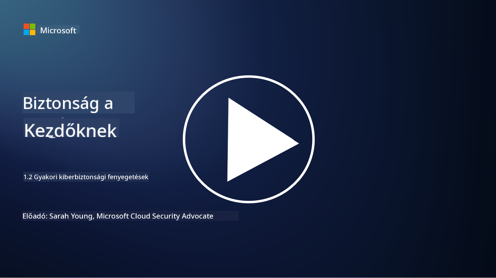

<!--
CO_OP_TRANSLATOR_METADATA:
{
  "original_hash": "6fc3030323139d7134a4ca9d03eccac9",
  "translation_date": "2025-09-03T20:14:43+00:00",
  "source_file": "1.2 Common cybersecurity threats.md",
  "language_code": "hu"
}
-->
# Gyakori kibertámadások

## Bevezetés

Ebben a leckében az alábbi témákat érintjük:

- Mi az a kibertámadás?

- Miért akarják rosszindulatú szereplők veszélyeztetni az adatokat és IT rendszereket?

- Melyek a leggyakoribb kibertámadások típusai?

- Mi az a MITRE ATT&CK keretrendszer?

- Hol tudok naprakész információkat szerezni a kibertámadásokkal kapcsolatban?

## Mi az a kibertámadás?

A kibertámadás olyan potenciális veszélyt vagy kockázatot jelent, amely veszélyeztetheti az adatok vagy IT rendszerek bizalmasságát, sértetlenségét vagy elérhetőségét. Ezeket a fenyegetéseket rosszindulatú szereplők idézik elő, akik sebezhetőségeket próbálnak kihasználni, hogy jogosulatlan hozzáférést szerezzenek, érzékeny információkat lopjanak el, műveleteket zavarjanak meg, vagy kárt okozzanak egyéneknek, szervezeteknek, sőt akár egész nemzeteknek. A kibertámadások különböző formákat ölthetnek, és a digitális rendszerek és adatok különböző aspektusait célozhatják meg.

## Miért akarják rosszindulatú szereplők veszélyeztetni az adatokat és IT rendszereket?

A rosszindulatú szereplők különböző okokból veszélyeztetik az adatokat és IT rendszereket, gyakran személyes haszonszerzés, ideológiai indítékok vagy zavarkeltés céljából. Ezeknek a motivációknak a megértése segíthet a szervezeteknek és egyéneknek hatékonyabban védekezni a kibertámadások ellen. Néhány gyakori ok, amiért rosszindulatú szereplők kibertámadásokat hajtanak végre:

1. **Pénzügyi haszonszerzés**: Sok támadást a pénzügyi profit motivál. A rosszindulatú szereplők érzékeny információkat, például hitelkártyaszámokat, bankszámla adatokat vagy személyes azonosító információkat lopnak el, hogy csalást kövessenek el, személyazonosságot lopjanak, váltságdíjat követeljenek, vagy eladják az ellopott adatokat a dark weben.

2. **Kémkedés**: Nemzetállamok, versenytársak vagy más entitások kiberkémkedést folytathatnak, hogy érzékeny kormányzati, vállalati vagy kutatási adatokat lopjanak el politikai, gazdasági vagy katonai előnyök érdekében.

3. **Zavarkeltés és szabotázs**: Egyes támadások célja kritikus infrastruktúra, szolgáltatások vagy műveletek megzavarása politikai vagy ideológiai okokból. Ezek a támadások széleskörű káoszt, pénzügyi veszteséget és hírnévvesztést okozhatnak.

4. **Ideológiai motivációk**: Hacktivisták és ideológiai vagy politikai motivációval rendelkező csoportok rendszereket kompromittálhatnak, hogy bizonyos kérdésekre felhívják a figyelmet, nézeteiket népszerűsítsék, vagy tiltakozzanak konkrét cselekvések vagy szervezetek ellen.

5. **Nem szándékos cselekvések**: Nem minden rosszindulatú cselekedet szándékos; egyes egyének akaratlanul is hozzájárulhatnak kibertámadásokhoz, például ha áldozatul esnek a social engineeringnek, vagy ha egy kompromittált hálózat részei.

Végső soron az adatok és IT rendszerek veszélyeztetésének motivációi nagyon különbözőek lehetnek, és ezeknek a támadásoknak a hatása súlyos lehet. Fontos, hogy az egyének, szervezetek és kormányok komolyan vegyék a kiberbiztonságot, és intézkedéseket tegyenek ezek ellen a fenyegetések ellen.

## Melyek a leggyakoribb kibertámadások típusai?

Számos gyakori kibertámadási típus létezik, amelyeket rosszindulatú szereplők használnak rendszerek veszélyeztetésére, adatok ellopására és zavarok okozására. Az alábbiakban bemutatjuk a legelterjedtebb típusokat:

1. **Adathalászat (Phishing)**:

Az adathalászat megtévesztő e-mailek vagy üzenetek küldését jelenti, amelyek legitim forrásoknak tűnnek, hogy rávegyék a címzetteket érzékeny információk, például jelszavak, hitelkártyaszámok vagy személyes adatok megadására. Az adathalászat áldozatai rosszindulatú weboldalakra kerülhetnek, vagy kártékony szoftvereket tölthetnek le.

2. **Kártékony szoftverek (Malware)**:

A kártékony szoftverek (malware) olyan rosszindulatú programokat foglalnak magukban, amelyek célja rendszerek megfertőzése, adatok ellopása vagy károkozás. A kártékony szoftverek típusai közé tartoznak:

- **Zsarolóvírusok (Ransomware)**: Fájlokat titkosítanak, és váltságdíjat követelnek a visszafejtésért.

- **Trójai programok (Trojans)**: Legitim szoftvernek álcázva jogosulatlan hozzáférést biztosítanak a támadóknak.

- **Vírusok**: Önmásoló programok, amelyek fájlokhoz csatlakoznak és terjednek.

- **Férgek (Worms)**: Önmásoló programok, amelyek hálózatokon keresztül terjednek.

3. **Szolgáltatásmegtagadás (DoS) és elosztott szolgáltatásmegtagadás (DDoS)**:

A DoS támadások túlterhelik a célrendszert, így az nem elérhető a felhasználók számára. A DDoS támadások kompromittált eszközök hálózatát használják, hogy forgalommal árasztják el a célt, megnehezítve a rendszer működését, vagy teljesen leállítva azt.

4. **SQL injekció**:

Ebben a támadásban a támadók egy webalkalmazás bemeneti mezőit manipulálják, hogy rosszindulatú SQL lekérdezéseket injektáljanak, és jogosulatlan hozzáférést szerezzenek adatbázisokhoz és érzékeny adatokhoz.

5. **Cross-Site Scripting (XSS)**:

A támadók rosszindulatú szkripteket injektálnak webalkalmazásokba, amelyeket a gyanútlan felhasználók böngészői hajtanak végre. Ez felhasználói adatok ellopásához és/vagy kártékony szoftverek terjesztéséhez vezethet.

6. **Social Engineering**:

A social engineering az emberi pszichológia kihasználásával manipulálja az egyéneket, hogy bizalmas információkat adjanak ki, vagy olyan cselekvéseket hajtsanak végre, amelyek veszélyeztetik a biztonságot.

7. **Zero-Day (0day) sebezhetőségek**:

Ezek a támadások olyan szoftver- vagy hardverhibákat céloznak meg, amelyeket még nem ismer a gyártó vagy a nyilvánosság. A támadók kihasználják ezeket a sebezhetőségeket, mielőtt javításokat fejlesztenének ki. Bár a zero-day támadások aggodalomra adnak okot, nem olyan gyakoriak, mint a lista többi támadása. Amikor egy zero-day sebezhetőséget felfedeznek, a biztonsági kutatók gyorsan dolgoznak a javításon, így ezek általában rövid életűek.

8. **Hitelesítési támadások**:

Ezek a támadások magukban foglalják a brute force támadásokat, ahol a támadók ismételten próbálnak jelszavakat kitalálni, és a credential stuffing támadásokat, ahol egy webhelyről ellopott hitelesítő adatokat más webhelyeken próbálnak felhasználni.

## Mi az a MITRE ATT&CK keretrendszer?

A [MITRE ATT&CK keretrendszer](https://attack.mitre.org/) (Adversarial Tactics, Techniques, and Common Knowledge) egy olyan keretrendszer, amely katalogizálja és kategorizálja a taktikákat, technikákat és eljárásokat (TTP-ket), amelyeket a támadók kibertámadások során alkalmaznak. A keretrendszert a MITRE Corporation hozta létre, amely egy nonprofit szervezet, amely kutatási és fejlesztési központokat működtet különböző kormányzati ügynökségek számára.

A MITRE ATT&CK keretrendszer szabványosított módot biztosít a kibertámadások leírására és elemzésére, lehetővé téve a kiberbiztonsági szakemberek számára, hogy jobban megértsék és védekezzenek a különböző támadási technikák ellen. Széles körben használják biztonsági csapatok, fenyegetésvadászok és incidenskezelők az alábbi célokra:

1. **A támadói viselkedés megértése**: A keretrendszer dokumentálja a valós támadási viselkedéseket, bemutatva a támadók lépéseit a kezdeti belépéstől a céljaik eléréséig. Széles körű támadási technikákat fed le, amelyeket különböző fenyegetési csoportok alkalmaznak.

2. **Védelmi stratégiák tervezése és megvalósítása**: A biztonsági csapatok a keretrendszert használhatják proaktív védelmi stratégiák kidolgozására, amelyek igazodnak a támadók által alkalmazott konkrét taktikákhoz és technikákhoz.

3. **Incidenskezelés és fenyegetésvadászat**: Incidensek vizsgálata vagy fenyegetésvadászat során a biztonsági szakemberek hivatkozhatnak a keretrendszerre, hogy azonosítsák és enyhítsék a támadók által alkalmazott konkrét technikákat.

A MITRE ATT&CK keretrendszer mátrixokba szerveződik, amelyek a támadási technikákat platformok és környezetek szerint csoportosítják, például Windows, macOS, Linux és felhőszolgáltatások. Minden mátrix taktikákra (magas szintű célok) és technikákra (konkrét módszerek a célok elérésére) oszlik. Minden technikához a keretrendszer információt nyújt arról, hogyan működik, milyen lehetséges enyhítések vannak, és releváns hivatkozásokat valós fenyegetési szereplőkre, akik alkalmazták a technikát.

A keretrendszert folyamatosan frissítik és bővítik, ahogy új fenyegetési információk gyűlnek, és ahogy a kiberbiztonsági környezet fejlődik. Értékes erőforrás a szervezetek kiberbiztonsági helyzetének javításához, mivel mélyebb megértést tesz lehetővé arról, hogyan működnek a támadók, és hogyan lehet védekezni a taktikáik ellen.

## Hol tudok naprakész információkat szerezni a kibertámadásokkal kapcsolatban?

Számos forrás áll rendelkezésre, amelyek segítségével naprakész információkat szerezhetünk a kibertámadásokkal kapcsolatban. Íme néhány példa:

- [Open Web Application Security Project (OWASP) top 10 sebezhetőség](https://owasp.org/Top10/)
- [Common Vulnerabilities and Exposures (CVEs)](https://www.bing.com/ck/a?!&&p=53df6007f017bca2JmltdHM9MTY5MjU3NjAwMCZpZ3VpZD0zYmY4N2RiYS1jYWI1LTYwMDgtMWY1YS02ZmYyY2JjNjYxZWUmaW5zaWQ9NTc2OQ&ptn=3&hsh=3&fclid=3bf87dba-cab5-6008-1f5a-6ff2cbc661ee&psq=cve&u=a1aHR0cHM6Ly9iaW5nLmNvbS9hbGluay9saW5rP3VybD1odHRwcyUzYSUyZiUyZmN2ZS5taXRyZS5vcmclMmYmc291cmNlPXNlcnAtcnImaD1BZXN4S0VBWTNnbGhNZEFpd3daMlNSZkZQNTlrODhIUnYxRUtlSkY1RTk0JTNkJnA9a2NvZmZjaWFsd2Vic2l0ZQ&ntb=1 "Common Vulnerabilities and Exposures")
- [Microsoft Security Response Center blogok](https://msrc.microsoft.com/blog/)
- [National Institute of Standards and Technology (NIST)](https://www.dhs.gov/topics/cybersecurity): A NIST erőforrásokat, riasztásokat és legfrissebb információkat nyújt a potenciális kibertámadásokról.
- [Cybersecurity and Infrastructure Security Agency (CISA)](https://www.cisa.gov/resources-tools/resources/free-cybersecurity-services-and-tools): A CISA kiberbiztonsági erőforrásokat és bevált gyakorlatokat kínál vállalkozások, kormányzati ügynökségek és más szervezetek számára. A CISA naprakész információkat oszt meg a közösséget érintő magas hatású biztonsági tevékenységekről, valamint részletes elemzéseket az új és fejlődő kibertámadásokról.
- [National Cybersecurity Center of Excellence (NCCoE)](https://www.dhs.gov/topics/cybersecurity): Az NCCoE gyakorlati kiberbiztonsági megoldásokat kínál, amelyek valós helyzetekben alkalmazhatók.
- [US-CERT](https://www.cisa.gov/resources-tools/resources/free-cybersecurity-services-and-tools): Az Egyesült Államok Számítógépes Vészhelyzeti Készenléti Csapata (US-CERT) különféle kiberbiztonsági erőforrásokat kínál, beleértve riasztásokat, tippeket és egyebeket.
- Az országod Cyber Emergency Response Team (CERT)

---

**Felelősségkizárás**:  
Ez a dokumentum az [Co-op Translator](https://github.com/Azure/co-op-translator) AI fordítási szolgáltatás segítségével készült. Bár törekszünk a pontosságra, kérjük, vegye figyelembe, hogy az automatikus fordítások hibákat vagy pontatlanságokat tartalmazhatnak. Az eredeti dokumentum az eredeti nyelvén tekintendő hiteles forrásnak. Kritikus információk esetén javasolt professzionális, emberi fordítást igénybe venni. Nem vállalunk felelősséget a fordítás használatából eredő félreértésekért vagy téves értelmezésekért.