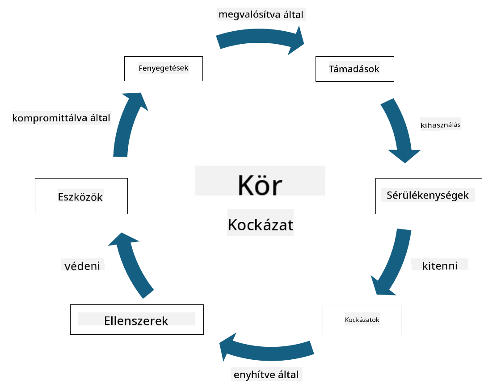

<!--
CO_OP_TRANSLATOR_METADATA:
{
  "original_hash": "fcca304f072cabf206388199e8e2e578",
  "translation_date": "2025-09-03T21:55:54+00:00",
  "source_file": "1.3 Understanding risk management.md",
  "language_code": "hu"
}
-->
# A kockázatkezelés megértése

## Bevezetés

Ebben a leckében az alábbi témákat tárgyaljuk:

 - Gyakran használt biztonsági terminológia definíciói
   
 - Biztonsági kontrollok típusai

 - Biztonsági kockázatok értékelése

## Gyakran használt biztonsági terminológia definíciói

Ezek a kifejezések alapvető fogalmak a kiberbiztonság és a kockázatkezelés területén. Nézzük meg, mit jelentenek, és hogyan kapcsolódnak egymáshoz:

1. **Fenyegetési szereplő**:

A fenyegetési szereplő lehet egy személy, csoport, szervezet vagy automatizált rendszer, amely képes kihasználni egy rendszer vagy hálózat sérülékenységeit, hogy kárt vagy veszteséget okozzon. Fenyegetési szereplők lehetnek hackerek, rosszindulatú programok készítői, elégedetlen alkalmazottak vagy bármely entitás, amely kockázatot jelent az információs és technológiai rendszerekre.

2. **Fenyegetés**:

A fenyegetés egy potenciális esemény vagy cselekvés, amely kihasználhatja egy rendszer sérülékenységeit, és kárt okozhat egy eszközben. Fenyegetések lehetnek például hackelés, adatlopás, szolgáltatásmegtagadási támadások és más hasonló cselekmények. A fenyegetés az, hogy "mi" okozhat potenciális kárt egy szervezet eszközeiben.

3. **Sérülékenység**:

A sérülékenység egy rendszer tervezésében, megvalósításában vagy konfigurációjában lévő gyengeség vagy hiba, amelyet egy fenyegetési szereplő kihasználhat a rendszer biztonságának kompromittálására. Sérülékenységek előfordulhatnak szoftverekben, hardverekben, folyamatokban vagy emberi viselkedésben. A sérülékenységek azonosítása és kezelése kulcsfontosságú a sikeres támadások kockázatának minimalizálásában.

4. **Kockázat**:

A kockázat az a lehetőség, hogy veszteség, kár vagy sérülés következik be egy fenyegetés és egy sérülékenység kölcsönhatása révén. Ez annak valószínűsége, hogy egy fenyegetési szereplő kihasznál egy sérülékenységet, és negatív hatást okoz. A kockázatokat gyakran a potenciális hatásuk és előfordulásuk valószínűsége alapján értékelik.

5. **Eszköz**:

Az eszköz bármi értékes dolog, amit egy szervezet meg akar védeni. Eszközök lehetnek fizikai tárgyak (például számítógépek és szerverek), adatok (ügyfélinformációk, pénzügyi nyilvántartások), szellemi tulajdon (üzleti titkok, szabadalmak) és akár emberi erőforrások (alkalmazottak készségei és tudása). Az eszközök védelme a kiberbiztonság egyik fő célja.

6. **Kitettség**:

A kitettség arra az állapotra utal, amikor egy rendszer sérülékeny a potenciális fenyegetésekkel szemben. Ez akkor fordul elő, amikor egy sérülékenység jelen van, amelyet egy fenyegetési szereplő kihasználhat. A kitettség kiemeli a kockázatot, amely a sérülékenységek jelenlétével jár egy rendszerben vagy hálózatban.

7. **Kontroll**:

A kontroll olyan intézkedés, amelyet a sérülékenységek és fenyegetések által okozott kockázat csökkentésére hoznak. A kontrollok lehetnek technikai, eljárási vagy adminisztratív jellegűek. Céljuk a fenyegetések és sérülékenységek megelőzése, észlelése vagy enyhítése. Példák: tűzfalak, hozzáférés-ellenőrzések, titkosítás, biztonsági irányelvek és alkalmazottak képzése.

Összefoglalva a kifejezések közötti kapcsolatot: A fenyegetési szereplők kihasználják a sérülékenységeket, hogy fenyegetéseket hajtsanak végre, amelyek kockázatokat okozhatnak, és károsíthatják az értékes eszközöket. A kitettség akkor fordul elő, amikor sérülékenységek vannak jelen, és kontrollokat helyeznek el a kockázat csökkentésére, hogy megelőzzék vagy enyhítsék a fenyegetések eszközökre gyakorolt hatását. Ez a keretrendszer képezi a kiberbiztonsági kockázatkezelés alapját, amely segíti a szervezeteket a potenciális kockázatok azonosításában, értékelésében és kezelésében.

## Biztonsági kontrollok típusai

A biztonsági kontrollok olyan intézkedések vagy védelmi mechanizmusok, amelyeket az információs rendszerek és eszközök különféle fenyegetésekkel és sérülékenységekkel szembeni védelmére alkalmaznak. Ezeket több kategóriába sorolhatjuk a fókuszuk és céljuk alapján. Íme néhány gyakori biztonsági kontrolltípus:

1. **Adminisztratív kontrollok**:

Ezek a kontrollok a szervezet biztonsági gyakorlatát és a felhasználói viselkedést szabályozó irányelvekhez, eljárásokhoz és útmutatókhoz kapcsolódnak.

- Biztonsági irányelvek és eljárások: Dokumentált útmutatók, amelyek meghatározzák, hogyan tartják fenn a biztonságot a szervezeten belül.

- Biztonsági tudatosság és képzés: Programok, amelyek az alkalmazottakat oktatják a biztonsági legjobb gyakorlatokról és potenciális fenyegetésekről.

- Incidenskezelés és válaszadás: Tervek a biztonsági incidensek kezelésére és enyhítésére.

2. **Technikai kontrollok**:

A technikai kontrollok technológia alkalmazásával érvényesítik a biztonsági intézkedéseket, és védik a rendszereket és adatokat. Példák technikai kontrollokra:

- Hozzáférés-ellenőrzések: Intézkedések, amelyek korlátozzák a felhasználók hozzáférését az erőforrásokhoz szerepkörük és jogosultságaik alapján.

- Titkosítás: Az adatok biztonságos formátumba való átalakítása, hogy megakadályozzák az illetéktelen hozzáférést.

- Tűzfalak: Hálózati biztonsági eszközök, amelyek szűrik és szabályozzák a bejövő és kimenő forgalmat.

- Betörésészlelő és -megelőző rendszerek (IDPS): Eszközök, amelyek figyelik a hálózati forgalmat gyanús tevékenységek után kutatva.

- Vírusirtó és rosszindulatú programok elleni szoftverek: Programok, amelyek észlelik és eltávolítják a rosszindulatú szoftvereket.

- Hitelesítési mechanizmusok: Módszerek a felhasználók azonosításának ellenőrzésére, például jelszavak, biometria és többfaktoros hitelesítés.

- Javításkezelés: Szoftverek rendszeres frissítése a sérülékenységek kezelésére.

3. **Fizikai kontrollok**:

A fizikai kontrollok az eszközök és létesítmények fizikai védelmét szolgálják.

- Biztonsági őrök és hozzáférés-ellenőrzési személyzet: Személyzet, amely figyeli és ellenőrzi a fizikai helyszínekhez való hozzáférést.

- Megfigyelő kamerák: Videómegfigyelő rendszerek, amelyek figyelik és rögzítik a tevékenységeket.

- Zárak és fizikai akadályok: Fizikai intézkedések az érzékeny területekhez való hozzáférés korlátozására.

- Környezeti kontrollok: Intézkedések a hőmérséklet, páratartalom és más környezeti tényezők szabályozására, amelyek hatással vannak a berendezésekre és adatközpontokra.

4. **Operatív kontrollok**:

Ezek a kontrollok a napi működéshez és tevékenységekhez kapcsolódnak, amelyek biztosítják a rendszerek folyamatos biztonságát.

- Változáskezelés: Folyamatok a rendszerek és konfigurációk változásainak nyomon követésére és jóváhagyására.

- Biztonsági mentés és katasztrófa utáni helyreállítás: Tervek az adatok biztonsági mentésére és helyreállítására rendszerhibák vagy katasztrófák esetén.

- Naplózás és auditálás: A rendszertevékenységek figyelése és rögzítése biztonsági és megfelelőségi célokra.

- Biztonságos kódolási gyakorlatok: Útmutatók a szoftverek írásához a sérülékenységek minimalizálása érdekében.

5. **Jogi és szabályozási kontrollok**:

Ezek a kontrollok biztosítják a vonatkozó törvények, szabályozások és iparági szabványok betartását. Az alkalmazandó szabványok a joghatóságtól, iparági szektortól és más tényezőktől függnek.

- Adatvédelmi szabályozások: A GDPR, HIPAA és CCPA törvényeknek való megfelelés.

- Iparspecifikus szabványok: A PCI DSS szabványok betartása a fizetési kártyaadatok biztonságáért.

Ezek a biztonsági kontrollkategóriák együttműködve átfogó biztonsági helyzetet teremtenek a szervezetek számára, segítve őket rendszereik, adataik és eszközeik védelmében a különféle fenyegetésekkel szemben.

## Biztonsági kockázatok értékelése

Egyes biztonsági szakemberek úgy vélik, hogy a kockázatkezelés kizárólag a kockázati szakemberek feladata, de a biztonsági kockázatok kezelésének folyamatának megértése minden biztonsági szakember számára fontos, hogy a biztonsági kockázatokat olyan nyelven tudják kifejezni, amelyet a szervezet többi része megért és cselekedni tud.

A szervezeteknek folyamatosan értékelniük kell a biztonsági kockázatokat, és dönteniük kell arról, hogy milyen lépéseket (vagy éppen semmit) tegyenek a vállalkozást érintő kockázatokkal szemben. Az alábbiakban bemutatjuk, hogyan történik ez általában. Fontos megjegyezni, hogy ezt a folyamatot általában több különböző csapat végzi a szervezeten belül, ritka, hogy egyetlen csapat felelős a kockázatkezelés teljes folyamatáért.

1. **Eszközök és fenyegetések azonosítása**:

A szervezet azonosítja azokat az eszközöket, amelyeket meg akar védeni. Ezek lehetnek adatok, rendszerek, hardverek, szoftverek, szellemi tulajdon és más értékek. Ezután azonosítják azokat a potenciális fenyegetéseket, amelyek ezeket az eszközöket célozhatják.

2. **Sérülékenységek értékelése**:

A szervezetek azonosítják azokat a sérülékenységeket vagy gyengeségeket a rendszerekben vagy folyamatokban, amelyeket a fenyegetések kihasználhatnak. Ezek a sérülékenységek származhatnak szoftverhibákból, rossz konfigurációkból, biztonsági kontrollok hiányából vagy emberi hibákból.

3. **Valószínűség értékelése**:

A szervezet értékeli az egyes fenyegetések bekövetkezésének valószínűségét. Ez magában foglalja a történelmi adatok, fenyegetési hírszerzés, iparági trendek és belső tényezők figyelembevételét. A valószínűséget alacsony, közepes vagy magas kategóriába sorolják a fenyegetés megvalósulásának valószínűsége alapján.

4. **Hatás értékelése**:

Ezután a szervezet meghatározza az egyes fenyegetések potenciális hatását, ha azok kihasználják a sérülékenységet. A hatás magában foglalhat pénzügyi veszteségeket, működési zavarokat, hírnévkárosodást, jogi következményeket és más tényezőket. A hatást szintén alacsony, közepes vagy magas kategóriába sorolják a lehetséges következmények alapján.

5. **Kockázat kiszámítása**:

A valószínűségi és hatásértékeléseket kombinálják, hogy kiszámítsák az egyes azonosított fenyegetések összesített kockázati szintjét. Ez gyakran egy kockázati mátrix segítségével történik, amely numerikus értékeket vagy minőségi leírásokat rendel a valószínűségi és hatásszintekhez. Az eredményül kapott kockázati szint segít meghatározni, mely kockázatok igényelnek azonnali figyelmet.

6. **Prioritás és döntéshozatal**:

A szervezet ezután prioritást ad a kockázatoknak, azokra összpontosítva, amelyek a legmagasabb kombinált valószínűségi és hatásértékekkel rendelkeznek. Ez lehetővé teszi számukra, hogy hatékonyabban osszák el az erőforrásokat és vezessenek be kontrollokat. A magas kockázatú fenyegetések azonnali figyelmet igényelnek, míg az alacsonyabb kockázatú fenyegetések hosszabb idő alatt kezelhetők.

7. **Kockázatkezelés**:

A kockázatértékelés alapján a szervezet meghatározza, hogyan csökkentse vagy kezelje az egyes kockázatokat. Ez magában foglalhatja biztonsági kontrollok bevezetését, a kockázat áthárítását biztosítással, vagy bizonyos szintű maradék kockázat elfogadását, ha az kezelhetőnek vagy túl költségesnek ítélik a megoldást.

8. **Folyamatos monitorozás és felülvizsgálat**:

A kockázatértékelés nem egyszeri folyamat. Időszakosan vagy a szervezet környezetében bekövetkező jelentős változások esetén kell elvégezni. A folyamatos monitorozás biztosítja, hogy az új fenyegetések, sérülékenységek vagy üzleti környezet változásai figyelembe legyenek véve.

A biztonsági kockázatok ilyen strukturált módon történő értékelésével a szervezetek megalapozott döntéseket hozhatnak az erőforrások elosztásáról, a biztonsági kontrollokról és az általános kockázatkezelési stratégiákról. A cél az, hogy csökkentsék a szervezet kockázati kitettségét, miközben a biztonsági erőfeszítéseket összehangolják a szervezet üzleti céljaival és prioritásaival.

---

**Felelősség kizárása**:  
Ez a dokumentum az AI fordítási szolgáltatás, a [Co-op Translator](https://github.com/Azure/co-op-translator) segítségével lett lefordítva. Bár törekszünk a pontosságra, kérjük, vegye figyelembe, hogy az automatikus fordítások hibákat vagy pontatlanságokat tartalmazhatnak. Az eredeti dokumentum az eredeti nyelvén tekintendő hiteles forrásnak. Kritikus információk esetén javasolt professzionális emberi fordítást igénybe venni. Nem vállalunk felelősséget semmilyen félreértésért vagy téves értelmezésért, amely a fordítás használatából eredhet.