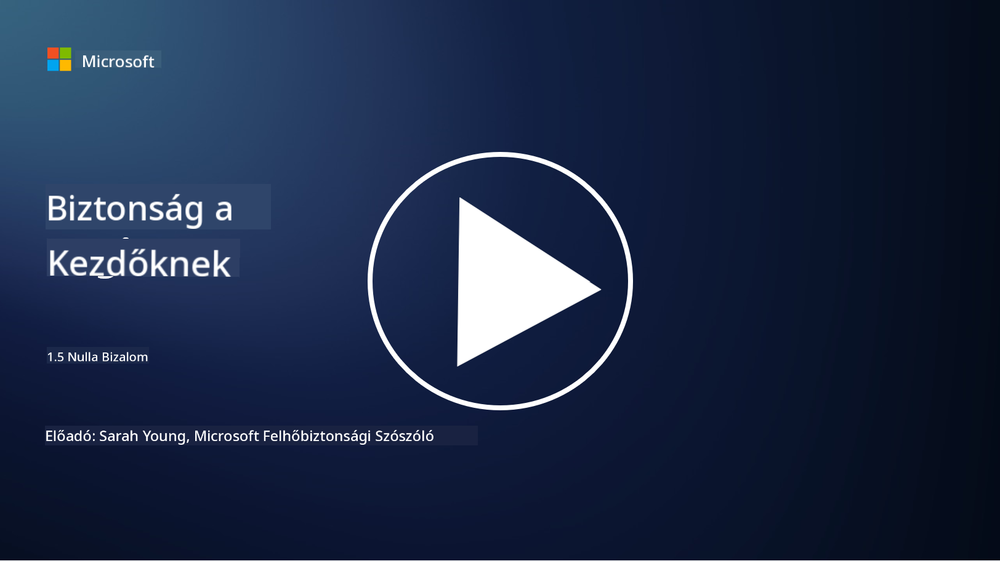
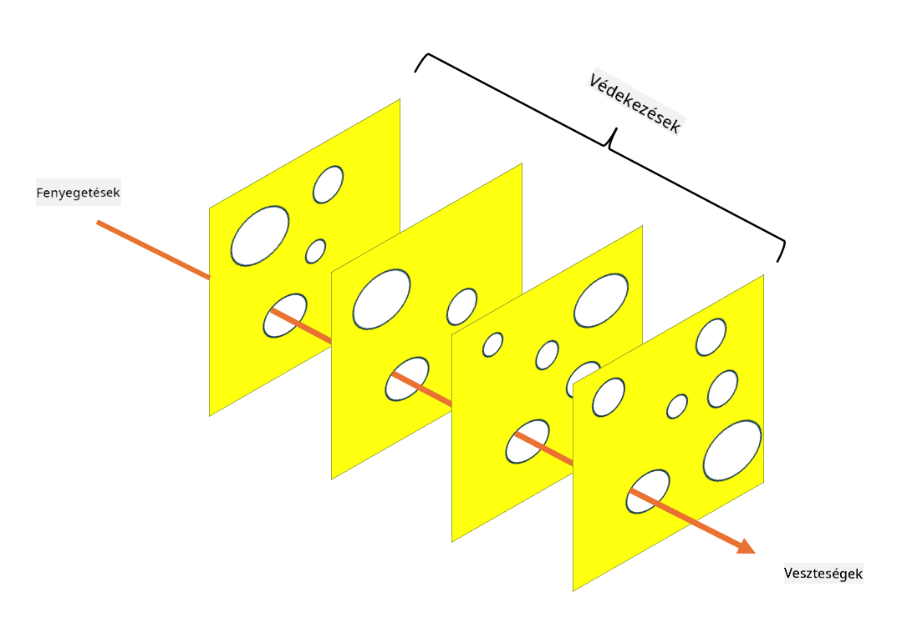

<!--
CO_OP_TRANSLATOR_METADATA:
{
  "original_hash": "75f77f972d2233c584f87c1eb96c983b",
  "translation_date": "2025-09-03T20:32:51+00:00",
  "source_file": "1.5 Zero trust.md",
  "language_code": "hu"
}
-->
# Zero Trust

A „Zero Trust” (Nulla bizalom) kifejezés manapság gyakran felbukkan a biztonsági körökben. De mit is jelent ez pontosan? Csak egy divatos szlogen? Ebben a leckében mélyebben megvizsgáljuk, hogy mi is az a Zero Trust.

## Bevezetés

 - Ebben a leckében az alábbiakat tárgyaljuk:
   
   
 - Mi az a Zero Trust?

   
  

 - Hogyan különbözik a Zero Trust a hagyományos biztonsági architektúráktól?

   
   

 - Mi az a mélységi védelem?

## Zero Trust

A Zero Trust egy olyan kiberbiztonsági megközelítés, amely megkérdőjelezi a hagyományos „bízz, de ellenőrizd” elvet, és azt feltételezi, hogy semmilyen entitás – legyen az a szervezet hálózatán belül vagy kívül – nem érdemel automatikus bizalmat. Ehelyett a Zero Trust azt szorgalmazza, hogy minden felhasználót, eszközt és alkalmazást, amely hozzáférést próbál szerezni, ellenőrizni kell, függetlenül azok helyzetétől. A Zero Trust alapelve az „támadási felület” minimalizálása és a biztonsági incidensek hatásának csökkentése.

A Zero Trust modellben az alábbi elvek kapnak hangsúlyt:

1. **Azonosítás ellenőrzése**: Az autentikációt és az autorizációt szigorúan alkalmazzák minden felhasználóra és eszközre, függetlenül azok helyzetétől. Ne feledjük, hogy az azonosítás nem feltétlenül emberi: lehet eszköz, alkalmazás stb.

2. **Minimális jogosultság**: A felhasználók és eszközök csak a feladataik elvégzéséhez szükséges minimális hozzáférést kapják, ezzel csökkentve a károkat, ha kompromittálódnak.

3. **Mikroszegmentáció**: A hálózati erőforrásokat kisebb szegmensekre osztják, hogy korlátozzák a hálózaton belüli oldalirányú mozgást egy esetleges támadás esetén.

4. **Folyamatos monitorozás**: A felhasználók és eszközök viselkedésének folyamatos megfigyelése és elemzése történik, hogy anomáliákat és potenciális fenyegetéseket lehessen észlelni. A modern monitorozási technikák gépi tanulást, mesterséges intelligenciát és fenyegetésfelderítést is alkalmaznak, hogy további részleteket és kontextust biztosítsanak.

5. **Adatok titkosítása**: Az adatok titkosítása mind átvitel közben, mind tárolás alatt történik, hogy megakadályozzák az illetéktelen hozzáférést.

6. **Szigorú hozzáférés-ellenőrzés**: A hozzáférés-ellenőrzést kontextus alapján hajtják végre, például felhasználói szerepkörök, eszköz állapota és hálózati helyzet alapján.

A Microsoft a Zero Trust-ot öt pillérre osztja, amelyeket egy későbbi leckében fogunk megvitatni.

## Különbségek a hagyományos biztonsági architektúrákhoz képest

A Zero Trust több szempontból különbözik a hagyományos biztonsági architektúráktól, például a periméter-alapú modellektől:

1. **Periméter vs. identitásközpontú**: A hagyományos modellek a hálózat periméterének védelmére összpontosítanak, és feltételezik, hogy a belső felhasználók és eszközök megbízhatóak, ha már belül vannak. A Zero Trust ezzel szemben azt feltételezi, hogy a fenyegetések a hálózaton belülről és kívülről egyaránt érkezhetnek, és szigorú identitásalapú ellenőrzéseket alkalmaz.

2. **Implicit vs. explicit bizalom**: A hagyományos modellek implicit módon bíznak a hálózaton belüli eszközökben és felhasználókban, amíg az ellenkezője be nem bizonyosodik. A Zero Trust explicit módon ellenőrzi az identitásokat, és folyamatosan monitorozza az anomáliákat.

3. **Lapos vs. szegmentált hálózat**: A hagyományos architektúrák gyakran lapos hálózatokat alkalmaznak, ahol a belső felhasználók széles körű hozzáféréssel rendelkeznek. A Zero Trust a hálózat kisebb, elkülönített zónákra való szegmentálását szorgalmazza, hogy korlátozza a potenciális támadásokat.

4. **Reaktív vs. proaktív**: A hagyományos biztonság gyakran reaktív intézkedésekre támaszkodik, mint például periméter tűzfalak és behatolásérzékelés. A Zero Trust proaktív megközelítést alkalmaz, feltételezve, hogy a támadások valószínűek, és minimalizálja azok hatását.

## Mélységi védelem

A mélységi védelem, más néven rétegezett biztonság, egy olyan kiberbiztonsági stratégia, amely több biztonsági kontroll és intézkedés alkalmazását foglalja magában a szervezet eszközeinek védelme érdekében. A cél az, hogy átfedő védelmi rétegeket hozzunk létre, így ha az egyik réteg megsérül, a többi még mindig védelmet nyújt. Minden réteg a biztonság egy másik aspektusára összpontosít, és növeli a szervezet általános biztonsági helyzetét.

A mélységi védelem technikai, eljárási és fizikai biztonsági intézkedések kombinációját foglalja magában. Ezek közé tartozhatnak tűzfalak, behatolásérzékelő rendszerek, hozzáférés-ellenőrzések, titkosítás, felhasználói képzés, biztonsági irányelvek és még sok más. Az ötlet az, hogy több akadályt hozzunk létre, amelyek együttesen megnehezítik a támadók számára a szervezet rendszereinek és hálózatainak behatolását. Ezt néha „svájci sajt” modellnek is nevezik, amelyet más iparágakban (pl. közlekedés) balesetmegelőzésre is alkalmaznak.

## További olvasmányok

[Mi az a Zero Trust?](https://learn.microsoft.com/security/zero-trust/zero-trust-overview?WT.mc_id=academic-96948-sayoung)

[A Zero Trust fejlődése – Microsoft állásfoglalás](https://query.prod.cms.rt.microsoft.com/cms/api/am/binary/RWJJdT?WT.mc_id=academic-96948-sayoung)

[Zero Trust és BeyondCorp Google Cloud | Google Cloud Blog](https://cloud.google.com/blog/topics/developers-practitioners/zero-trust-and-beyondcorp-google-cloud)

---

**Felelősség kizárása**:  
Ez a dokumentum az AI fordítási szolgáltatás, a [Co-op Translator](https://github.com/Azure/co-op-translator) segítségével lett lefordítva. Bár törekszünk a pontosságra, kérjük, vegye figyelembe, hogy az automatikus fordítások hibákat vagy pontatlanságokat tartalmazhatnak. Az eredeti dokumentum az eredeti nyelvén tekintendő hiteles forrásnak. Kritikus információk esetén javasolt professzionális emberi fordítást igénybe venni. Nem vállalunk felelősséget semmilyen félreértésért vagy téves értelmezésért, amely a fordítás használatából eredhet.