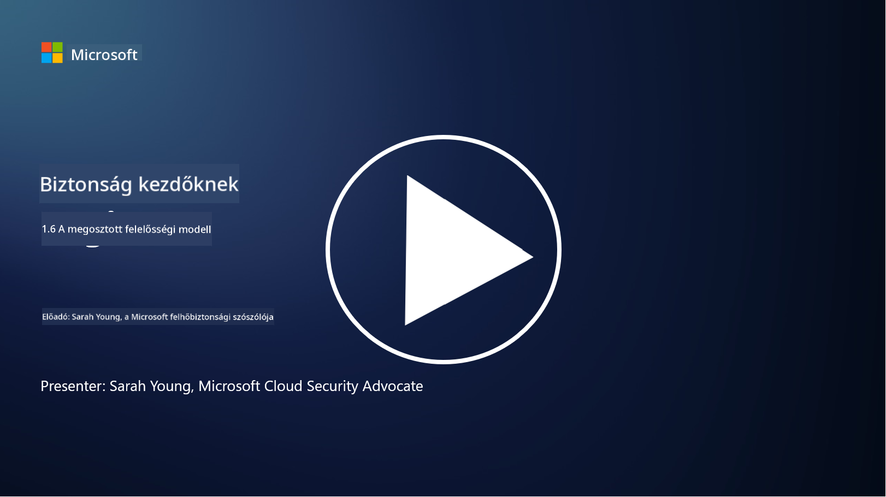

<!--
CO_OP_TRANSLATOR_METADATA:
{
  "original_hash": "a48db640d80c786b928ca178c414f084",
  "translation_date": "2025-09-03T21:05:47+00:00",
  "source_file": "1.6 Shared responsibility model.md",
  "language_code": "hu"
}
-->
# A megosztott felelősség modellje

A megosztott felelősség egy viszonylag új fogalom az informatikában, amely a felhőalapú számítástechnika megjelenésével vált fontossá. A kiberbiztonság szempontjából kritikus, hogy pontosan megértsük, ki milyen biztonsági intézkedéseket biztosít, hogy ne maradjanak védelmi hiányosságok.

## Bevezetés

Ebben a leckében szó lesz:

 - Mi a megosztott felelősség a kiberbiztonság kontextusában?
   
 - Mi a különbség a biztonsági intézkedések megosztott felelőssége között
   az IaaS, PaaS és SaaS esetében?

   

 - Hol találhatók meg a felhőplatform által biztosított biztonsági intézkedések?

   
 

 - Mit jelent a „bízz, de ellenőrizd” elv?

## Mi a megosztott felelősség a kiberbiztonság kontextusában?

A megosztott felelősség a kiberbiztonságban a biztonsági feladatok megosztását jelenti a felhőszolgáltató (CSP) és annak ügyfelei között. A felhőalapú számítástechnikai környezetekben, mint például az Infrastructure as a Service (IaaS), Platform as a Service (PaaS) és Software as a Service (SaaS), mind a CSP, mind az ügyfél szerepet játszik az adatok, alkalmazások és rendszerek biztonságának biztosításában.

## Mi a különbség a biztonsági intézkedések megosztott felelőssége között az IaaS, PaaS és SaaS esetében?

A felelősségek megosztása általában a használt felhőszolgáltatás típusától függ:

 - **IaaS (Infrastructure as a Service)**: A CSP biztosítja az alapvető infrastruktúrát (szerverek, hálózat, tárhely), míg az ügyfél felelős az operációs rendszerek, alkalmazások és biztonsági konfigurációk kezeléséért ezen az infrastruktúrán.
   
   
 - **PaaS (Platform as a Service):** A CSP egy platformot kínál, amelyen az ügyfelek alkalmazásokat építhetnek és telepíthetnek. A CSP kezeli az alapvető infrastruktúrát, míg az ügyfél az alkalmazásfejlesztésre és az adatok biztonságára koncentrál.

   

 - **SaaS (Software as a Service)**: A CSP teljesen működőképes alkalmazásokat biztosít, amelyek az interneten keresztül érhetők el. Ebben az esetben a CSP felelős az alkalmazás biztonságáért és infrastruktúrájáért, míg az ügyfél a felhasználói hozzáférést és az adatok használatát kezeli.

A megosztott felelősség megértése kulcsfontosságú, mivel tisztázza, hogy mely biztonsági aspektusokat fedezi a CSP, és melyeket kell az ügyfélnek kezelnie. Ez segít elkerülni a félreértéseket, és biztosítja, hogy a biztonsági intézkedések átfogóan legyenek végrehajtva.

## Hol találhatók meg a felhőplatform által biztosított biztonsági intézkedések?

A felhőplatform által biztosított biztonsági intézkedések megismeréséhez a felhőszolgáltató dokumentációját és erőforrásait kell tanulmányozni. Ezek közé tartoznak:

 - **A CSP weboldala és dokumentációja**: A CSP weboldalán információ található az általuk kínált biztonsági funkciókról és intézkedésekről. A CSP-k általában részletes dokumentációt kínálnak, amely bemutatja biztonsági gyakorlatukat, intézkedéseiket és ajánlásaikat. Ez magában foglalhat fehér könyveket, biztonsági útmutatókat és technikai dokumentációt.
   
 - **Biztonsági értékelések és auditok**: A legtöbb CSP független biztonsági szakértők és szervezetek által értékelteti biztonsági intézkedéseit. Ezek az értékelések betekintést nyújthatnak a CSP biztonsági intézkedéseinek minőségébe. Néha ez ahhoz vezet, hogy a CSP biztonsági megfelelőségi tanúsítványt szerez (lásd a következő pontot).
 - **Biztonsági megfelelőségi tanúsítványok**: A legtöbb CSP olyan tanúsítványokat szerez, mint az ISO:27001, SOC 2 és FedRAMP stb. Ezek a tanúsítványok igazolják, hogy a szolgáltató megfelel bizonyos biztonsági és megfelelőségi szabványoknak.

Ne feledje, hogy a részletek szintje és az információk elérhetősége CSP-nként eltérő lehet. Mindig győződjön meg arról, hogy a felhőszolgáltató által biztosított hivatalos és naprakész forrásokat tanulmányozza, hogy megalapozott döntéseket hozhasson a felhőalapú eszközök biztonságáról.

## Mit jelent a „bízz, de ellenőrizd” elv?

A CSP, harmadik fél által kínált szoftver vagy más IT-biztonsági szolgáltatás használatának kontextusában egy szervezet kezdetben megbízhat a szolgáltató biztonsági intézkedésekkel kapcsolatos állításaiban. Azonban ahhoz, hogy valóban biztosítsák adataik és rendszereik biztonságát, ezeket az állításokat biztonsági értékelésekkel, behatolási tesztekkel és a külső fél biztonsági intézkedéseinek áttekintésével kell ellenőrizni, mielőtt teljes mértékben integrálnák a szoftvert vagy szolgáltatást a működésükbe. Minden egyénnek és szervezetnek törekednie kell arra, hogy bízzon, de ellenőrizze azokat a biztonsági intézkedéseket, amelyekért nem felelős.

## Megosztott felelősség a szervezeten belül
Ne feledje, hogy a szervezeten belüli biztonsági megosztott felelősséget a különböző csapatok között is figyelembe kell venni. A biztonsági csapat ritkán valósítja meg az összes intézkedést önállóan, és együtt kell működnie az operációs csapatokkal, fejlesztőkkel és az üzlet más részeivel, hogy minden szükséges biztonsági intézkedést megvalósítsanak a szervezet biztonságának megőrzése érdekében.

## További olvasnivalók
- [Megosztott felelősség a felhőben - Microsoft Azure | Microsoft Learn](https://learn.microsoft.com/azure/security/fundamentals/shared-responsibility?WT.mc_id=academic-96948-sayoung)
- [Mi az a megosztott felelősség modell? – Meghatározás a TechTarget.com-tól](https://www.techtarget.com/searchcloudcomputing/definition/shared-responsibility-model)
- [A megosztott felelősség modellje és mit jelent a felhőbiztonság szempontjából | CSO Online](https://www.csoonline.com/article/570779/the-shared-responsibility-model-explained-and-what-it-means-for-cloud-security.html)
- [Megosztott felelősség a felhőbiztonságért: Amit tudnia kell (cisecurity.org)](https://www.cisecurity.org/insights/blog/shared-responsibility-cloud-security-what-you-need-to-know)

---

**Felelősség kizárása**:  
Ez a dokumentum az AI fordítási szolgáltatás, a [Co-op Translator](https://github.com/Azure/co-op-translator) segítségével lett lefordítva. Bár törekszünk a pontosságra, kérjük, vegye figyelembe, hogy az automatikus fordítások hibákat vagy pontatlanságokat tartalmazhatnak. Az eredeti dokumentum az eredeti nyelvén tekintendő hiteles forrásnak. Kritikus információk esetén javasolt professzionális emberi fordítást igénybe venni. Nem vállalunk felelősséget semmilyen félreértésért vagy téves értelmezésért, amely a fordítás használatából eredhet.