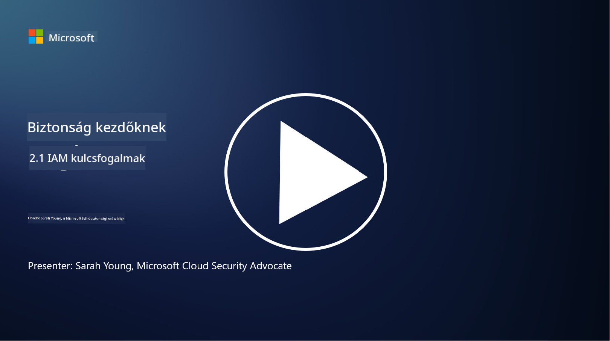

<!--
CO_OP_TRANSLATOR_METADATA:
{
  "original_hash": "2e3864e3d579f0dbb4ac2ec8c5f82acf",
  "translation_date": "2025-09-03T19:37:39+00:00",
  "source_file": "2.1 IAM key concepts.md",
  "language_code": "hu"
}
-->
# IAM kulcsfogalmak

Valaha bejelentkeztél már egy számítógépre vagy weboldalra? Természetesen igen! Ez azt jelenti, hogy már találkoztál az identitáskezelés eszközeivel a mindennapi életedben. Az identitás- és hozzáférés-kezelés (IAM) a biztonság egyik alapvető pillére, amelyről többet fogunk tanulni a következő leckékben.

**Bevezetés**

Ebben a leckében az alábbi témákat fogjuk áttekinteni:

- Mit értünk identitás- és hozzáférés-kezelés (IAM) alatt a
  kiberbiztonság kontextusában?

- Mi az a legkisebb jogosultság elve?

- Mi az a feladatok szétválasztása?

- Mi az autentikáció és az autorizáció?

## Mit értünk identitás- és hozzáférés-kezelés (IAM) alatt a kiberbiztonság kontextusában?

Az identitás- és hozzáférés-kezelés (IAM) olyan folyamatok, technológiák és szabályzatok összességét jelenti, amelyek biztosítják, hogy a megfelelő személyek megfelelő hozzáférést kapjanak egy szervezet digitális környezetében található erőforrásokhoz. Az IAM magában foglalja a digitális identitások (felhasználók, alkalmazottak, partnerek) kezelését, valamint hozzáférésüket rendszerekhez, alkalmazásokhoz, adatokhoz és hálózatokhoz. Az IAM elsődleges célja a biztonság növelése, a felhasználói hozzáférés egyszerűsítése és a szervezeti szabályzatoknak és előírásoknak való megfelelés biztosítása. Az IAM megoldások általában magukban foglalják a felhasználói autentikációt, autorizációt, identitás-létrehozást, hozzáférés-ellenőrzést és a felhasználói életciklus kezelését (például annak biztosítását, hogy a már nem használt fiókok törlésre kerüljenek).

## Mi az a legkisebb jogosultság elve?

A legkisebb jogosultság elve egy alapvető koncepció, amely azt hirdeti, hogy a felhasználóknak és rendszereknek csak a minimálisan szükséges jogosultságokat kell megkapniuk ahhoz, hogy elvégezhessék a rájuk bízott feladatokat vagy szerepeket. Ez az elv segít csökkenteni a biztonsági incidensek vagy belső fenyegetések esetén bekövetkező károkat. A legkisebb jogosultság elvének betartásával a szervezetek csökkentik a támadási felületet, és minimalizálják a jogosulatlan hozzáférés, adatlopás és jogosultságok véletlen visszaéléseinek kockázatát. Gyakorlatban ez azt jelenti, hogy a felhasználók csak azokhoz az erőforrásokhoz és funkciókhoz kapnak hozzáférést, amelyek szükségesek a munkájukhoz, és semmi többet. Például, ha csak egy dokumentumot kell elolvasnod, akkor túlzás lenne, ha teljes adminisztrátori jogosultságot kapnál az adott dokumentumhoz.

## Mi az a feladatok szétválasztása?

A feladatok szétválasztása egy olyan elv, amelynek célja az érdekellentétek megelőzése, valamint a csalás és hibák kockázatának csökkentése azáltal, hogy kritikus feladatokat és felelősségeket különböző személyek között osztanak el egy szervezeten belül. A kiberbiztonság kontextusában a feladatok szétválasztása azt jelenti, hogy egyetlen személy sem rendelkezhet teljes ellenőrzéssel egy kritikus folyamat vagy rendszer minden aspektusa felett. A cél egy olyan ellenőrzési rendszer létrehozása, amely megakadályozza, hogy egyetlen személy képes legyen egy folyamat beállítási és jóváhagyási szakaszát is elvégezni. Például pénzügyi rendszerekben ez azt jelentheti, hogy az a személy, aki tranzakciókat rögzít a rendszerben, nem lehet ugyanaz, aki jóváhagyja azokat. Ez csökkenti annak kockázatát, hogy jogosulatlan vagy csalárd tevékenységek észrevétlenek maradjanak.

## Mi az autentikáció és az autorizáció?

Az autentikáció és az autorizáció két alapvető fogalom a kiberbiztonságban, amelyek kulcsszerepet játszanak a számítógépes rendszerek és adatok biztonságának és integritásának biztosításában. Gyakran együtt használják őket az erőforrásokhoz való hozzáférés szabályozására és az érzékeny információk védelmére.

**1. Autentikáció**: Az autentikáció az a folyamat, amely során ellenőrzik egy felhasználó, rendszer vagy entitás azonosságát, amikor az hozzáférést próbál szerezni egy számítógépes rendszerhez vagy konkrét erőforráshoz. Ez biztosítja, hogy az állított identitás valódi és pontos. Az autentikációs módszerek általában az alábbi tényezők egyikét vagy kombinációját használják:

   a. Amit tudsz: Ide tartoznak jelszavak, PIN-kódok vagy más titkos információk, amelyeket csak az engedélyezett felhasználó ismerhet.

   b. Amit birtokolsz: Ez magában foglal fizikai tokeneket vagy eszközöket, mint például okoskártyák, biztonsági tokenek vagy mobiltelefonok, amelyekkel a felhasználó személyazonossága igazolható.

   c. Ami vagy: Ez biometrikus tényezőkre utal, mint például ujjlenyomatok, arcfelismerés vagy retina-szkennelés, amelyek egyediek az egyén számára.

Az autentikációs mechanizmusok arra szolgálnak, hogy megerősítsék, hogy a felhasználó valóban az, akinek mondja magát, mielőtt hozzáférést kapna egy rendszerhez vagy erőforráshoz. Ez segít megelőzni a jogosulatlan hozzáférést, és biztosítja, hogy csak legitim felhasználók hajthassanak végre műveleteket egy rendszerben.

**2. Autorizáció**: Az autorizáció az a folyamat, amely során az autentikált felhasználóknak vagy entitásoknak meghatározott engedélyeket és jogosultságokat adnak vagy tagadnak meg, miután az identitásukat ellenőrizték. Ez határozza meg, hogy egy felhasználó milyen műveleteket vagy tevékenységeket végezhet egy rendszerben vagy konkrét erőforráson. Az autorizáció általában előre meghatározott szabályzatokon, hozzáférés-ellenőrzési szabályokon és a felhasználókhoz rendelt szerepkörökön alapul.

Az autorizáció úgy is értelmezhető, mint a kérdés megválaszolása: "Mit tehet egy autentikált felhasználó?" Ez magában foglalja a hozzáférés-ellenőrzési szabályzatok meghatározását és érvényesítését, hogy megvédje az érzékeny adatokat és erőforrásokat a jogosulatlan hozzáféréstől vagy módosítástól.

**Összefoglalva:**

- Az autentikáció a felhasználók vagy entitások azonosságát állapítja meg.
- Az autorizáció meghatározza, hogy az autentikált felhasználók milyen műveleteket és erőforrásokat érhetnek el vagy módosíthatnak.

## További olvasnivalók

- [Describe identity concepts - Training | Microsoft Learn](https://learn.microsoft.com/training/modules/describe-identity-principles-concepts/?WT.mc_id=academic-96948-sayoung)
- [Introduction to identity - Microsoft Entra | Microsoft Learn](https://learn.microsoft.com/azure/active-directory/fundamentals/identity-fundamental-concepts?WT.mc_id=academic-96948-sayoung)
- [What is Identity Access Management (IAM)? | Microsoft Security](https://www.microsoft.com/security/business/security-101/what-is-identity-access-management-iam?WT.mc_id=academic-96948-sayoung)
- [What is IAM? Identity and access management explained | CSO Online](https://www.csoonline.com/article/518296/what-is-iam-identity-and-access-management-explained.html)
- [What is IAM? (auth0.com)](https://auth0.com/blog/what-is-iam/)
- [Security+: implementing Identity and Access Management (IAM) controls [updated 2021] | Infosec (infosecinstitute.com)](https://resources.infosecinstitute.com/certifications/securityplus/security-implementing-identity-and-access-management-iam-controls/)
- [least privilege - Glossary | CSRC (nist.gov)](https://csrc.nist.gov/glossary/term/least_privilege)
- [Security: The Principle of Least Privilege (POLP) - Microsoft Community Hub](https://techcommunity.microsoft.com/t5/azure-sql-blog/security-the-principle-of-least-privilege-polp/ba-p/2067390?WT.mc_id=academic-96948-sayoung)
- [Principle of least privilege | CERT NZ](https://www.cert.govt.nz/it-specialists/critical-controls/principle-of-least-privilege/)
- [Why is separation of duties required by NIST 800-171 and CMMC? - (totem.tech)](https://www.totem.tech/cmmc-separation-of-duties/)

---

**Felelősség kizárása**:  
Ez a dokumentum az [Co-op Translator](https://github.com/Azure/co-op-translator) AI fordítási szolgáltatás segítségével került lefordításra. Bár törekszünk a pontosságra, kérjük, vegye figyelembe, hogy az automatikus fordítások hibákat vagy pontatlanságokat tartalmazhatnak. Az eredeti dokumentum az eredeti nyelvén tekintendő hiteles forrásnak. Fontos információk esetén javasolt professzionális emberi fordítást igénybe venni. Nem vállalunk felelősséget semmilyen félreértésért vagy téves értelmezésért, amely a fordítás használatából eredhet.