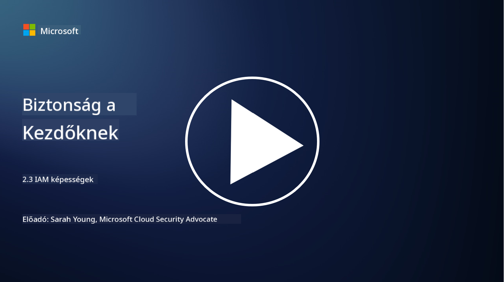

<!--
CO_OP_TRANSLATOR_METADATA:
{
  "original_hash": "bf0b8a54f2c69951744df5a94bc923f7",
  "translation_date": "2025-09-03T22:11:34+00:00",
  "source_file": "2.3 IAM capabilities.md",
  "language_code": "hu"
}
-->
# IAM képességek

Ebben a szakaszban részletesebben bemutatjuk azokat az alapvető eszközöket és képességeket, amelyek az identitásbiztonságban használatosak.

## Bevezetés

Ebben a leckében szó lesz:

 - Mi az a könyvtárszolgáltatás?
      
     
    
 - Milyen képességekkel lehet az identitásokat védeni?
>
>        Többtényezős hitelesítés (MFA)
> 
>        Egyszeri bejelentkezés (SSO)
> 
>        Szerepkör-alapú hozzáférés-vezérlés (RBAC)
> 
>        Adaptív hitelesítés
> 
>        Biometrikus hitelesítés
> 
>        Kiváltságos hozzáférés-kezelés (PAM)
> 
>        Identitásirányítás és adminisztráció (IGA)
> 
>        Viselkedéselemzés

## Mi az a könyvtárszolgáltatás?

A könyvtárszolgáltatás egy speciális adatbázis, amely hálózati erőforrásokkal kapcsolatos információkat tárol és kezel, beleértve a felhasználókat, csoportokat, eszközöket, alkalmazásokat és egyéb objektumokat. Ez egy központi adattárként szolgál az identitás- és hozzáféréskezeléssel kapcsolatos adatok számára, lehetővé téve a szervezetek számára, hogy hatékonyan kezeljék és irányítsák a felhasználói hitelesítést, jogosultságokat és egyéb biztonsági feladatokat.

A könyvtárszolgáltatások kulcsszerepet játszanak a modern IT környezetekben, mivel alapot biztosítanak az identitás- és hozzáféréskezelési (IAM) megoldásokhoz. Segítenek az erőforrások biztonságos elérésében, hozzáférési szabályok érvényesítésében és az adminisztratív feladatok egyszerűsítésében. Az egyik legismertebb könyvtárszolgáltatás a Microsoft Active Directory, de léteznek más megoldások is, mint például az LDAP (Lightweight Directory Access Protocol) könyvtárak, amelyek hasonló célokat szolgálnak.

A könyvtárszolgáltatás kulcsfontosságú funkciói és jellemzői a kiberbiztonság szempontjából:

 - **Felhasználói hitelesítés**: A könyvtárszolgáltatások ellenőrzik a felhasználói hitelesítő adatokat (például felhasználóneveket és jelszavakat), hogy biztosítsák, csak az engedélyezett felhasználók férjenek hozzá a hálózathoz és annak erőforrásaihoz.
 - **Felhasználói jogosultságok**: Meghatározzák, hogy egyes felhasználók milyen szintű hozzáféréssel rendelkeznek a szerepkörük, csoporttagságuk és egyéb attribútumaik alapján. Ez biztosítja, hogy a felhasználók csak azokat az erőforrásokat érjék el, amelyekhez jogosultságuk van.
 - **Csoportkezelés**: A könyvtárszolgáltatások lehetővé teszik az adminisztrátorok számára, hogy a felhasználókat logikai csoportokba szervezzék, egyszerűsítve a hozzáférés-vezérlés kezelését. A jogosultságokat csoportokhoz lehet rendelni, nem pedig egyéni felhasználókhoz.
 - **Jelszó-szabályok**: Jelszókomplexitási és lejárati szabályokat érvényesítenek, növelve a felhasználói fiókok biztonságát.
 - **Egyszeri bejelentkezés (SSO)**: Egyes könyvtárszolgáltatások támogatják az SSO-t, lehetővé téve a felhasználók számára, hogy egyetlen hitelesítő adatkészlettel több alkalmazást és szolgáltatást érjenek el.
 - **Központosított felhasználókezelés**: A könyvtárszolgáltatások központosítják a felhasználói információkat, megkönnyítve a felhasználói fiókok, profilok és attribútumok kezelését egyetlen helyről.
 - **Auditálás és naplózás**: Rögzíthetik a felhasználói hitelesítési és hozzáférési tevékenységeket, segítve a biztonsági auditokat és a megfelelőségi erőfeszítéseket.

## Milyen képességekkel lehet az identitásokat védeni?

**Többtényezős hitelesítés (MFA)**

Az MFA megköveteli, hogy a felhasználók többféle igazolást nyújtsanak be a hozzáférés engedélyezése előtt. Ez általában magában foglalja azt, amit a felhasználó tud (jelszó), amit birtokol (okostelefon vagy biztonsági token), és amit a felhasználó maga (biometrikus adatok, például ujjlenyomat vagy arcfelismerés).

**Egyszeri bejelentkezés (SSO)**

Az SSO lehetővé teszi a felhasználók számára, hogy egyetlen hitelesítő adatkészlettel több alkalmazást és rendszert érjenek el. Ez javítja a felhasználói élményt és csökkenti a több jelszó kezelésével járó kockázatokat.

**Szerepkör-alapú hozzáférés-vezérlés (RBAC)**

Az RBAC előre meghatározott szerepkörök alapján osztja ki a jogosultságokat. A felhasználók hozzáférést kapnak a szervezeten belüli szerepkörük alapján.

**Adaptív hitelesítés**

Az adaptív hitelesítés kockázati tényezőket, például helyet, eszközt, hozzáférési időt és felhasználói viselkedést értékel, hogy dinamikusan állítsa be a szükséges hitelesítési szintet. Ha egy kérés gyanúsnak tűnik, további hitelesítési lépések léphetnek életbe.

**Biometrikus hitelesítés**

A biometrikus hitelesítés egyedi biológiai jellemzőket használ, például ujjlenyomatokat, arcvonásokat, hangmintákat, sőt viselkedési jellemzőket, mint például a gépelési sebesség, az identitás ellenőrzésére.

**Kiváltságos hozzáférés-kezelés (PAM)**

A PAM a kritikus rendszerekhez és adatokhoz való hozzáférés biztosítására összpontosít, szigorú ellenőrzéseket alkalmazva a kiváltságos fiókokra. Ez magában foglalja például az időszakos hozzáférést és a munkamenet-figyelést.

**Identitásirányítás és adminisztráció (IGA)**

Az IGA megoldások kezelik a felhasználói identitásokat és azok hozzáférését az erőforrásokhoz az életciklusuk során. Ez magában foglalja a beléptetést, jogosultságok kiosztását, szerepkör-alapú hozzáférés-vezérlést és a kiléptetést.

**Viselkedéselemzés**

A viselkedéselemzés figyeli a felhasználói viselkedést és alapvető mintákat állít fel. Az eltérések riasztásokat válthatnak ki további vizsgálat céljából.

# További olvasnivalók
- [Azure Active Directory alapok dokumentáció - Microsoft Entra | Microsoft Learn](https://learn.microsoft.com/azure/active-directory/fundamentals/?WT.mc_id=academic-96948-sayoung)
- [Mi az Azure Active Directory? - Microsoft Entra | Microsoft Learn](https://learn.microsoft.com/azure/active-directory/fundamentals/whatis?WT.mc_id=academic-96948-sayoung)
- [Kezeld többfelhős identitás infrastruktúrádat a Microsoft Entra segítségével - YouTube](https://www.youtube.com/watch?v=9qQiq3wTS2Y&list=PLXtHYVsvn_b_gtX1-NB62wNervQx1Fhp4&index=18)

---

**Felelősség kizárása**:  
Ez a dokumentum az AI fordítási szolgáltatás, a [Co-op Translator](https://github.com/Azure/co-op-translator) segítségével lett lefordítva. Bár törekszünk a pontosságra, kérjük, vegye figyelembe, hogy az automatikus fordítások hibákat vagy pontatlanságokat tartalmazhatnak. Az eredeti dokumentum az eredeti nyelvén tekintendő hiteles forrásnak. Kritikus információk esetén javasolt professzionális emberi fordítást igénybe venni. Nem vállalunk felelősséget semmilyen félreértésért vagy téves értelmezésért, amely a fordítás használatából eredhet.