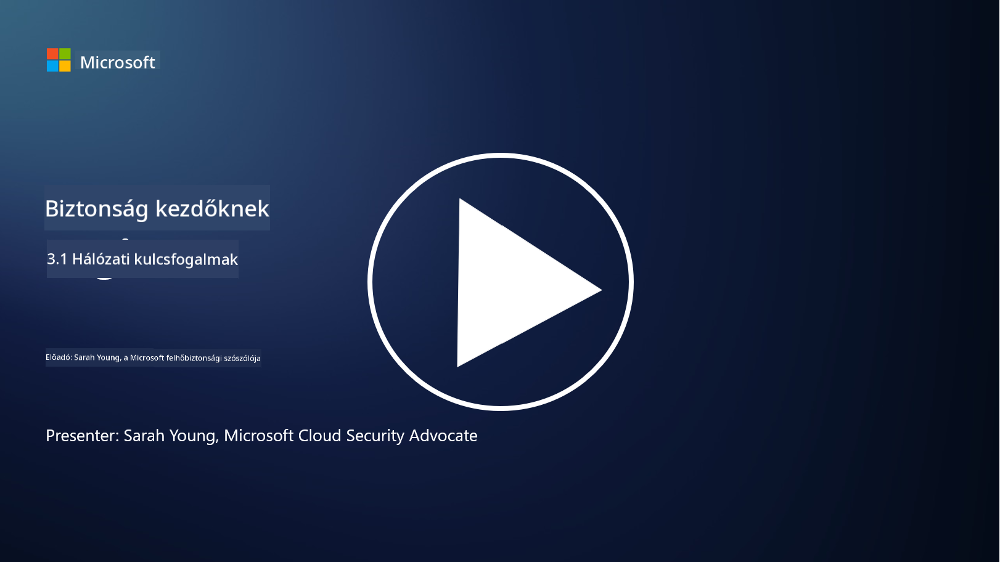
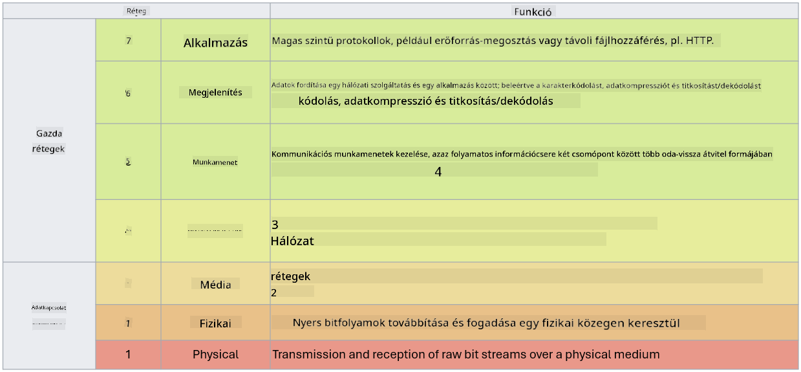

<!--
CO_OP_TRANSLATOR_METADATA:
{
  "original_hash": "252724eceeb183fb9018f88c5e1a3f0c",
  "translation_date": "2025-09-03T22:06:02+00:00",
  "source_file": "3.1 Networking key concepts.md",
  "language_code": "hu"
}
-->
# Hálózati alapfogalmak

Ha valaha dolgoztál az IT területén, valószínűleg találkoztál már hálózati fogalmakkal. Bár modern környezetekben az identitást használjuk elsődleges védelmi vonalként, ez nem jelenti azt, hogy a hálózati kontrollok feleslegessé váltak. Ez egy hatalmas téma, de ebben a leckében néhány kulcsfontosságú hálózati fogalmat fogunk áttekinteni.

Ebben a leckében szó lesz:

 - Mi az IP-címzés?
   
 - Mi az OSI modell?

 

 - Mi az a TCP/UDP?

   
 

 - Mik azok a portszámok?

   
  

 - Mi az adattitkosítás nyugalmi állapotban és átvitel közben?

## Mi az IP-címzés?

Az IP-címzés, vagy Internet Protocol címzés, egy numerikus azonosító, amelyet minden olyan eszköz kap, amely az Internet Protocolt használó számítógépes hálózathoz csatlakozik. Ez egyedi azonosítóként szolgál az eszközök számára a hálózaton belül, lehetővé téve számukra az adatok küldését és fogadását az interneten vagy más összekapcsolt hálózatokon keresztül. Az IP-címzésnek két fő verziója van: IPv4 (Internet Protocol verzió 4) és IPv6 (Internet Protocol verzió 6). Az IP-címeket általában IPv4 formátumban (pl. 192.168.1.1) vagy IPv6 formátumban (pl. 2001:0db8:85a3:0000:0000:8a2e:0370:7334) ábrázolják.

## Mi az OSI modell?

Az OSI (Open Systems Interconnection) modell egy elméleti keretrendszer, amely a kommunikációs rendszer funkcióit hét különálló rétegre osztja. Minden réteg specifikus feladatokat lát el, és a szomszédos rétegekkel kommunikál, hogy biztosítsa az eszközök közötti hatékony és megbízható adatkommunikációt a hálózaton belül. A rétegek alulról felfelé a következők:

 1. Fizikai réteg
    
 
 2. Adatkapcsolati réteg

    
    

 1. Hálózati réteg

    
   

 1. Szállítási réteg

    

 1. Munkamenet réteg

    
   

 1. Megjelenítési réteg

    
    

 1. Alkalmazási réteg

Az OSI modell közös referenciát biztosít annak megértéséhez, hogy a hálózati protokollok és technológiák hogyan működnek együtt, függetlenül a konkrét hardver- vagy szoftvermegvalósításoktól.

_ref: https://en.wikipedia.org/wiki/OSI_model_

## Mi az a TCP/UDP?

A TCP (Transmission Control Protocol) és az UDP (User Datagram Protocol) két alapvető szállítási réteg protokoll, amelyeket számítógépes hálózatokban használnak az eszközök közötti kommunikáció megkönnyítésére az interneten vagy helyi hálózaton belül. Feladatuk az adatok csomagokra bontása az átvitelhez, majd ezeknek a csomagoknak az eredeti adatokként való összeállítása a fogadó oldalon. Azonban különböznek jellemzőikben és felhasználási területeikben.

**TCP (Transmission Control Protocol)**:

A TCP egy kapcsolat-orientált protokoll, amely megbízható és rendezett adatátvitelt biztosít az eszközök között. Az adatcsere megkezdése előtt kapcsolatot létesít a küldő és a fogadó között. A TCP biztosítja, hogy az adatcsomagok megfelelő sorrendben érkezzenek meg, és képes az elveszett csomagok újraküldésére, hogy garantálja az adatok integritását és teljességét. Ezért a TCP alkalmas olyan alkalmazásokhoz, amelyek megbízható adatátvitelt igényelnek, mint például a webes böngészés, e-mail, fájlátvitel (FTP) és adatbázis-kommunikáció.

**UDP (User Datagram Protocol)**:

Az UDP egy kapcsolat nélküli protokoll, amely gyorsabb adatátvitelt kínál, de nem biztosítja ugyanazt a megbízhatóságot, mint a TCP. Nem létesít formális kapcsolatot az adatok küldése előtt, és nem tartalmaz mechanizmusokat az elveszett csomagok visszaigazolására vagy újraküldésére. Az UDP alkalmas olyan alkalmazásokhoz, ahol a sebesség és hatékonyság fontosabb, mint a garantált adatátvitel, például valós idejű kommunikáció, média streaming, online játékok és DNS-lekérdezések.

Összefoglalva, a TCP a megbízhatóságot és a rendezett adatátvitelt helyezi előtérbe, így alkalmas olyan alkalmazásokhoz, amelyek adatpontosságot igényelnek, míg az UDP a sebességet és hatékonyságot hangsúlyozza, így megfelelő olyan alkalmazásokhoz, ahol kisebb adatvesztés vagy sorrendváltozás elfogadható a csökkentett késleltetésért cserébe. A TCP és UDP közötti választás az alkalmazás vagy szolgáltatás konkrét követelményeitől függ.

## Mik azok a portszámok?

A hálózatokban a portszám egy numerikus azonosító, amelyet arra használnak, hogy megkülönböztessék az egy eszközön belül futó különböző szolgáltatásokat vagy alkalmazásokat. A portok segítenek az érkező adatok megfelelő alkalmazáshoz való irányításában. A portszámok 16 bites előjel nélküli egész számok, ami azt jelenti, hogy 0 és 65535 között mozognak. Három tartományra oszlanak:

- Jól ismert portok (0-1023): Standard szolgáltatások számára fenntartva, mint például HTTP (80-as port) és FTP (21-es port).

- Regisztrált portok (1024-49151): Olyan alkalmazások és szolgáltatások számára, amelyek nem tartoznak a jól ismert tartományba, de hivatalosan regisztráltak.

- Dinamikus/privát portok (49152-65535): Ideiglenes vagy privát használatra elérhetők alkalmazások által.

## Mi az adattitkosítás nyugalmi állapotban és átvitel közben?

A titkosítás az adatok biztonságos formátumba való átalakításának folyamata, hogy megvédje azokat az illetéktelen hozzáféréstől vagy manipulációtól. A titkosítást alkalmazhatjuk az adatokra "nyugalmi állapotban" (amikor eszközön vagy szerveren tárolják) és "átvitel közben" (amikor eszközök között vagy hálózatokon keresztül továbbítják).

Titkosítás nyugalmi állapotban: Ez magában foglalja az adatok titkosítását, amelyeket eszközökön, szervereken vagy tárolórendszereken tárolnak. Még akkor is, ha egy támadó fizikai hozzáférést szerez a tárolóeszközhöz, nem férhet hozzá az adatokhoz a titkosítási kulcsok nélkül. Ez kulcsfontosságú az érzékeny adatok védelmében eszközlopás, adatlopás vagy illetéktelen hozzáférés esetén.

Titkosítás átvitel közben: Ez magában foglalja az adatok titkosítását, miközben azok eszközök között vagy hálózatokon keresztül utaznak. Ez megakadályozza az adatok lehallgatását és illetéktelen elfogását az átvitel során. Az átvitel közbeni titkosítás gyakori protokolljai közé tartozik a HTTPS a webes kommunikációhoz és a TLS/SSL különböző típusú hálózati forgalom biztosításához.

## További olvasmányok
- [Hogyan működnek az IP-címek? (howtogeek.com)](https://www.howtogeek.com/341307/how-do-ip-addresses-work/)
- [IP-címek megértése: Bevezető útmutató (geekflare.com)](https://geekflare.com/understanding-ip-address/)
- [Mi az OSI modell? Az OSI 7 rétege magyarázva (techtarget.com)](https://www.techtarget.com/searchnetworking/definition/OSI)
- [Az OSI modell – A hálózatok 7 rétege egyszerűen elmagyarázva (freecodecamp.org)](https://www.freecodecamp.org/news/osi-model-networking-layers-explained-in-plain-english/)
- [TCP/IP protokollok - IBM Dokumentáció](https://www.ibm.com/docs/en/aix/7.3?topic=protocol-tcpip-protocols)
- [Portok Cheat Sheet: Az Ultimate Ports & Protocols Lista (stationx.net)](https://www.stationx.net/common-ports-cheat-sheet/)
- [Azure Adattitkosítás nyugalmi állapotban - Azure Security | Microsoft Learn](https://learn.microsoft.com/azure/security/fundamentals/encryption-atrest?WT.mc_id=academic-96948-sayoung)

---

**Felelősség kizárása**:  
Ez a dokumentum az AI fordítási szolgáltatás, a [Co-op Translator](https://github.com/Azure/co-op-translator) segítségével lett lefordítva. Bár törekszünk a pontosságra, kérjük, vegye figyelembe, hogy az automatikus fordítások hibákat vagy pontatlanságokat tartalmazhatnak. Az eredeti dokumentum az eredeti nyelvén tekintendő hiteles forrásnak. Kritikus információk esetén javasolt professzionális emberi fordítást igénybe venni. Nem vállalunk felelősséget semmilyen félreértésért vagy téves értelmezésért, amely a fordítás használatából eredhet.