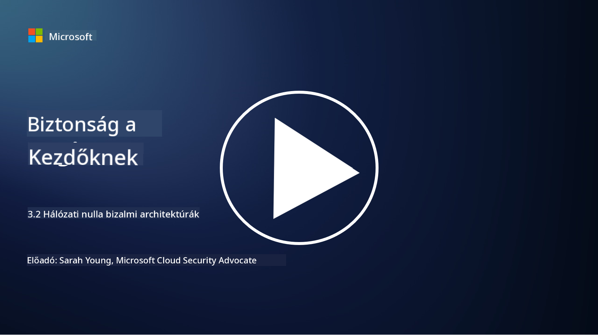

<!--
CO_OP_TRANSLATOR_METADATA:
{
  "original_hash": "680d6e14d9d33fc471c22f44679713f8",
  "translation_date": "2025-09-03T21:15:40+00:00",
  "source_file": "3.2 Networking zero trust architecture.md",
  "language_code": "hu"
}
-->
# Zero trust hálózati architektúrák

A hálózat kulcsfontosságú réteget biztosít a zero trust kontrollokban, ebben a leckében többet megtudhatunk erről:

- Mi az a hálózati szegmentáció?  
- Hogyan segíti a hálózati szegmentáció a zero trust megvalósítását?  
- Mi az a végpontok közötti titkosítás?

## Mi az a hálózati szegmentáció?

A hálózati szegmentáció a gyakorlat, amely során egy hálózatot kisebb, elkülönített szegmensekre vagy alhálózatokra osztanak. Minden szegmens izolált a többitől, és a szegmensek közötti hozzáférést specifikus biztonsági szabályzatok alapján szabályozzák és korlátozzák. A hálózati szegmentációt a biztonság javítására használják, mivel segít korlátozni a potenciális behatolások hatását és megakadályozni a támadók oldalirányú mozgását a hálózaton belül.

A hálózati szegmentáció megvalósításával egy szervezet "zónákat" hozhat létre, amelyek különválasztják a különböző típusú felhasználókat, alkalmazásokat és adatokat. Ez csökkenti a támadási felületet és minimalizálja a biztonsági incidens okozta potenciális károkat. A hálózati szegmentáció olyan technológiák segítségével érhető el, mint a virtuális LAN-ok (VLAN-ok), tűzfalak és hozzáférés-vezérlési mechanizmusok.

## Hogyan segíti a hálózati szegmentáció a zero trust megvalósítását?

A hálózati szegmentáció szorosan illeszkedik a Zero Trust modell alapelveihez. A Zero Trust architektúrában a hálózati szegmentáció segít érvényesíteni a "legkisebb jogosultság" elvét azáltal, hogy biztosítja, hogy a felhasználók és eszközök csak azokhoz az erőforrásokhoz és szolgáltatásokhoz férjenek hozzá, amelyekre feladataik elvégzéséhez szükségük van. A hálózat kisebb zónákra történő szegmentálásával a szervezetek szigorú hozzáférés-vezérlést valósíthatnak meg, izolálhatják a kritikus eszközöket, és megakadályozhatják a támadók oldalirányú mozgását.

A hálózati szegmentáció segít az identitásalapú hozzáférés-vezérlés érvényesítésében is, ahol a felhasználók és eszközök alaposan hitelesítve és engedélyezve vannak, mielőtt hozzáférnének az egyes szegmensekhez. Ez megakadályozza az illetéktelen hozzáférést az érzékeny erőforrásokhoz, és csökkenti a kompromittált hitelesítő adatok hatását.

## Mi az a végpontok közötti titkosítás?

A végpontok közötti (E2E) titkosítás egy olyan biztonsági intézkedés, amely biztosítja, hogy az adatok teljes útjuk során titkosítva maradjanak a küldőtől a címzettig. Ebben a folyamatban az adatok a küldő oldalán titkosítva vannak, és csak a címzett rendelkezik a visszafejtéshez szükséges kulccsal, hogy az adatokat olvashassa. A titkosítási és visszafejtési folyamatok az végpontokon történnek, így rendkívül nehéz az illetéktelen felek, beleértve a szolgáltatókat és közvetítőket, számára hozzáférni a titkosítatlan adatokhoz.

Az E2E titkosítás magas szintű bizalmasságot és biztonságot nyújt az adatátvitel során, még akkor is, ha az adatok különböző közvetítő rendszereken vagy hálózatokon haladnak át. Gyakran használják biztonságos üzenetküldő alkalmazásokban, e-mail szolgáltatásokban és más kommunikációs platformokon, hogy megvédjék az érzékeny információkat az elfogástól és az illetéktelen hozzáféréstől.

Ez a titkosítási módszer biztosítja, hogy még akkor is, ha a támadók hozzáférnek az adatokhoz az átvitel során, csak titkosított tartalmat látnak, amely értelmetlen a visszafejtési kulcs nélkül. A végpontok közötti titkosítás kulcsszerepet játszik a felhasználói adatvédelem megőrzésében és az érzékeny információk illetéktelen felek előli védelmében.

## Mi az a SASE?

A SASE a "Secure Access Service Edge" rövidítése, és egy olyan kiberbiztonsági keretrendszer és architektúra, amely egyesíti a hálózati biztonságot és a széles területű hálózatok (WAN) képességeit egyetlen felhőalapú szolgáltatásban. A SASE célja, hogy biztonságos és skálázható hozzáférést biztosítson hálózati erőforrásokhoz, alkalmazásokhoz és adatokhoz távoli és mobil felhasználók számára, miközben egyszerűsíti a hálózatkezelést és csökkenti a hagyományos hálózati és biztonsági architektúrák összetettségét.

A SASE kulcsfontosságú jellemzői és összetevői:

1. **Felhőalapú:** A SASE felhőszolgáltatásként érhető el, ami azt jelenti, hogy a biztonsági és hálózati funkciók a felhőből érhetők el, nem pedig hagyományos helyszíni hardverekre és eszközökre támaszkodva.  

2. **Biztonság és hálózat integrációja:** A SASE integrálja a különböző biztonsági szolgáltatásokat, mint például a biztonságos webes átjárók (SWG), tűzfal mint szolgáltatás (FWaaS), adatvesztés megelőzés (DLP), zero-trust hálózati hozzáférés (ZTNA) és WAN optimalizáció a széles területű hálózati képességekkel. Ez az integráció segít egyszerűsíteni a biztonsági és hálózati műveleteket.  

3. **Zero Trust:** A SASE a zero trust elvén működik, ami azt jelenti, hogy szigorú hozzáférés-vezérlést és legkisebb jogosultság elvű hozzáférési szabályokat érvényesít. A felhasználók és eszközök alapértelmezetten nem megbízhatóak, és hitelesíteni és engedélyezni kell őket, mielőtt hozzáférnének az erőforrásokhoz.  

4. **Identitásközpontú:** A SASE a felhasználói és eszközidentitásokra összpontosít, mint a hozzáférés-vezérlés alapjára. Identitás- és kontextusalapú szabályok határozzák meg a hozzáférési jogosultságokat, és ezek a szabályok dinamikusan alkalmazkodnak a felhasználói viselkedéshez és kontextushoz.  

5. **Skálázhatóság és rugalmasság:** A SASE könnyen skálázható, hogy nagy számú felhasználót és eszközt támogasson, így alkalmas olyan szervezetek számára, amelyeknek változatos és fejlődő hálózati és biztonsági igényeik vannak.  

A SASE különösen releváns a távoli munkavégzés és a felhőalapú megoldások korszakában, mivel átfogó és rugalmas megközelítést kínál a hálózati hozzáférés biztosítására és kezelésére. Segít a szervezeteknek alkalmazkodni a változó biztonsági és hálózati követelményekhez, miközben erősen fókuszál a felhasználóközpontú és zero trust biztonsági modellekre.

## További olvasnivalók

- [Mi az a hálózati szegmentáció? - Cisco](https://www.cisco.com/c/en/us/products/security/what-is-network-segmentation.html#~benefits)  
- [Mi az a mikroszegmentáció? - Cisco](https://www.cisco.com/c/en/us/products/security/what-is-microsegmentation.html)  
- [Hálózati szegmentáció és elkülönítés megvalósítása | Cyber.gov.au](https://www.cyber.gov.au/resources-business-and-government/maintaining-devices-and-systems/system-hardening-and-administration/network-hardening/implementing-network-segmentation-and-segregation)  
- [Mi az a hálózati szegmentáció és miért fontos? | CompTIA](https://www.comptia.org/blog/security-awareness-training-network-segmentation)  
- [Hálózati szegmentáció: Fogalmak és gyakorlatok (cmu.edu)](https://insights.sei.cmu.edu/blog/network-segmentation-concepts-and-practices/)  
- [Biztonságos hálózatok Zero Trust megközelítéssel | Microsoft Learn](https://learn.microsoft.com/security/zero-trust/deploy/networks?WT.mc_id=academic-96948-sayoung)  
- [Mi az a végpontok közötti titkosítás? | IBM](https://www.ibm.com/topics/end-to-end-encryption)  
- [Mi az a végpontok közötti titkosítás, és miért fontos? (howtogeek.com)](https://www.howtogeek.com/711656/what-is-end-to-end-encryption-and-why-does-it-matter/)  
- [Secure Access Service Edge (SASE) definíciója - Gartner Information Technology Glossary](https://www.gartner.com/en/information-technology/glossary/secure-access-service-edge-sase)  
- [Mi az a Secure Access Service Edge (SASE)? | Microsoft Security](https://www.microsoft.com/security/business/security-101/what-is-sase?WT.mc_id=academic-96948-sayoung)  

---

**Felelősségkizárás**:  
Ez a dokumentum az [Co-op Translator](https://github.com/Azure/co-op-translator) AI fordítási szolgáltatás segítségével készült. Bár törekszünk a pontosságra, kérjük, vegye figyelembe, hogy az automatikus fordítások hibákat vagy pontatlanságokat tartalmazhatnak. Az eredeti dokumentum az eredeti nyelvén tekintendő hiteles forrásnak. Kritikus információk esetén javasolt professzionális, emberi fordítást igénybe venni. Nem vállalunk felelősséget a fordítás használatából eredő félreértésekért vagy téves értelmezésekért.