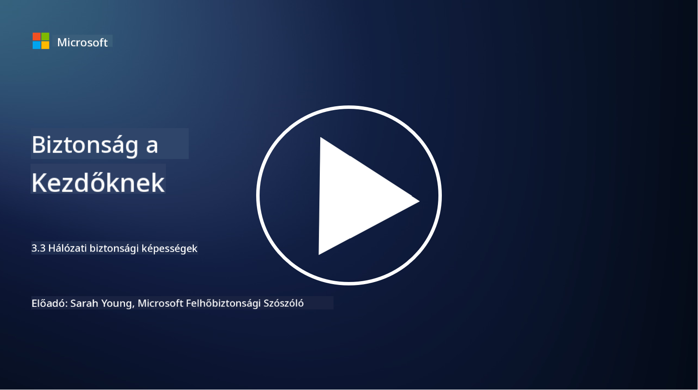

<!--
CO_OP_TRANSLATOR_METADATA:
{
  "original_hash": "c3aba077bb98eebc925dd58d870229ab",
  "translation_date": "2025-09-03T20:21:24+00:00",
  "source_file": "3.3 Network security capabilities.md",
  "language_code": "hu"
}
-->
# Hálózati biztonsági képességek

Ebben a leckében a következő képességeket ismerjük meg, amelyekkel egy hálózat biztonságossá tehető:

 - Hagyományos tűzfalak
 - Webalkalmazás-tűzfalak
 - Felhőbiztonsági csoportok
 - CDN
 - Terheléselosztók
 - Bastion hostok
 - VPN-ek
 - DDoS elleni védelem

## Hagyományos tűzfalak

A hagyományos tűzfalak olyan biztonsági eszközök, amelyek előre meghatározott szabályok alapján ellenőrzik és szabályozzák a bejövő és kimenő hálózati forgalmat. Egy megbízható belső hálózat és egy nem megbízható külső hálózat között helyezkednek el, szűrve a forgalmat, hogy megakadályozzák az illetéktelen hozzáférést és a potenciális fenyegetéseket.

## Webalkalmazás-tűzfalak

A Webalkalmazás-tűzfalak (WAF-ek) olyan speciális tűzfalak, amelyek a webalkalmazásokat védik különböző támadásoktól, például SQL injekciótól, cross-site scriptingtől és más sebezhetőségektől. Elemzik az HTTP kéréseket és válaszokat, hogy azonosítsák és blokkolják a webalkalmazásokat célzó rosszindulatú forgalmat.

## Felhőbiztonsági csoportok

A biztonsági csoportok a felhőszolgáltatók által biztosított alapvető hálózati biztonsági funkciók. Virtuális tűzfalakként működnek, amelyek szabályozzák a bejövő és kimenő forgalmat a felhő erőforrások, például virtuális gépek (VM-ek) és példányok között. A biztonsági csoportok lehetővé teszik a szervezetek számára, hogy szabályokat határozzanak meg, amelyek meghatározzák, milyen típusú forgalom engedélyezett vagy tiltott, így további védelmi réteget adnak a felhőalapú telepítésekhez.

## Tartalomelosztó hálózat (CDN)

A Tartalomelosztó Hálózat egy földrajzilag elosztott szerverhálózat. A CDN-ek javítják a weboldalak teljesítményét és elérhetőségét azáltal, hogy gyorsítótárazzák a tartalmat, és a felhasználóhoz legközelebb eső szerverekről szolgáltatják azt. Emellett bizonyos szintű védelmet nyújtanak a DDoS támadások ellen, mivel a forgalmat több szerverhelyszín között osztják el.

## Terheléselosztók

A terheléselosztók elosztják a bejövő hálózati forgalmat több szerver között, hogy optimalizálják az erőforrások kihasználtságát, biztosítsák a magas rendelkezésre állást, és javítsák az alkalmazások teljesítményét. Segítenek megelőzni a szerverek túlterhelését, és fenntartják a hatékony válaszidőket, növelve a hálózat ellenállóképességét.

## Bastion hostok

A Bastion hostok rendkívül biztonságos és elszigetelt szerverek, amelyek kontrollált hozzáférést biztosítanak egy hálózathoz egy külső, nem megbízható hálózatról (például az internetről). Belépési pontként szolgálnak az adminisztrátorok számára, hogy biztonságosan hozzáférjenek a belső rendszerekhez. A Bastion hostokat általában erős biztonsági intézkedésekkel konfigurálják, hogy minimalizálják a támadási felületet.

## Virtuális magánhálózatok (VPN-ek)

A VPN-ek titkosított alagutakat hoznak létre a felhasználó eszköze és egy távoli szerver között, biztosítva a biztonságos és privát kommunikációt a potenciálisan nem biztonságos hálózatokon, például az interneten. A VPN-eket gyakran használják arra, hogy távoli hozzáférést biztosítsanak a belső hálózatokhoz, lehetővé téve a felhasználók számára, hogy úgy férjenek hozzá az erőforrásokhoz, mintha fizikailag ugyanazon a hálózaton lennének.

## DDoS elleni védelem

A DDoS (Distributed Denial of Service) elleni védelem eszközei és szolgáltatásai arra szolgálnak, hogy enyhítsék a DDoS támadások hatásait, amelyek során több kompromittált eszköz áraszt el egy hálózatot vagy szolgáltatást, hogy túlterhelje azt. A DDoS elleni védelmi megoldások azonosítják és kiszűrik a rosszindulatú forgalmat, biztosítva, hogy a legitim forgalom továbbra is elérje a célját.

## További olvasnivalók

- [Mi az a tűzfal? - Cisco](https://www.cisco.com/c/en/us/products/security/firewalls/what-is-a-firewall.html#~types-of-firewalls)
- [Mit csinál valójában egy tűzfal? (howtogeek.com)](https://www.howtogeek.com/144269/htg-explains-what-firewalls-actually-do/)
- [Mi az a tűzfal? Hogyan működik és típusai (kaspersky.com)](https://www.kaspersky.com/resource-center/definitions/firewall)
- [Hálózati biztonsági csoport - hogyan működik | Microsoft Learn](https://learn.microsoft.com/azure/virtual-network/network-security-group-how-it-works)
- [Bevezetés az Azure Tartalomelosztó Hálózatba (CDN) - Oktatás | Microsoft Learn](https://learn.microsoft.com/training/modules/intro-to-azure-content-delivery-network/?WT.mc_id=academic-96948-sayoung)
- [Mi az a tartalomelosztó hálózat (CDN)? - Azure | Microsoft Learn](https://learn.microsoft.com/azure/cdn/cdn-overview?WT.mc_id=academic-96948-sayoung)
- [Mi az a terheléselosztás? Hogyan működnek a terheléselosztók (nginx.com)](https://www.nginx.com/resources/glossary/load-balancing/)
- [Bastion hostok vs. VPN-ek · Tailscale](https://tailscale.com/learn/bastion-hosts-vs-vpns/)
- [Mi az a VPN? Hogyan működik, típusai (kaspersky.com)](https://www.kaspersky.com/resource-center/definitions/what-is-a-vpn)
- [Bevezetés az Azure DDoS védelembe - Oktatás | Microsoft Learn](https://learn.microsoft.com/training/modules/introduction-azure-ddos-protection/?WT.mc_id=academic-96948-sayoung)
- [Mi az a DDoS támadás? | Microsoft Security](https://www.microsoft.com/security/business/security-101/what-is-a-ddos-attack?WT.mc_id=academic-96948-sayoung)

---

**Felelősség kizárása**:  
Ez a dokumentum az [Co-op Translator](https://github.com/Azure/co-op-translator) AI fordítási szolgáltatás segítségével lett lefordítva. Bár törekszünk a pontosságra, kérjük, vegye figyelembe, hogy az automatikus fordítások hibákat vagy pontatlanságokat tartalmazhatnak. Az eredeti dokumentum az eredeti nyelvén tekintendő hiteles forrásnak. Fontos információk esetén javasolt professzionális emberi fordítást igénybe venni. Nem vállalunk felelősséget semmilyen félreértésért vagy téves értelmezésért, amely a fordítás használatából eredhet.