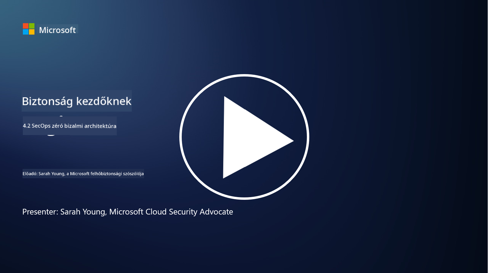

<!--
CO_OP_TRANSLATOR_METADATA:
{
  "original_hash": "45bbdc114e70936816b0b3e7c40189cf",
  "translation_date": "2025-09-03T21:20:46+00:00",
  "source_file": "4.2 SecOps zero trust architecture.md",
  "language_code": "hu"
}
-->
# SecOps nulla bizalmi architektúra

A biztonsági műveletek a nulla bizalmi architektúra két részét alkotják, és ebben a leckében mindkettőt megismerjük:

- Hogyan kell az IT-architektúrákat úgy kialakítani, hogy lehetővé tegyék a központosított naplógyűjtést?

- Melyek a legjobb gyakorlatok a biztonsági műveletek terén a modern IT-környezetekben?

## Hogyan kell az IT-architektúrákat úgy kialakítani, hogy lehetővé tegyék a központosított naplógyűjtést?

A központosított naplógyűjtés a modern biztonsági műveletek kritikus eleme. Lehetővé teszi a szervezetek számára, hogy különböző forrásokból, például szerverekből, alkalmazásokból, hálózati eszközökből és biztonsági eszközökből származó naplókat és adatokat egy központi tárolóba gyűjtsenek elemzés, monitorozás és incidenskezelés céljából. Íme néhány legjobb gyakorlat az IT-architektúrák kialakításához a központosított naplógyűjtés támogatására:

1. **Naplóforrások integrációja**:

- Biztosítsd, hogy minden releváns eszköz és rendszer naplókat generáljon. Ide tartoznak a szerverek, tűzfalak, routerek, switchek, alkalmazások és biztonsági eszközök.

- Konfiguráld a naplóforrásokat úgy, hogy továbbítsák a naplókat egy központosított naplógyűjtő vagy kezelő rendszerhez.

2. **Megfelelő SIEM (Security Information and Event Management) eszköz kiválasztása**:

- Válassz olyan SIEM megoldást, amely megfelel a szervezet igényeinek és méretének.

- Győződj meg arról, hogy a választott megoldás támogatja a naplógyűjtést, aggregálást, elemzést és jelentéskészítést.

3. **Skálázhatóság és redundancia**:

- Úgy tervezd meg az architektúrát, hogy skálázható legyen, és képes legyen kezelni a növekvő számú naplóforrást és a megnövekedett naplómennyiséget.

- Valósíts meg redundanciát a magas rendelkezésre állás érdekében, hogy elkerüld a hardver- vagy hálózati hibák miatti kieséseket.

4. **Naplók biztonságos továbbítása**:

- Használj biztonságos protokollokat, például TLS/SSL vagy IPsec, a naplók forrásoktól a központi tárolóba történő továbbításához.

- Valósíts meg hitelesítést és hozzáférés-ellenőrzést, hogy csak jogosult eszközök küldhessenek naplókat.

5. **Normalizálás**:

- Standardizáld a naplóformátumokat és normalizáld az adatokat, hogy biztosítsd az egységességet és az egyszerű elemzést.

6. **Tárolás és megőrzés**:

- Határozd meg a naplók megfelelő megőrzési idejét a megfelelőségi és biztonsági követelmények alapján.

- Tárold a naplókat biztonságosan, védve azokat az illetéktelen hozzáféréstől és manipulációtól.

## Melyek a legjobb gyakorlatok a biztonsági műveletek terén a modern IT-környezetekben?

A központosított naplógyűjtés mellett íme néhány legjobb gyakorlat a biztonsági műveletek terén a modern IT-környezetekben:

1. **Folyamatos monitorozás**: Valósíts meg folyamatos monitorozást a hálózati és rendszertevékenységek nyomon követésére, hogy valós időben észleld és reagálj a fenyegetésekre.

2. **Fenyegetés-intelligencia**: Tájékozódj az újonnan felmerülő fenyegetésekről és sebezhetőségekről fenyegetés-intelligencia források és szolgáltatások segítségével.

3. **Felhasználói képzés**: Tarts rendszeres biztonságtudatossági képzéseket az alkalmazottak számára, hogy csökkentsd a szociális manipuláció és adathalász támadások kockázatát.

4. **Incidenskezelési terv**: Dolgozz ki és tesztelj egy incidenskezelési tervet, hogy biztosítsd a gyors és hatékony reagálást a biztonsági incidensekre.

5. **Biztonsági automatizálás**: Használj biztonsági automatizálási és orkestrációs eszközöket az incidenskezelés és ismétlődő feladatok egyszerűsítésére.

6. **Biztonsági mentés és helyreállítás**: Valósíts meg robusztus biztonsági mentési és katasztrófa-helyreállítási megoldásokat, hogy biztosítsd az adatok elérhetőségét adatvesztés vagy zsarolóvírus támadások esetén.

## További olvasnivaló

- [Microsoft Security Best Practices modul: Security operations | Microsoft Learn](https://learn.microsoft.com/security/operations/security-operations-videos-and-decks?WT.mc_id=academic-96948-sayoung)
- [Security operations - Cloud Adoption Framework | Microsoft Learn](https://learn.microsoft.com/azure/cloud-adoption-framework/secure/security-operations?WT.mc_id=academic-96948-sayoung)
- [What is Security Operations and Analytics Platform Architecture? A Definition of SOAPA, How It Works, Benefits, and More (digitalguardian.com)](https://www.digitalguardian.com/blog/what-security-operations-and-analytics-platform-architecture-definition-soapa-how-it-works#:~:text=All%20in%20all%2C%20security%20operations%20and%20analytics%20platform,become%20more%20efficient%20and%20operative%20with%20your%20security.)

---

**Felelősség kizárása**:  
Ez a dokumentum az AI fordítási szolgáltatás, a [Co-op Translator](https://github.com/Azure/co-op-translator) segítségével lett lefordítva. Bár törekszünk a pontosságra, kérjük, vegye figyelembe, hogy az automatikus fordítások hibákat vagy pontatlanságokat tartalmazhatnak. Az eredeti dokumentum az eredeti nyelvén tekintendő hiteles forrásnak. Kritikus információk esetén javasolt professzionális emberi fordítást igénybe venni. Nem vállalunk felelősséget semmilyen félreértésért vagy téves értelmezésért, amely a fordítás használatából eredhet.