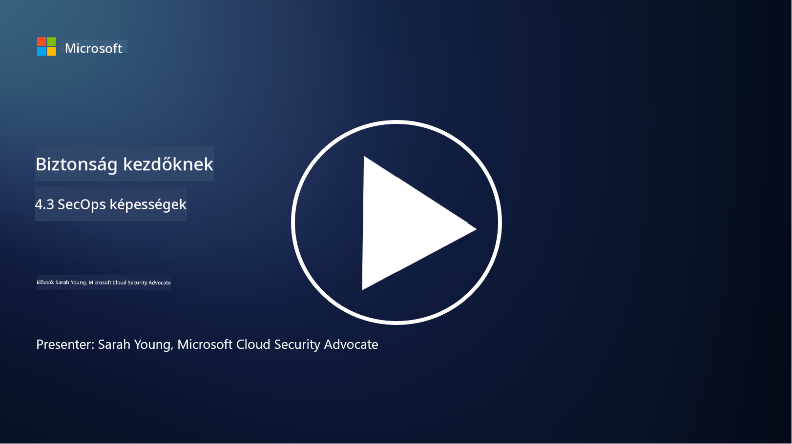

<!--
CO_OP_TRANSLATOR_METADATA:
{
  "original_hash": "553eb694c89f1caca0694e8d8ab89e0e",
  "translation_date": "2025-09-03T21:46:55+00:00",
  "source_file": "4.3 SecOps capabilities.md",
  "language_code": "hu"
}
-->
# SecOps képességek

Ebben a részben részletesebben bemutatjuk azokat az alapvető eszközöket és képességeket, amelyek a biztonsági műveletek során használhatók.

Ebben a leckében szó lesz:

- Mi az a biztonsági információ- és eseménykezelő (SIEM) eszköz?

- Mi az XDR?

- Milyen képességekkel lehet javítani a biztonsági műveleteket?

## Mi az a biztonsági információ- és eseménykezelő (SIEM) eszköz?

A Biztonsági Információ- és Eseménykezelő (SIEM) eszköz elemzést nyújt a szervezet IT környezetében keletkező biztonsági riasztásokról. Ezek az eszközök gyűjtik, összesítik, korrelálják és elemzik a naplóadatokat és biztonsági eseményeket különböző forrásokból, például hálózati eszközökből, szerverekből, alkalmazásokból és biztonsági rendszerekből.

A SIEM eszközök kulcsfontosságú funkciói és képességei:

1. **Naplógyűjtés**: A SIEM eszközök naplókat és biztonsági eseményadatokat gyűjtenek számos eszközből, rendszerből és alkalmazásból, például tűzfalakból, behatolásérzékelő rendszerekből, antivírus szoftverekből stb.

2. **Adatnormalizálás**: Az eszközök normalizálják a naplóadatokat egy közös formátumba, hogy megkönnyítsék az elemzést és korrelációt.

3. **Eseménykorreláció**: A SIEM eszközök korrelálják az eseményeket, hogy azonosítsák azokat a mintákat és anomáliákat, amelyek biztonsági incidensekre vagy fenyegetésekre utalhatnak.

4. **Riasztások és értesítések**: A SIEM eszközök valós időben generálnak riasztásokat és értesítéseket, amikor gyanús tevékenységeket vagy biztonsági szabálysértéseket észlelnek, lehetővé téve az azonnali reagálást.

5. **Incidensérzékelés**: Segítik a biztonsági incidensek, például jogosulatlan hozzáférések, adatlopások, rosszindulatú programfertőzések és belső fenyegetések észlelését.

6. **Felhasználói és entitás viselkedéselemzés (UEBA)**: Néhány SIEM eszköz tartalmaz UEBA képességeket, amelyekkel azonosíthatók a szokatlan felhasználói és entitás viselkedések, amelyek kompromittált fiókokra vagy belső fenyegetésekre utalhatnak.

7. **Fenyegetésintelligencia integráció**: A SIEM eszközök integrálhatók fenyegetésintelligencia forrásokkal, hogy javítsák a fenyegetések észlelését az ismert kompromittálási indikátorok (IOC-k) hálózati tevékenységgel való összehasonlításával.

8. **Automatizálás és orkestráció**: Az automatizálási funkciók lehetővé teszik a SIEM eszközök számára, hogy automatizálják a gyakori biztonsági incidensekre adott válaszokat, csökkentve a válaszidőt és a manuális erőfeszítéseket.

9. **Irányítópult és vizualizáció**: Az eszközök irányítópultokat és vizualizációs eszközöket kínálnak a biztonsági adatok nyomon követésére és egyedi jelentések készítésére.

10. **Integráció más biztonsági eszközökkel**: A SIEM eszközök gyakran integrálódnak más biztonsági eszközökkel és technológiákkal, például végpontérzékelési és válaszadási (EDR) megoldásokkal, hogy átfogó képet nyújtsanak a szervezet biztonsági helyzetéről.

## Mi az XDR?

Az XDR (Extended Detection and Response) egy olyan technológia, amely kiterjeszti a hagyományos végpontérzékelési és válaszadási (EDR) képességeket, és szélesebb biztonsági telemetriát kombinál különböző forrásokból, hogy átfogóbb képet nyújtson a szervezet biztonsági helyzetéről. Az XDR célja a fenyegetések észlelésének, az incidenskezelésnek és az általános biztonságnak a javítása az EDR, SIEM vagy más egyedi biztonsági eszközök korlátainak kezelésével.

Az XDR kulcsfontosságú jellemzői és elemei:

1. **Adatintegráció**: Az XDR több forrásból, például végpontokból, hálózati forgalomból, felhőszolgáltatásokból, e-mailekből és másokból származó adatokat integrál. Ez az átfogó adatgyűjtés szélesebb kontextust biztosít a fenyegetések észleléséhez és elemzéséhez.

2. **Fejlett analitika**: Az XDR fejlett analitikát, gépi tanulást és viselkedéselemzést alkalmaz a biztonsági fenyegetések azonosítására és priorizálására. Mintákat és anomáliákat keres az integrált adatokban, hogy észlelje az ismert és ismeretlen fenyegetéseket.

3. **Automatizált fenyegetésészlelés**: Az XDR automatizálja a biztonsági fenyegetések és anomáliák észlelését különböző forrásokból származó információk korrelálásával. Képes azonosítani az összetett támadási láncokat, amelyek több vektorra is kiterjedhetnek.

4. **Incidensvizsgálat és válaszadás**: Az XDR eszközöket biztosít az incidensvizsgálathoz és válaszadáshoz, segítve a biztonsági csapatokat az incidensek hatókörének és hatásának gyors felmérésében, valamint a megfelelő helyreállítási intézkedések megtételében.

5. **Fenyegetésintelligencia integráció**: Az XDR integrálja a fenyegetésintelligencia forrásokat és adatokat, hogy javítsa a fenyegetések észlelését az ismert kompromittálási indikátorok (IOC-k) hálózati és végponti tevékenységgel való összehasonlításával.

6. **Egységes konzol**: Az XDR általában egy egységes konzolt vagy irányítópultot kínál, ahol a biztonsági csapatok központosított módon tekinthetik meg és kezelhetik a különböző forrásokból származó biztonsági riasztásokat és incidenseket.

7. **Keresztplatformos lefedettség**: Az XDR megoldások széles körű platformokat fednek le, beleértve a végpontokat, szervereket, felhőkörnyezeteket és mobil eszközöket, így alkalmasak a modern, többplatformos IT környezetekhez.

## Milyen képességekkel lehet javítani a biztonsági műveleteket?

A biztonsági műveletek javítása érdekében a szervezetek számos képességet alkalmazhatnak a SIEM eszközökön túl:

1. **Gépi tanulás és mesterséges intelligencia**: Fejlett analitikát, gépi tanulást és AI-t alkalmazva észlelhetők a fejlődő fenyegetések és automatizálható a fenyegetésvadászat.

2. **Felhasználói és entitás viselkedéselemzés (UEBA)**: A felhasználói és entitás viselkedésének elemzése anomáliák és belső fenyegetések észlelésére.

3. **Fenyegetésintelligencia források**: Fenyegetésintelligencia források integrálása, hogy naprakész információkat kapjunk a legújabb fenyegetésekről és kompromittálási indikátorokról.

4. **Biztonsági orkestráció, automatizálás és válaszadás (SOAR)**: SOAR platformok alkalmazása az incidenskezelés automatizálására és a biztonsági műveletek munkafolyamatainak egyszerűsítésére.

5. **Megtévesztési technológiák**: Megtévesztési technológiák telepítése, amelyekkel félrevezethetők és észlelhetők a hálózaton belüli támadók.

## További olvasnivaló

- [Mi az a SIEM? | Microsoft Security](https://www.microsoft.com/security/business/security-101/what-is-siem?WT.mc_id=academic-96948-sayoung)
- [Mi az a SIEM? - Biztonsági információ- és eseménykezelés - Cisco](https://www.cisco.com/c/en/us/products/security/what-is-siem.html)
- [Biztonsági információ- és eseménykezelés - Wikipédia](https://en.wikipedia.org/wiki/Security_information_and_event_management)
- [Mi az XDR? | Microsoft Security](https://www.microsoft.com/security/business/security-101/what-is-xdr?WT.mc_id=academic-96948-sayoung)
- [XDR & XDR Security (kaspersky.com.au)](https://www.kaspersky.com.au/resource-center/definitions/what-is-xdr)
- [A SecOps ereje: Az alapvető biztonsági képességek újradefiniálása - The New Stack](https://thenewstack.io/the-power-of-secops-redefining-core-security-capabilities/)
- [Hét lépés a biztonsági műveletek és válaszadás javításához (securityintelligence.com)](https://securityintelligence.com/seven-steps-to-improve-your-security-operations-and-response/)

---

**Felelősség kizárása**:  
Ez a dokumentum az AI fordítási szolgáltatás, a [Co-op Translator](https://github.com/Azure/co-op-translator) segítségével lett lefordítva. Bár törekszünk a pontosságra, kérjük, vegye figyelembe, hogy az automatikus fordítások hibákat vagy pontatlanságokat tartalmazhatnak. Az eredeti dokumentum az eredeti nyelvén tekintendő hiteles forrásnak. Kritikus információk esetén javasolt professzionális emberi fordítást igénybe venni. Nem vállalunk felelősséget semmilyen félreértésért vagy téves értelmezésért, amely a fordítás használatából eredhet.