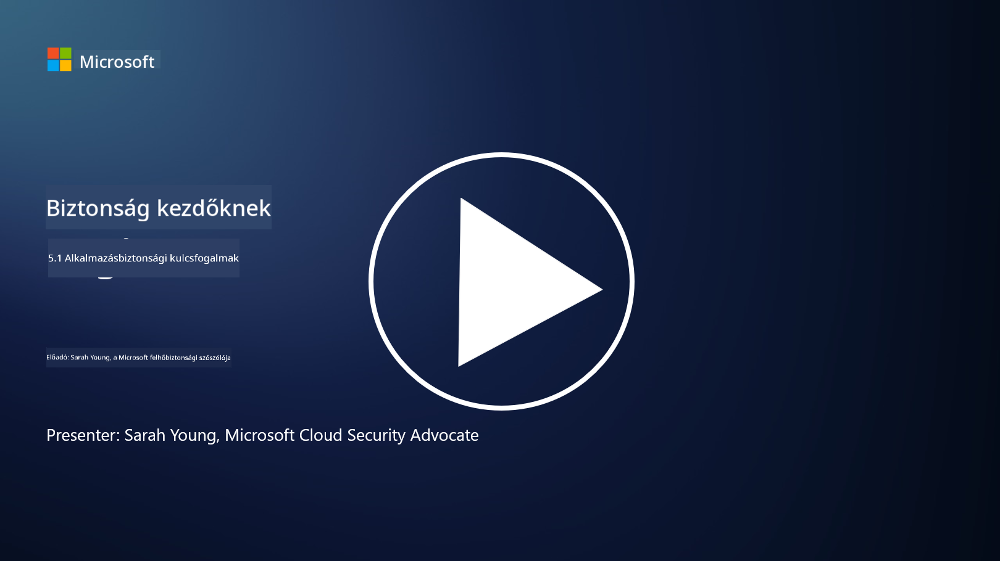

<!--
CO_OP_TRANSLATOR_METADATA:
{
  "original_hash": "e4b56bb23078d3ffb7ad407d280b0c36",
  "translation_date": "2025-09-03T21:10:07+00:00",
  "source_file": "5.1 AppSec key concepts.md",
  "language_code": "hu"
}
-->
# Az alkalmazásbiztonság kulcsfogalmai

Az alkalmazásbiztonság önálló szakterület a biztonságon belül. Ebben a kurzusrészben mélyebben foglalkozunk az alkalmazásbiztonsággal.

## Bevezetés

Ebben a leckében szó lesz:

- Mi az alkalmazásbiztonság?

- Mik az alkalmazásbiztonság kulcsfogalmai/elvei?

## Mi az alkalmazásbiztonság?

Az alkalmazásbiztonság, gyakran "AppSec" rövidítéssel, a szoftveralkalmazások védelmét jelenti a biztonsági fenyegetésekkel, sebezhetőségekkel és támadásokkal szemben. Magában foglalja azokat a folyamatokat, technikákat és eszközöket, amelyekkel az alkalmazás fejlesztése, telepítése és karbantartása során azonosítják, enyhítik és megelőzik a biztonsági kockázatokat.

Az alkalmazásbiztonság kiemelten fontos, mivel az alkalmazások gyakori célpontjai a kibertámadásoknak. Rosszindulatú szereplők kihasználják a szoftverek sebezhetőségeit és gyengeségeit, hogy jogosulatlan hozzáférést szerezzenek, adatokat lopjanak, szolgáltatásokat zavarjanak meg, vagy más káros tevékenységeket hajtsanak végre. A hatékony alkalmazásbiztonság biztosítja az alkalmazás és a hozzá kapcsolódó adatok bizalmasságát, sértetlenségét és rendelkezésre állását.

## Mik az alkalmazásbiztonság kulcsfogalmai/elvei?

Az alkalmazásbiztonságot megalapozó kulcsfogalmak és elvek a következők:

1. **Biztonságos tervezés**:

- A biztonságot már az alkalmazás tervezése és architektúrája során integrálni kell, nem utólag hozzáadni.

2. **Bemeneti ellenőrzés**:

- Minden felhasználói bemenetet ellenőrizni kell, hogy megfeleljen az elvárt formátumoknak, és mentes legyen a rosszindulatú kódtól vagy adatoktól.

3. **Kimeneti kódolás**:

- Az ügyfélnek küldött adatokat megfelelően kódolni kell, hogy elkerüljük például a cross-site scripting (XSS) típusú sebezhetőségeket.

4. **Hitelesítés és jogosultságkezelés**:

- A felhasználók hitelesítése és hozzáférésük engedélyezése a szerepkörük és jogosultságaik alapján történjen.

5. **Adatvédelem**:

- Az érzékeny adatokat titkosítani kell tárolás, továbbítás és feldolgozás során, hogy megakadályozzuk a jogosulatlan hozzáférést.

6. **Munkamenet-kezelés**:

- A biztonságos munkamenet-kezelés megvédi a felhasználói munkameneteket az eltérítéstől és a jogosulatlan hozzáféréstől.

7. **Biztonságos függőségek**:

- Minden szoftverfüggőséget naprakészen kell tartani biztonsági javításokkal, hogy elkerüljük a sebezhetőségeket.

8. **Hibakezelés és naplózás**:

- Biztonságos hibakezelést kell alkalmazni, hogy ne fedjünk fel érzékeny információkat, és biztosítsuk a biztonságos naplózási gyakorlatokat.

9. **Biztonsági tesztelés**:

- Rendszeresen teszteljük az alkalmazásokat sebezhetőségek szempontjából, például behatolási teszteléssel, kódellenőrzéssel és automatizált szkennelő eszközökkel.

10. **Biztonságos szoftverfejlesztési életciklus (SDLC)**:

- A biztonsági gyakorlatokat integrálni kell a szoftverfejlesztési életciklus minden fázisába, a követelményektől kezdve a telepítésen és karbantartáson át.

## További olvasnivaló

- [SheHacksPurple: Mi az alkalmazásbiztonság? - YouTube](https://www.youtube.com/watch?v=eNmccQNzSSY)
- [Mi az alkalmazásbiztonság? - Cisco](https://www.cisco.com/c/en/us/solutions/security/application-first-security/what-is-application-security.html#~how-does-it-work)
- [Mi az alkalmazásbiztonság? Folyamat és eszközök a szoftverek védelméhez | CSO Online](https://www.csoonline.com/article/566471/what-is-application-security-a-process-and-tools-for-securing-software.html)
- [OWASP Cheat Sheet Series | OWASP Foundation](https://owasp.org/www-project-cheat-sheets/)

---

**Felelősség kizárása**:  
Ez a dokumentum az AI fordítási szolgáltatás [Co-op Translator](https://github.com/Azure/co-op-translator) segítségével lett lefordítva. Bár törekszünk a pontosságra, kérjük, vegye figyelembe, hogy az automatikus fordítások hibákat vagy pontatlanságokat tartalmazhatnak. Az eredeti dokumentum az eredeti nyelvén tekintendő hiteles forrásnak. Fontos információk esetén javasolt professzionális emberi fordítást igénybe venni. Nem vállalunk felelősséget semmilyen félreértésért vagy téves értelmezésért, amely a fordítás használatából eredhet.