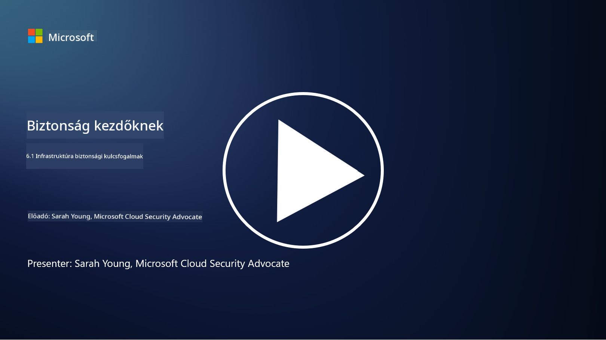

<!--
CO_OP_TRANSLATOR_METADATA:
{
  "original_hash": "882ebf66a648f419bcbf680ed6aefa00",
  "translation_date": "2025-09-03T20:06:03+00:00",
  "source_file": "6.1 Infrastructure security key concepts.md",
  "language_code": "hu"
}
-->
# Az infrastruktúra biztonságának kulcsfogalmai

Az „infrastruktúra” az IT környezet alapvető építőelemeire utal, beleértve a szervereket, felhőszolgáltatásokat és konténereket – számos különböző technológiát. Az előző részben tárgyalt alkalmazások ezen az infrastruktúrán futnak, így az támadások célpontjává is válhat.

Ebben a leckében szó lesz:

- Mi az a biztonsági higiénia, és miért fontos?

- Mi az a biztonsági helyzetkezelés?

- Mi az a frissítés (patching), és miért fontos?

- Mik azok a konténerek, és miben különbözik a biztonságuk?

## Mi az a biztonsági higiénia, és miért fontos?

**Biztonsági higiénia** azokra a gyakorlatokra és viselkedésekre utal, amelyeket egyének és szervezetek követnek a jó kiberbiztonsági szokások fenntartása érdekében. Ez magában foglalja a rendszerek, adatok és hálózatok védelmét a fenyegetésektől és sebezhetőségektől. A jó biztonsági higiénia több okból is fontos:

- **Támadások megelőzése**: A legjobb gyakorlatok követése segíthet a gyakori kibertámadások, például adathalászat, rosszindulatú programok fertőzése és jogosulatlan hozzáférés megelőzésében.

- **Adatvédelem**: A megfelelő biztonsági higiénia megóvja az érzékeny és bizalmas adatokat a lopástól vagy kiszivárgástól.

- **Bizalom fenntartása**: Azok a szervezetek, amelyek jó biztonsági higiéniát mutatnak, bizalmat építenek ügyfeleik és partnereik körében.

- **Megfelelés**: Számos szabályozás és szabvány megköveteli a biztonsági higiéniai gyakorlatok követését.

- **Kockázatcsökkentés**: A következetes biztonsági higiénia csökkenti a biztonsági incidensek és adatvédelmi sérülések kockázatát.

A biztonsági higiénia magában foglalja például a szoftverek naprakészen tartását, erős jelszavak és többfaktoros hitelesítés használatát, rendszeres biztonsági mentéseket, alkalmazottak képzését és gyanús tevékenységek monitorozását. Ez a kiberbiztonság erős alapja.

## Mi az a biztonsági helyzetkezelés?

A biztonsági helyzetkezelés (Security Posture Management) egy szervezet általános kiberbiztonsági helyzetének értékelésére, monitorozására és kezelésére utal. A kiberbiztonsági helyzet egy szervezet általános megközelítését és felkészültségét jelenti az informatikai rendszerek, hálózatok, adatok és eszközök védelmére a kibertámadásokkal szemben. Ez magában foglalja azokat a stratégiákat, irányelveket, gyakorlatokat és technológiákat, amelyeket egy szervezet alkalmaz digitális eszközeinek védelmére, valamint információi bizalmasságának, integritásának és elérhetőségének fenntartására. 

A biztonsági helyzetkezelés célja, hogy átfogó képet nyújtson egy szervezet biztonsági állapotáról, azonosítsa a sebezhetőségeket és gyengeségeket, valamint prioritást adjon a javítási erőfeszítéseknek.

## Mi az a frissítés (patching), és miért fontos?

**Frissítés** (patching) a szoftverek, operációs rendszerek és alkalmazások frissítéseinek, más néven javításoknak vagy hibajavításoknak az alkalmazását jelenti. Ezek a frissítések általában biztonsági sebezhetőségeket, hibákat és egyéb problémákat orvosolnak, amelyeket a támadók kihasználhatnak. Hardvereszközök is igényelhetnek frissítést: ez lehet a firmware vagy a beépített operációs rendszer. A hardverek frissítése gyakran nehezebb, mint a szoftvereké.

A frissítés több okból is fontos:

- **Biztonság**: A frissítések javítják az ismert sebezhetőségeket, amelyeket a támadók kihasználhatnak a rendszerek kompromittálására és adatok ellopására.

- **Stabilitás**: A frissítések gyakran tartalmaznak stabilitási és teljesítményjavításokat, csökkentve a rendszerösszeomlások vagy hibák kockázatát.

- **Megfelelés**: Számos szabályozás és megfelelőségi szabvány megköveteli a biztonsági frissítések gyors alkalmazását.

- **Bizalom fenntartása**: A rendszeres frissítés segít megőrizni az ügyfelek és érintettek bizalmát, mivel a szervezet elkötelezettséget mutat a biztonság iránt.

- **Kockázatcsökkentés**: A frissítés csökkenti a támadási felületet és a sikeres kibertámadások valószínűségét.

A frissítések késedelmes alkalmazása növelheti a rendszerek sebezhetőségét az ismert támadásokkal szemben, növelve a biztonsági incidensek és adatvesztés kockázatát.

## Mik azok a konténerek, és miben különbözik a biztonságuk?

A konténerek olyan könnyű, önálló és végrehajtható szoftvercsomagok, amelyek mindent tartalmaznak, ami egy szoftver futtatásához szükséges, beleértve a kódot, futtatókörnyezetet, könyvtárakat és rendszereszközöket. A konténerek egységes és izolált környezetet biztosítanak az alkalmazások számára, megkönnyítve a szoftverek fejlesztését, csomagolását és telepítését különböző környezetekben és platformokon. Népszerű konténerizációs technológiák közé tartozik a Docker és a Kubernetes.

A konténerbiztonság azokat a gyakorlatokat és technológiákat foglalja magában, amelyek célja a konténerek és az általuk hosztolt alkalmazások védelme különféle biztonsági fenyegetésekkel és sebezhetőségekkel szemben. A konténerbiztonság különösen fontos, mivel bár a konténerek számos előnyt kínálnak a hordozhatóság és skálázhatóság terén, új biztonsági kihívásokat is felvetnek:

1. **Képbiztonság**: A konténerképek tartalmazhatnak sebezhetőségeket, és ha ezeket nem frissítik és javítják rendszeresen, a támadók kihasználhatják őket. A konténerbiztonság magában foglalja a képek sebezhetőségeinek vizsgálatát és annak biztosítását, hogy csak megbízható képeket használjanak.

2. **Futtatási biztonság**: A futó konténereket el kell különíteni egymástól és a gazdarendszertől, hogy megakadályozzák a jogosulatlan hozzáférést és a potenciális támadásokat. A futtatási biztonsági mechanizmusok közé tartoznak a konténerizolációs technológiák, mint például a namespaces és cgroups, valamint a konténerek viselkedésének monitorozására és auditálására szolgáló eszközök.

3. **Hálózati biztonság**: A konténerek hálózatokon keresztül kommunikálnak egymással és külső rendszerekkel. A megfelelő hálózati szegmentáció és tűzfal szabályok elengedhetetlenek a konténerek közötti forgalom szabályozásához és a jogosulatlan hozzáférés megakadályozásához.

4. **Hozzáférés-vezérlés**: Fontos biztosítani, hogy csak jogosult felhasználók és folyamatok férhessenek hozzá és módosíthassák a konténereket. Gyakran használnak szerepkör-alapú hozzáférés-vezérlést (RBAC) és identitáskezelő eszközöket.

5. **Naplózás és monitorozás**: A konténerbiztonság magában foglalja a naplók és monitorozási adatok gyűjtését és elemzését, hogy valós időben észleljék és reagáljanak a biztonsági incidensekre és anomáliákra.

6. **Orkesztrációs biztonság**: Konténer-orkesztrációs platformok, például Kubernetes használatakor az orkesztrációs réteg biztonságának biztosítása ugyanolyan fontos. Ez magában foglalja a Kubernetes API szerver védelmét, megfelelő RBAC irányelvek alkalmazását és a klaszter tevékenységének auditálását.

7. **Titkok kezelése**: Az érzékeny információk, például API kulcsok és jelszavak kezelése a konténerekben biztonságos tárolási és kezelési megoldásokat igényel, hogy elkerüljék azok kiszivárgását.

A konténerbiztonsági megoldások gyakran a biztonsági legjobb gyakorlatok, sebezhetőség-vizsgáló eszközök, futtatási védelmi mechanizmusok, hálózati biztonsági konfigurációk és konténer-orkesztrációs biztonsági funkciók kombinációját foglalják magukban. A folyamatos monitorozás és automatizálás elengedhetetlen részei a konténerbiztonságnak, hogy gyorsan észleljék és reagáljanak a fenyegetésekre, ahogy a konténeres alkalmazások fejlődnek és skálázódnak.

## További olvasnivalók

- [A biztonsági higiénia fontossága | Security Magazine](https://www.securitymagazine.com/articles/99510-the-importance-of-security-hygiene)
- [Mi az a CSPM? | Microsoft Security](https://www.microsoft.com/security/business/security-101/what-is-cspm?WT.mc_id=academic-96948-sayoung)
- [Mi az a Cloud Security Posture Management (CSPM)? | HackerOne](https://www.hackerone.com/knowledge-center/what-cloud-security-posture-management)
- [A felhőbiztonsági helyzetkezelés funkciója - Cloud Adoption Framework | Microsoft Learn](https://learn.microsoft.com/azure/cloud-adoption-framework/organize/cloud-security-posture-management?WT.mc_id=academic-96948-sayoung)
- [Mi az a CNAPP? | Microsoft Security](https://www.microsoft.com/security/business/security-101/what-is-cnapp)
- [Miért beszél mindenki a CNAPP-ról (forbes.com)](https://www.forbes.com/sites/forbestechcouncil/2021/12/10/why-everyone-is-talking-about-cnapp/?sh=567275ca1549)
- [Miért fontos a frissítés a kiberbiztonság szempontjából? - CyberSmart](https://cybersmart.co.uk/blog/why-is-patching-important-to-cybersecurity/)
- [Mi az a konténerbiztonság? Teljes útmutató [2023] (aquasec.com)](https://www.aquasec.com/cloud-native-academy/container-security/container-security/)

---

**Felelősségkizárás**:  
Ez a dokumentum az [Co-op Translator](https://github.com/Azure/co-op-translator) AI fordítási szolgáltatás segítségével készült. Bár törekszünk a pontosságra, kérjük, vegye figyelembe, hogy az automatikus fordítások hibákat vagy pontatlanságokat tartalmazhatnak. Az eredeti dokumentum az eredeti nyelvén tekintendő hiteles forrásnak. Kritikus információk esetén javasolt professzionális, emberi fordítást igénybe venni. Nem vállalunk felelősséget a fordítás használatából eredő félreértésekért vagy téves értelmezésekért.