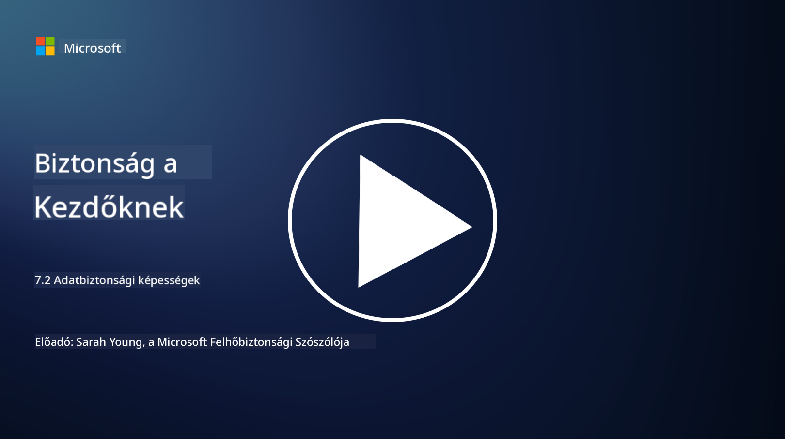

<!--
CO_OP_TRANSLATOR_METADATA:
{
  "original_hash": "50697add9758e54693442d502d2d5f8a",
  "translation_date": "2025-09-03T21:29:46+00:00",
  "source_file": "7.2 Data security capabilities.md",
  "language_code": "hu"
}
-->
# Adatbiztonsági képességek

Ebben a szakaszban részletesebben bemutatjuk azokat az alapvető eszközöket és képességeket, amelyeket az adatbiztonság területén használnak:

**Bevezetés**

Ebben a leckében az alábbi témákat tárgyaljuk:

- Mi az adatvesztés-megelőző eszközök szerepe?

- Mi az insider kockázatkezelő eszközök szerepe?

- Milyen adatmegőrzési eszközök érhetők el?

## Mi az adatvesztés-megelőző eszközök szerepe?

Az adatvesztés-megelőző (Data Loss Prevention, DLP) eszközök olyan szoftvermegoldások és technológiák összességét jelentik, amelyek célja, hogy megakadályozzák az érzékeny vagy bizalmas adatok jogosulatlan hozzáférését, megosztását vagy kiszivárgását egy szervezeten belül. Ezek az eszközök tartalomellenőrzést, szabályzatok érvényesítését és monitorozást alkalmaznak annak érdekében, hogy azonosítsák és megvédjék az érzékeny adatokat a kiszivárgástól vagy visszaéléstől. Példák DLP termékekre: Symantec Data Loss Prevention, McAfee Total Protection for Data Loss Prevention, Microsoft 365 DLP**: Integrálódik a Microsoft 365 alkalmazásokkal, hogy segítse a szervezeteket az érzékeny adatok azonosításában és védelmében e-mailekben, dokumentumokban és üzenetekben.

## Mi az insider kockázatkezelő eszközök szerepe?

Az insider kockázatkezelő eszközök segítenek a szervezeteknek azonosítani és csökkenteni azokat a kockázatokat, amelyeket alkalmazottak, alvállalkozók vagy partnerek okozhatnak, akik szándékosan vagy véletlenül veszélyeztetik az adatbiztonságot. Ezek az eszközök figyelik a felhasználói viselkedést, hozzáférési mintákat és adatfelhasználást, hogy gyanús tevékenységeket és potenciális belső fenyegetéseket észleljenek. Példák insider kockázatkezelő termékekre: Microsoft Insider Risk Management (a Microsoft 365 része), Forcepoint Insider Threat Data Protection, Varonis Insider Threat Detection.

## Milyen adatmegőrzési eszközök érhetők el?

Az adatmegőrzési eszközök olyan szoftverek és megoldások, amelyek célja az adatok megőrzésének és törlésének kezelése a szervezet adatmegőrzési szabályzataival és jogi követelményeivel összhangban. Ezek az eszközök automatizálják az adatok meghatározott időtartamra történő megőrzésének és biztonságos törlésének folyamatát, amikor már nincs rájuk szükség. Példák adatmegőrzési termékekre: Veritas Enterprise Vault, Commvault Complete Data Protection, Microsoft data lifecycle management. Ezek az eszközök segítenek a szervezeteknek az adatmegőrzés és -törlés feletti kontroll fenntartásában, biztosítva az adatvédelmi szabályozásoknak való megfelelést, miközben hatékonyan kezelik az adatokat azok teljes életciklusa során.

## További olvasmányok

- [Útmutató az adatbiztonsági helyzetkezeléshez (DSPM) | CSA (cloudsecurityalliance.org)](https://cloudsecurityalliance.org/blog/2023/03/31/the-big-guide-to-data-security-posture-management-dspm/)
- [Adatvesztés-megelőzés végpontokon, alkalmazásokban és szolgáltatásokban | Microsoft Purview](https://youtu.be/hvqq8L_0kgI)
- [18 legjobb adatvesztés-megelőző szoftvereszköz 2023 (ingyenes + fizetős) (comparitech.com)](https://www.comparitech.com/data-privacy-management/data-loss-prevention-tools-software/)
- [Adatvesztés-megelőzés (nist.gov)](https://tsapps.nist.gov/publication/get_pdf.cfm?pub_id=904672)
- [Ismerd meg az insider kockázatkezelést | Microsoft Learn](https://learn.microsoft.com/purview/insider-risk-management?WT.mc_id=academic-96948-sayoung)
- [Adat-életciklus kezelés | IBM](https://www.ibm.com/topics/data-lifecycle-management)
- [Mi az adat-életciklus kezelés (DLM)? | 2023 legjobb gyakorlatok (selecthub.com)](https://www.selecthub.com/big-data-analytics/data-lifecycle-management/)

---

**Felelősség kizárása**:  
Ez a dokumentum az AI fordítási szolgáltatás, a [Co-op Translator](https://github.com/Azure/co-op-translator) segítségével lett lefordítva. Bár törekszünk a pontosságra, kérjük, vegye figyelembe, hogy az automatikus fordítások hibákat vagy pontatlanságokat tartalmazhatnak. Az eredeti dokumentum az eredeti nyelvén tekintendő hiteles forrásnak. Kritikus információk esetén javasolt professzionális emberi fordítást igénybe venni. Nem vállalunk felelősséget semmilyen félreértésért vagy téves értelmezésért, amely a fordítás használatából eredhet.