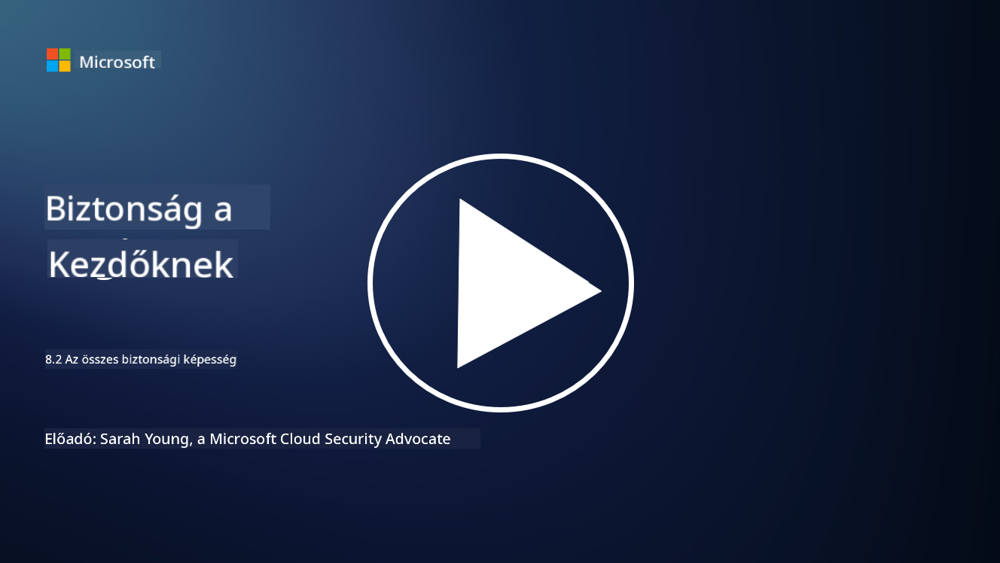

<!--
CO_OP_TRANSLATOR_METADATA:
{
  "original_hash": "b6bb7175672298d1e2f73ba7e0006f95",
  "translation_date": "2025-09-03T21:36:47+00:00",
  "source_file": "8.2 AI security capabilities.md",
  "language_code": "hu"
}
-->
# AI biztonsági képességek

## Milyen eszközök és képességek állnak jelenleg rendelkezésre az AI rendszerek biztonságának megőrzésére?

Jelenleg számos eszköz és képesség áll rendelkezésre az AI rendszerek biztonságának megőrzésére:

-   **Counterfit**: Egy nyílt forráskódú automatizált eszköz az AI rendszerek biztonsági tesztelésére, amely segíti a szervezeteket az AI biztonsági kockázatok felmérésében és algoritmusaik robusztusságának biztosításában.
-   **Adverzárius gépi tanulási eszközök**: Ezek az eszközök értékelik a gépi tanulási modellek robusztusságát adverzárius támadásokkal szemben, segítve a sebezhetőségek azonosítását és enyhítését.
-   **AI biztonsági eszköztárak**: Nyílt forráskódú eszköztárak állnak rendelkezésre, amelyek erőforrásokat biztosítanak az AI rendszerek biztonságának megőrzésére, beleértve könyvtárakat és keretrendszereket a biztonsági intézkedések megvalósításához.
-   **Együttműködési platformok**: Vállalatok és AI közösségek közötti partnerségek, amelyek AI-specifikus biztonsági szkennereket és más eszközöket fejlesztenek az AI ellátási lánc védelmére.

Ezek az eszközök és képességek egy növekvő terület részét képezik, amely az AI rendszerek különféle fenyegetésekkel szembeni biztonságának fokozására irányul. Kutatások, gyakorlati eszközök és iparági együttműködések kombinációját képviselik, amelyek az AI technológiák által támasztott egyedi kihívások kezelésére irányulnak.

## Mi a helyzet az AI red teaminggel? Miben különbözik a hagyományos biztonsági red teamingtől?

Az AI red teaming több kulcsfontosságú szempontban különbözik a hagyományos biztonsági red teamingtől:

-   **Fókusz az AI rendszereken**: Az AI red teaming kifejezetten az AI rendszerek egyedi sebezhetőségeit célozza meg, mint például a gépi tanulási modelleket és adatfolyamatokat, nem pedig a hagyományos IT infrastruktúrát.
-   **Az AI viselkedésének tesztelése**: Magában foglalja annak tesztelését, hogy az AI rendszerek hogyan reagálnak szokatlan vagy váratlan bemenetekre, amelyek feltárhatják a támadók által kihasználható sebezhetőségeket.
-   **AI hibák feltárása**: Az AI red teaming nemcsak rosszindulatú, hanem jóindulatú hibákat is vizsgál, szélesebb körű személyiségeket és potenciális rendszerhibákat figyelembe véve, nem csupán biztonsági incidenseket.
-   **Prompt injekció és tartalomgenerálás**: Az AI red teaming magában foglalja az olyan hibák feltárását is, mint a prompt injekció, ahol a támadók manipulálják az AI rendszereket, hogy káros vagy megalapozatlan tartalmat hozzanak létre.
-   **Etikus és felelős AI**: Része annak biztosításának, hogy az AI rendszerek felelősségteljesen legyenek tervezve, és ellenálljanak azoknak a kísérleteknek, amelyek nem kívánt viselkedésre késztetnék őket.

Összességében az AI red teaming egy kibővített gyakorlat, amely nemcsak a biztonsági sebezhetőségek feltárását foglalja magában, hanem az AI technológiákra jellemző egyéb rendszerhibák tesztelését is. Ez kulcsfontosságú az AI rendszerek biztonságosabbá tételében, az AI bevezetésével járó új kockázatok megértése és enyhítése révén.

## További olvasnivaló

 - [Microsoft AI Red Team building future of safer AI | Microsoft Security Blog](https://www.microsoft.com/en-us/security/blog/2023/08/07/microsoft-ai-red-team-building-future-of-safer-ai/?WT.mc_id=academic-96948-sayoung)
 - [Announcing Microsoft’s open automation framework to red team generative AI Systems | Microsoft Security Blog](https://www.microsoft.com/en-us/security/blog/2024/02/22/announcing-microsofts-open-automation-framework-to-red-team-generative-ai-systems/?WT.mc_id=academic-96948-sayoung)
 - [AI Security Tools: The Open-Source Toolkit | Wiz](https://www.wiz.io/academy/ai-security-tools)

---

**Felelősség kizárása**:  
Ez a dokumentum az AI fordítási szolgáltatás, a [Co-op Translator](https://github.com/Azure/co-op-translator) segítségével lett lefordítva. Bár törekszünk a pontosságra, kérjük, vegye figyelembe, hogy az automatikus fordítások hibákat vagy pontatlanságokat tartalmazhatnak. Az eredeti dokumentum az eredeti nyelvén tekintendő hiteles forrásnak. Kritikus információk esetén javasolt professzionális emberi fordítást igénybe venni. Nem vállalunk felelősséget semmilyen félreértésért vagy téves értelmezésért, amely a fordítás használatából eredhet.