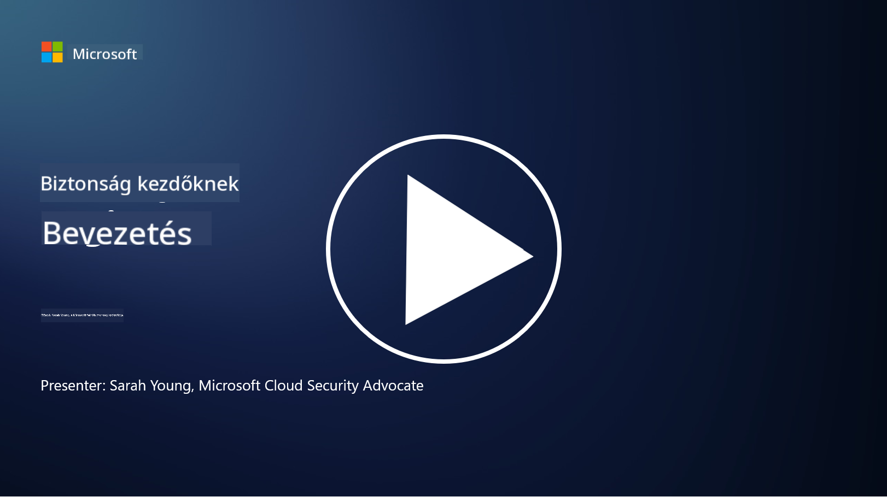

<!--
CO_OP_TRANSLATOR_METADATA:
{
  "original_hash": "33e83c2beb28a1b6e031416624dc23aa",
  "translation_date": "2025-10-11T11:06:14+00:00",
  "source_file": "README.md",
  "language_code": "hu"
}
-->

### 🌐 Többnyelvű támogatás

#### Támogatott GitHub Action segítségével (Automatikus és mindig naprakész)

<!-- CO-OP TRANSLATOR LANGUAGES TABLE START -->
[Arab](../ar/README.md) | [Bengáli](../bn/README.md) | [Bolgár](../bg/README.md) | [Burmai (Mianmar)](../my/README.md) | [Kínai (Egyszerűsített)](../zh/README.md) | [Kínai (Hagyományos, Hongkong)](../hk/README.md) | [Kínai (Hagyományos, Makaó)](../mo/README.md) | [Kínai (Hagyományos, Tajvan)](../tw/README.md) | [Horvát](../hr/README.md) | [Cseh](../cs/README.md) | [Dán](../da/README.md) | [Holland](../nl/README.md) | [Észt](../et/README.md) | [Finn](../fi/README.md) | [Francia](../fr/README.md) | [Német](../de/README.md) | [Görög](../el/README.md) | [Héber](../he/README.md) | [Hindi](../hi/README.md) | [Magyar](./README.md) | [Indonéz](../id/README.md) | [Olasz](../it/README.md) | [Japán](../ja/README.md) | [Koreai](../ko/README.md) | [Litván](../lt/README.md) | [Maláj](../ms/README.md) | [Maráthi](../mr/README.md) | [Nepáli](../ne/README.md) | [Norvég](../no/README.md) | [Perzsa (Fárszi)](../fa/README.md) | [Lengyel](../pl/README.md) | [Portugál (Brazília)](../br/README.md) | [Portugál (Portugália)](../pt/README.md) | [Pandzsábi (Gurmukhi)](../pa/README.md) | [Román](../ro/README.md) | [Orosz](../ru/README.md) | [Szerb (Cirill)](../sr/README.md) | [Szlovák](../sk/README.md) | [Szlovén](../sl/README.md) | [Spanyol](../es/README.md) | [Szuahéli](../sw/README.md) | [Svéd](../sv/README.md) | [Tagalog (Filippínó)](../tl/README.md) | [Tamil](../ta/README.md) | [Thai](../th/README.md) | [Török](../tr/README.md) | [Ukrán](../uk/README.md) | [Urdu](../ur/README.md) | [Vietnámi](../vi/README.md)
<!-- CO-OP TRANSLATOR LANGUAGES TABLE END -->

**Ha további fordításokat szeretnél, a támogatott nyelvek listája [itt található](https://github.com/Azure/co-op-translator/blob/main/getting_started/supported-languages.md)**

#### Csatlakozz a közösségünkhöz 

# 🚀 Kiberbiztonság kezdőknek – tananyag

Az AI technológia gyorsan változó korszakában még fontosabb megérteni, hogyan védhetjük meg az IT rendszereket. Ez a kurzus alapvető kiberbiztonsági fogalmakat tanít, hogy elindítsa a biztonsági tanulásodat. A tananyag gyártófüggetlen, és rövid, 30-60 perces leckékre van osztva. Minden lecke tartalmaz egy rövid kvízt és további olvasnivalókat, ha mélyebben szeretnél elmerülni a témában.

Mit tartalmaz ez a kurzus 📚

- 🔐 Alapvető kiberbiztonsági fogalmak, mint például a CIA triád, a kockázatok és fenyegetések közötti különbségek stb.
- 🛡️ Megérteni, mi az a biztonsági kontroll, és milyen formái vannak.
- 🌐 Megérteni, mi az a zero trust, és miért fontos ez a modern kiberbiztonságban.
- 🔑 Kulcsfogalmak és témák megértése az identitás, hálózat, biztonsági műveletek, infrastruktúra és adatbiztonság területén.
- 🔧 Példák bemutatása a biztonsági kontrollok megvalósításához használt eszközökre.

Mit nem tartalmaz ez a kurzus 🙅‍♂️

- 🚫 Konkrét biztonsági eszközök használatának bemutatása.
- 🚫 "Hackelés" vagy piros csapat/offenzív biztonsági tevékenységek tanítása.
- 🚫 Konkrét megfelelőségi szabványok tanulmányozása.

Miután befejezted ezt a kurzust, továbbléphetsz néhány Microsoft Learn modulra. Javasoljuk, hogy folytasd a tanulást a [Microsoft Security, Compliance, and Identity Fundamentals](https://learn.microsoft.com/training/paths/describe-concepts-of-security-compliance-identity/?WT.mc_id=academic-96948-sayoung) modulokkal.

Végül megfontolhatod a [SC-900 vizsga: Microsoft Security, Compliance, and Identity Fundamentals](https://learn.microsoft.com/credentials/certifications/exams/sc-900/?WT.mc_id=academic-96948-sayoung) letételét.

> 💁 Ha bármilyen visszajelzésed vagy javaslatod van a kurzussal kapcsolatban, vagy úgy érzed, hogy hiányzik valami tartalom, szívesen vesszük a véleményedet!

## Modulok áttekintése 📝 
| **Modul száma** | **Modul neve**                           | **Tanított fogalmak**                  | **Tanulási célok**                                                                                          |
|-------------------|-------------------------------------------|--------------------------------------|-----------------------------------------------------------------------------------------------------------------|
| **1.1**           | Alapvető biztonsági fogalmak                   | [A CIA triád](https://github.com/microsoft/Security-101/blob/main/1.1%20The%20CIA%20triad%20and%20other%20key%20concepts.md)                        | Ismerd meg a titkosságot, rendelkezésre állást és integritást. Valamint az autentikációt, a nem visszautasíthatóságot és a magánéletet. |
| **1.2**           | Alapvető biztonsági fogalmak                   | [Gyakori kiberbiztonsági fenyegetések](https://github.com/microsoft/Security-101/blob/main/1.2%20Common%20cybersecurity%20threats.md)        | Ismerd meg az egyéneket és szervezeteket érintő gyakori kiberbiztonsági fenyegetéseket.                             |
| **1.3**           | Alapvető biztonsági fogalmak                   | [Kockázatkezelés megértése](https://github.com/microsoft/Security-101/blob/main/1.3%20Understanding%20risk%20management.md)       | Ismerd meg a kockázat felmérését és megértését – hatás/valószínűség és kontrollok bevezetése.                                                                                                               | |
| **1.4**           | Alapvető biztonsági fogalmak                   | [Biztonsági gyakorlatok és dokumentáció](https://github.com/microsoft/Security-101/blob/main/1.4%20Security%20practices%20and%20documentation.md) | Ismerd meg a különbséget a szabályzatok, eljárások, szabványok és szabályozások/törvények között.                         |
| **1.5**           | Alapvető biztonsági fogalmak                   | [Zero trust](https://github.com/microsoft/Security-101/blob/main/1.5%20Zero%20trust.md)                           | Ismerd meg, mi az a zero trust, és hogyan befolyásolja az architektúrát. Mi az a mélységi védelem?                   |
| **1.6**           | Alapvető biztonsági fogalmak                   | [Megosztott felelősségi modell](https://github.com/microsoft/Security-101/blob/main/1.6%20Shared%20responsibility%20model.md)                           | Mi az a megosztott felelősségi modell, és hogyan befolyásolja a kiberbiztonságot?                  |
| **1.7**           | [Modul végi kvíz](https://github.com/microsoft/Security-101/blob/main/1.7%20End%20of%20module%20quiz.md)                        |                                      |                                                                                                                 |
| **2.1**           | Identitás- és hozzáférés-kezelés alapjai | [IAM kulcsfogalmak](https://github.com/microsoft/Security-101/blob/main/2.1%20IAM%20key%20concepts.md)                     | Ismerd meg a legkisebb jogosultság elvét, a feladatok szétválasztását, és hogyan támogatja az IAM a zero trustot.               |
| **2.2**           | Identitás- és hozzáférés-kezelés alapjai | [IAM zero trust architektúra](https://github.com/microsoft/Security-101/blob/main/2.2%20IAM%20zero%20trust%20architecture.md)          | Ismerd meg, hogyan válik az identitás a modern IT környezetek új határává, és milyen fenyegetéseket enyhít.          |
| **2.3**           | Identitás- és hozzáférés-kezelés alapjai | [IAM képességek](https://github.com/microsoft/Security-101/blob/main/2.3%20IAM%20capabilities.md)                     | Ismerd meg az IAM képességeit és kontrolljait az identitások védelméhez.                                                  |
| **2.4**           | [Modul végi kvíz](https://github.com/microsoft/Security-101/blob/main/2.4%20End%20of%20module%20quiz.md)                        |                                      |                                                                                                                 |
| **3.1**           | Hálózatbiztonság alapjai             | [Hálózati kulcsfogalmak](https://github.com/microsoft/Security-101/blob/main/3.1%20Networking%20key%20concepts.md)              | Ismerd meg a hálózati fogalmakat (IP címzés, portszámok, titkosítás stb.).                                 |
| **3.2**           | Hálózatbiztonság alapjai             | [Hálózati zero trust architektúra](https://github.com/microsoft/Security-101/blob/main/3.2%20Networking%20zero%20trust%20architecture.md)   | Ismerd meg, hogyan járul hozzá a hálózat egy E2E ZT architektúrához, és milyen fenyegetéseket enyhít.                  |
| **3.3**           | Hálózatbiztonság alapjai             | [Hálózatbiztonsági képességek](https://github.com/microsoft/Security-101/blob/main/3.3%20Network%20security%20capabilities.md)        | Ismerd meg a hálózatbiztonsági eszközöket – tűzfalak, WAF, DDoS védelem stb.                                    |
| **3.4**           | [Modul végi kvíz](https://github.com/microsoft/Security-101/blob/main/3.4%20End%20of%20module%20quiz.md)                        |                                      |                                                                                                                 |
| **4.1**           | Biztonsági műveletek alapjai          | [SecOps kulcsfogalmak](https://github.com/microsoft/Security-101/blob/main/4.1%20SecOps%20key%20concepts.md)                  | Ismerd meg, miért fontosak a biztonsági műveletek, és hogyan különböznek a normál IT műveleti csapatoktól.                  |
| **4.2**           | Biztonsági műveletek alapjai          | [SecOps zero trust architektúra](https://github.com/microsoft/Security-101/blob/main/4.2%20SecOps%20zero%20trust%20architecture.md)       | Ismerd meg, hogyan járul hozzá a SecOps egy E2E ZT architektúrához, és milyen fenyegetéseket enyhít.                      |
| **4.3**           | Biztonsági műveletek alapjai          | [SecOps képességek](https://github.com/microsoft/Security-101/blob/main/4.3%20SecOps%20capabilities.md)                  | Ismerd meg a SecOps eszközeit – SIEM, XDR stb.                                                                    |
| **4.4**           | [Modul végi kvíz](https://github.com/microsoft/Security-101/blob/main/4.4%20End%20of%20module%20quiz.md)                        |                                      |                                                                                                                 |
| **5.1**           | Alkalmazásbiztonság alapjai         | [AppSec kulcsfogalmak](https://github.com/microsoft/Security-101/blob/main/5.1%20AppSec%20key%20concepts.md)                  | Ismerd meg az AppSec fogalmakat, mint például a biztonságos tervezés, bemeneti validáció stb.                                    |
| **5.2**           | Alkalmazásbiztonság alapjai              | [AppSec képességek](https://github.com/microsoft/Security-101/blob/main/5.2%20AppSec%20key%20capabilities.md)                  | Ismerd meg az AppSec eszközöket: pipeline biztonsági eszközök, kódellenőrzés, titkosításellenőrzés stb.          |
| **5.3**           | [Modul végi kvíz](https://github.com/microsoft/Security-101/blob/main/5.3%20End%20of%20module%20quiz.md)                        |                                      |                                                                                                                 |
| **6.1**           | Infrastruktúra-biztonság alapjai         | [Infrastruktúra-biztonság kulcsfogalmai](https://github.com/microsoft/Security-101/blob/main/6.1%20Infrastructure%20security%20key%20concepts.md) | Ismerd meg a rendszerek megerősítését, frissítést, biztonsági higiéniát, konténerbiztonságot.                    |
| **6.2**           | Infrastruktúra-biztonság alapjai         | [Infrastruktúra-biztonság képességei](https://github.com/microsoft/Security-101/blob/main/6.2%20Infrastructure%20security%20capabilities.md) | Ismerd meg az infrastruktúra-biztonságot támogató eszközöket, például CSPM, konténerbiztonság stb.               |
| **6.3**           | [Modul végi kvíz](https://github.com/microsoft/Security-101/blob/main/6.3%20End%20of%20module%20quiz.md)                        |                                      |                                                                                                                 |
| **7.1**           | Adatbiztonság alapjai                    | [Adatbiztonság kulcsfogalmai](https://github.com/microsoft/Security-101/blob/main/7.1%20Data%20security%20key%20concepts.md)           | Ismerd meg az adatbesorolást és -megőrzést, valamint ezek fontosságát egy szervezet számára.                     |
| **7.2**           | Adatbiztonság alapjai                    | [Adatbiztonság képességei](https://github.com/microsoft/Security-101/blob/main/7.2%20Data%20security%20capabilities.md)           | Ismerd meg az adatbiztonsági eszközöket – DLP, belső kockázatkezelés, adatirányítás stb.                          |
| **7.3**           | [Modul végi kvíz](https://github.com/microsoft/Security-101/blob/main/7.3%20End%20of%20module%20quiz.md)                        |
| **8.1**           | MI-biztonság alapjai                     | [MI-biztonság kulcsfogalmai](https://github.com/microsoft/Security-101/blob/main/8.1%20AI%20security%20key%20concepts.md)          | Ismerd meg a hagyományos biztonság és az MI-biztonság közötti különbségeket és hasonlóságokat.                    |
| **8.2**           | MI-biztonság alapjai                     | [MI-biztonság képességei](https://github.com/microsoft/Security-101/blob/main/8.2%20AI%20security%20capabilities.md)           | Ismerd meg az MI-biztonsági eszközöket és az MI védelmét szolgáló kontrollokat.                                   |
| **8.3**           | MI-biztonság alapjai                     | [Felelős MI](https://github.com/microsoft/Security-101/blob/main/8.3%20Responsible%20AI.md)          | Ismerd meg, mi az a felelős MI, és az MI-specifikus károkat, amelyekkel a biztonsági szakembereknek tisztában kell lenniük. |
| **8.4**           | [Modul végi kvíz](https://github.com/microsoft/Security-101/blob/main/8.4%20End%20of%20module%20quiz.md)     

## 🎒 Egyéb kurzusok 

Csapatunk további kurzusokat is készít! Nézd meg:

- [Generatív MI kezdőknek](https://aka.ms/genai-beginners)
- [Generatív MI kezdőknek .NET](https://github.com/microsoft/Generative-AI-for-beginners-dotnet)
- [Generatív MI JavaScript-tel](https://github.com/microsoft/generative-ai-with-javascript)
- [Generatív MI Java-val](https://github.com/microsoft/Generative-AI-for-beginners-java)
- [MI kezdőknek](https://aka.ms/ai-beginners)
- [Adattudomány kezdőknek](https://aka.ms/datascience-beginners)
- [ML kezdőknek](https://aka.ms/ml-beginners)
- [Kiberbiztonság kezdőknek](https://github.com/microsoft/Security-101) 
- [Webfejlesztés kezdőknek](https://aka.ms/webdev-beginners)
- [IoT kezdőknek](https://aka.ms/iot-beginners)
- [XR fejlesztés kezdőknek](https://github.com/microsoft/xr-development-for-beginners)
- [GitHub Copilot mesterfokon páros programozáshoz](https://github.com/microsoft/Mastering-GitHub-Copilot-for-Paired-Programming)
- [GitHub Copilot mesterfokon C#/.NET fejlesztőknek](https://github.com/microsoft/mastering-github-copilot-for-dotnet-csharp-developers)
- [Válaszd ki a saját Copilot kalandodat](https://github.com/microsoft/CopilotAdventures)

---

**Felelősség kizárása**:  
Ez a dokumentum az [Co-op Translator](https://github.com/Azure/co-op-translator) AI fordítási szolgáltatás segítségével került lefordításra. Bár törekszünk a pontosságra, kérjük, vegye figyelembe, hogy az automatikus fordítások hibákat vagy pontatlanságokat tartalmazhatnak. Az eredeti dokumentum az eredeti nyelvén tekintendő hiteles forrásnak. Kritikus információk esetén javasolt professzionális emberi fordítást igénybe venni. Nem vállalunk felelősséget semmilyen félreértésért vagy téves értelmezésért, amely a fordítás használatából eredhet.