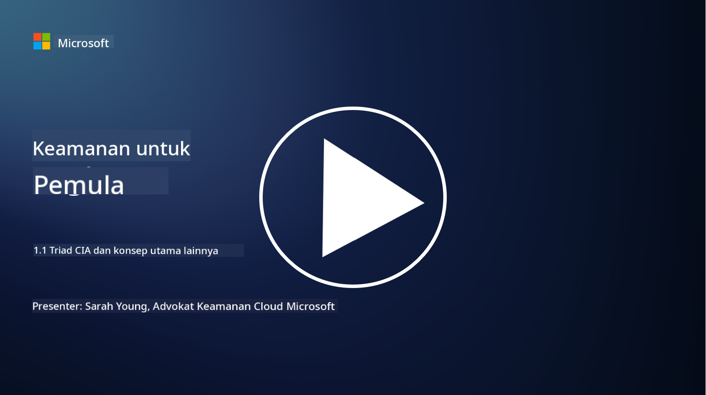
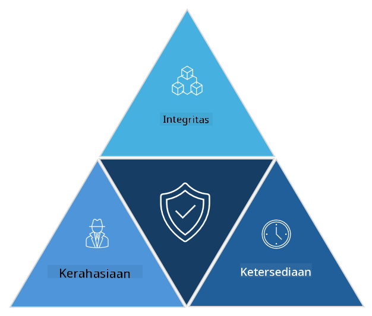

<!--
CO_OP_TRANSLATOR_METADATA:
{
  "original_hash": "16a76f9fa372fb63cffb6d76b855f023",
  "translation_date": "2025-09-03T21:41:01+00:00",
  "source_file": "1.1 The CIA triad and other key concepts.md",
  "language_code": "id"
}
-->
# Triad CIA dan Konsep Penting Lainnya

## Pendahuluan

Dalam pelajaran ini, kita akan membahas:

 - Apa itu keamanan siber?
   
 - Apa itu triad CIA dalam keamanan siber?

 - Apa itu autentisitas, nonrepudiation, dan privasi dalam konteks keamanan siber?

## Apa itu keamanan siber?

Keamanan siber, juga dikenal sebagai keamanan informasi, adalah praktik melindungi sistem komputer, jaringan, perangkat, dan data dari serangan digital, akses yang tidak sah, kerusakan, atau pencurian. Tujuan utama keamanan siber adalah memastikan kerahasiaan, integritas, dan ketersediaan aset digital dan informasi. Para profesional keamanan siber merancang dan menerapkan kontrol keamanan untuk melindungi aset, data, dan informasi. Seiring dengan semakin banyaknya aspek kehidupan kita yang menjadi digital dan online, keamanan siber telah menjadi perhatian utama baik bagi individu maupun organisasi.

## Apa itu triad CIA dalam keamanan siber?

Triad keamanan siber mengacu pada model yang mencakup tiga pertimbangan utama dalam setiap pekerjaan keamanan siber atau perancangan sistem/lingkungan:

### Kerahasiaan

Ini adalah pertimbangan yang paling dikenal oleh banyak orang ketika memikirkan "keamanan siber": kerahasiaan adalah proses melindungi data dan informasi dari upaya akses yang tidak sah, yaitu hanya orang yang membutuhkan informasi tersebut yang dapat mengaksesnya. Namun, tidak semua data diciptakan sama, dan data biasanya dikategorikan serta dilindungi berdasarkan seberapa besar kerusakan yang akan terjadi jika data tersebut diakses oleh pihak yang salah.

### Integritas

Mengacu pada perlindungan terhadap akurasi dan kepercayaan data yang terdapat dalam lingkungan, serta memastikan data tidak diubah atau dimanipulasi oleh individu yang tidak berwenang. Contohnya, seorang siswa mengubah tanggal lahirnya di catatan SIM di DMV agar terlihat lebih tua sehingga mereka dapat mencetak ulang SIM dengan tanggal lahir yang lebih awal untuk membeli alkohol.

### Ketersediaan

Ini adalah pertimbangan di seluruh operasional TI, tetapi ketersediaan juga penting dalam keamanan siber. Ada jenis serangan tertentu yang menargetkan ketersediaan yang harus dilindungi oleh para profesional keamanan (misalnya, serangan distributed denial of service – DDoS).

**Triad CIA Keamanan Siber**

## Apa itu autentisitas, nonrepudiation, dan privasi dalam konteks keamanan siber?

Ini adalah konsep penting tambahan yang berkaitan dengan memastikan keamanan dan kepercayaan pada sistem dan data:

**Autentisitas** - mengacu pada jaminan bahwa informasi, komunikasi, atau entitas yang Anda interaksikan adalah asli dan tidak dimanipulasi atau diubah oleh pihak yang tidak berwenang.

**Nonrepudiation** - adalah konsep yang memastikan bahwa suatu pihak tidak dapat menyangkal keterlibatan mereka atau keaslian transaksi atau komunikasi. Ini mencegah seseorang mengklaim bahwa mereka tidak mengirim pesan atau melakukan tindakan tertentu ketika ada bukti yang menunjukkan sebaliknya.

**Privasi** - mengacu pada perlindungan informasi sensitif dan data pribadi yang dapat diidentifikasi dari akses, penggunaan, pengungkapan, atau manipulasi yang tidak sah. Ini melibatkan pengendalian siapa yang memiliki akses ke data pribadi dan bagaimana data tersebut dikumpulkan, disimpan, dan dibagikan.

## Bacaan tambahan

[What Is Information Security (InfoSec)? | Microsoft Security](https://www.microsoft.com/security/business/security-101/what-is-information-security-infosec#:~:text=Three%20pillars%20of%20information%20security%3A%20the%20CIA%20triad,as%20guiding%20principles%20for%20implementing%20an%20InfoSec%20plan.)

---

**Penafian**:  
Dokumen ini telah diterjemahkan menggunakan layanan penerjemahan AI [Co-op Translator](https://github.com/Azure/co-op-translator). Meskipun kami berusaha untuk memberikan hasil yang akurat, harap diingat bahwa terjemahan otomatis mungkin mengandung kesalahan atau ketidakakuratan. Dokumen asli dalam bahasa aslinya harus dianggap sebagai sumber yang otoritatif. Untuk informasi yang bersifat kritis, disarankan menggunakan jasa penerjemahan profesional oleh manusia. Kami tidak bertanggung jawab atas kesalahpahaman atau penafsiran yang keliru yang timbul dari penggunaan terjemahan ini.