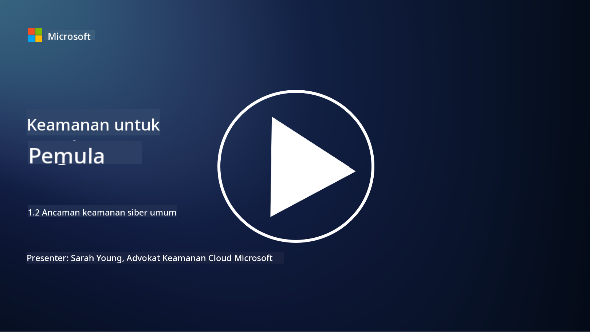

<!--
CO_OP_TRANSLATOR_METADATA:
{
  "original_hash": "6fc3030323139d7134a4ca9d03eccac9",
  "translation_date": "2025-09-03T20:15:30+00:00",
  "source_file": "1.2 Common cybersecurity threats.md",
  "language_code": "id"
}
-->
# Ancaman Siber Umum

## Pendahuluan

Dalam pelajaran ini, kita akan membahas:

- Apa itu ancaman siber?

- Mengapa pelaku jahat ingin mengkompromikan data dan sistem TI?

- Apa saja jenis ancaman siber yang paling umum?

- Apa itu kerangka kerja MITRE ATT&CK?

- Di mana saya bisa mengikuti perkembangan lanskap ancaman siber?

## Apa itu ancaman siber?

Ancaman siber mengacu pada potensi bahaya atau risiko yang dapat mengancam kerahasiaan, integritas, atau ketersediaan data atau sistem TI. Ancaman ini berasal dari pelaku jahat yang mencoba mengeksploitasi kerentanan untuk mendapatkan akses tanpa izin, mencuri informasi sensitif, mengganggu operasi, atau menyebabkan kerugian pada individu, organisasi, atau bahkan negara. Ancaman siber dapat berbentuk berbagai macam dan menargetkan aspek-aspek berbeda dari sistem digital dan data.

## Mengapa pelaku jahat ingin mengkompromikan data dan sistem TI?

Pelaku jahat mengkompromikan data dan sistem TI karena berbagai alasan, sering kali didorong oleh keuntungan pribadi, motif ideologis, atau keinginan untuk menyebabkan gangguan. Memahami motivasi ini dapat membantu organisasi dan individu lebih baik dalam melindungi diri dari ancaman siber. Beberapa alasan umum mengapa pelaku jahat melakukan serangan siber meliputi:

1. **Keuntungan Finansial**: Banyak serangan didorong oleh keinginan untuk mendapatkan keuntungan finansial. Pelaku jahat dapat mencuri informasi sensitif seperti nomor kartu kredit, detail rekening bank, atau informasi identitas pribadi untuk melakukan penipuan, pencurian identitas, meminta tebusan, atau menjual data yang dicuri di web gelap.

2. **Spionase**: Negara, pesaing, atau entitas lain dapat melakukan spionase siber untuk mencuri data pemerintah, perusahaan, atau penelitian yang sensitif demi keuntungan politik, ekonomi, atau militer.

3. **Gangguan dan Sabotase**: Beberapa serangan bertujuan untuk mengganggu infrastruktur penting, layanan, atau operasi demi alasan politik atau ideologis. Serangan ini dapat menyebabkan kekacauan luas, kerugian finansial, dan kerusakan reputasi.

4. **Motivasi Ideologis**: Aktivis siber dan kelompok dengan motivasi ideologis atau politik dapat mengkompromikan sistem untuk meningkatkan kesadaran tentang isu tertentu, mempromosikan keyakinan mereka, atau memprotes tindakan atau organisasi tertentu.

5. **Tindakan Tidak Sengaja**: Tidak semua tindakan jahat dilakukan dengan sengaja; beberapa individu mungkin tanpa sadar berkontribusi pada ancaman siber dengan menjadi korban rekayasa sosial atau menjadi bagian dari jaringan yang dikompromikan.

Pada akhirnya, motivasi untuk mengkompromikan data dan sistem TI dapat sangat beragam, dan dampak dari serangan ini bisa sangat parah. Penting bagi individu, organisasi, dan pemerintah untuk serius dalam menangani keamanan siber dan menerapkan langkah-langkah untuk melindungi diri dari ancaman ini.

## Apa saja jenis ancaman siber yang paling umum?

Ada beberapa jenis serangan siber umum yang digunakan pelaku jahat untuk mengkompromikan sistem, mencuri data, dan menyebabkan gangguan. Berikut adalah beberapa jenis yang paling umum saat ini:

1. **Phishing**:

Phishing melibatkan pengiriman email atau pesan yang menipu dan tampak berasal dari sumber yang sah untuk memanipulasi penerima agar mengungkapkan informasi sensitif, seperti kata sandi, nomor kartu kredit, atau detail pribadi. Phishing juga dapat mengarahkan korban ke situs web berbahaya atau mengunduh malware.

2. **Malware**:

Malware (perangkat lunak berbahaya) mencakup berbagai program jahat yang dirancang untuk menginfeksi sistem, mencuri data, atau menyebabkan kerusakan. Jenis malware meliputi:

- **Ransomware**: Mengenkripsi file dan meminta tebusan untuk dekripsi.

- **Trojan**: Menyamar sebagai perangkat lunak sah, memberikan akses tanpa izin kepada penyerang.

- **Virus**: Program yang dapat mereplikasi diri dan menempel pada file untuk menyebar.

- **Worm**: Program yang dapat mereplikasi diri dan menyebar melalui jaringan.

3. **Denial of Service (DoS) dan Distributed Denial of Service (DDoS)**:

Serangan DoS membebani sistem target, membuatnya tidak dapat digunakan oleh pengguna. Serangan DDoS melibatkan penggunaan jaringan perangkat yang dikompromikan untuk membanjiri target dengan lalu lintas, sehingga sistem sulit berfungsi dengan baik atau bahkan berhenti bekerja sepenuhnya.

4. **SQL Injection**:

Dalam serangan ini, penyerang memanipulasi bidang input aplikasi web untuk menyuntikkan kueri SQL berbahaya, yang berpotensi memberikan akses tanpa izin ke basis data dan data sensitif.

5. **Cross-Site Scripting (XSS)**:

Penyerang menyuntikkan skrip berbahaya ke aplikasi web, yang kemudian dijalankan oleh browser pengguna yang tidak curiga. Ini dapat menyebabkan pencurian data pengguna dan/atau penyebaran malware.

6. **Rekayasa Sosial**:

Rekayasa sosial memanfaatkan psikologi manusia untuk memanipulasi individu agar mengungkapkan informasi rahasia atau melakukan tindakan yang mengkompromikan keamanan.

7. **Eksploitasi Zero-Day (0day)**:

Serangan ini menargetkan kerentanan dalam perangkat lunak atau perangkat keras yang belum diketahui oleh vendor atau publik. Penyerang memanfaatkan kerentanan ini sebelum tambalan dikembangkan. Banyak organisasi khawatir tentang zero-day karena tidak ada tambalan untuk mereka, tetapi mereka tidak seumum serangan lain dalam daftar ini. Ketika zero-day ditemukan, peneliti keamanan akan bekerja cepat untuk membuat tambalan, sehingga zero-day biasanya berumur pendek.

8. **Serangan Kredensial**:

Serangan ini mencakup serangan brute force, di mana penyerang menebak kata sandi berulang kali, dan serangan credential stuffing, di mana kredensial yang dicuri dari satu situs digunakan untuk mencoba akses di situs lain.

## Apa itu kerangka kerja MITRE ATT&CK?

[Kerangka kerja MITRE ATT&CK](https://attack.mitre.org/) (Adversarial Tactics, Techniques, and Common Knowledge) adalah kerangka kerja yang mengkatalogkan dan mengkategorikan taktik, teknik, dan prosedur (TTP) yang digunakan oleh pelaku serangan selama serangan siber. Kerangka kerja ini dibuat oleh MITRE Corporation, sebuah organisasi nirlaba yang mengoperasikan pusat penelitian dan pengembangan untuk berbagai lembaga pemerintah.

Kerangka kerja MITRE ATT&CK menyediakan cara standar untuk mendeskripsikan dan menganalisis ancaman siber, memungkinkan para profesional keamanan siber untuk lebih memahami dan melindungi diri dari berbagai teknik serangan. Kerangka kerja ini banyak digunakan oleh tim keamanan, pemburu ancaman, dan respon insiden untuk:

1. **Memahami Perilaku Adversarial**: Kerangka kerja ini mendokumentasikan perilaku serangan dunia nyata, merinci langkah-langkah yang diambil penyerang dari masuk awal hingga mencapai tujuan mereka. Ini mencakup berbagai teknik serangan yang digunakan oleh berbagai kelompok ancaman.

2. **Merencanakan dan Menerapkan Strategi Pertahanan**: Tim keamanan dapat menggunakan kerangka kerja ini untuk mengembangkan strategi pertahanan proaktif yang selaras dengan taktik dan teknik spesifik yang mungkin digunakan oleh pelaku serangan.

3. **Respon Insiden dan Pemburuan Ancaman**: Saat menyelidiki insiden atau melakukan pemburuan ancaman, para profesional keamanan dapat merujuk pada kerangka kerja ini untuk mengidentifikasi dan mengurangi teknik spesifik yang digunakan oleh penyerang.

Kerangka kerja MITRE ATT&CK diorganisasikan ke dalam matriks yang mengelompokkan teknik serangan berdasarkan platform dan lingkungan tertentu, seperti Windows, macOS, Linux, dan layanan cloud. Setiap matriks dibagi menjadi taktik (tujuan tingkat tinggi) dan teknik (metode spesifik yang digunakan untuk mencapai tujuan tersebut). Untuk setiap teknik, kerangka kerja ini menyediakan informasi tentang cara kerjanya, potensi mitigasi, dan referensi terkait pelaku ancaman dunia nyata yang telah menggunakan teknik tersebut.

Kerangka kerja ini terus diperbarui dan diperluas seiring dengan pengumpulan intelijen ancaman baru dan evolusi lanskap keamanan siber. Ini adalah sumber daya yang berharga untuk meningkatkan postur keamanan siber organisasi dengan memungkinkan pemahaman yang lebih dalam tentang cara kerja penyerang dan cara melindungi diri dari taktik mereka.

## Di mana saya bisa mengikuti perkembangan lanskap ancaman siber?

Ada banyak sumber yang dapat digunakan untuk mengikuti perkembangan ancaman siber, berikut adalah beberapa pilihan:

- [Open Web Application Security Project (OWASP) top 10 vulnerabilities](https://owasp.org/Top10/)
- [Common Vulnerabilities and Exposures (CVEs)](https://www.bing.com/ck/a?!&&p=53df6007f017bca2JmltdHM9MTY5MjU3NjAwMCZpZ3VpZD0zYmY4N2RiYS1jYWI1LTYwMDgtMWY1YS02ZmYyY2JjNjYxZWUmaW5zaWQ9NTc2OQ&ptn=3&hsh=3&fclid=3bf87dba-cab5-6008-1f5a-6ff2cbc661ee&psq=cve&u=a1aHR0cHM6Ly9iaW5nLmNvbS9hbGluay9saW5rP3VybD1odHRwcyUzYSUyZiUyZmN2ZS5taXRyZS5vcmclMmYmc291cmNlPXNlcnAtcnImaD1BZXN4S0VBWTNnbGhNZEFpd3daMlNSZkZQNTlrODhIUnYxRUtlSkY1RTk0JTNkJnA9a2NvZmZjaWFsd2Vic2l0ZQ&ntb=1 "Common Vulnerabilities and Exposures")
- [Microsoft Security Response Center blogs](https://msrc.microsoft.com/blog/)
- [National Institute of Standards and Technology (NIST)](https://www.dhs.gov/topics/cybersecurity): NIST menyediakan sumber daya, peringatan, dan pembaruan terbaru tentang potensi ancaman siber.
- [Cybersecurity and Infrastructure Security Agency (CISA)](https://www.cisa.gov/resources-tools/resources/free-cybersecurity-services-and-tools): CISA menyediakan sumber daya keamanan siber dan praktik terbaik untuk bisnis, lembaga pemerintah, dan organisasi lainnya. CISA berbagi informasi terkini tentang jenis aktivitas keamanan yang berdampak tinggi yang memengaruhi komunitas secara luas serta analisis mendalam tentang ancaman siber baru dan yang sedang berkembang.
- [National Cybersecurity Center of Excellence (NCCoE)](https://www.dhs.gov/topics/cybersecurity): NCCoE adalah pusat yang menyediakan solusi keamanan siber praktis yang dapat diterapkan dalam situasi dunia nyata.
- [US-CERT](https://www.cisa.gov/resources-tools/resources/free-cybersecurity-services-and-tools): Tim Kesiapan Darurat Komputer Amerika Serikat (US-CERT) menyediakan berbagai sumber daya keamanan siber, termasuk peringatan, tips, dan lainnya.
- Tim Tanggap Darurat Siber (CERT) di negara Anda.

---

**Penafian**:  
Dokumen ini telah diterjemahkan menggunakan layanan penerjemahan AI [Co-op Translator](https://github.com/Azure/co-op-translator). Meskipun kami berusaha untuk memberikan hasil yang akurat, harap diingat bahwa terjemahan otomatis mungkin mengandung kesalahan atau ketidakakuratan. Dokumen asli dalam bahasa aslinya harus dianggap sebagai sumber yang otoritatif. Untuk informasi yang bersifat kritis, disarankan menggunakan jasa penerjemahan profesional oleh manusia. Kami tidak bertanggung jawab atas kesalahpahaman atau penafsiran yang keliru yang timbul dari penggunaan terjemahan ini.