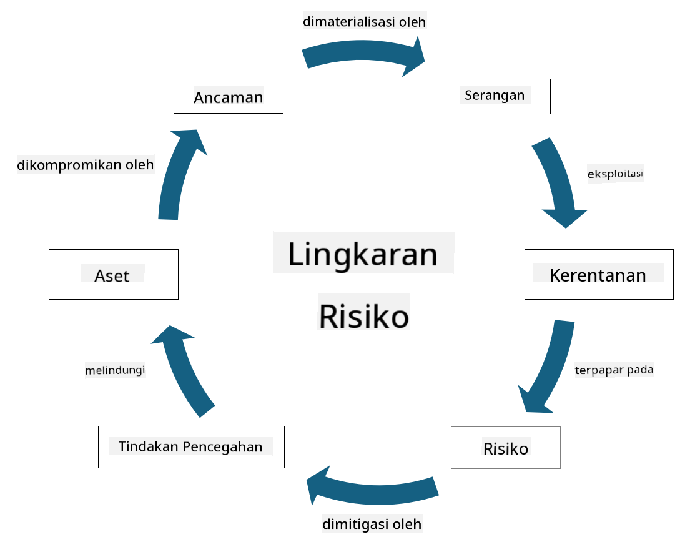

<!--
CO_OP_TRANSLATOR_METADATA:
{
  "original_hash": "fcca304f072cabf206388199e8e2e578",
  "translation_date": "2025-09-03T21:56:34+00:00",
  "source_file": "1.3 Understanding risk management.md",
  "language_code": "id"
}
-->
# Memahami Manajemen Risiko

## Pendahuluan

Dalam pelajaran ini, kita akan membahas:

- Definisi istilah keamanan yang sering digunakan

- Jenis kontrol keamanan

- Penilaian risiko keamanan

## Definisi istilah keamanan yang sering digunakan

Istilah-istilah ini adalah konsep dasar dalam bidang keamanan siber dan manajemen risiko. Mari kita uraikan setiap istilah dan hubungannya satu sama lain:

1. **Agen Ancaman**:

Agen ancaman adalah individu, kelompok, organisasi, atau sistem otomatis yang memiliki potensi untuk mengeksploitasi kerentanan dalam sistem atau jaringan untuk menyebabkan kerugian atau kerusakan. Agen ancaman dapat berupa peretas, pembuat malware, karyawan yang tidak puas, atau entitas lain yang menimbulkan risiko terhadap sistem informasi dan teknologi.

2. **Ancaman**:

Ancaman adalah potensi peristiwa atau tindakan yang dapat mengeksploitasi kerentanan dalam sistem dan menyebabkan kerugian pada aset. Ancaman dapat mencakup tindakan seperti peretasan, pelanggaran data, serangan denial-of-service, dan lainnya. Ancaman adalah "apa" dalam hal potensi kerugian yang dapat ditimbulkan pada aset organisasi.

3. **Kerentanan**:

Kerentanan adalah kelemahan atau cacat dalam desain, implementasi, atau konfigurasi sistem yang dapat dieksploitasi oleh agen ancaman untuk mengkompromikan keamanan sistem. Kerentanan dapat ditemukan dalam perangkat lunak, perangkat keras, proses, atau perilaku manusia. Mengidentifikasi dan mengatasi kerentanan sangat penting untuk meminimalkan risiko serangan yang berhasil.

4. **Risiko**:

Risiko adalah potensi kerugian, kerusakan, atau dampak negatif yang dihasilkan dari interaksi antara ancaman dan kerentanan. Risiko adalah kemungkinan bahwa agen ancaman akan mengeksploitasi kerentanan untuk menyebabkan dampak negatif. Risiko sering dinilai berdasarkan potensi dampaknya dan kemungkinan terjadinya.

5. **Aset**:

Aset adalah segala sesuatu yang bernilai yang ingin dilindungi oleh organisasi. Aset dapat mencakup objek fisik (seperti komputer dan server), data (informasi pelanggan, catatan keuangan), kekayaan intelektual (rahasia dagang, paten), dan bahkan sumber daya manusia (keterampilan dan pengetahuan karyawan). Melindungi aset adalah tujuan utama keamanan siber.

6. **Eksposur**:

Eksposur mengacu pada keadaan rentan terhadap ancaman potensial. Ini terjadi ketika kerentanan ada yang dapat dieksploitasi oleh agen ancaman. Eksposur menyoroti risiko yang terkait dengan adanya kerentanan dalam sistem atau jaringan.

7. **Kontrol**:

Kontrol adalah langkah yang diterapkan untuk mengurangi risiko yang terkait dengan kerentanan dan ancaman. Kontrol dapat bersifat teknis, prosedural, atau administratif. Kontrol dirancang untuk mencegah, mendeteksi, atau mengurangi potensi ancaman dan kerentanan. Contohnya termasuk firewall, kontrol akses, enkripsi, kebijakan keamanan, dan pelatihan karyawan.

Untuk merangkum hubungan antara istilah-istilah ini: Agen ancaman mengeksploitasi kerentanan untuk melaksanakan ancaman, yang dapat menyebabkan risiko yang berpotensi merugikan aset berharga. Eksposur terjadi ketika kerentanan ada, dan kontrol diterapkan untuk mengurangi risiko dengan mencegah atau mengurangi dampak ancaman pada aset. Kerangka kerja ini membentuk dasar manajemen risiko keamanan siber, yang membimbing organisasi dalam mengidentifikasi, menilai, dan menangani risiko potensial terhadap sistem informasi dan aset mereka.

## Jenis kontrol keamanan

Kontrol keamanan adalah langkah atau perlindungan yang diterapkan untuk melindungi sistem informasi dan aset dari berbagai ancaman dan kerentanan. Kontrol ini dapat diklasifikasikan ke dalam beberapa kategori berdasarkan fokus dan tujuannya. Berikut adalah beberapa jenis kontrol keamanan yang umum:

1. **Kontrol Administratif**:

Kontrol ini terkait dengan kebijakan, prosedur, dan pedoman yang mengatur praktik keamanan organisasi dan perilaku pengguna.

- Kebijakan dan prosedur keamanan: Pedoman yang terdokumentasi yang mendefinisikan bagaimana keamanan dipertahankan dalam organisasi.

- Kesadaran dan pelatihan keamanan: Program untuk mendidik karyawan tentang praktik keamanan terbaik dan ancaman potensial.

- Respons dan manajemen insiden: Rencana untuk merespons dan mengurangi insiden keamanan.

2. **Kontrol Teknis**:

Kontrol teknis melibatkan penggunaan teknologi untuk menerapkan langkah-langkah keamanan dan melindungi sistem serta data. Contoh kontrol teknis meliputi:

- Kontrol akses: Langkah-langkah yang membatasi akses pengguna ke sumber daya berdasarkan peran dan izin mereka.

- Enkripsi: Mengubah data ke dalam format yang aman untuk mencegah akses yang tidak sah.

- Firewall: Perangkat keamanan jaringan yang menyaring dan mengontrol lalu lintas masuk dan keluar.

- Sistem Deteksi dan Pencegahan Intrusi (IDPS): Alat yang memantau lalu lintas jaringan untuk aktivitas mencurigakan.

- Perangkat lunak antivirus dan anti-malware: Program yang mendeteksi dan menghapus perangkat lunak berbahaya.

- Mekanisme autentikasi: Metode untuk memverifikasi identitas pengguna, seperti kata sandi, biometrik, dan autentikasi multi-faktor.

- Manajemen patch: Memperbarui perangkat lunak secara teratur untuk mengatasi kerentanan yang diketahui.

3. **Kontrol Fisik**:

Kontrol fisik adalah langkah-langkah untuk melindungi aset fisik dan fasilitas.

- Petugas keamanan dan personel kontrol akses: Personel yang memantau dan mengontrol akses ke lokasi fisik.

- Kamera pengawas: Sistem pemantauan video untuk memantau dan merekam aktivitas.

- Kunci dan penghalang fisik: Langkah-langkah fisik untuk membatasi akses ke area sensitif.

- Kontrol lingkungan: Langkah-langkah untuk mengatur suhu, kelembapan, dan faktor lingkungan lainnya yang memengaruhi peralatan dan pusat data.

4. **Kontrol Operasional**:

Kontrol ini terkait dengan operasi sehari-hari dan aktivitas yang memastikan keamanan sistem secara berkelanjutan.

- Manajemen perubahan: Proses untuk melacak dan menyetujui perubahan pada sistem dan konfigurasi.

- Cadangan dan pemulihan bencana: Rencana untuk pencadangan data dan pemulihan dalam kasus kegagalan sistem atau bencana.

- Pencatatan dan audit: Memantau dan merekam aktivitas sistem untuk tujuan keamanan dan kepatuhan.

- Praktik pengkodean aman: Pedoman untuk menulis perangkat lunak guna meminimalkan kerentanan.

5. **Kontrol Hukum dan Regulasi**:

Kontrol ini memastikan kepatuhan terhadap hukum, peraturan, dan standar industri yang relevan. Standar yang harus dipatuhi oleh organisasi bergantung pada yurisdiksi, sektor industri, dan faktor lainnya.

- Regulasi perlindungan data: Kepatuhan terhadap undang-undang seperti GDPR, HIPAA, dan CCPA.

- Standar industri spesifik: Kepatuhan terhadap standar seperti PCI DSS untuk keamanan data kartu pembayaran.

Kategori kontrol keamanan ini bekerja sama untuk menciptakan postur keamanan yang komprehensif bagi organisasi, membantu melindungi sistem, data, dan aset mereka dari berbagai ancaman.

## Penilaian risiko keamanan

Beberapa profesional keamanan merasa bahwa manajemen risiko hanya dilakukan oleh profesional risiko, tetapi memahami proses pengelolaan risiko keamanan penting bagi setiap profesional keamanan untuk membantu mengungkapkan risiko keamanan dalam bahasa yang dapat dipahami dan ditindaklanjuti oleh seluruh organisasi.

Organisasi harus terus menilai risiko keamanan dan memutuskan tindakan apa (atau tidak) yang akan diambil terhadap risiko terhadap bisnis. Berikut adalah gambaran umum tentang bagaimana hal ini biasanya dilakukan. Perlu dicatat bahwa proses ini biasanya dilakukan oleh beberapa tim berbeda dalam organisasi; jarang satu tim bertanggung jawab atas manajemen risiko secara menyeluruh.

1. **Identifikasi Aset dan Ancaman**:

Organisasi mengidentifikasi aset yang ingin dilindungi. Ini dapat mencakup data, sistem, perangkat keras, perangkat lunak, kekayaan intelektual, dan lainnya. Selanjutnya, mereka mengidentifikasi ancaman potensial yang dapat menargetkan aset tersebut.

2. **Penilaian Kerentanan**:

Organisasi kemudian mengidentifikasi kerentanan atau kelemahan dalam sistem atau proses yang dapat dieksploitasi oleh ancaman. Kerentanan ini dapat berasal dari cacat perangkat lunak, konfigurasi yang salah, kurangnya kontrol keamanan, dan kesalahan manusia.

3. **Penilaian Kemungkinan**:

Organisasi kemudian mengevaluasi kemungkinan terjadinya setiap ancaman. Ini melibatkan pertimbangan data historis, intelijen ancaman, tren industri, dan faktor internal. Kemungkinan dapat dikategorikan sebagai rendah, sedang, atau tinggi berdasarkan probabilitas ancaman terwujud.

4. **Penilaian Dampak**:

Selanjutnya, organisasi menentukan potensi dampak dari setiap ancaman jika mengeksploitasi kerentanan. Dampak dapat mencakup kerugian finansial, gangguan operasional, kerusakan reputasi, konsekuensi hukum, dan lainnya. Dampak juga dapat dikategorikan sebagai rendah, sedang, atau tinggi berdasarkan konsekuensi potensial.

5. **Perhitungan Risiko**:

Penilaian kemungkinan dan dampak digabungkan untuk menghitung tingkat risiko keseluruhan untuk setiap ancaman yang diidentifikasi. Ini sering dilakukan menggunakan matriks risiko yang memberikan nilai numerik atau deskriptor kualitatif untuk tingkat kemungkinan dan dampak. Tingkat risiko yang dihasilkan membantu memprioritaskan risiko mana yang memerlukan perhatian segera.

6. **Prioritas dan Pengambilan Keputusan**:

Organisasi kemudian memprioritaskan risiko dengan fokus pada risiko dengan nilai kemungkinan dan dampak gabungan tertinggi. Ini memungkinkan mereka untuk mengalokasikan sumber daya dan menerapkan kontrol secara lebih efektif. Ancaman berisiko tinggi memerlukan perhatian segera, sementara ancaman berisiko rendah dapat ditangani dalam jangka waktu yang lebih lama.

7. **Penanganan Risiko**:

Berdasarkan penilaian risiko, organisasi menentukan cara mengurangi atau mengelola setiap risiko. Ini dapat melibatkan penerapan kontrol keamanan, mentransfer risiko melalui asuransi, atau bahkan menerima tingkat risiko residual tertentu jika dianggap dapat dikelola/terlalu mahal untuk diperbaiki/dll.

8. **Pemantauan dan Tinjauan Berkelanjutan**:

Penilaian risiko bukanlah proses satu kali. Ini harus dilakukan secara berkala atau setiap kali ada perubahan signifikan pada lingkungan organisasi. Pemantauan berkelanjutan memastikan bahwa ancaman baru, kerentanan, atau perubahan dalam lanskap bisnis diperhitungkan.

Dengan menilai risiko keamanan secara terstruktur, organisasi dapat membuat keputusan yang tepat tentang alokasi sumber daya, kontrol keamanan, dan strategi manajemen risiko secara keseluruhan. Tujuannya adalah untuk mengurangi eksposur risiko organisasi secara keseluruhan sambil menyelaraskan upaya keamanan dengan tujuan dan sasaran bisnis organisasi.

---

**Penafian**:  
Dokumen ini telah diterjemahkan menggunakan layanan penerjemahan AI [Co-op Translator](https://github.com/Azure/co-op-translator). Meskipun kami berusaha untuk memberikan hasil yang akurat, harap diketahui bahwa terjemahan otomatis mungkin mengandung kesalahan atau ketidakakuratan. Dokumen asli dalam bahasa aslinya harus dianggap sebagai sumber yang otoritatif. Untuk informasi yang bersifat kritis, disarankan menggunakan jasa penerjemahan profesional oleh manusia. Kami tidak bertanggung jawab atas kesalahpahaman atau penafsiran yang timbul dari penggunaan terjemahan ini.