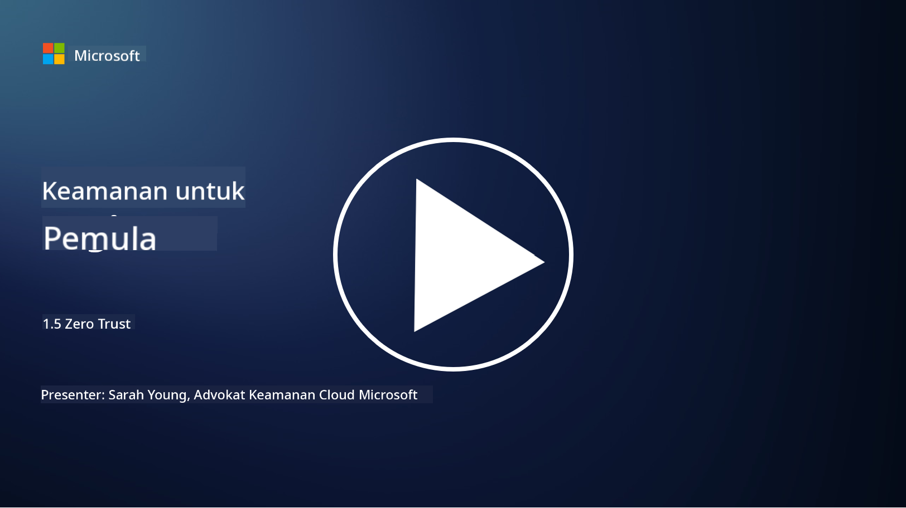
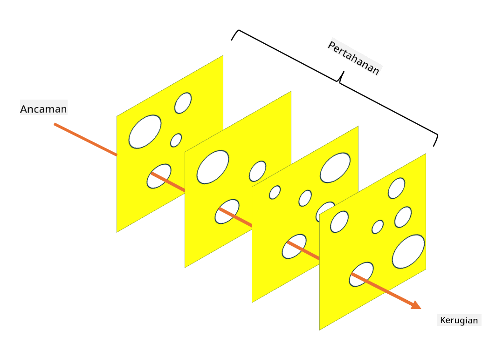

<!--
CO_OP_TRANSLATOR_METADATA:
{
  "original_hash": "75f77f972d2233c584f87c1eb96c983b",
  "translation_date": "2025-09-03T20:33:11+00:00",
  "source_file": "1.5 Zero trust.md",
  "language_code": "id"
}
-->
# Zero Trust

"Zero trust" adalah frasa yang sering digunakan dalam dunia keamanan saat ini. Tapi apa sebenarnya artinya? Apakah ini hanya sekadar kata kunci? Dalam pelajaran ini, kita akan membahas secara mendalam apa itu zero trust.

## Pendahuluan

- Dalam pelajaran ini, kita akan membahas:
  
  - Apa itu zero trust?
  
  - Bagaimana zero trust berbeda dari arsitektur keamanan tradisional?
  
  - Apa itu defense in depth?

## Zero Trust

Zero Trust adalah pendekatan keamanan siber yang menantang konsep tradisional "percaya tapi verifikasi" dengan mengasumsikan bahwa tidak ada entitas, baik di dalam maupun di luar jaringan organisasi, yang dapat dipercaya secara inheren. Sebaliknya, Zero Trust menganjurkan untuk memverifikasi setiap pengguna, perangkat, dan aplikasi yang mencoba mengakses sumber daya, tanpa memandang lokasi mereka. Prinsip utama Zero Trust adalah meminimalkan "permukaan serangan" dan mengurangi dampak potensial dari pelanggaran keamanan.

Dalam model Zero Trust, prinsip-prinsip berikut ditekankan:

1. **Verifikasi Identitas**: Otentikasi dan otorisasi diterapkan secara ketat kepada semua pengguna dan perangkat, tanpa memandang lokasi mereka. Ingat bahwa identitas tidak selalu manusia: bisa berupa perangkat, aplikasi, dll.

2. **Hak Istimewa Minimum**: Pengguna dan perangkat hanya diberikan akses minimum yang diperlukan untuk menjalankan tugas mereka, sehingga mengurangi potensi kerusakan jika terjadi kompromi.

3. **Mikro-Segmentasi**: Sumber daya jaringan dibagi menjadi segmen-segmen kecil untuk membatasi pergerakan lateral dalam jaringan jika terjadi pelanggaran.

4. **Pemantauan Berkelanjutan**: Pemantauan dan analisis perilaku pengguna dan perangkat dilakukan secara terus-menerus untuk mendeteksi anomali dan potensi ancaman. Teknik pemantauan modern juga menggunakan pembelajaran mesin, AI, dan intelijen ancaman untuk memberikan detail dan konteks tambahan.

5. **Enkripsi Data**: Data dienkripsi baik saat transit maupun saat disimpan untuk mencegah akses yang tidak sah.

6. **Kontrol Akses Ketat**: Kontrol akses diterapkan berdasarkan konteks, seperti peran pengguna, kesehatan perangkat, dan lokasi jaringan.

Microsoft membagi zero trust menjadi lima pilar, yang akan kita bahas dalam pelajaran berikutnya.

## Perbedaan dari Arsitektur Keamanan Tradisional

Zero Trust berbeda dari arsitektur keamanan tradisional, seperti model berbasis perimeter, dalam beberapa cara:

1. **Perimeter vs. Berbasis Identitas**: Model tradisional berfokus pada pengamanan perimeter jaringan dan mengasumsikan bahwa pengguna dan perangkat internal dapat dipercaya setelah berada di dalam. Zero Trust, di sisi lain, mengasumsikan bahwa ancaman dapat berasal dari dalam maupun luar jaringan dan menerapkan kontrol berbasis identitas yang ketat.

2. **Kepercayaan Implisit vs. Eksplisit**: Model tradisional secara implisit mempercayai perangkat dan pengguna dalam jaringan sampai terbukti sebaliknya. Zero Trust secara eksplisit memverifikasi identitas dan terus memantau anomali.

3. **Jaringan Datar vs. Tersegmentasi**: Arsitektur tradisional sering melibatkan jaringan datar di mana pengguna internal memiliki akses luas. Zero Trust menganjurkan segmentasi jaringan menjadi zona-zona kecil yang terisolasi untuk membatasi potensi pelanggaran.

4. **Reaktif vs. Proaktif**: Keamanan tradisional sering mengandalkan langkah-langkah reaktif seperti firewall perimeter dan deteksi intrusi. Zero Trust mengambil pendekatan proaktif dengan mengasumsikan pelanggaran mungkin terjadi dan meminimalkan dampaknya.

## Defense in Depth

Defense in depth, juga dikenal sebagai keamanan berlapis, adalah strategi keamanan siber yang melibatkan penerapan beberapa lapisan kontrol dan langkah-langkah keamanan untuk melindungi aset organisasi. Tujuannya adalah menciptakan lapisan-lapisan pertahanan yang saling tumpang tindih sehingga jika satu lapisan dilanggar, lapisan lainnya masih dapat memberikan perlindungan. Setiap lapisan berfokus pada aspek keamanan yang berbeda dan meningkatkan postur keamanan keseluruhan organisasi.

Defense in depth melibatkan kombinasi langkah-langkah keamanan teknis, prosedural, dan fisik. Ini dapat mencakup firewall, sistem deteksi intrusi, kontrol akses, enkripsi, pelatihan pengguna, kebijakan keamanan, dan lainnya. Idenya adalah menciptakan beberapa penghalang yang secara kolektif membuat sulit bagi penyerang untuk menembus sistem dan jaringan organisasi. Ini juga kadang-kadang dikenal sebagai model "keju Swiss" yang juga digunakan dalam pencegahan kecelakaan di industri lain (misalnya, transportasi).

## Bacaan Lebih Lanjut

[What is Zero Trust?](https://learn.microsoft.com/security/zero-trust/zero-trust-overview?WT.mc_id=academic-96948-sayoung)

[Evolving Zero Trust – Microsoft Position Paper](https://query.prod.cms.rt.microsoft.com/cms/api/am/binary/RWJJdT?WT.mc_id=academic-96948-sayoung)

[Zero Trust and BeyondCorp Google Cloud | Google Cloud Blog](https://cloud.google.com/blog/topics/developers-practitioners/zero-trust-and-beyondcorp-google-cloud)

---

**Penafian**:  
Dokumen ini telah diterjemahkan menggunakan layanan penerjemahan AI [Co-op Translator](https://github.com/Azure/co-op-translator). Meskipun kami berusaha untuk memberikan hasil yang akurat, harap diingat bahwa terjemahan otomatis mungkin mengandung kesalahan atau ketidakakuratan. Dokumen asli dalam bahasa aslinya harus dianggap sebagai sumber yang otoritatif. Untuk informasi yang bersifat kritis, disarankan menggunakan jasa penerjemahan profesional oleh manusia. Kami tidak bertanggung jawab atas kesalahpahaman atau penafsiran yang keliru yang timbul dari penggunaan terjemahan ini.