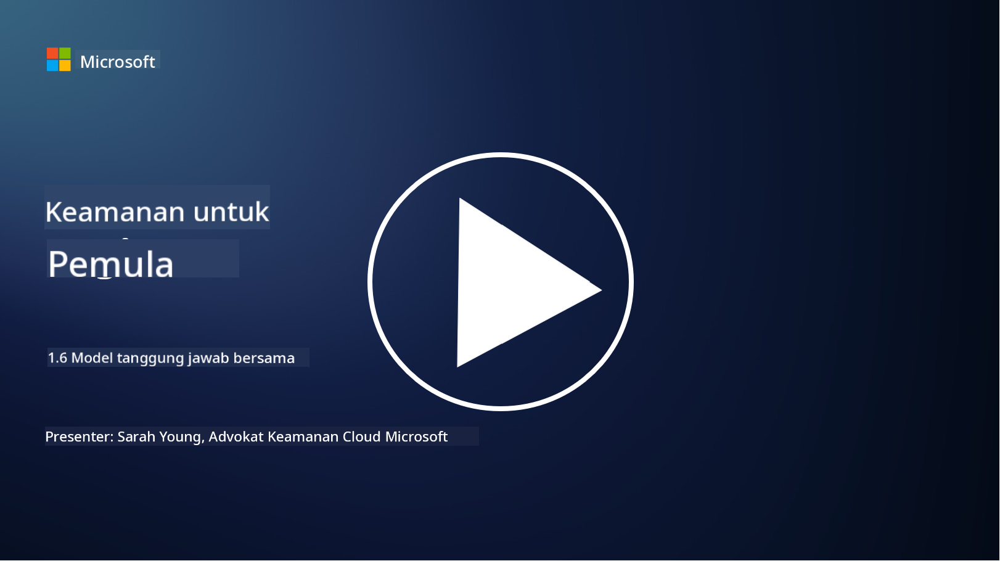

<!--
CO_OP_TRANSLATOR_METADATA:
{
  "original_hash": "a48db640d80c786b928ca178c414f084",
  "translation_date": "2025-09-03T21:06:11+00:00",
  "source_file": "1.6 Shared responsibility model.md",
  "language_code": "id"
}
-->
# Model tanggung jawab bersama

Tanggung jawab bersama adalah konsep baru dalam TI yang muncul dengan adanya komputasi awan. Dari perspektif keamanan siber, penting untuk memahami siapa yang menyediakan kontrol keamanan tertentu agar tidak ada celah dalam pertahanan.

## Pendahuluan

Dalam pelajaran ini, kita akan membahas:

- Apa itu tanggung jawab bersama dalam konteks keamanan siber?

- Apa perbedaan tanggung jawab bersama untuk kontrol keamanan antara IaaS, PaaS, dan SaaS?

- Di mana Anda dapat menemukan informasi tentang kontrol keamanan yang disediakan oleh platform cloud Anda?

- Apa itu "percaya tapi verifikasi"?

## Apa itu tanggung jawab bersama dalam konteks keamanan siber?

Tanggung jawab bersama dalam keamanan siber mengacu pada pembagian tanggung jawab keamanan antara penyedia layanan cloud (CSP) dan pelanggannya. Dalam lingkungan komputasi awan, seperti Infrastructure as a Service (IaaS), Platform as a Service (PaaS), dan Software as a Service (SaaS), baik CSP maupun pelanggan memiliki peran dalam memastikan keamanan data, aplikasi, dan sistem.

## Apa perbedaan tanggung jawab bersama untuk kontrol keamanan antara IaaS, PaaS, dan SaaS?

Pembagian tanggung jawab biasanya bergantung pada jenis layanan cloud yang digunakan:

- **IaaS (Infrastructure as a Service)**: CSP menyediakan infrastruktur dasar (server, jaringan, penyimpanan), sementara pelanggan bertanggung jawab untuk mengelola sistem operasi, aplikasi, dan konfigurasi keamanan pada infrastruktur tersebut.

- **PaaS (Platform as a Service)**: CSP menawarkan platform di mana pelanggan dapat membangun dan menerapkan aplikasi. CSP mengelola infrastruktur dasar, dan pelanggan fokus pada pengembangan aplikasi dan keamanan data.

- **SaaS (Software as a Service)**: CSP menyediakan aplikasi yang sepenuhnya berfungsi dan dapat diakses melalui internet. Dalam hal ini, CSP bertanggung jawab atas keamanan aplikasi dan infrastruktur, sementara pelanggan mengelola akses pengguna dan penggunaan data.

Memahami tanggung jawab bersama sangat penting karena menjelaskan aspek keamanan mana yang ditangani oleh CSP dan mana yang perlu ditangani oleh pelanggan. Hal ini membantu mencegah kesalahpahaman dan memastikan bahwa langkah-langkah keamanan diterapkan secara menyeluruh.

## Di mana Anda dapat menemukan informasi tentang kontrol keamanan yang disediakan oleh platform cloud Anda?

Untuk mengetahui kontrol keamanan yang disediakan oleh platform cloud Anda, Anda perlu merujuk pada dokumentasi dan sumber daya penyedia layanan cloud. Ini termasuk:

- **Situs web dan dokumentasi CSP**: Situs web CSP akan memiliki informasi tentang fitur keamanan dan kontrol yang ditawarkan sebagai bagian dari layanan mereka. CSP biasanya menyediakan dokumentasi terperinci yang menjelaskan praktik keamanan, kontrol, dan rekomendasi mereka. Ini mungkin mencakup whitepaper, panduan keamanan, dan dokumentasi teknis.

- **Penilaian dan audit keamanan**: Sebagian besar CSP mendapatkan kontrol keamanan mereka dinilai oleh pakar keamanan independen dan organisasi. Penilaian ini dapat memberikan wawasan tentang kualitas langkah-langkah keamanan CSP. Kadang-kadang ini menghasilkan CSP mendapatkan sertifikat kepatuhan keamanan (lihat poin berikutnya).

- **Sertifikasi kepatuhan keamanan**: Sebagian besar CSP memperoleh sertifikasi seperti ISO:27001, SOC 2, dan FedRAMP, dll. Sertifikasi ini menunjukkan bahwa penyedia memenuhi standar keamanan dan kepatuhan tertentu.

Ingatlah bahwa tingkat detail dan ketersediaan informasi dapat bervariasi antara penyedia cloud. Selalu pastikan Anda berkonsultasi dengan sumber daya resmi dan terkini yang disediakan oleh penyedia layanan cloud untuk membuat keputusan yang tepat tentang keamanan aset berbasis cloud Anda.

## Apa itu "percaya tapi verifikasi"?

Dalam konteks menggunakan CSP, perangkat lunak pihak ketiga, atau layanan keamanan TI lainnya, sebuah organisasi mungkin awalnya mempercayai klaim penyedia tentang langkah-langkah keamanan. Namun, untuk benar-benar memastikan keamanan data dan sistem mereka, mereka harus memverifikasi klaim tersebut melalui penilaian keamanan, pengujian penetrasi, dan tinjauan kontrol keamanan pihak eksternal sebelum sepenuhnya mengintegrasikan perangkat lunak atau layanan ke dalam operasi mereka. Semua individu dan organisasi harus berusaha untuk percaya tetapi memverifikasi kontrol keamanan yang bukan menjadi tanggung jawab mereka.

## Tanggung jawab bersama dalam organisasi

Ingatlah, tanggung jawab bersama untuk keamanan dalam organisasi juga perlu diperhitungkan untuk berbagai tim. Tim keamanan jarang menerapkan semua kontrol sendiri dan perlu berkolaborasi dengan tim operasi, pengembang, dan bagian bisnis lainnya untuk menerapkan semua kontrol keamanan yang diperlukan untuk menjaga keamanan organisasi.

## Bacaan lebih lanjut

- [Shared responsibility in the cloud - Microsoft Azure | Microsoft Learn](https://learn.microsoft.com/azure/security/fundamentals/shared-responsibility?WT.mc_id=academic-96948-sayoung)
- [What is shared responsibility model? – Definition from TechTarget.com](https://www.techtarget.com/searchcloudcomputing/definition/shared-responsibility-model)
- [The shared responsibility model explained and what it means for cloud security | CSO Online](https://www.csoonline.com/article/570779/the-shared-responsibility-model-explained-and-what-it-means-for-cloud-security.html)
- [Shared Responsibility for Cloud Security: What You Need to Know (cisecurity.org)](https://www.cisecurity.org/insights/blog/shared-responsibility-cloud-security-what-you-need-to-know)

---

**Penafian**:  
Dokumen ini telah diterjemahkan menggunakan layanan terjemahan AI [Co-op Translator](https://github.com/Azure/co-op-translator). Meskipun kami berupaya untuk memberikan hasil yang akurat, harap diperhatikan bahwa terjemahan otomatis mungkin mengandung kesalahan atau ketidakakuratan. Dokumen asli dalam bahasa aslinya harus dianggap sebagai sumber yang berwenang. Untuk informasi yang bersifat kritis, disarankan menggunakan jasa terjemahan manusia profesional. Kami tidak bertanggung jawab atas kesalahpahaman atau penafsiran yang keliru yang timbul dari penggunaan terjemahan ini.