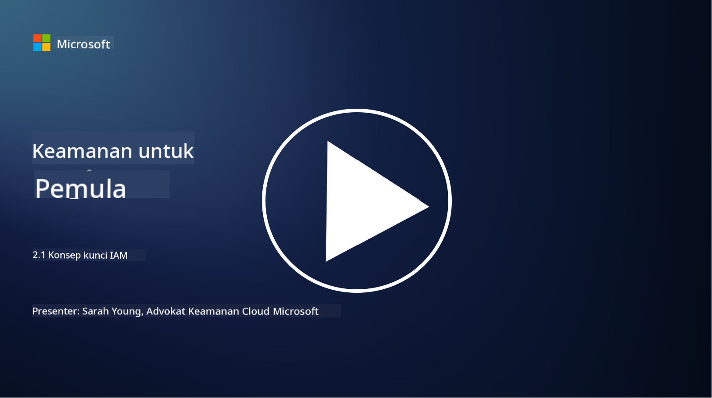

<!--
CO_OP_TRANSLATOR_METADATA:
{
  "original_hash": "2e3864e3d579f0dbb4ac2ec8c5f82acf",
  "translation_date": "2025-09-03T19:38:06+00:00",
  "source_file": "2.1 IAM key concepts.md",
  "language_code": "id"
}
-->
# Konsep Utama IAM

Pernahkah Anda masuk ke komputer atau situs web? Tentu saja pernah! Itu berarti Anda sudah menggunakan kontrol identitas dalam kehidupan sehari-hari. Identity and Access Management (IAM) adalah salah satu pilar utama keamanan, dan kita akan mempelajarinya lebih lanjut dalam beberapa pelajaran berikutnya.

**Pendahuluan**

Dalam pelajaran ini, kita akan membahas:

- Apa yang dimaksud dengan Identity and Access Management (IAM) dalam
  konteks keamanan siber?
  
- Apa itu prinsip least privilege?
  
- Apa itu segregasi tugas?
  
- Apa itu autentikasi dan otorisasi?

## Apa yang dimaksud dengan Identity and Access Management (IAM) dalam konteks keamanan siber?

Identity and Access Management (IAM) mengacu pada serangkaian proses, teknologi, dan kebijakan yang diterapkan untuk memastikan bahwa individu yang tepat memiliki akses yang sesuai ke sumber daya dalam lingkungan digital organisasi. IAM melibatkan pengelolaan identitas digital (pengguna, karyawan, mitra) dan akses mereka ke sistem, aplikasi, data, dan jaringan. Tujuan utama IAM adalah meningkatkan keamanan, menyederhanakan akses pengguna, dan memastikan kepatuhan terhadap kebijakan dan regulasi organisasi. Solusi IAM biasanya mencakup autentikasi pengguna, otorisasi, penyediaan identitas, kontrol akses, dan pengelolaan siklus hidup pengguna (memastikan akun dihapus saat tidak lagi digunakan).

## Apa itu prinsip least privilege?

Prinsip least privilege adalah konsep fundamental yang menganjurkan pemberian hak akses kepada pengguna dan sistem hanya sebatas yang diperlukan untuk menjalankan tugas atau peran mereka. Prinsip ini membantu membatasi potensi kerusakan yang dapat terjadi dalam kasus pelanggaran keamanan atau ancaman dari dalam. Dengan mematuhi prinsip least privilege, organisasi dapat mengurangi area serangan dan meminimalkan risiko akses tidak sah, pelanggaran data, dan penyalahgunaan hak akses secara tidak sengaja. Dalam praktiknya, ini berarti pengguna hanya diberikan akses ke sumber daya dan fungsi tertentu yang diperlukan untuk peran pekerjaan mereka, tidak lebih. Sebagai contoh, jika Anda hanya perlu membaca dokumen, akan berlebihan jika Anda diberikan hak admin penuh terhadap dokumen tersebut.

## Apa itu segregasi tugas?

Segregasi tugas adalah prinsip yang bertujuan untuk mencegah konflik kepentingan dan mengurangi risiko penipuan serta kesalahan dengan mendistribusikan tugas dan tanggung jawab penting di antara individu yang berbeda dalam organisasi. Dalam konteks keamanan siber, segregasi tugas melibatkan memastikan bahwa tidak ada satu individu yang memiliki kendali atas semua aspek dari proses atau sistem yang penting. Tujuannya adalah menciptakan sistem pemeriksaan dan keseimbangan yang mencegah satu orang memiliki kemampuan untuk melakukan tahap pengaturan dan persetujuan dari suatu proses. Sebagai contoh, dalam sistem keuangan, ini mungkin berarti bahwa orang yang memasukkan transaksi ke dalam sistem tidak boleh menjadi orang yang menyetujui transaksi tersebut. Hal ini mengurangi risiko tindakan tidak sah atau penipuan yang tidak terdeteksi.

## Apa itu autentikasi dan otorisasi?

Autentikasi dan otorisasi adalah dua konsep fundamental dalam keamanan siber yang memainkan peran penting dalam memastikan keamanan dan integritas sistem komputer serta data. Keduanya sering digunakan bersama untuk mengontrol akses ke sumber daya dan melindungi informasi sensitif.

**1. Autentikasi**: Autentikasi adalah proses memverifikasi identitas pengguna, sistem, atau entitas yang mencoba mengakses sistem komputer atau sumber daya tertentu. Proses ini memastikan bahwa identitas yang diklaim adalah asli dan akurat. Metode autentikasi biasanya melibatkan penggunaan satu atau lebih dari faktor berikut:
    
    a. Sesuatu yang Anda tahu: Ini mencakup kata sandi, PIN, atau pengetahuan rahasia lainnya yang hanya dimiliki oleh pengguna yang sah.
    
    b. Sesuatu yang Anda miliki: Ini melibatkan token fisik atau perangkat seperti kartu pintar, token keamanan, atau ponsel yang digunakan untuk mengonfirmasi identitas pengguna.
    
    c. Sesuatu yang Anda miliki: Ini mengacu pada faktor biometrik seperti sidik jari, pengenalan wajah, atau pemindaian retina yang unik untuk individu tertentu.
    

Mekanisme autentikasi digunakan untuk memastikan bahwa pengguna adalah siapa yang mereka klaim sebelum diberikan akses ke sistem atau sumber daya. Hal ini membantu mencegah akses tidak sah dan memastikan bahwa hanya pengguna yang sah yang dapat melakukan tindakan dalam sistem.

**2. Otorisasi**: Otorisasi adalah proses memberikan atau menolak izin dan hak tertentu kepada pengguna atau entitas yang telah terautentikasi setelah identitas mereka diverifikasi. Proses ini menentukan tindakan atau operasi apa yang diizinkan untuk dilakukan oleh pengguna dalam sistem atau pada sumber daya tertentu. Otorisasi sering kali didasarkan pada kebijakan yang telah ditentukan sebelumnya, aturan kontrol akses, dan peran yang diberikan kepada pengguna.

Otorisasi dapat dianggap sebagai jawaban atas pertanyaan, "Apa yang dapat dilakukan oleh pengguna yang telah terautentikasi?" Proses ini melibatkan penentuan dan penegakan kebijakan kontrol akses untuk melindungi data dan sumber daya sensitif dari akses atau modifikasi yang tidak sah.

**Ringkasannya:**

- Autentikasi menetapkan identitas pengguna atau entitas.
- Otorisasi menentukan tindakan dan sumber daya apa yang dapat diakses atau dimanipulasi oleh pengguna yang telah terautentikasi.

## Bacaan lebih lanjut

- [Describe identity concepts - Training | Microsoft Learn](https://learn.microsoft.com/training/modules/describe-identity-principles-concepts/?WT.mc_id=academic-96948-sayoung)
- [Introduction to identity - Microsoft Entra | Microsoft Learn](https://learn.microsoft.com/azure/active-directory/fundamentals/identity-fundamental-concepts?WT.mc_id=academic-96948-sayoung)
- [What is Identity Access Management (IAM)? | Microsoft Security](https://www.microsoft.com/security/business/security-101/what-is-identity-access-management-iam?WT.mc_id=academic-96948-sayoung)
- [What is IAM? Identity and access management explained | CSO Online](https://www.csoonline.com/article/518296/what-is-iam-identity-and-access-management-explained.html)
- [What is IAM? (auth0.com)](https://auth0.com/blog/what-is-iam/)
- [Security+: implementing Identity and Access Management (IAM) controls [updated 2021] | Infosec (infosecinstitute.com)](https://resources.infosecinstitute.com/certifications/securityplus/security-implementing-identity-and-access-management-iam-controls/)
- [least privilege - Glossary | CSRC (nist.gov)](https://csrc.nist.gov/glossary/term/least_privilege)
- [Security: The Principle of Least Privilege (POLP) - Microsoft Community Hub](https://techcommunity.microsoft.com/t5/azure-sql-blog/security-the-principle-of-least-privilege-polp/ba-p/2067390?WT.mc_id=academic-96948-sayoung)
- [Principle of least privilege | CERT NZ](https://www.cert.govt.nz/it-specialists/critical-controls/principle-of-least-privilege/)
- [Why is separation of duties required by NIST 800-171 and CMMC? - (totem.tech)](https://www.totem.tech/cmmc-separation-of-duties/)

---

**Penafian**:  
Dokumen ini telah diterjemahkan menggunakan layanan penerjemahan AI [Co-op Translator](https://github.com/Azure/co-op-translator). Meskipun kami berusaha untuk memberikan hasil yang akurat, harap diingat bahwa terjemahan otomatis mungkin mengandung kesalahan atau ketidakakuratan. Dokumen asli dalam bahasa aslinya harus dianggap sebagai sumber yang otoritatif. Untuk informasi yang bersifat kritis, disarankan menggunakan jasa penerjemahan profesional oleh manusia. Kami tidak bertanggung jawab atas kesalahpahaman atau penafsiran yang keliru yang timbul dari penggunaan terjemahan ini.