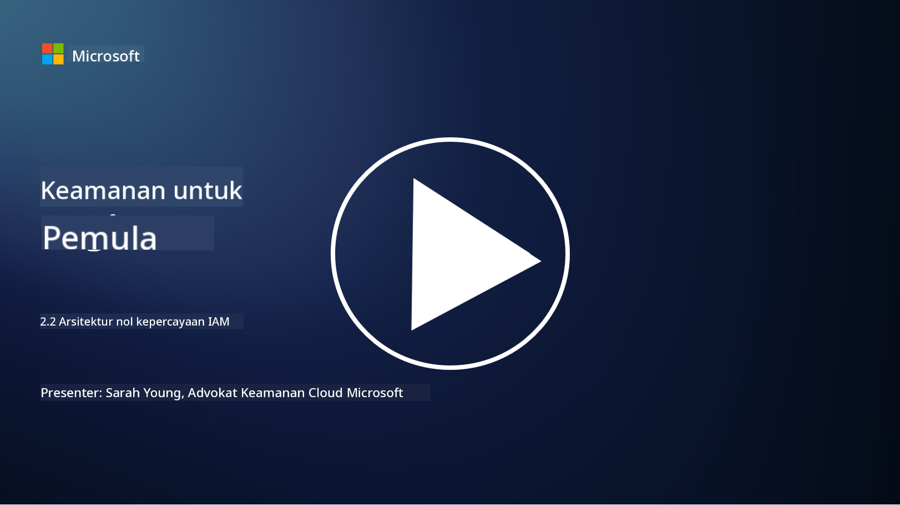

<!--
CO_OP_TRANSLATOR_METADATA:
{
  "original_hash": "4774a978af123f72ebb872199c4c4d4f",
  "translation_date": "2025-09-03T20:28:04+00:00",
  "source_file": "2.2 IAM zero trust architecture.md",
  "language_code": "id"
}
-->
# Arsitektur Zero Trust IAM

Identitas adalah bagian penting dalam menerapkan arsitektur zero trust dan membangun perimeter untuk lingkungan TI apa pun. Dalam bagian ini, kita akan membahas mengapa penting menggunakan kontrol identitas untuk menerapkan zero trust.

## Pendahuluan

Dalam pelajaran ini, kita akan membahas:

 - Mengapa kita perlu menggunakan identitas sebagai perimeter dalam lingkungan TI modern?
   
 - Bagaimana ini berbeda dari arsitektur TI tradisional?

 - Bagaimana identitas digunakan untuk menerapkan arsitektur zero trust?

## Mengapa kita perlu menggunakan identitas sebagai perimeter dalam lingkungan TI modern?

Dalam lingkungan TI modern, konsep tradisional tentang perimeter fisik (menggunakan alat seperti firewall dan batas jaringan) sebagai garis pertahanan utama terhadap ancaman siber menjadi kurang efektif karena meningkatnya kompleksitas teknologi, munculnya kerja jarak jauh, dan adopsi layanan cloud. Sebagai gantinya, organisasi beralih menggunakan identitas sebagai perimeter baru. Ini berarti keamanan berpusat pada verifikasi dan pengelolaan identitas pengguna, perangkat, dan aplikasi yang mencoba mengakses sumber daya, tanpa memandang lokasi fisik mereka.

Berikut alasan mengapa menggunakan identitas sebagai perimeter sangat penting dalam lingkungan TI modern:

**Tenaga Kerja Jarak Jauh**: Dengan kerja jarak jauh dan perangkat seluler menjadi hal yang umum, pengguna dapat mengakses sumber daya dari berbagai lokasi dan perangkat. Pendekatan perimeter tradisional tidak efektif ketika pengguna tidak lagi terbatas pada kantor fisik.

**Lingkungan Cloud dan Hybrid**: Organisasi semakin banyak mengadopsi layanan cloud dan lingkungan hybrid. Data dan aplikasi tidak lagi hanya berada di dalam lokasi organisasi, membuat pertahanan perimeter tradisional kurang relevan.

**Keamanan Zero Trust**: Konsep keamanan zero trust mengasumsikan bahwa tidak ada entitas, baik di dalam maupun di luar jaringan, yang harus dipercaya secara otomatis. Identitas menjadi dasar untuk memverifikasi permintaan akses, tanpa memandang asalnya.

**Lanskap Ancaman**: Ancaman siber terus berkembang, dan penyerang menemukan cara untuk melewati pertahanan perimeter tradisional. Phishing, rekayasa sosial, dan ancaman dari dalam sering kali mengeksploitasi kelemahan manusia daripada mencoba menembus perimeter jaringan.

**Pendekatan Berbasis Data**: Melindungi data sensitif adalah hal yang utama. Dengan berfokus pada identitas, organisasi dapat mengontrol siapa yang mengakses data tertentu, sehingga mengurangi risiko pelanggaran data.

## Bagaimana ini berbeda dari arsitektur TI tradisional?

Arsitektur TI tradisional sangat bergantung pada model keamanan berbasis perimeter, di mana firewall dan batas jaringan memainkan peran penting dalam menjaga ancaman tetap di luar. Perbedaan utama antara pendekatan tradisional dan pendekatan berbasis identitas adalah:

|      Aspek                  |      Arsitektur TI Tradisional                                                                    |      Pendekatan Berbasis Identitas                                                                         |
|-----------------------------|----------------------------------------------------------------------------------------------------|------------------------------------------------------------------------------------------------------------|
|     Fokus                   |     Fokus Perimeter: Mengandalkan pertahanan perimeter seperti firewall dan kontrol akses.        |     Fokus pada Verifikasi Identitas: Beralih dari batas jaringan ke verifikasi identitas pengguna/perangkat.|
|     Lokasi                  |     Ketergantungan Lokasi: Keamanan terkait dengan lokasi kantor fisik dan batas jaringan.         |     Kemandirian Lokasi: Keamanan tidak terkait dengan lokasi tertentu; akses dari mana saja.               |
|     Asumsi Kepercayaan      |     Kepercayaan yang Diasumsikan: Mengasumsikan kepercayaan dalam perimeter jaringan untuk pengguna/perangkat. |     Pendekatan Zero Trust: Kepercayaan tidak pernah diasumsikan; akses diverifikasi berdasarkan identitas dan konteks. |
|     Pertimbangan Perangkat  |     Keanekaragaman Perangkat: Mengasumsikan perangkat dalam perimeter jaringan aman.              |     Kesadaran Perangkat: Mempertimbangkan kesehatan dan postur keamanan perangkat, tanpa memandang lokasi. |
|     Perlindungan Data       |     Perlindungan Data: Berfokus pada mengamankan perimeter jaringan untuk perlindungan data.      |     Perlindungan Berbasis Data: Berfokus pada mengontrol akses data berdasarkan identitas dan sensitivitas data. |

## Bagaimana identitas digunakan untuk menerapkan arsitektur zero trust?

Dalam arsitektur zero trust, prinsip fundamentalnya adalah untuk tidak pernah secara otomatis mempercayai entitas apa pun, baik di dalam maupun di luar perimeter jaringan. Identitas memainkan peran sentral dalam menerapkan pendekatan zero trust dengan memungkinkan verifikasi berkelanjutan terhadap entitas yang mencoba mengakses sumber daya. Kontrol keamanan identitas modern memungkinkan setiap pengguna, perangkat, aplikasi, dan layanan yang ingin mengakses sumber daya harus diidentifikasi dan diautentikasi secara menyeluruh sebelum akses diberikan. Ini melibatkan verifikasi identitas digital mereka melalui metode seperti kombinasi nama pengguna/kata sandi, autentikasi multi-faktor (MFA), biometrik, dan mekanisme autentikasi kuat lainnya.

## Bacaan lebih lanjut

- [Securing identity with Zero Trust | Microsoft Learn](https://learn.microsoft.com/security/zero-trust/deploy/identity?WT.mc_id=academic-96948-sayoung)
- [Zero Trust Principles and Guidance for Identity and Access | CSA (cloudsecurityalliance.org)](https://cloudsecurityalliance.org/artifacts/zero-trust-principles-and-guidance-for-iam/)
- [Zero Trust Identity Controls - Essentials Series - Episode 2 - YouTube](https://www.youtube.com/watch?v=fQZQznIKcGM&list=PLXtHYVsvn_b_gtX1-NB62wNervQx1Fhp4&index=13)

---

**Penafian**:  
Dokumen ini telah diterjemahkan menggunakan layanan penerjemahan AI [Co-op Translator](https://github.com/Azure/co-op-translator). Meskipun kami berusaha untuk memberikan hasil yang akurat, harap diperhatikan bahwa terjemahan otomatis mungkin mengandung kesalahan atau ketidakakuratan. Dokumen asli dalam bahasa aslinya harus dianggap sebagai sumber yang otoritatif. Untuk informasi yang bersifat kritis, disarankan menggunakan jasa penerjemahan profesional oleh manusia. Kami tidak bertanggung jawab atas kesalahpahaman atau penafsiran yang keliru yang timbul dari penggunaan terjemahan ini.