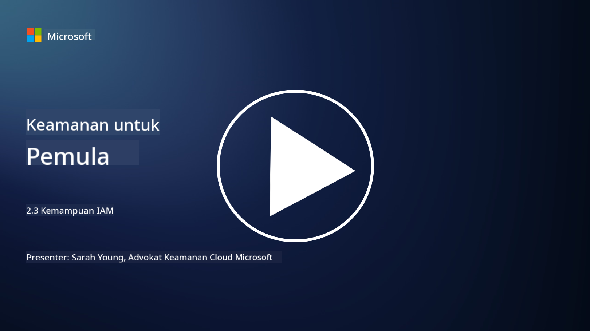

<!--
CO_OP_TRANSLATOR_METADATA:
{
  "original_hash": "bf0b8a54f2c69951744df5a94bc923f7",
  "translation_date": "2025-09-03T22:11:56+00:00",
  "source_file": "2.3 IAM capabilities.md",
  "language_code": "id"
}
-->
# Kemampuan IAM

Di bagian ini, kita akan membahas lebih lanjut tentang alat dan kemampuan inti yang digunakan dalam keamanan identitas.

## Pengantar

Dalam pelajaran ini, kita akan membahas:

 - Apa itu layanan direktori?
      
     
    
 - Kemampuan apa saja yang dapat digunakan untuk mengamankan identitas?
>
>        Multi-Factor Authentication (MFA)
> 
>        Single Sign-On (SSO)
> 
>        Role-Based Access Control (RBAC)
> 
>        Adaptive Authentication
> 
>        Biometric Authentication
> 
>        Privileged Access Management (PAM)
> 
>        Identity Governance and Administration (IGA)
> 
>        Behavioral Analytics

## Apa itu layanan direktori?

Layanan direktori adalah basis data khusus yang menyimpan dan mengelola informasi tentang sumber daya jaringan, termasuk pengguna, grup, perangkat, aplikasi, dan objek lainnya. Layanan ini berfungsi sebagai repositori terpusat untuk data terkait identitas dan akses, memungkinkan organisasi untuk mengelola dan mengontrol autentikasi pengguna, otorisasi, dan tugas-tugas keamanan lainnya secara efisien.

Layanan direktori memainkan peran penting dalam lingkungan TI modern dengan menyediakan dasar untuk solusi manajemen identitas dan akses (IAM). Layanan ini memfasilitasi akses aman ke sumber daya, menerapkan kebijakan akses, dan menyederhanakan tugas administratif. Salah satu layanan direktori yang paling dikenal adalah Microsoft Active Directory, tetapi ada solusi lain seperti direktori LDAP (Lightweight Directory Access Protocol) yang memiliki tujuan serupa.

Fungsi dan fitur utama layanan direktori dalam konteks keamanan siber meliputi:

 - **Autentikasi Pengguna**: Layanan direktori memvalidasi kredensial pengguna (seperti nama pengguna dan kata sandi) untuk memastikan bahwa hanya pengguna yang berwenang yang dapat mengakses jaringan dan sumber dayanya.
 - **Otorisasi Pengguna**: Layanan ini menentukan tingkat akses yang dimiliki setiap pengguna berdasarkan peran, keanggotaan grup, dan atribut lainnya. Hal ini memastikan bahwa pengguna hanya dapat mengakses sumber daya yang mereka berhak.
 - **Manajemen Grup**: Layanan direktori memungkinkan administrator untuk mengorganisasi pengguna ke dalam grup logis, menyederhanakan manajemen kontrol akses. Izin dapat diberikan kepada grup daripada pengguna individu.
 - **Kebijakan Kata Sandi**: Layanan ini menerapkan aturan kompleksitas dan kedaluwarsa kata sandi, meningkatkan keamanan akun pengguna.
 - **Single Sign-On (SSO)**: Beberapa layanan direktori mendukung SSO, memungkinkan pengguna untuk mengakses beberapa aplikasi dan layanan dengan satu set kredensial.
 - **Manajemen Pengguna Terpusat**: Layanan direktori memusatkan informasi pengguna, membuatnya lebih mudah untuk mengelola akun pengguna, profil, dan atribut dari satu lokasi.
 - **Audit dan Logging**: Layanan ini dapat merekam aktivitas autentikasi dan akses pengguna, membantu dalam audit keamanan dan upaya kepatuhan.

## Kemampuan apa saja yang dapat digunakan untuk mengamankan identitas?

**Multi-Factor Authentication (MFA)**

MFA mengharuskan pengguna untuk memberikan beberapa bentuk verifikasi sebelum diberikan akses. Ini biasanya mencakup sesuatu yang diketahui pengguna (kata sandi), sesuatu yang dimiliki pengguna (smartphone atau token keamanan), dan sesuatu yang merupakan bagian dari pengguna (data biometrik seperti sidik jari atau pengenalan wajah).

**Single Sign-On (SSO)**

SSO memungkinkan pengguna untuk mengakses beberapa aplikasi dan sistem dengan satu set kredensial. Ini meningkatkan pengalaman pengguna dan mengurangi risiko yang terkait dengan pengelolaan banyak kata sandi.

**Role-Based Access Control (RBAC)**

RBAC memberikan izin berdasarkan peran yang telah ditentukan sebelumnya. Pengguna diberikan akses berdasarkan peran mereka dalam organisasi.

**Adaptive Authentication**

Adaptive authentication menilai faktor risiko seperti lokasi, perangkat, waktu akses, dan perilaku pengguna untuk secara dinamis menyesuaikan tingkat autentikasi yang diperlukan. Jika permintaan tampak mencurigakan, langkah autentikasi tambahan dapat dipicu.

**Biometric Authentication**

Biometric authentication menggunakan karakteristik biologis unik seperti sidik jari, fitur wajah, pola suara, dan bahkan sifat perilaku seperti kecepatan mengetik untuk verifikasi identitas.

**Privileged Access Management (PAM)**

PAM berfokus pada pengamanan akses ke sistem dan data penting dengan menerapkan kontrol ketat pada akun-akun yang memiliki hak istimewa. Ini mencakup fitur seperti akses just-in-time dan pemantauan sesi.

**Identity Governance and Administration (IGA)**

Solusi IGA mengelola identitas pengguna dan akses mereka ke sumber daya sepanjang siklus hidupnya. Ini mencakup onboarding, provisioning, kontrol akses berbasis peran, dan deprovisioning.

**Behavioral Analytics**

Behavioral analytics memantau perilaku pengguna dan menetapkan pola dasar. Penyimpangan dari norma dapat memicu peringatan untuk investigasi lebih lanjut.

# Bacaan lebih lanjut
- [Dokumentasi dasar Azure Active Directory - Microsoft Entra | Microsoft Learn](https://learn.microsoft.com/azure/active-directory/fundamentals/?WT.mc_id=academic-96948-sayoung)
- [Apa itu Azure Active Directory? - Microsoft Entra | Microsoft Learn](https://learn.microsoft.com/azure/active-directory/fundamentals/whatis?WT.mc_id=academic-96948-sayoung)
- [Kelola infrastruktur identitas multi-cloud Anda dengan Microsoft Entra - YouTube](https://www.youtube.com/watch?v=9qQiq3wTS2Y&list=PLXtHYVsvn_b_gtX1-NB62wNervQx1Fhp4&index=18)

---

**Penafian**:  
Dokumen ini telah diterjemahkan menggunakan layanan penerjemahan AI [Co-op Translator](https://github.com/Azure/co-op-translator). Meskipun kami berusaha untuk memberikan hasil yang akurat, harap diingat bahwa terjemahan otomatis mungkin mengandung kesalahan atau ketidakakuratan. Dokumen asli dalam bahasa aslinya harus dianggap sebagai sumber yang otoritatif. Untuk informasi yang bersifat kritis, disarankan menggunakan jasa penerjemahan profesional oleh manusia. Kami tidak bertanggung jawab atas kesalahpahaman atau penafsiran yang keliru yang timbul dari penggunaan terjemahan ini.