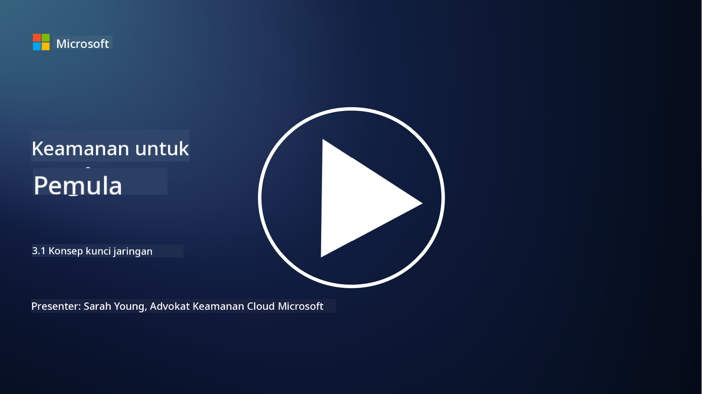
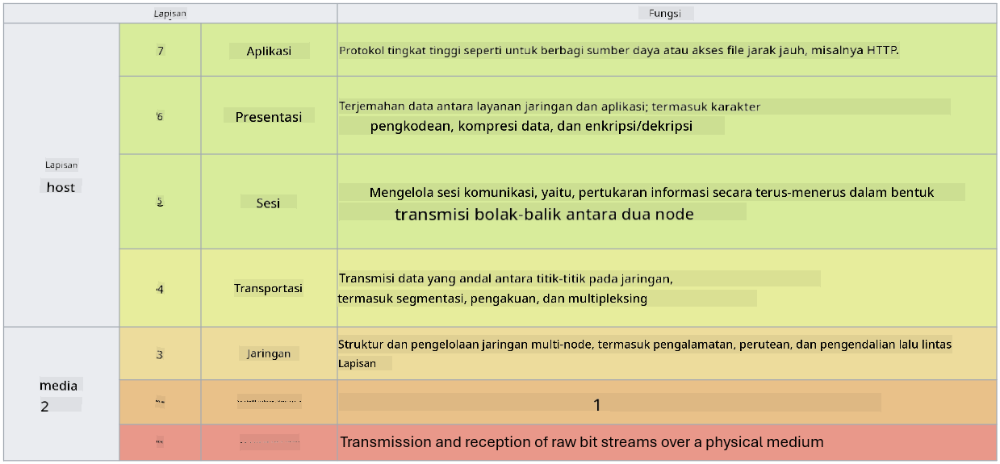

<!--
CO_OP_TRANSLATOR_METADATA:
{
  "original_hash": "252724eceeb183fb9018f88c5e1a3f0c",
  "translation_date": "2025-09-03T22:06:27+00:00",
  "source_file": "3.1 Networking key concepts.md",
  "language_code": "id"
}
-->
# Konsep Utama Jaringan

Jika Anda pernah bekerja di bidang IT, kemungkinan besar Anda sudah mengenal konsep jaringan. Meskipun identitas digunakan sebagai kontrol perimeter utama dalam lingkungan modern, ini tidak berarti bahwa kontrol jaringan menjadi tidak relevan. Meskipun topik ini sangat luas, dalam pelajaran ini kita akan membahas beberapa konsep utama jaringan.

Dalam pelajaran ini, kita akan membahas:

- Apa itu pengalamatan IP?

- Apa itu model OSI?

- Apa itu TCP/UDP?

- Apa itu nomor port?

- Apa itu enkripsi saat data disimpan dan saat data dikirim?

## Apa itu pengalamatan IP?

Pengalamatan IP, atau Internet Protocol addressing, adalah label numerik yang diberikan kepada setiap perangkat yang terhubung ke jaringan komputer yang menggunakan Internet Protocol untuk komunikasi. Pengalamatan ini berfungsi sebagai pengidentifikasi unik untuk perangkat dalam jaringan, memungkinkan mereka untuk mengirim dan menerima data melalui internet atau jaringan yang saling terhubung. Ada dua versi utama pengalamatan IP: IPv4 (Internet Protocol versi 4) dan IPv6 (Internet Protocol versi 6). Alamat IP biasanya direpresentasikan dalam format IPv4 (misalnya, 192.168.1.1) atau format IPv6 (misalnya, 2001:0db8:85a3:0000:0000:8a2e:0370:7334).

## Apa itu model OSI?

Model OSI (Open Systems Interconnection) adalah kerangka konseptual yang menstandarkan fungsi sistem komunikasi ke dalam tujuh lapisan yang berbeda. Setiap lapisan melakukan tugas tertentu dan berkomunikasi dengan lapisan yang berdekatan untuk memastikan komunikasi data yang efisien dan andal antara perangkat dalam jaringan. Lapisan-lapisan tersebut, dari bawah ke atas, adalah sebagai berikut:

1. Lapisan Fisik

2. Lapisan Data Link

3. Lapisan Jaringan

4. Lapisan Transport

5. Lapisan Sesi

6. Lapisan Presentasi

7. Lapisan Aplikasi

Model OSI menyediakan referensi umum untuk memahami bagaimana protokol dan teknologi jaringan berinteraksi, terlepas dari implementasi perangkat keras atau perangkat lunak tertentu.

_ref: https://en.wikipedia.org/wiki/OSI_model_

## Apa itu TCP/UDP?

TCP (Transmission Control Protocol) dan UDP (User Datagram Protocol) adalah dua protokol lapisan transport yang mendasar yang digunakan dalam jaringan komputer untuk memfasilitasi komunikasi antara perangkat melalui internet atau dalam jaringan lokal. Mereka bertanggung jawab untuk memecah data menjadi paket-paket untuk dikirim dan kemudian menyusun kembali paket-paket tersebut menjadi data asli di sisi penerima. Namun, keduanya memiliki karakteristik dan kasus penggunaan yang berbeda.

**TCP (Transmission Control Protocol)**:

TCP adalah protokol yang berorientasi pada koneksi dan menyediakan pengiriman data yang andal dan terurut antara perangkat. TCP membangun koneksi antara pengirim dan penerima sebelum pertukaran data dimulai. TCP memastikan bahwa paket data tiba dalam urutan yang benar dan dapat menangani pengiriman ulang paket yang hilang untuk menjamin integritas dan kelengkapan data. Hal ini membuat TCP cocok untuk aplikasi yang membutuhkan pengiriman data yang andal, seperti penjelajahan web, email, transfer file (FTP), dan komunikasi basis data.

**UDP (User Datagram Protocol)**:

UDP adalah protokol tanpa koneksi yang menawarkan pengiriman data yang lebih cepat tetapi tidak memberikan tingkat keandalan yang sama seperti TCP. UDP tidak membangun koneksi formal sebelum mengirim data dan tidak memiliki mekanisme untuk mengakui atau mengirim ulang paket yang hilang. UDP cocok untuk aplikasi di mana kecepatan dan efisiensi lebih penting daripada pengiriman yang dijamin, seperti komunikasi real-time, streaming media, permainan online, dan kueri DNS.

Secara ringkas, TCP memprioritaskan keandalan dan pengiriman terurut, membuatnya cocok untuk aplikasi yang membutuhkan akurasi data, sementara UDP menekankan kecepatan dan efisiensi, membuatnya sesuai untuk aplikasi di mana kehilangan data kecil atau pengaturan ulang urutan dapat diterima demi mengurangi latensi. Pemilihan antara TCP dan UDP tergantung pada kebutuhan spesifik dari aplikasi atau layanan yang digunakan.

## Apa itu nomor port?

Dalam jaringan, nomor port adalah pengidentifikasi numerik yang digunakan untuk membedakan antara layanan atau aplikasi yang berbeda yang berjalan pada satu perangkat dalam jaringan. Port membantu mengarahkan data yang masuk ke aplikasi yang sesuai. Nomor port adalah bilangan bulat 16-bit yang tidak bertanda, yang berarti mereka memiliki rentang dari 0 hingga 65535. Port dibagi menjadi tiga rentang:

- Port Terkenal (0-1023): Dicadangkan untuk layanan standar seperti HTTP (port 80) dan FTP (port 21).

- Port Terdaftar (1024-49151): Digunakan untuk aplikasi dan layanan yang tidak termasuk dalam rentang terkenal tetapi telah terdaftar secara resmi.

- Port Dinamis/Pribadi (49152-65535): Tersedia untuk penggunaan sementara atau pribadi oleh aplikasi.

## Apa itu enkripsi saat data disimpan dan saat data dikirim?

Enkripsi adalah proses mengubah data ke dalam format yang aman untuk melindunginya dari akses atau manipulasi yang tidak sah. Enkripsi dapat diterapkan pada data baik "saat disimpan" (ketika disimpan di perangkat atau server) maupun "saat dikirim" (ketika sedang ditransmisikan antar perangkat atau melalui jaringan).

Enkripsi Saat Disimpan: Ini melibatkan enkripsi data yang disimpan di perangkat, server, atau sistem penyimpanan. Bahkan jika penyerang mendapatkan akses fisik ke media penyimpanan, mereka tidak dapat mengakses data tanpa kunci enkripsi. Hal ini penting untuk melindungi data sensitif dalam kasus pencurian perangkat, pelanggaran data, atau akses yang tidak sah.

Enkripsi Saat Dikirim: Ini melibatkan enkripsi data saat data bergerak antar perangkat atau melalui jaringan. Ini mencegah penyadapan dan intersepsi data yang tidak sah selama transmisi. Protokol umum untuk enkripsi saat dikirim termasuk HTTPS untuk komunikasi web dan TLS/SSL untuk mengamankan berbagai jenis lalu lintas jaringan.

## Bacaan lebih lanjut
- [How Do IP Addresses Work? (howtogeek.com)](https://www.howtogeek.com/341307/how-do-ip-addresses-work/)
- [Understanding IP Address: An Introductory Guide (geekflare.com)](https://geekflare.com/understanding-ip-address/)
- [What is the OSI model? The 7 layers of OSI explained (techtarget.com)](https://www.techtarget.com/searchnetworking/definition/OSI)
- [The OSI Model – The 7 Layers of Networking Explained in Plain English (freecodecamp.org)](https://www.freecodecamp.org/news/osi-model-networking-layers-explained-in-plain-english/)
- [TCP/IP protocols - IBM Documentation](https://www.ibm.com/docs/en/aix/7.3?topic=protocol-tcpip-protocols)
- [Common Ports Cheat Sheet: The Ultimate Ports & Protocols List (stationx.net)](https://www.stationx.net/common-ports-cheat-sheet/)
- [Azure Data Encryption-at-Rest - Azure Security | Microsoft Learn](https://learn.microsoft.com/azure/security/fundamentals/encryption-atrest?WT.mc_id=academic-96948-sayoung)

---

**Penafian**:  
Dokumen ini telah diterjemahkan menggunakan layanan penerjemahan AI [Co-op Translator](https://github.com/Azure/co-op-translator). Meskipun kami berupaya untuk memberikan hasil yang akurat, harap diketahui bahwa terjemahan otomatis mungkin mengandung kesalahan atau ketidakakuratan. Dokumen asli dalam bahasa aslinya harus dianggap sebagai sumber yang otoritatif. Untuk informasi yang bersifat kritis, disarankan menggunakan jasa penerjemahan profesional oleh manusia. Kami tidak bertanggung jawab atas kesalahpahaman atau penafsiran yang keliru yang timbul dari penggunaan terjemahan ini.