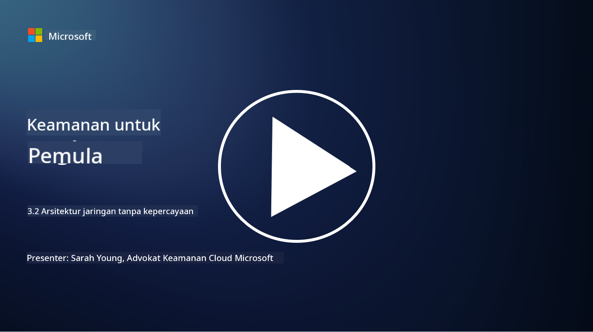

<!--
CO_OP_TRANSLATOR_METADATA:
{
  "original_hash": "680d6e14d9d33fc471c22f44679713f8",
  "translation_date": "2025-09-03T21:16:06+00:00",
  "source_file": "3.2 Networking zero trust architecture.md",
  "language_code": "id"
}
-->
# Arsitektur Zero Trust pada Jaringan

Jaringan menyediakan lapisan penting dalam kontrol zero trust. Dalam pelajaran ini, kita akan mempelajari lebih lanjut tentang:

- Apa itu segmentasi jaringan?  
- Bagaimana segmentasi jaringan membantu menerapkan zero trust?  
- Apa itu enkripsi end-to-end?

## Apa itu segmentasi jaringan?

Segmentasi jaringan adalah praktik membagi jaringan menjadi segmen-segmen kecil yang terisolasi atau sub-jaringan. Setiap segmen terpisah dari yang lain, dan akses antar segmen dikontrol serta dibatasi berdasarkan kebijakan keamanan tertentu. Segmentasi jaringan digunakan untuk meningkatkan keamanan dengan membatasi dampak pelanggaran potensial dan mengurangi pergerakan lateral bagi penyerang di dalam jaringan.

Dengan menerapkan segmentasi jaringan, organisasi dapat menciptakan "zona" yang memisahkan berbagai jenis pengguna, aplikasi, dan data. Hal ini mengurangi permukaan serangan dan meminimalkan potensi kerusakan akibat insiden keamanan. Segmentasi jaringan dapat dicapai melalui teknologi seperti virtual LANs (VLANs), firewall, dan kontrol akses.

## Bagaimana segmentasi jaringan membantu menerapkan zero trust?

Segmentasi jaringan sangat selaras dengan prinsip-prinsip model Zero Trust. Dalam arsitektur Zero Trust, segmentasi jaringan membantu menerapkan prinsip "least privilege" dengan memastikan bahwa pengguna dan perangkat hanya memiliki akses ke sumber daya dan layanan tertentu yang mereka butuhkan untuk menjalankan tugas mereka. Dengan membagi jaringan menjadi zona-zona kecil, organisasi dapat menerapkan kontrol akses yang ketat, mengisolasi aset penting, dan mencegah pergerakan lateral penyerang.

Segmentasi jaringan juga membantu dalam menerapkan kontrol akses berbasis identitas, di mana pengguna dan perangkat diautentikasi dan diotorisasi secara menyeluruh sebelum mengakses segmen tertentu. Hal ini mencegah akses tidak sah ke sumber daya sensitif dan mengurangi dampak potensial dari kredensial yang dikompromikan.

## Apa itu enkripsi end-to-end?

Enkripsi end-to-end (E2E) adalah langkah keamanan yang memastikan bahwa data tetap terenkripsi sepanjang perjalanan dari pengirim ke penerima. Dalam proses ini, data dienkripsi di sisi pengirim, dan hanya penerima yang memiliki kunci dekripsi untuk membuka dan membaca data tersebut. Proses enkripsi dan dekripsi terjadi di titik akhir, sehingga sangat sulit bagi pihak yang tidak berwenang, termasuk penyedia layanan dan perantara, untuk mengakses data dalam bentuk teks biasa.

Enkripsi E2E memberikan tingkat kerahasiaan dan keamanan yang tinggi untuk transmisi data, bahkan jika data melewati berbagai sistem atau jaringan perantara. Metode ini sering digunakan dalam aplikasi pesan aman, layanan email, dan platform komunikasi lainnya untuk melindungi informasi sensitif dari penyadapan dan akses tidak sah.

Metode enkripsi ini memastikan bahwa meskipun penyerang berhasil mendapatkan akses ke data yang sedang ditransmisikan, mereka hanya akan melihat konten yang terenkripsi yang tidak memiliki arti tanpa kunci dekripsi. Enkripsi end-to-end memainkan peran penting dalam melindungi privasi pengguna dan menjaga informasi sensitif agar tidak terpapar kepada pihak yang tidak berwenang.

## Apa itu SASE?

SASE adalah singkatan dari "Secure Access Service Edge," yaitu kerangka kerja dan arsitektur keamanan siber yang menggabungkan keamanan jaringan dan kemampuan wide-area networking (WAN) ke dalam satu layanan berbasis cloud. SASE dirancang untuk menyediakan akses yang aman dan skalabel ke sumber daya jaringan, aplikasi, dan data bagi pengguna jarak jauh dan mobile, sambil menyederhanakan manajemen jaringan dan mengurangi kompleksitas arsitektur jaringan dan keamanan tradisional.

Karakteristik dan komponen utama SASE meliputi:

1. **Berbasis Cloud:** SASE disediakan sebagai layanan cloud, yang berarti fungsi keamanan dan jaringan diberikan dari cloud, bukan mengandalkan perangkat keras dan alat tradisional di lokasi.
   
2. **Integrasi Keamanan dan Jaringan:** SASE mengintegrasikan berbagai layanan keamanan seperti secure web gateways (SWG), firewall as a service (FWaaS), data loss prevention (DLP), zero-trust network access (ZTNA), dan optimisasi WAN dengan kemampuan wide-area networking. Integrasi ini membantu menyederhanakan operasi keamanan dan jaringan.
   
3. **Zero Trust:** SASE beroperasi berdasarkan prinsip zero trust, yang berarti menerapkan kontrol akses yang ketat dan kebijakan akses least-privilege. Pengguna dan perangkat tidak dipercaya secara default, dan mereka harus diautentikasi serta diotorisasi sebelum mengakses sumber daya.
   
4. **Berbasis Identitas:** SASE berfokus pada identitas pengguna dan perangkat sebagai dasar untuk kontrol akses. Kebijakan berbasis identitas dan konteks digunakan untuk menentukan izin akses, dan kebijakan ini beradaptasi secara dinamis berdasarkan perilaku pengguna dan konteks.
   
5. **Skalabilitas dan Fleksibilitas:** SASE dapat dengan mudah diskalakan untuk mengakomodasi sejumlah besar pengguna dan perangkat, membuatnya cocok untuk organisasi dengan kebutuhan jaringan dan keamanan yang beragam dan terus berkembang.

SASE sangat relevan di era modern kerja jarak jauh dan adopsi cloud, karena menyediakan pendekatan yang komprehensif dan fleksibel untuk mengamankan serta mengelola akses jaringan. SASE membantu organisasi beradaptasi dengan kebutuhan keamanan dan jaringan yang berubah sambil tetap fokus pada model keamanan berbasis pengguna dan zero trust.

## Bacaan lebih lanjut

- [Apa Itu Segmentasi Jaringan? - Cisco](https://www.cisco.com/c/en/us/products/security/what-is-network-segmentation.html#~benefits)  
- [Apa Itu Mikro-Segmentasi? - Cisco](https://www.cisco.com/c/en/us/products/security/what-is-microsegmentation.html)  
- [Menerapkan Segmentasi dan Pemisahan Jaringan | Cyber.gov.au](https://www.cyber.gov.au/resources-business-and-government/maintaining-devices-and-systems/system-hardening-and-administration/network-hardening/implementing-network-segmentation-and-segregation)  
- [Apa Itu Segmentasi Jaringan dan Mengapa Penting | CompTIA](https://www.comptia.org/blog/security-awareness-training-network-segmentation)  
- [Segmentasi Jaringan: Konsep dan Praktik (cmu.edu)](https://insights.sei.cmu.edu/blog/network-segmentation-concepts-and-practices/)  
- [Mengamankan Jaringan dengan Zero Trust | Microsoft Learn](https://learn.microsoft.com/security/zero-trust/deploy/networks?WT.mc_id=academic-96948-sayoung)  
- [Apa itu enkripsi end-to-end? | IBM](https://www.ibm.com/topics/end-to-end-encryption)  
- [Apa Itu Enkripsi End-to-End, dan Mengapa Penting? (howtogeek.com)](https://www.howtogeek.com/711656/what-is-end-to-end-encryption-and-why-does-it-matter/)  
- [Definisi Secure Access Service Edge (SASE) - Gartner Information Technology Glossary](https://www.gartner.com/en/information-technology/glossary/secure-access-service-edge-sase)  
- [Apa Itu Secure Access Service Edge (SASE)? | Microsoft Security](https://www.microsoft.com/security/business/security-101/what-is-sase?WT.mc_id=academic-96948-sayoung)  

---

**Penafian**:  
Dokumen ini telah diterjemahkan menggunakan layanan penerjemahan AI [Co-op Translator](https://github.com/Azure/co-op-translator). Meskipun kami berusaha untuk memberikan hasil yang akurat, harap diketahui bahwa terjemahan otomatis mungkin mengandung kesalahan atau ketidakakuratan. Dokumen asli dalam bahasa aslinya harus dianggap sebagai sumber yang otoritatif. Untuk informasi yang bersifat kritis, disarankan menggunakan jasa penerjemahan profesional oleh manusia. Kami tidak bertanggung jawab atas kesalahpahaman atau penafsiran yang keliru yang timbul dari penggunaan terjemahan ini.