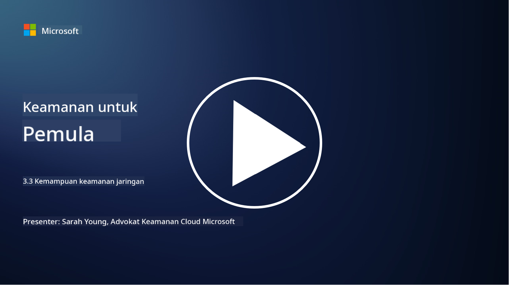

<!--
CO_OP_TRANSLATOR_METADATA:
{
  "original_hash": "c3aba077bb98eebc925dd58d870229ab",
  "translation_date": "2025-09-03T20:21:47+00:00",
  "source_file": "3.3 Network security capabilities.md",
  "language_code": "id"
}
-->
# Kemampuan Keamanan Jaringan

Dalam pelajaran ini, kita akan mempelajari kemampuan berikut yang dapat digunakan untuk mengamankan jaringan:

 - Firewall tradisional
 - Firewall aplikasi web
 - Grup keamanan cloud
 - CDN
 - Load balancer
 - Bastion host
 - VPN
 - Perlindungan DDoS

## Firewall Tradisional

Firewall tradisional adalah perangkat keamanan yang mengontrol dan memantau lalu lintas jaringan masuk dan keluar berdasarkan aturan keamanan yang telah ditentukan sebelumnya. Mereka berfungsi sebagai penghalang antara jaringan internal yang terpercaya dan jaringan eksternal yang tidak terpercaya, menyaring lalu lintas untuk mencegah akses yang tidak sah dan potensi ancaman.

## Firewall Aplikasi Web

Firewall Aplikasi Web (WAF) adalah firewall khusus yang dirancang untuk melindungi aplikasi web dari berbagai serangan, seperti injeksi SQL, cross-site scripting, dan kerentanan lainnya. Mereka menganalisis permintaan dan respons HTTP untuk mengidentifikasi dan memblokir lalu lintas berbahaya yang menargetkan aplikasi web.

## Grup Keamanan Cloud

Grup keamanan adalah fitur keamanan jaringan dasar yang disediakan oleh penyedia layanan cloud. Mereka berfungsi sebagai firewall virtual yang mengontrol lalu lintas masuk dan keluar ke dan dari sumber daya cloud, seperti mesin virtual (VM) dan instance. Grup keamanan memungkinkan organisasi untuk menentukan aturan yang menentukan jenis lalu lintas yang diizinkan dan ditolak, menambahkan lapisan pertahanan tambahan pada penerapan cloud.

## Content Delivery Network (CDN)

Content Delivery Network adalah jaringan server yang tersebar di berbagai lokasi geografis. CDN membantu meningkatkan kinerja dan ketersediaan situs web dengan menyimpan konten dan menyajikannya dari server yang lebih dekat dengan pengguna. Mereka juga memberikan tingkat perlindungan terhadap serangan DDoS dengan mendistribusikan lalu lintas ke beberapa lokasi server.

## Load Balancer

Load balancer mendistribusikan lalu lintas jaringan masuk ke beberapa server untuk mengoptimalkan pemanfaatan sumber daya, memastikan ketersediaan tinggi, dan meningkatkan kinerja aplikasi. Mereka membantu mencegah kelebihan beban server dan menjaga waktu respons yang efisien, meningkatkan ketahanan jaringan.

## Bastion Host

Bastion host adalah server yang sangat aman dan terisolasi yang menyediakan akses terkendali ke jaringan dari jaringan eksternal yang tidak terpercaya (seperti internet). Mereka berfungsi sebagai titik masuk bagi administrator untuk mengakses sistem internal dengan aman. Bastion host biasanya dikonfigurasi dengan langkah-langkah keamanan yang kuat untuk meminimalkan permukaan serangan.

## Virtual Private Network (VPN)

VPN menciptakan terowongan terenkripsi antara perangkat pengguna dan server jarak jauh, memastikan komunikasi yang aman dan pribadi melalui jaringan yang berpotensi tidak aman seperti internet. VPN biasanya digunakan untuk memberikan akses jarak jauh ke jaringan internal, memungkinkan pengguna mengakses sumber daya seolah-olah mereka berada di jaringan yang sama secara fisik.

## Alat Perlindungan DDoS

Alat dan layanan perlindungan DDoS (Distributed Denial of Service) dirancang untuk mengurangi dampak serangan DDoS, di mana beberapa perangkat yang dikompromikan membanjiri jaringan atau layanan untuk membuatnya kewalahan. Solusi perlindungan DDoS mengidentifikasi dan menyaring lalu lintas berbahaya, memastikan bahwa lalu lintas yang sah tetap dapat mencapai tujuan yang diinginkan.

## Bacaan Lebih Lanjut

- [Apa Itu Firewall? - Cisco](https://www.cisco.com/c/en/us/products/security/firewalls/what-is-a-firewall.html#~types-of-firewalls)
- [Apa yang Sebenarnya Dilakukan Firewall? (howtogeek.com)](https://www.howtogeek.com/144269/htg-explains-what-firewalls-actually-do/)
- [Apa Itu Firewall? Cara Kerja Firewall & Jenis Firewall (kaspersky.com)](https://www.kaspersky.com/resource-center/definitions/firewall)
- [Grup keamanan jaringan - cara kerjanya | Microsoft Learn](https://learn.microsoft.com/azure/virtual-network/network-security-group-how-it-works)
- [Pengantar Azure Content Delivery Network (CDN) - Pelatihan | Microsoft Learn](https://learn.microsoft.com/training/modules/intro-to-azure-content-delivery-network/?WT.mc_id=academic-96948-sayoung)
- [Apa itu Content Delivery Network (CDN)? - Azure | Microsoft Learn](https://learn.microsoft.com/azure/cdn/cdn-overview?WT.mc_id=academic-96948-sayoung)
- [Apa Itu Load Balancing? Cara Kerja Load Balancer (nginx.com)](https://www.nginx.com/resources/glossary/load-balancing/)
- [Bastion host vs. VPN · Tailscale](https://tailscale.com/learn/bastion-hosts-vs-vpns/)
- [Apa Itu VPN? Cara Kerja, Jenis VPN (kaspersky.com)](https://www.kaspersky.com/resource-center/definitions/what-is-a-vpn)
- [Pengantar Perlindungan DDoS Azure - Pelatihan | Microsoft Learn](https://learn.microsoft.com/training/modules/introduction-azure-ddos-protection/?WT.mc_id=academic-96948-sayoung)
- [Apa Itu Serangan DDoS? | Microsoft Security](https://www.microsoft.com/security/business/security-101/what-is-a-ddos-attack?WT.mc_id=academic-96948-sayoung)

---

**Penafian**:  
Dokumen ini telah diterjemahkan menggunakan layanan penerjemahan AI [Co-op Translator](https://github.com/Azure/co-op-translator). Meskipun kami berupaya untuk memberikan hasil yang akurat, harap diingat bahwa terjemahan otomatis mungkin mengandung kesalahan atau ketidakakuratan. Dokumen asli dalam bahasa aslinya harus dianggap sebagai sumber yang otoritatif. Untuk informasi yang bersifat kritis, disarankan menggunakan jasa penerjemahan profesional oleh manusia. Kami tidak bertanggung jawab atas kesalahpahaman atau penafsiran yang keliru yang timbul dari penggunaan terjemahan ini.