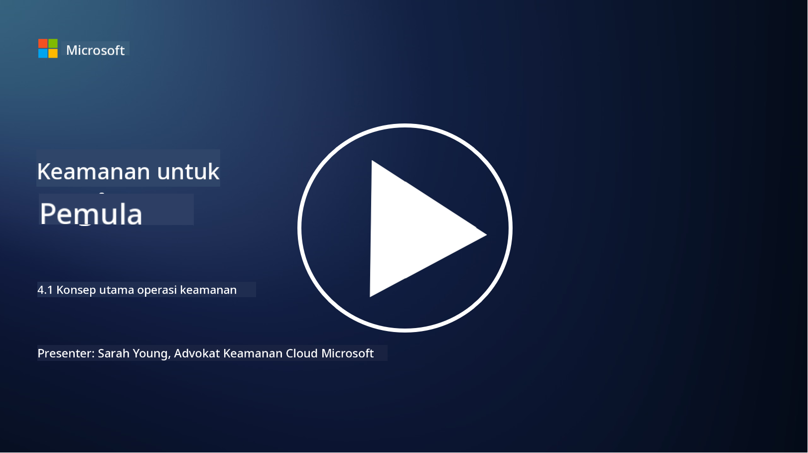

<!--
CO_OP_TRANSLATOR_METADATA:
{
  "original_hash": "6a55b31df9eebf550d040cef0ef7dff3",
  "translation_date": "2025-09-03T22:16:32+00:00",
  "source_file": "4.1 SecOps key concepts.md",
  "language_code": "id"
}
-->
# Konsep Utama Operasi Keamanan

Operasi keamanan adalah komponen penting dari fungsi keamanan keseluruhan sebuah organisasi. Dalam pelajaran ini, kita akan mempelajari lebih lanjut tentang:

- Apa itu fungsi operasi keamanan dalam sebuah bisnis?

- Bentuk apa saja yang dapat diambil oleh operasi keamanan?

- Bagaimana operasi keamanan berbeda dari operasi TI tradisional?

## Apa itu fungsi operasi keamanan dalam sebuah bisnis?

Fungsi operasi keamanan dalam sebuah bisnis merujuk pada tim atau departemen khusus yang bertanggung jawab untuk memantau, mendeteksi, menyelidiki, dan merespons ancaman serta insiden keamanan siber. Tujuan utama dari fungsi operasi keamanan adalah memastikan kerahasiaan, integritas, dan ketersediaan aset digital organisasi dengan secara proaktif mengidentifikasi dan mengurangi risiko keamanan serta merespons insiden keamanan secara efektif.

## Bentuk apa saja yang dapat diambil oleh operasi keamanan?

Operasi keamanan dapat mengambil berbagai bentuk tergantung pada ukuran dan kompleksitas organisasi. Beberapa bentuk umum meliputi:

**Security Operations Center (SOC):** Tim terpusat yang bertanggung jawab untuk pemantauan, analisis, dan respons terhadap kejadian keamanan selama 24/7. SOC sering menggunakan alat dan teknologi canggih untuk mengidentifikasi dan merespons ancaman secara real-time.

**Incident Response Team:** Tim khusus yang berfokus pada respons terhadap insiden dan pelanggaran keamanan. Mereka melakukan investigasi, mengoordinasikan upaya respons, dan memfasilitasi pemulihan.

**Threat Hunting Team:** Tim yang secara proaktif mencari tanda-tanda ancaman canggih dan kerentanan tersembunyi yang mungkin tidak terdeteksi oleh alat keamanan tradisional.

**Red Team/Blue Team:** Tim merah mensimulasikan serangan untuk mengidentifikasi kerentanan, sementara tim biru mempertahankan diri dari serangan tersebut. Kedua tim bekerja sama untuk meningkatkan langkah-langkah keamanan.

**Managed Security Services Provider (MSSP):** Beberapa organisasi mengalihdayakan operasi keamanan mereka kepada penyedia pihak ketiga yang berspesialisasi dalam pemantauan keamanan dan respons insiden.

## Bagaimana operasi keamanan berbeda dari operasi TI tradisional?

Operasi keamanan dan operasi TI tradisional adalah fungsi yang terkait tetapi berbeda:

**Fokus:** Operasi TI berfokus pada pengelolaan dan pemeliharaan infrastruktur TI organisasi, memastikan fungsionalitas dan ketersediaannya. Operasi keamanan, di sisi lain, memprioritaskan identifikasi dan mitigasi risiko keamanan serta respons terhadap insiden.

**Tanggung Jawab:** Operasi TI menangani tugas seperti pemeliharaan sistem, pembaruan perangkat lunak, dan dukungan pengguna. Operasi keamanan menangani deteksi ancaman, respons insiden, manajemen kerentanan, dan pemantauan keamanan.

**Ketepatan Waktu:** Operasi TI menekankan ketersediaan dan kinerja sistem secara langsung. Operasi keamanan berfokus pada identifikasi dan perbaikan ancaman, yang mungkin tidak selalu selaras dengan ketersediaan langsung.

**Keahlian:** Operasi keamanan membutuhkan keahlian khusus dalam analisis ancaman, respons insiden, dan alat keamanan siber. Operasi TI membutuhkan keahlian dalam administrasi sistem, manajemen jaringan, dan dukungan aplikasi.

## Alur kerja respons insiden

Kerangka Kerja NIST Cybersecurity Core Functions mencantumkan lima fungsi utama yang harus dilakukan secara berkelanjutan sebagai bagian dari lingkungan operasional organisasi untuk mengurangi risiko keamanan siber.

Penting untuk memahami bahwa aktivitas ini harus ada sebagai bagian dari lingkaran yang lebih besar yang terhubung dan selaras dengan proses keamanan siber yang lebih luas dalam organisasi.

**Note:** Anda dapat membaca lebih lanjut tentang Kerangka Kerja NIST Cybersecurity di [https://www.nist.gov/cybersecurity](https://www.nist.gov/cybersecurity)

## Bacaan lebih lanjut

- [Security operations | Microsoft Learn](https://learn.microsoft.com/security/operations/overview?WT.mc_id=academic-96948-sayoung)
- [Implementing security operations processes | Microsoft Learn](https://learn.microsoft.com/security/operations/?WT.mc_id=academic-96948-sayoung)
- [What is a security operations center (SOC)? | Microsoft Security](https://www.microsoft.com/security/business/security-101/what-is-a-security-operations-center-soc?WT.mc_id=academic-96948-sayoung)
- [What Is a Security Operations Center | Cybersecurity | CompTIA](https://www.comptia.org/content/articles/what-is-a-security-operations-center)

---

**Penafian**:  
Dokumen ini telah diterjemahkan menggunakan layanan penerjemahan AI [Co-op Translator](https://github.com/Azure/co-op-translator). Meskipun kami berusaha untuk memberikan hasil yang akurat, harap diingat bahwa terjemahan otomatis mungkin mengandung kesalahan atau ketidakakuratan. Dokumen asli dalam bahasa aslinya harus dianggap sebagai sumber yang otoritatif. Untuk informasi yang bersifat kritis, disarankan menggunakan jasa penerjemahan profesional oleh manusia. Kami tidak bertanggung jawab atas kesalahpahaman atau penafsiran yang keliru yang timbul dari penggunaan terjemahan ini.