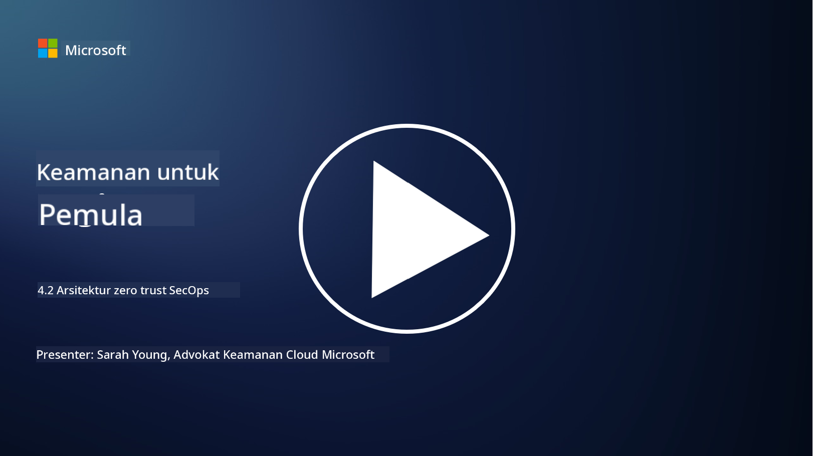

<!--
CO_OP_TRANSLATOR_METADATA:
{
  "original_hash": "45bbdc114e70936816b0b3e7c40189cf",
  "translation_date": "2025-09-03T21:21:05+00:00",
  "source_file": "4.2 SecOps zero trust architecture.md",
  "language_code": "id"
}
-->
# Arsitektur zero trust untuk operasi keamanan

Operasi keamanan merupakan dua bagian dari arsitektur zero trust, dan dalam pelajaran ini kita akan mempelajari keduanya:

- Bagaimana arsitektur TI harus dibangun untuk memungkinkan pengumpulan log terpusat?

- Apa saja praktik terbaik untuk operasi keamanan di lingkungan TI modern?

## Bagaimana arsitektur TI harus dibangun untuk memungkinkan pengumpulan log terpusat?

Pengumpulan log terpusat adalah komponen penting dalam operasi keamanan modern. Hal ini memungkinkan organisasi untuk mengumpulkan log dan data dari berbagai sumber, seperti server, aplikasi, perangkat jaringan, dan alat keamanan, ke dalam repositori pusat untuk analisis, pemantauan, dan respons insiden. Berikut adalah beberapa praktik terbaik untuk membangun arsitektur TI yang mendukung pengumpulan log terpusat:

1. **Integrasi Sumber Log**:

- Pastikan semua perangkat dan sistem yang relevan dikonfigurasi untuk menghasilkan log. Ini mencakup server, firewall, router, switch, aplikasi, dan perangkat keamanan.

- Konfigurasikan sumber log untuk meneruskan log ke pengumpul log atau sistem manajemen terpusat.

2. **Pilih alat SIEM (Security Information and Event Management) yang tepat**:

- Pilih solusi SIEM (Security Information and Event Management) yang sesuai dengan kebutuhan dan skala organisasi Anda.

- Pastikan solusi yang dipilih mendukung pengumpulan, agregasi, analisis, dan pelaporan log.

3. **Skalabilitas dan Redundansi**:

- Rancang arsitektur yang dapat diskalakan untuk mengakomodasi jumlah sumber log yang terus bertambah dan volume log yang meningkat.

- Terapkan redundansi untuk ketersediaan tinggi guna mencegah gangguan akibat kegagalan perangkat keras atau jaringan.

4. **Transportasi log yang aman**:

- Gunakan protokol aman seperti TLS/SSL atau IPsec untuk mentransfer log dari sumber ke repositori terpusat.

- Terapkan autentikasi dan kontrol akses untuk memastikan hanya perangkat yang berwenang yang dapat mengirim log.

5. **Normalisasi**:

- Standarisasi format log dan normalisasi data untuk memastikan konsistensi dan kemudahan analisis.

6. **Penyimpanan dan Retensi**:

- Tentukan periode retensi yang sesuai untuk log berdasarkan persyaratan kepatuhan dan keamanan.

- Simpan log dengan aman, melindunginya dari akses tidak sah dan manipulasi.

## Apa saja praktik terbaik untuk operasi keamanan di lingkungan TI modern?

Selain pengumpulan log terpusat, berikut adalah beberapa praktik terbaik untuk operasi keamanan di lingkungan TI modern:

1. **Pemantauan Berkelanjutan**: Terapkan pemantauan berkelanjutan terhadap aktivitas jaringan dan sistem untuk mendeteksi dan merespons ancaman secara real-time.

2. **Intelijen Ancaman**: Tetap terinformasi tentang ancaman dan kerentanan yang muncul dengan memanfaatkan feed dan layanan intelijen ancaman.

3. **Pelatihan Pengguna**: Lakukan pelatihan kesadaran keamanan secara rutin untuk karyawan guna mengurangi risiko yang terkait dengan rekayasa sosial dan serangan phishing.

4. **Rencana Respons Insiden**: Kembangkan dan uji rencana respons insiden untuk memastikan respons yang cepat dan efektif terhadap insiden keamanan.

5. **Otomasi Keamanan**: Manfaatkan alat otomasi dan orkestrasi keamanan untuk menyederhanakan respons insiden dan tugas-tugas berulang.

6. **Cadangan dan Pemulihan**: Terapkan solusi cadangan dan pemulihan bencana yang kuat untuk memastikan ketersediaan data jika terjadi kehilangan data atau serangan ransomware.

## Bacaan lebih lanjut

- [Modul Praktik Terbaik Keamanan Microsoft: Operasi keamanan | Microsoft Learn](https://learn.microsoft.com/security/operations/security-operations-videos-and-decks?WT.mc_id=academic-96948-sayoung)
- [Operasi keamanan - Kerangka Adopsi Cloud | Microsoft Learn](https://learn.microsoft.com/azure/cloud-adoption-framework/secure/security-operations?WT.mc_id=academic-96948-sayoung)
- [Apa itu Arsitektur Platform Operasi dan Analitik Keamanan? Definisi SOAPA, Cara Kerjanya, Manfaat, dan Lainnya (digitalguardian.com)](https://www.digitalguardian.com/blog/what-security-operations-and-analytics-platform-architecture-definition-soapa-how-it-works#:~:text=All%20in%20all%2C%20security%20operations%20and%20analytics%20platform,become%20more%20efficient%20and%20operative%20with%20your%20security.)

---

**Penafian**:  
Dokumen ini telah diterjemahkan menggunakan layanan penerjemahan AI [Co-op Translator](https://github.com/Azure/co-op-translator). Meskipun kami berusaha untuk memberikan hasil yang akurat, harap diketahui bahwa terjemahan otomatis mungkin mengandung kesalahan atau ketidakakuratan. Dokumen asli dalam bahasa aslinya harus dianggap sebagai sumber yang otoritatif. Untuk informasi yang bersifat kritis, disarankan menggunakan jasa penerjemahan profesional oleh manusia. Kami tidak bertanggung jawab atas kesalahpahaman atau penafsiran yang keliru yang timbul dari penggunaan terjemahan ini.