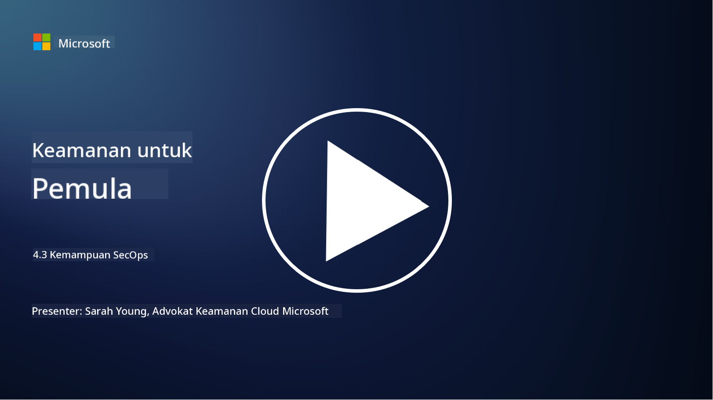

<!--
CO_OP_TRANSLATOR_METADATA:
{
  "original_hash": "553eb694c89f1caca0694e8d8ab89e0e",
  "translation_date": "2025-09-03T21:47:21+00:00",
  "source_file": "4.3 SecOps capabilities.md",
  "language_code": "id"
}
-->
# Kemampuan SecOps

Pada bagian ini, kita akan membahas lebih lanjut tentang alat dan kemampuan inti yang dapat digunakan dalam operasi keamanan.

Dalam pelajaran ini, kita akan membahas:

- Apa itu alat manajemen informasi dan kejadian keamanan (SIEM)?

- Apa itu XDR?

- Kemampuan apa saja yang dapat digunakan untuk meningkatkan operasi keamanan?

## Apa itu alat manajemen informasi dan kejadian keamanan (SIEM)?

Alat Manajemen Informasi dan Kejadian Keamanan (SIEM) digunakan untuk menganalisis peringatan keamanan yang dihasilkan di seluruh lingkungan TI organisasi. Alat ini mengumpulkan, menggabungkan, mengorelasikan, dan menganalisis data log serta kejadian keamanan dari berbagai sumber, seperti perangkat jaringan, server, aplikasi, dan sistem keamanan.

Fungsi utama dan kemampuan alat SIEM meliputi:

1. **Pengumpulan Log**: Alat SIEM mengumpulkan log dan data kejadian keamanan dari berbagai perangkat, sistem, dan aplikasi, termasuk firewall, sistem deteksi intrusi, perangkat lunak antivirus, dan lainnya.

2. **Normalisasi Data**: Alat ini menormalkan data log ke dalam format umum untuk mempermudah analisis dan korelasi.

3. **Korelasi Kejadian**: Alat SIEM mengorelasikan kejadian untuk mengidentifikasi pola dan anomali yang mungkin menunjukkan insiden atau ancaman keamanan.

4. **Peringatan dan Notifikasi**: Alat SIEM menghasilkan peringatan dan notifikasi secara real-time ketika aktivitas mencurigakan atau pelanggaran keamanan terdeteksi, memungkinkan respons segera.

5. **Deteksi Insiden**: Alat ini memfasilitasi deteksi insiden keamanan, termasuk akses tidak sah, pelanggaran data, infeksi malware, dan ancaman dari dalam.

6. **Analitik Perilaku Pengguna dan Entitas (UEBA)**: Beberapa alat SIEM mengintegrasikan kemampuan UEBA untuk mengidentifikasi perilaku pengguna dan entitas yang tidak normal yang mungkin menunjukkan akun yang dikompromikan atau ancaman dari dalam.

7. **Integrasi Intelijen Ancaman**: Alat SIEM dapat terintegrasi dengan umpan intelijen ancaman untuk meningkatkan deteksi ancaman dengan membandingkan indikator kompromi (IOC) yang diketahui dengan aktivitas jaringan.

8. **Otomasi dan Orkestrasi**: Fitur otomasi memungkinkan SIEM untuk merespons insiden keamanan umum secara otomatis, mengurangi waktu respons dan upaya manual.

9. **Dasbor dan Visualisasi**: Alat ini menawarkan dasbor dan alat visualisasi untuk memantau data keamanan dan membuat laporan khusus.

10. **Integrasi dengan Alat Keamanan Lain**: Alat SIEM sering terintegrasi dengan alat dan teknologi keamanan lainnya, seperti solusi deteksi dan respons endpoint (EDR), untuk memberikan pandangan menyeluruh tentang postur keamanan organisasi.

## Apa itu XDR?

XDR (Extended Detection and Response) adalah teknologi yang memperluas kemampuan Deteksi dan Respons Endpoint (EDR) tradisional dan menggabungkannya dengan telemetri keamanan yang lebih luas dari berbagai sumber untuk memberikan pandangan yang lebih komprehensif tentang postur keamanan organisasi. XDR bertujuan untuk meningkatkan deteksi ancaman, respons insiden, dan keamanan secara keseluruhan dengan mengatasi keterbatasan yang ada pada EDR, SIEM, atau alat keamanan individu lainnya.

Karakteristik utama dan komponen XDR meliputi:

1. **Integrasi Data**: XDR mengintegrasikan data dari berbagai sumber, termasuk endpoint, lalu lintas jaringan, layanan cloud, email, dan lainnya. Pengumpulan data yang komprehensif ini memberikan konteks yang lebih luas untuk deteksi dan analisis ancaman.

2. **Analitik Lanjutan**: XDR menggunakan analitik lanjutan, pembelajaran mesin, dan analisis perilaku untuk mengidentifikasi dan memprioritaskan ancaman keamanan. Alat ini mencari pola dan anomali dalam data yang terintegrasi untuk mendeteksi ancaman yang diketahui maupun yang tidak diketahui.

3. **Deteksi Ancaman Otomatis**: XDR mengotomatisasi deteksi ancaman keamanan dan anomali dengan mengorelasikan informasi dari berbagai sumber. Alat ini dapat mengidentifikasi rantai serangan kompleks yang mungkin melibatkan beberapa vektor.

4. **Investigasi dan Respons Insiden**: XDR menyediakan alat untuk investigasi dan respons insiden, membantu tim keamanan dengan cepat menilai cakupan dan dampak insiden serta mengambil tindakan perbaikan yang sesuai.

5. **Integrasi Intelijen Ancaman**: Alat ini mengintegrasikan umpan dan data intelijen ancaman untuk meningkatkan deteksi ancaman dengan membandingkan indikator kompromi (IOC) yang diketahui dengan aktivitas jaringan dan endpoint organisasi.

6. **Konsol Terpadu**: XDR biasanya menawarkan konsol atau dasbor terpadu di mana tim keamanan dapat melihat dan mengelola peringatan serta insiden keamanan dari berbagai sumber secara terpusat.

7. **Cakupan Lintas Platform**: Solusi XDR mencakup berbagai platform, termasuk endpoint, server, lingkungan cloud, dan perangkat seluler, sehingga cocok untuk lingkungan TI modern yang multi-platform.

## Kemampuan apa saja yang dapat digunakan untuk meningkatkan operasi keamanan?

Untuk meningkatkan operasi keamanan, organisasi dapat memanfaatkan beberapa kemampuan selain alat SIEM:

1. **Pembelajaran Mesin dan Kecerdasan Buatan**: Mengimplementasikan analitik lanjutan, pembelajaran mesin, dan AI untuk mendeteksi ancaman yang terus berkembang dan mengotomatisasi pencarian ancaman.

2. **Analitik Perilaku Pengguna dan Entitas (UEBA)**: Menganalisis perilaku pengguna dan entitas untuk mendeteksi anomali dan ancaman dari dalam.

3. **Umpan Intelijen Ancaman**: Mengintegrasikan umpan intelijen ancaman untuk tetap mendapatkan informasi terbaru tentang ancaman dan indikator kompromi.

4. **Orkestrasi, Otomasi, dan Respons Keamanan (SOAR)**: Mengimplementasikan platform SOAR untuk mengotomatisasi respons insiden dan menyederhanakan alur kerja operasi keamanan.

5. **Teknologi Penipuan**: Menggunakan teknologi penipuan untuk menyesatkan dan mendeteksi penyerang di dalam jaringan.

## Bacaan lebih lanjut

- [Apa itu SIEM? | Microsoft Security](https://www.microsoft.com/security/business/security-101/what-is-siem?WT.mc_id=academic-96948-sayoung)
- [Apa Itu SIEM? - Manajemen Informasi dan Kejadian Keamanan - Cisco](https://www.cisco.com/c/en/us/products/security/what-is-siem.html)
- [Manajemen informasi dan kejadian keamanan - Wikipedia](https://en.wikipedia.org/wiki/Security_information_and_event_management)
- [Apa Itu XDR? | Microsoft Security](https://www.microsoft.com/security/business/security-101/what-is-xdr?WT.mc_id=academic-96948-sayoung)
- [XDR & Keamanan XDR (kaspersky.com.au)](https://www.kaspersky.com.au/resource-center/definitions/what-is-xdr)
- [Kekuatan SecOps: Mendefinisikan Ulang Kemampuan Keamanan Inti - The New Stack](https://thenewstack.io/the-power-of-secops-redefining-core-security-capabilities/)
- [Tujuh Langkah untuk Meningkatkan Operasi dan Respons Keamanan Anda (securityintelligence.com)](https://securityintelligence.com/seven-steps-to-improve-your-security-operations-and-response/)

---

**Penafian**:  
Dokumen ini telah diterjemahkan menggunakan layanan penerjemahan AI [Co-op Translator](https://github.com/Azure/co-op-translator). Meskipun kami berusaha untuk memberikan hasil yang akurat, harap diingat bahwa terjemahan otomatis mungkin mengandung kesalahan atau ketidakakuratan. Dokumen asli dalam bahasa aslinya harus dianggap sebagai sumber yang otoritatif. Untuk informasi yang bersifat kritis, disarankan menggunakan jasa penerjemahan profesional oleh manusia. Kami tidak bertanggung jawab atas kesalahpahaman atau penafsiran yang keliru yang timbul dari penggunaan terjemahan ini.