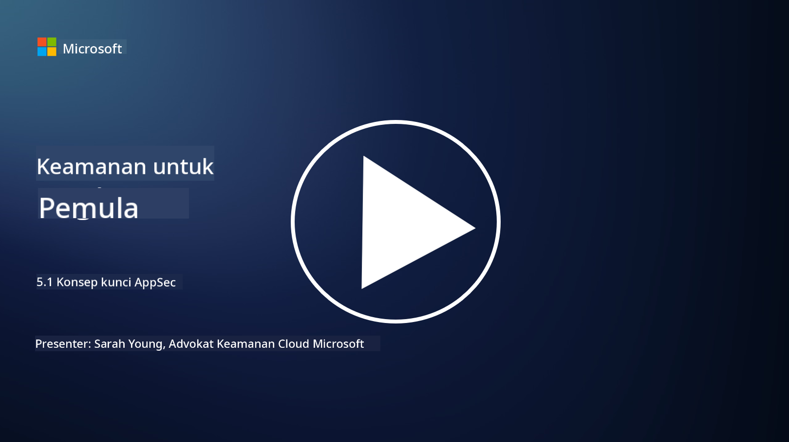

<!--
CO_OP_TRANSLATOR_METADATA:
{
  "original_hash": "e4b56bb23078d3ffb7ad407d280b0c36",
  "translation_date": "2025-09-03T21:10:26+00:00",
  "source_file": "5.1 AppSec key concepts.md",
  "language_code": "id"
}
-->
# Konsep Utama AppSec

Keamanan aplikasi adalah spesialisasi keamanan yang berdiri sendiri. Dalam bagian kursus ini, kita akan mempelajari lebih dalam tentang keamanan aplikasi.

## Pengantar

Dalam pelajaran ini, kita akan membahas:

- Apa itu keamanan aplikasi?

- Apa saja konsep/prinsip utama dalam keamanan aplikasi?

## Apa itu keamanan aplikasi?

Keamanan aplikasi, sering disingkat sebagai "AppSec," mengacu pada praktik melindungi aplikasi perangkat lunak dari ancaman keamanan, kerentanan, dan serangan. Ini mencakup proses, teknik, dan alat yang digunakan untuk mengidentifikasi, mengurangi, dan mencegah risiko keamanan sepanjang siklus pengembangan, penerapan, dan pemeliharaan aplikasi.

Keamanan aplikasi sangat penting karena aplikasi sering menjadi target serangan siber. Pelaku jahat memanfaatkan kerentanan dan kelemahan dalam perangkat lunak untuk mendapatkan akses tanpa izin, mencuri data, mengganggu layanan, atau melakukan aktivitas berbahaya lainnya. Keamanan aplikasi yang efektif membantu memastikan kerahasiaan, integritas, dan ketersediaan aplikasi serta data yang terkait.

## Apa saja konsep/prinsip utama dalam keamanan aplikasi?

Konsep dan prinsip utama yang mendasari keamanan aplikasi meliputi:

1. **Aman sejak Desain**:

- Keamanan harus diintegrasikan ke dalam desain dan arsitektur aplikasi sejak awal, bukan ditambahkan belakangan.

2. **Validasi Input**:

- Semua input pengguna harus divalidasi untuk memastikan sesuai dengan format yang diharapkan dan bebas dari kode atau data berbahaya.

3. **Encoding Output**:

- Data yang dikirim ke klien harus dienkode dengan benar untuk mencegah kerentanan seperti cross-site scripting (XSS).

4. **Otentikasi dan Otorisasi**:

- Otentikasi pengguna dan otorisasi akses mereka ke sumber daya berdasarkan peran dan izin mereka.

5. **Perlindungan Data**:

- Data sensitif harus dienkripsi saat disimpan, dikirim, dan diproses untuk mencegah akses tanpa izin.

6. **Manajemen Sesi**:

- Manajemen sesi yang aman memastikan sesi pengguna terlindungi dari pembajakan dan akses tanpa izin.

7. **Ketergantungan yang Aman**:

- Pastikan semua ketergantungan perangkat lunak diperbarui dengan patch keamanan untuk mencegah kerentanan.

8. **Penanganan Kesalahan dan Logging**:

- Terapkan penanganan kesalahan yang aman untuk menghindari pengungkapan informasi sensitif dan pastikan praktik logging yang aman.

9. **Pengujian Keamanan**:

- Secara rutin uji aplikasi untuk kerentanan menggunakan metode seperti pengujian penetrasi, tinjauan kode, dan alat pemindaian otomatis.

10. **Siklus Hidup Pengembangan Perangkat Lunak yang Aman (SDLC)**:

- Integrasikan praktik keamanan ke dalam setiap fase siklus hidup pengembangan perangkat lunak, mulai dari persyaratan hingga penerapan dan pemeliharaan.

## Bacaan lebih lanjut

- [SheHacksPurple: Apa itu Keamanan Aplikasi? - YouTube](https://www.youtube.com/watch?v=eNmccQNzSSY)
- [Apa itu Keamanan Aplikasi? - Cisco](https://www.cisco.com/c/en/us/solutions/security/application-first-security/what-is-application-security.html#~how-does-it-work)
- [Apa itu keamanan aplikasi? Proses dan alat untuk mengamankan perangkat lunak | CSO Online](https://www.csoonline.com/article/566471/what-is-application-security-a-process-and-tools-for-securing-software.html)
- [OWASP Cheat Sheet Series | OWASP Foundation](https://owasp.org/www-project-cheat-sheets/)

---

**Penafian**:  
Dokumen ini telah diterjemahkan menggunakan layanan penerjemahan AI [Co-op Translator](https://github.com/Azure/co-op-translator). Meskipun kami berusaha untuk memberikan hasil yang akurat, harap diingat bahwa terjemahan otomatis mungkin mengandung kesalahan atau ketidakakuratan. Dokumen asli dalam bahasa aslinya harus dianggap sebagai sumber yang otoritatif. Untuk informasi yang bersifat kritis, disarankan menggunakan jasa penerjemahan profesional oleh manusia. Kami tidak bertanggung jawab atas kesalahpahaman atau penafsiran yang keliru yang timbul dari penggunaan terjemahan ini.