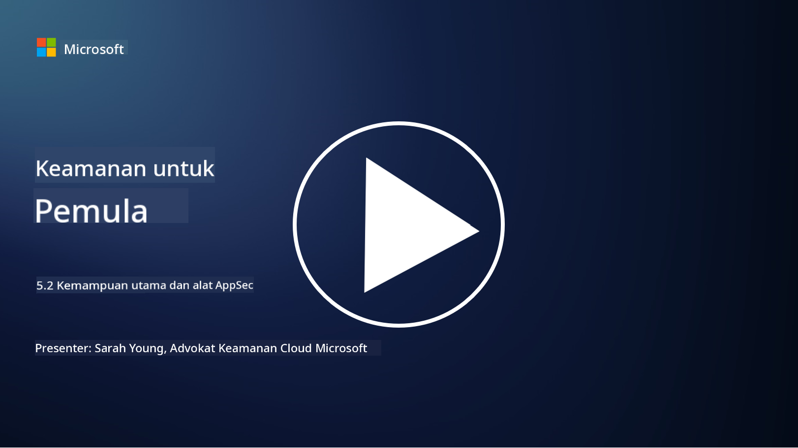

<!--
CO_OP_TRANSLATOR_METADATA:
{
  "original_hash": "790a3fa7e535ec60bb51bde13e759781",
  "translation_date": "2025-09-03T21:26:00+00:00",
  "source_file": "5.2 AppSec key capabilities.md",
  "language_code": "id"
}
-->
## Pendahuluan

Dalam pelajaran ini, kita akan membahas kemampuan utama dan alat yang digunakan dalam keamanan aplikasi.

## Kemampuan utama dan alat dalam AppSec

Kemampuan utama dan alat yang digunakan dalam keamanan aplikasi sangat penting untuk mengidentifikasi, mengurangi, dan mencegah kerentanan serta ancaman keamanan dalam aplikasi perangkat lunak. Berikut adalah beberapa yang paling penting:

**1. Static Application Security Testing (SAST)**:

- **Kemampuan**: Menganalisis kode sumber, bytecode, atau kode biner untuk mengidentifikasi kerentanan keamanan dalam kode aplikasi.

- **Alat**: Contohnya termasuk Fortify, Checkmarx, dan Veracode.

**2. Dynamic Application Security Testing (DAST)**:

- **Kemampuan**: Memindai aplikasi yang sedang berjalan untuk mengidentifikasi kerentanan dengan mengirimkan permintaan input dan menganalisis respons.

- **Alat**: Contohnya termasuk ZAP, Burp Suite, dan Qualys Web Application Scanning.

**3. Interactive Application Security Testing (IAST)**:

- **Kemampuan**: Menggabungkan elemen SAST dan DAST untuk menganalisis kode selama runtime, memberikan hasil yang lebih akurat dan mengurangi positif palsu.

- **Alat**: Contohnya termasuk Contrast Security dan HCL AppScan.

**4. Runtime Application Self-Protection (RASP)**:

- **Kemampuan**: Memantau dan melindungi aplikasi secara real-time, mendeteksi dan merespons ancaman keamanan saat terjadi.

- **Alat**: Contohnya termasuk Veracode Runtime Protection dan F5 Advanced WAF dengan RASP.

**5. Web Application Firewalls (WAFs)**:

- **Kemampuan**: Memberikan lapisan perlindungan antara aplikasi dan internet, menyaring lalu lintas masuk dan memblokir permintaan berbahaya.

- **Alat**: Contohnya termasuk ModSecurity, AWS WAF, dan Akamai Kona Site Defender.

**6. Pemindaian Ketergantungan**:

- **Kemampuan**: Mengidentifikasi kerentanan dalam pustaka pihak ketiga dan komponen yang digunakan dalam aplikasi.

- **Alat**: Contohnya termasuk OWASP Dependency-Check dan Snyk.

**7. Penetration Testing (Pen Testing)**:

- **Kemampuan**: Mensimulasikan serangan dunia nyata untuk menemukan kerentanan dan menilai keamanan aplikasi.

- **Alat**: Dilakukan oleh hacker etis bersertifikat dan profesional keamanan menggunakan berbagai alat seperti Metasploit dan Nmap.

**8. Pemindaian dan Analisis Keamanan**:

- **Kemampuan**: Memindai kerentanan yang diketahui, kesalahan konfigurasi, dan kesalahan pengaturan keamanan.

- **Alat**: Contohnya termasuk Nessus, Qualys Vulnerability Management, dan OpenVAS.

**9. Alat Keamanan Kontainer**:

- **Kemampuan**: Berfokus pada keamanan aplikasi yang dikontainerisasi dan lingkungannya.

- **Alat**: Contohnya termasuk Docker Security Scanning dan Aqua Security.

**10. Pelatihan Pengembangan Aman**:

- **Kemampuan**: Memberikan program pelatihan dan kesadaran untuk tim pengembang guna mendorong praktik pengkodean yang aman.

- **Alat**: Program pelatihan dan platform yang disesuaikan.

**11. Kerangka Pengujian Keamanan**:

- **Kemampuan**: Menyediakan kerangka pengujian yang komprehensif untuk berbagai kebutuhan pengujian keamanan aplikasi.

- **Alat**: OWASP Amass, OWASP OWTF, dan FrAppSec.

**12. Alat Tinjauan Kode Aman**:

- **Kemampuan**: Meninjau kode sumber untuk kerentanan keamanan dan praktik pengkodean terbaik.

- **Alat**: Contohnya termasuk SonarQube dan Checkmarx.

**13. Alat Keamanan API dan Mikroservis**:

- **Kemampuan**: Berfokus pada keamanan API dan mikroservis, termasuk autentikasi, otorisasi, dan perlindungan data.

- **Alat**: Contohnya termasuk Apigee, AWS API Gateway, dan Istio.

## Bacaan lebih lanjut

- [What Is Application Security? Concepts, Tools & Best Practices | HackerOne](https://www.hackerone.com/knowledge-center/what-application-security-concepts-tools-best-practices)
- [What is IAST? (Interactive Application Security Testing) (comparitech.com)](https://www.comparitech.com/net-admin/what-is-iast/)
- [10 Types of Application Security Testing Tools: When and How to Use Them (cmu.edu)](https://insights.sei.cmu.edu/blog/10-types-of-application-security-testing-tools-when-and-how-to-use-them/)
- [Shifting the Balance of Cybersecurity Risk: Principles and Approaches for Security-by-Design and Default | Cyber.gov.au](https://www.cyber.gov.au/about-us/view-all-content/publications/principles-and-approaches-for-security-by-design-and-default)

---

**Penafian**:  
Dokumen ini telah diterjemahkan menggunakan layanan penerjemahan AI [Co-op Translator](https://github.com/Azure/co-op-translator). Meskipun kami berusaha untuk memberikan hasil yang akurat, harap diingat bahwa terjemahan otomatis mungkin mengandung kesalahan atau ketidakakuratan. Dokumen asli dalam bahasa aslinya harus dianggap sebagai sumber yang otoritatif. Untuk informasi yang bersifat kritis, disarankan menggunakan jasa penerjemahan profesional oleh manusia. Kami tidak bertanggung jawab atas kesalahpahaman atau penafsiran yang keliru yang timbul dari penggunaan terjemahan ini.