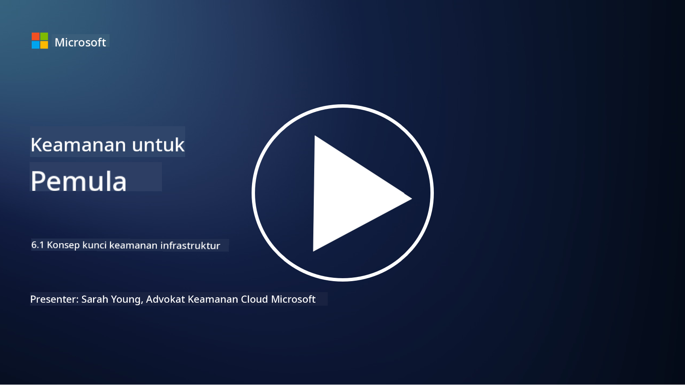

<!--
CO_OP_TRANSLATOR_METADATA:
{
  "original_hash": "882ebf66a648f419bcbf680ed6aefa00",
  "translation_date": "2025-09-03T20:06:32+00:00",
  "source_file": "6.1 Infrastructure security key concepts.md",
  "language_code": "id"
}
-->
# Konsep Kunci Keamanan Infrastruktur

“Infrastruktur” mengacu pada elemen dasar dari lingkungan TI apa pun, termasuk server, layanan cloud, dan container – mencakup berbagai teknologi yang luas. Aplikasi yang dibahas di bagian sebelumnya berjalan di atas infrastruktur, sehingga infrastruktur juga dapat menjadi target serangan.

Dalam pelajaran ini, kita akan membahas:

- Apa itu kebersihan keamanan dan mengapa itu penting?

- Apa itu manajemen postur keamanan?

- Apa itu patching dan mengapa itu penting?

- Apa itu container dan apa yang berbeda dalam keamanannya?

## Apa itu kebersihan keamanan dan mengapa itu penting?

**Kebersihan keamanan** mengacu pada serangkaian praktik dan perilaku yang diikuti individu dan organisasi untuk menjaga kebiasaan keamanan siber yang baik. Ini melibatkan langkah-langkah untuk melindungi sistem, data, dan jaringan dari ancaman dan kerentanan. Kebersihan keamanan yang baik penting karena beberapa alasan:

- **Mencegah Serangan**: Mengikuti praktik terbaik dapat mencegah serangan siber umum, seperti phishing, infeksi malware, dan akses tidak sah.

- **Melindungi Data**: Kebersihan keamanan yang tepat melindungi data sensitif dan rahasia dari pencurian atau paparan.

- **Membangun Kepercayaan**: Organisasi yang menunjukkan kebersihan keamanan yang baik membangun kepercayaan dengan pelanggan dan mitra.

- **Kepatuhan**: Banyak regulasi dan standar mengharuskan organisasi untuk mengikuti praktik kebersihan keamanan.

- **Mengurangi Risiko**: Kebersihan keamanan yang konsisten mengurangi risiko keseluruhan dari insiden dan pelanggaran keamanan.

Kebersihan keamanan mencakup praktik seperti menjaga perangkat lunak tetap diperbarui, menggunakan kata sandi yang kuat dan autentikasi multi-faktor, pencadangan rutin, pelatihan karyawan, dan pemantauan aktivitas mencurigakan. Ini adalah dasar dari postur keamanan siber yang kuat.

## Apa itu manajemen postur keamanan?

Manajemen Postur Keamanan mengacu pada praktik menilai, memantau, dan mengelola postur keamanan siber organisasi secara keseluruhan. Postur keamanan siber mengacu pada pendekatan dan kesiapan organisasi untuk melindungi sistem teknologi informasi (TI), jaringan, data, dan asetnya dari ancaman dan serangan siber. Ini mencakup strategi, kebijakan, praktik, dan teknologi yang digunakan organisasi untuk melindungi aset digitalnya serta menjaga kerahasiaan, integritas, dan ketersediaan informasi.

Manajemen postur keamanan melibatkan evaluasi dan pemeliharaan keamanan sistem, jaringan, aplikasi, dan data untuk memastikan kesesuaiannya dengan kebijakan keamanan, praktik terbaik, dan persyaratan kepatuhan. Tujuannya adalah memberikan pandangan menyeluruh tentang status keamanan organisasi, mengidentifikasi kerentanan dan kelemahan, serta memprioritaskan upaya perbaikan.

## Apa itu patching dan mengapa itu penting?

**Patching** mengacu pada proses menerapkan pembaruan perangkat lunak, yang juga dikenal sebagai patch atau perbaikan, pada perangkat lunak, sistem operasi, dan aplikasi. Pembaruan ini biasanya mengatasi kerentanan keamanan, bug, dan masalah lain yang dapat dimanfaatkan oleh penyerang. Perangkat keras juga memerlukan patching: ini bisa berupa firmware atau sistem operasi bawaan. Patching perangkat keras sering kali lebih sulit dibandingkan patching perangkat lunak.

Patching penting karena beberapa alasan:

- **Keamanan**: Patch memperbaiki kerentanan yang diketahui yang dapat dimanfaatkan oleh penyerang untuk mengkompromikan sistem dan mencuri data.

- **Stabilitas**: Patch sering kali mencakup peningkatan stabilitas dan kinerja, mengurangi risiko kerusakan atau kegagalan sistem.

- **Kepatuhan**: Banyak regulasi dan standar kepatuhan mengharuskan organisasi untuk menerapkan patch keamanan secara tepat waktu.

- **Membangun Kepercayaan**: Patching secara rutin membantu menjaga kepercayaan pelanggan dan pemangku kepentingan dengan menunjukkan komitmen terhadap keamanan.

- **Pengurangan Risiko**: Patching mengurangi permukaan serangan dan kemungkinan serangan siber yang berhasil.

Kegagalan untuk menerapkan patch secara tepat waktu dapat membuat sistem rentan terhadap eksploitasi yang diketahui, meningkatkan risiko pelanggaran keamanan dan kehilangan data.

## Apa itu container dan apa yang berbeda dalam keamanannya?

Container adalah bentuk paket perangkat lunak yang ringan, mandiri, dan dapat dieksekusi yang berisi semua yang diperlukan untuk menjalankan sebuah perangkat lunak, termasuk kode, runtime, pustaka, dan alat sistem. Container menyediakan lingkungan yang konsisten dan terisolasi untuk aplikasi, sehingga memudahkan pengembangan, pengemasan, dan penerapan perangkat lunak di berbagai lingkungan dan platform. Teknologi containerisasi yang populer termasuk Docker dan Kubernetes.

Keamanan Container mengacu pada praktik dan teknologi yang digunakan untuk melindungi container dan aplikasi yang mereka host dari berbagai ancaman dan kerentanan keamanan. Keamanan container penting karena, meskipun container menawarkan banyak manfaat dalam hal portabilitas dan skalabilitas, mereka juga memperkenalkan tantangan keamanan tertentu:

1. **Keamanan Gambar**: Gambar container dapat mengandung kerentanan, dan jika gambar ini tidak diperbarui dan dipatch secara rutin, mereka dapat dimanfaatkan oleh penyerang. Keamanan container melibatkan pemindaian gambar untuk kerentanan yang diketahui dan memastikan hanya gambar yang terpercaya yang digunakan.

2. **Keamanan Runtime**: Container yang berjalan harus diisolasi satu sama lain dan dari sistem host untuk mencegah akses tidak sah dan potensi serangan. Mekanisme keamanan runtime mencakup teknologi isolasi container seperti namespaces dan cgroups, serta alat untuk memantau dan mengaudit perilaku container.

3. **Keamanan Jaringan**: Container berkomunikasi satu sama lain dan dengan sistem eksternal melalui jaringan. Segmentasi jaringan yang tepat dan aturan firewall sangat penting untuk mengontrol lalu lintas antar container dan mencegah akses tidak sah.

4. **Kontrol Akses**: Memastikan bahwa hanya pengguna dan proses yang berwenang yang dapat mengakses dan memodifikasi container sangat penting. Kontrol akses berbasis peran (RBAC) dan alat manajemen identitas sering digunakan untuk kontrol akses.

5. **Logging dan Pemantauan**: Keamanan container melibatkan pengumpulan dan analisis log serta data pemantauan untuk mendeteksi dan merespons insiden keamanan dan anomali secara real-time.

6. **Keamanan Orkestrasi**: Saat menggunakan platform orkestrasi container seperti Kubernetes, keamanan lapisan orkestrasi sama pentingnya. Ini mencakup pengamanan server API Kubernetes, memastikan kebijakan RBAC yang tepat, dan mengaudit aktivitas kluster.

7. **Manajemen Rahasia**: Penanganan informasi sensitif, seperti kunci API dan kata sandi, dalam container memerlukan solusi penyimpanan dan manajemen yang aman untuk mencegah paparan.

Solusi keamanan container sering kali melibatkan kombinasi praktik keamanan terbaik, alat pemindaian kerentanan, mekanisme perlindungan runtime, konfigurasi keamanan jaringan, dan fitur keamanan orkestrasi container. Pemantauan dan otomatisasi yang berkelanjutan adalah komponen penting dari keamanan container untuk mendeteksi dan merespons ancaman dengan cepat seiring perkembangan dan skala aplikasi yang tercontainerisasi.

## Bacaan lebih lanjut

- [The importance of security hygiene | Security Magazine](https://www.securitymagazine.com/articles/99510-the-importance-of-security-hygiene)
- [What is CSPM? | Microsoft Security](https://www.microsoft.com/security/business/security-101/what-is-cspm?WT.mc_id=academic-96948-sayoung)
- [What is Cloud Security Posture Management (CSPM)? | HackerOne](https://www.hackerone.com/knowledge-center/what-cloud-security-posture-management)
- [Function of cloud security posture management - Cloud Adoption Framework | Microsoft Learn](https://learn.microsoft.com/azure/cloud-adoption-framework/organize/cloud-security-posture-management?WT.mc_id=academic-96948-sayoung)
- [What Is a CNAPP? | Microsoft Security](https://www.microsoft.com/security/business/security-101/what-is-cnapp)
- [Why Everyone Is Talking About CNAPP (forbes.com)](https://www.forbes.com/sites/forbestechcouncil/2021/12/10/why-everyone-is-talking-about-cnapp/?sh=567275ca1549)
- [Why is patching important to cybersecurity? - CyberSmart](https://cybersmart.co.uk/blog/why-is-patching-important-to-cybersecurity/)
- [What Is Container Security? Complete Guide [2023] (aquasec.com)](https://www.aquasec.com/cloud-native-academy/container-security/container-security/)

---

**Penafian**:  
Dokumen ini telah diterjemahkan menggunakan layanan penerjemahan AI [Co-op Translator](https://github.com/Azure/co-op-translator). Meskipun kami berusaha untuk memberikan hasil yang akurat, harap diingat bahwa terjemahan otomatis mungkin mengandung kesalahan atau ketidakakuratan. Dokumen asli dalam bahasa aslinya harus dianggap sebagai sumber yang otoritatif. Untuk informasi yang bersifat kritis, disarankan menggunakan jasa penerjemahan profesional oleh manusia. Kami tidak bertanggung jawab atas kesalahpahaman atau penafsiran yang keliru yang timbul dari penggunaan terjemahan ini.