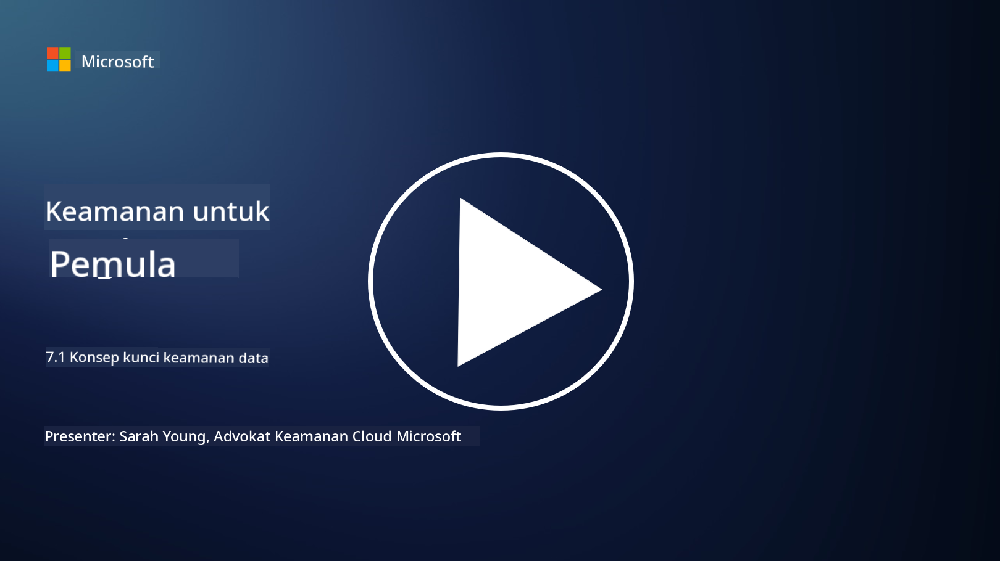

<!--
CO_OP_TRANSLATOR_METADATA:
{
  "original_hash": "9703868f41dcddd5a98dea9ea6fcd94d",
  "translation_date": "2025-09-03T20:40:59+00:00",
  "source_file": "7.1 Data security key concepts.md",
  "language_code": "id"
}
-->
# Konsep Utama Keamanan Data

Kami telah menyebutkan keamanan data dan membahasnya beberapa kali dalam kursus ini. Sekarang, mari kita pelajari topik ini lebih mendalam. Dalam pelajaran ini, Anda akan mempelajari:

- Apa itu keamanan data?

- Apa itu klasifikasi data?

- Apa itu manajemen siklus hidup data?

- Apa itu pencegahan kehilangan data (DLP)?

- Mengapa keamanan data penting bagi organisasi?

## Apa itu keamanan data?

**Keamanan data** mengacu pada praktik melindungi data digital, seperti basis data, file, dan informasi sensitif, dari akses, pengungkapan, perubahan, atau penghancuran yang tidak sah. Tujuan utama keamanan data adalah memastikan kerahasiaan, integritas, dan ketersediaan data. Hal ini melibatkan penerapan kombinasi langkah-langkah keamanan teknis, administratif, dan fisik untuk melindungi data dari berbagai ancaman dan kerentanan, termasuk serangan siber, ancaman dari dalam, dan pelanggaran data. Langkah-langkah keamanan data dapat mencakup enkripsi, kontrol akses, autentikasi, jejak audit, dan kebijakan keamanan.

## Apa itu klasifikasi data?

**Klasifikasi data** adalah proses mengategorikan data berdasarkan sensitivitas, nilai, dan pentingnya bagi organisasi. Tujuan klasifikasi data adalah membantu organisasi mengidentifikasi dan memprioritaskan perlindungan serta penanganan berbagai jenis data. Kategori klasifikasi data yang umum meliputi "publik," "internal," "rahasia," dan "terbatas" atau "sangat rahasia." Setelah data diklasifikasikan, organisasi dapat menerapkan kontrol keamanan dan pembatasan akses yang sesuai untuk memastikan bahwa data sensitif terlindungi dengan baik dan kepatuhan terhadap persyaratan regulasi tetap terjaga.

## Apa itu manajemen siklus hidup data?

**Manajemen siklus hidup data** adalah pendekatan terstruktur untuk mengelola data sepanjang siklus hidupnya, mulai dari pembuatan atau akuisisi hingga pengarsipan atau penghapusan. Siklus hidup data biasanya terdiri dari tahap-tahap seperti pembuatan, penyimpanan, pemrosesan, transmisi, pengarsipan, dan pembuangan. Manajemen siklus hidup data melibatkan penentuan kebijakan dan prosedur untuk setiap tahap siklus hidup data, termasuk retensi data, kontrol akses, pencadangan, dan pembersihan data. Manajemen siklus hidup data yang efektif membantu organisasi mengoptimalkan penyimpanan data, meningkatkan kualitas data, dan memastikan kepatuhan terhadap regulasi perlindungan data.

## Apa itu pencegahan kehilangan data (DLP)?

**Pencegahan Kehilangan Data (DLP)** mengacu pada serangkaian teknologi, kebijakan, dan praktik yang dirancang untuk mencegah akses, berbagi, atau kebocoran data sensitif atau rahasia yang tidak sah. Solusi DLP menggunakan inspeksi konten dan analisis kontekstual untuk memantau dan mengontrol data yang sedang bergerak (misalnya, email, lalu lintas web), data yang tersimpan (misalnya, file dan basis data), dan data yang sedang digunakan (misalnya, data yang diakses atau dimanipulasi oleh pengguna). DLP bertujuan untuk mengidentifikasi dan memblokir atau mengenkripsi data sensitif untuk mencegah pelanggaran data, mematuhi regulasi perlindungan data, dan melindungi reputasi organisasi.

## Mengapa keamanan data penting bagi organisasi?

Keamanan data sangat penting bagi organisasi karena beberapa alasan:

- **Perlindungan Informasi Sensitif**: Organisasi sering menyimpan data sensitif, seperti catatan pelanggan, kekayaan intelektual, data keuangan, dan informasi karyawan. Keamanan data melindungi informasi sensitif ini dari akses atau pencurian yang tidak sah.

- **Kepatuhan**: Banyak industri dan yurisdiksi memiliki regulasi perlindungan data dan privasi yang ketat. Keamanan data membantu organisasi mematuhi hukum ini, menghindari sanksi hukum dan kerusakan reputasi.

- **Pencegahan Pelanggaran Data**: Pelanggaran data dapat menyebabkan kerugian finansial, kerusakan reputasi, dan konsekuensi hukum. Langkah-langkah keamanan data yang efektif membantu mencegah pelanggaran data atau membatasi dampaknya.

- **Pelestarian Kepercayaan**: Pelanggan dan pemangku kepentingan mempercayai organisasi dengan data mereka. Pelanggaran keamanan data merusak kepercayaan. Mempertahankan keamanan data yang kuat membantu menjaga kepercayaan dan keyakinan pelanggan.

- **Keunggulan Kompetitif**: Menunjukkan komitmen terhadap keamanan data dapat menjadi keunggulan kompetitif. Pelanggan dan mitra lebih cenderung bekerja dengan organisasi yang serius dalam menjaga keamanan data.

- **Kelangsungan Operasional**: Langkah-langkah keamanan data, termasuk pencadangan data dan perencanaan pemulihan bencana, membantu memastikan ketersediaan data penting dan kelangsungan bisnis dalam kasus kehilangan data atau bencana.

- **Perlindungan Terhadap Ancaman dari Dalam**: Langkah-langkah keamanan data juga menangani ancaman dari dalam organisasi, termasuk paparan data yang tidak disengaja oleh karyawan dan tindakan jahat oleh orang dalam.

Singkatnya, keamanan data sangat penting untuk melindungi informasi sensitif, mematuhi regulasi, mencegah pelanggaran data, menjaga kepercayaan, dan memastikan keberhasilan serta reputasi organisasi yang berkelanjutan.

## Bacaan lebih lanjut

- [What Is Data Security? | Microsoft Security](https://www.microsoft.com/en-au/security/business/security-101/what-is-data-security?WT.mc_id=academic-96948-sayoung)
- [Automatically Classify & Protect Documents & Data | Microsoft Purview Information Protection](https://youtu.be/v8LqmzBUaOo)
- [Example data classification policy](https://www.cmu.edu/data/guidelines/data-classification.html)
- [What is Data Security? Data Security Definition and Overview | IBM](https://www.ibm.com/topics/data-security)
- [Data Lifecycle Management: A 2023 Guide for Your Business (cloudwards.net)](https://www.cloudwards.net/data-lifecycle-management/)
- [What is data loss prevention (DLP)? | Microsoft Security](https://www.microsoft.com/security/business/security-101/what-is-data-loss-prevention-dlp?WT.mc_id=academic-96948-sayoung)
- [What is DLP? How data loss prevention software works and why you need it | CSO Online](https://www.csoonline.com/article/569559/what-is-dlp-how-data-loss-prevention-software-works-and-why-you-need-it.html)

---

**Penafian**:  
Dokumen ini telah diterjemahkan menggunakan layanan penerjemahan AI [Co-op Translator](https://github.com/Azure/co-op-translator). Meskipun kami berupaya untuk memberikan hasil yang akurat, harap diingat bahwa terjemahan otomatis mungkin mengandung kesalahan atau ketidakakuratan. Dokumen asli dalam bahasa aslinya harus dianggap sebagai sumber yang otoritatif. Untuk informasi yang bersifat kritis, disarankan menggunakan jasa penerjemahan profesional oleh manusia. Kami tidak bertanggung jawab atas kesalahpahaman atau penafsiran yang keliru yang timbul dari penggunaan terjemahan ini.