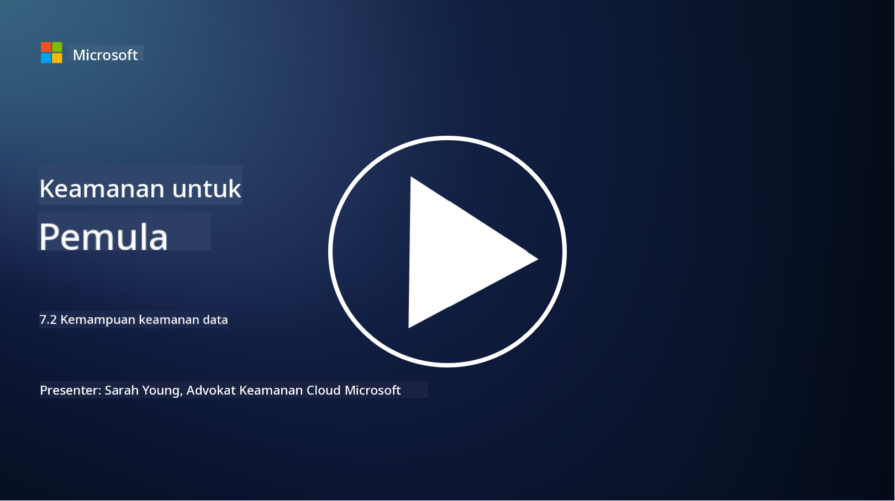

<!--
CO_OP_TRANSLATOR_METADATA:
{
  "original_hash": "50697add9758e54693442d502d2d5f8a",
  "translation_date": "2025-09-03T21:30:02+00:00",
  "source_file": "7.2 Data security capabilities.md",
  "language_code": "id"
}
-->
# Kemampuan Keamanan Data

Di bagian ini, kita akan membahas lebih detail tentang alat dan kemampuan inti yang digunakan dalam keamanan data:

**Pendahuluan**

Dalam pelajaran ini, kita akan membahas:

- Apa itu alat pencegahan kehilangan data?

- Apa itu alat manajemen risiko internal?

- Alat apa yang tersedia untuk retensi data?

## Apa itu alat pencegahan kehilangan data?

Alat Pencegahan Kehilangan Data (Data Loss Prevention/DLP) mengacu pada serangkaian solusi perangkat lunak dan teknologi yang dirancang untuk mencegah akses, berbagi, atau kebocoran data sensitif atau rahasia secara tidak sah dalam sebuah organisasi. Alat ini menggunakan inspeksi konten, penegakan kebijakan, dan pemantauan untuk mengidentifikasi dan melindungi data sensitif agar tidak terpapar atau disalahgunakan. Contoh produk DLP meliputi: Symantec Data Loss Prevention, McAfee Total Protection for Data Loss Prevention, Microsoft 365 DLP**: Terintegrasi dengan aplikasi Microsoft 365 untuk membantu organisasi mengidentifikasi dan melindungi data sensitif dalam email, dokumen, dan pesan.

## Apa itu alat manajemen risiko internal?

Alat Manajemen Risiko Internal membantu organisasi mengidentifikasi dan mengurangi risiko yang ditimbulkan oleh karyawan, kontraktor, atau mitra yang mungkin secara sengaja atau tidak sengaja mengkompromikan keamanan data. Alat ini memantau perilaku pengguna, pola akses, dan penggunaan data untuk mendeteksi aktivitas mencurigakan dan potensi ancaman internal. Contoh produk manajemen risiko internal meliputi: Microsoft Insider Risk Management (bagian dari Microsoft 365), Forcepoint Insider Threat Data Protection, Varonis Insider Threat Detection.

## Alat apa yang tersedia untuk retensi data?

Alat retensi data mencakup perangkat lunak dan solusi yang dirancang untuk mengelola retensi dan penghapusan data sesuai dengan kebijakan retensi data dan persyaratan hukum organisasi. Alat ini membantu mengotomatisasi proses retensi data untuk durasi tertentu dan menghapusnya dengan aman saat tidak lagi diperlukan. Contoh produk retensi data meliputi: Veritas Enterprise Vault, Commvault Complete Data Protection, Microsoft data lifecycle management. Solusi alat ini membantu organisasi menjaga kontrol atas retensi dan pembuangan data, memastikan kepatuhan terhadap regulasi perlindungan data sambil mengelola data secara efisien sepanjang siklus hidupnya.

## Bacaan lebih lanjut

- [Panduan Manajemen Postur Keamanan Data (DSPM) | CSA (cloudsecurityalliance.org)](https://cloudsecurityalliance.org/blog/2023/03/31/the-big-guide-to-data-security-posture-management-dspm/)
- [Pencegahan Kehilangan Data di berbagai endpoint, aplikasi, & layanan | Microsoft Purview](https://youtu.be/hvqq8L_0kgI)
- [18 Alat Perangkat Lunak Pencegahan Kehilangan Data Terbaik 2023 (Gratis + Berbayar) (comparitech.com)](https://www.comparitech.com/data-privacy-management/data-loss-prevention-tools-software/)
- [Pencegahan Kehilangan Data (nist.gov)](https://tsapps.nist.gov/publication/get_pdf.cfm?pub_id=904672)
- [Pelajari tentang manajemen risiko internal | Microsoft Learn](https://learn.microsoft.com/purview/insider-risk-management?WT.mc_id=academic-96948-sayoung)
- [Manajemen Siklus Hidup Data | IBM](https://www.ibm.com/topics/data-lifecycle-management)
- [Apa itu Manajemen Siklus Hidup Data (DLM)? | Praktik Terbaik 2023 (selecthub.com)](https://www.selecthub.com/big-data-analytics/data-lifecycle-management/)

---

**Penafian**:  
Dokumen ini telah diterjemahkan menggunakan layanan penerjemahan AI [Co-op Translator](https://github.com/Azure/co-op-translator). Meskipun kami berusaha untuk memberikan hasil yang akurat, harap diingat bahwa terjemahan otomatis mungkin mengandung kesalahan atau ketidakakuratan. Dokumen asli dalam bahasa aslinya harus dianggap sebagai sumber yang otoritatif. Untuk informasi yang bersifat kritis, disarankan menggunakan jasa penerjemahan profesional oleh manusia. Kami tidak bertanggung jawab atas kesalahpahaman atau penafsiran yang keliru yang timbul dari penggunaan terjemahan ini.