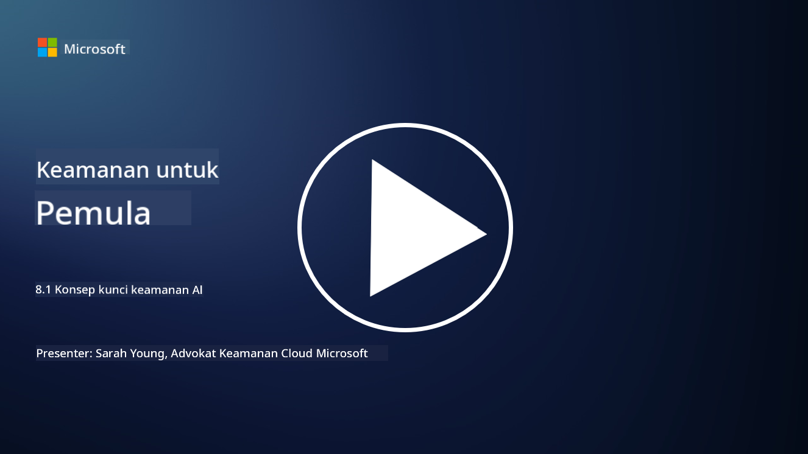

<!--
CO_OP_TRANSLATOR_METADATA:
{
  "original_hash": "66b61d96936cf25d20fcb411d4ce5227",
  "translation_date": "2025-09-03T19:43:56+00:00",
  "source_file": "8.1 AI security key concepts.md",
  "language_code": "id"
}
-->
# Konsep Kunci Keamanan AI

## Bagaimana keamanan AI berbeda dari keamanan siber tradisional?

Mengamankan sistem AI menghadirkan tantangan unik dibandingkan dengan keamanan siber tradisional, terutama karena sifat kemampuan pembelajaran dan proses pengambilan keputusan AI. Berikut adalah beberapa perbedaan utama:

- **Integritas Data**: Sistem AI sangat bergantung pada data untuk pembelajaran. [Memastikan integritas data ini sangat penting, karena penyerang dapat memanipulasi data untuk memengaruhi perilaku AI, sebuah taktik yang dikenal sebagai data poisoning.
- **Keamanan Model**: Model pengambilan keputusan AI itu sendiri dapat menjadi target. [Penyerang mungkin mencoba merekayasa balik model atau mengeksploitasi kelemahannya untuk membuat keputusan yang salah atau berbahaya.
- **Serangan Adversarial**: Sistem AI dapat rentan terhadap serangan adversarial, di mana perubahan kecil, sering kali tidak terlihat, pada data input dapat menyebabkan AI membuat kesalahan atau prediksi yang salah.
- **Keamanan Infrastruktur**: Meskipun keamanan siber tradisional juga berfokus pada perlindungan infrastruktur, sistem AI mungkin memiliki lapisan kompleksitas tambahan, seperti layanan berbasis cloud atau perangkat keras khusus, yang memerlukan langkah-langkah keamanan tertentu.
- **Pertimbangan Etika**: Penggunaan AI dalam keamanan membawa pertimbangan etika, seperti masalah privasi dan potensi bias dalam pengambilan keputusan, yang harus ditangani dalam strategi keamanan.

Secara keseluruhan, mengamankan sistem AI memerlukan pendekatan yang berbeda yang mempertimbangkan aspek unik teknologi AI, termasuk perlindungan data, model, dan proses pembelajaran AI, sambil juga menangani implikasi etika dari penerapan AI.

Keamanan AI dan keamanan siber tradisional memiliki banyak kesamaan, tetapi juga memiliki beberapa perbedaan yang mencolok karena karakteristik dan kemampuan unik sistem kecerdasan buatan. Berikut adalah perbedaannya:

- **Kompleksitas Ancaman**: Sistem AI memperkenalkan lapisan kompleksitas baru dalam keamanan siber. Keamanan siber tradisional terutama menangani ancaman seperti malware, serangan phishing, dan intrusi jaringan. Namun, sistem AI dapat rentan terhadap serangan seperti serangan adversarial, data poisoning, dan penghindaran model, yang secara khusus menargetkan algoritma pembelajaran mesin itu sendiri.

- **Permukaan Serangan**: Sistem AI sering kali memiliki permukaan serangan yang lebih besar dibandingkan dengan sistem tradisional. Hal ini karena mereka tidak hanya bergantung pada perangkat lunak tetapi juga pada data dan model. Penyerang dapat menargetkan data pelatihan, memanipulasi model, atau mengeksploitasi kerentanan dalam algoritma itu sendiri.

- **Adaptabilitas Ancaman**: Sistem AI dapat beradaptasi dan belajar dari lingkungannya, yang dapat membuatnya lebih rentan terhadap ancaman yang adaptif dan berkembang. Langkah-langkah keamanan siber tradisional mungkin tidak cukup untuk melindungi dari serangan yang terus berkembang berdasarkan perilaku sistem AI.

- **Interpretabilitas dan Penjelasan**: Memahami mengapa sistem AI membuat keputusan tertentu sering kali lebih menantang dibandingkan dengan sistem perangkat lunak tradisional. Kurangnya interpretabilitas dan penjelasan ini dapat membuat sulit untuk mendeteksi dan mengurangi serangan pada sistem AI secara efektif.

- **Masalah Privasi Data**: Sistem AI sering kali bergantung pada sejumlah besar data, yang dapat memperkenalkan risiko privasi jika tidak ditangani dengan baik. Langkah-langkah keamanan siber tradisional mungkin tidak cukup untuk menangani masalah privasi data yang spesifik pada sistem AI.

- **Kepatuhan Regulasi**: Lanskap regulasi untuk keamanan AI masih berkembang, dengan regulasi dan standar khusus muncul untuk menangani tantangan unik yang ditimbulkan oleh sistem AI. Kerangka kerja keamanan siber tradisional mungkin perlu diperluas atau disesuaikan untuk memastikan kepatuhan terhadap regulasi baru ini.

- **Pertimbangan Etika**: Keamanan AI melibatkan tidak hanya melindungi sistem dari serangan berbahaya tetapi juga memastikan bahwa sistem AI digunakan dengan cara yang etis dan bertanggung jawab. Ini mencakup pertimbangan seperti keadilan, transparansi, dan akuntabilitas, yang mungkin tidak terlalu menonjol dalam keamanan siber tradisional.

## Bagaimana AI sama dengan mengamankan sistem TI tradisional?

Mengamankan sistem AI berbagi beberapa prinsip dasar dengan keamanan siber tradisional:

- **Perlindungan Ancaman**: Baik sistem AI maupun sistem tradisional perlu dilindungi dari akses tidak sah, modifikasi data, dan penghancuran, serta ancaman umum lainnya.
- **Manajemen Kerentanan**: Banyak kerentanan yang memengaruhi sistem tradisional, seperti bug perangkat lunak atau konfigurasi yang salah, juga dapat berdampak pada sistem AI.
- **Keamanan Data**: Perlindungan data yang diproses sangat penting di kedua domain untuk mencegah pelanggaran data dan memastikan kerahasiaan.
- **Keamanan Rantai Pasokan**: Kedua jenis sistem rentan terhadap serangan rantai pasokan, di mana komponen yang dikompromikan dapat merusak keamanan seluruh sistem.

Kesamaan ini menunjukkan bahwa meskipun sistem AI memperkenalkan tantangan keamanan baru, mereka juga memerlukan penerapan praktik keamanan siber yang sudah mapan untuk memastikan perlindungan yang kuat. Ini adalah perpaduan antara memanfaatkan kebijaksanaan keamanan tradisional sambil beradaptasi dengan aspek unik teknologi AI.

## Bacaan lebih lanjut

- [Not with a Bug, But with a Sticker [Book] (oreilly.com)](https://www.oreilly.com/library/view/not-with-a/9781119883982/)
- [Intro to AI Security Part 1: AI Security 101 | by HarrietHacks | Medium](https://medium.com/@harrietfarlow/intro-to-ai-security-part-1-ai-security-101-b8662a9efe5)
- [Best practices for AI security risk management | Microsoft Security Blog](https://www.microsoft.com/en-us/security/blog/2021/12/09/best-practices-for-ai-security-risk-management/?WT.mc_id=academic-96948-sayoung)
- [OWASP AI Security and Privacy Guide | OWASP Foundation](https://owasp.org/www-project-ai-security-and-privacy-guide/)

---

**Penafian**:  
Dokumen ini telah diterjemahkan menggunakan layanan penerjemahan AI [Co-op Translator](https://github.com/Azure/co-op-translator). Meskipun kami berusaha untuk memberikan hasil yang akurat, harap diingat bahwa terjemahan otomatis mungkin mengandung kesalahan atau ketidakakuratan. Dokumen asli dalam bahasa aslinya harus dianggap sebagai sumber yang otoritatif. Untuk informasi yang bersifat kritis, disarankan menggunakan jasa penerjemahan profesional oleh manusia. Kami tidak bertanggung jawab atas kesalahpahaman atau penafsiran yang keliru yang timbul dari penggunaan terjemahan ini.