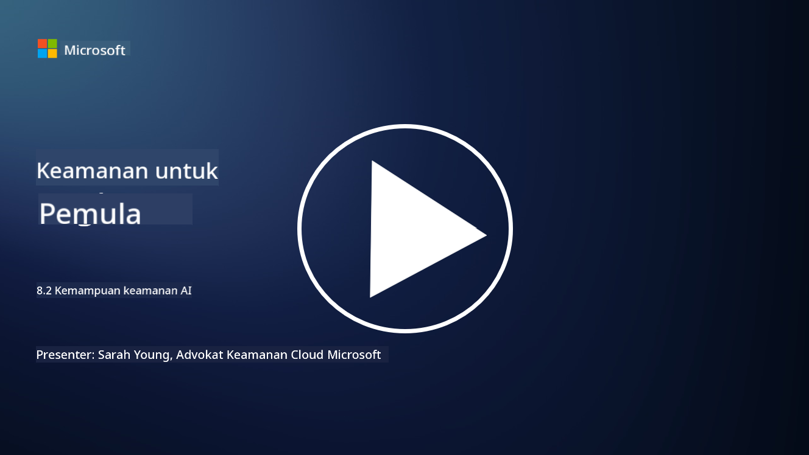

<!--
CO_OP_TRANSLATOR_METADATA:
{
  "original_hash": "b6bb7175672298d1e2f73ba7e0006f95",
  "translation_date": "2025-09-03T21:37:02+00:00",
  "source_file": "8.2 AI security capabilities.md",
  "language_code": "id"
}
-->
# Kemampuan keamanan AI

## Alat dan kemampuan apa yang saat ini tersedia untuk mengamankan sistem AI?

Saat ini, terdapat beberapa alat dan kemampuan yang tersedia untuk mengamankan sistem AI:

-   **Counterfit**: Alat otomatisasi open-source untuk pengujian keamanan sistem AI, dirancang untuk membantu organisasi melakukan penilaian risiko keamanan AI dan memastikan ketangguhan algoritma mereka.
-   **Alat Pembelajaran Mesin Adversarial**: Alat-alat ini mengevaluasi ketangguhan model pembelajaran mesin terhadap serangan adversarial, membantu mengidentifikasi dan mengurangi kerentanan.
-   **Toolkit Keamanan AI**: Tersedia toolkit open-source yang menyediakan sumber daya untuk mengamankan sistem AI, termasuk pustaka dan kerangka kerja untuk menerapkan langkah-langkah keamanan.
-   **Platform Kolaboratif**: Kemitraan antara perusahaan dan komunitas AI untuk mengembangkan pemindai keamanan khusus AI dan alat lainnya untuk mengamankan rantai pasokan AI.

Alat dan kemampuan ini merupakan bagian dari bidang yang terus berkembang yang didedikasikan untuk meningkatkan keamanan sistem AI terhadap berbagai ancaman. Mereka mewakili kombinasi penelitian, alat praktis, dan kolaborasi industri yang bertujuan untuk mengatasi tantangan unik yang ditimbulkan oleh teknologi AI.

## Bagaimana dengan AI red teaming? Apa perbedaannya dengan red teaming keamanan tradisional?

AI red teaming berbeda dari red teaming keamanan tradisional dalam beberapa aspek utama:

-   **Fokus pada Sistem AI**: AI red teaming secara khusus menargetkan kerentanan unik sistem AI, seperti model pembelajaran mesin dan alur data, bukan infrastruktur TI tradisional.
-   **Pengujian Perilaku AI**: Melibatkan pengujian bagaimana sistem AI merespons input yang tidak biasa atau tak terduga, yang dapat mengungkap kerentanan yang dapat dimanfaatkan oleh penyerang.
-   **Eksplorasi Kegagalan AI**: AI red teaming melihat kegagalan baik yang bersifat jahat maupun tidak disengaja, mempertimbangkan berbagai persona dan potensi kegagalan sistem di luar pelanggaran keamanan saja.
-   **Injeksi Prompt dan Generasi Konten**: AI red teaming juga mencakup pengujian kegagalan seperti injeksi prompt, di mana penyerang memanipulasi sistem AI untuk menghasilkan konten yang berbahaya atau tidak berdasar.
-   **AI yang Etis dan Bertanggung Jawab**: Merupakan bagian dari memastikan AI yang bertanggung jawab sejak awal, memastikan sistem AI tangguh terhadap upaya untuk membuatnya berperilaku dengan cara yang tidak diinginkan.

Secara keseluruhan, AI red teaming adalah praktik yang diperluas yang tidak hanya mencakup pengujian kerentanan keamanan tetapi juga pengujian jenis kegagalan sistem lainnya yang spesifik untuk teknologi AI. Ini adalah bagian penting dari pengembangan sistem AI yang lebih aman dengan memahami dan mengurangi risiko baru yang terkait dengan penerapan AI.

## Bacaan lebih lanjut

 - [Microsoft AI Red Team building future of safer AI | Microsoft Security Blog](https://www.microsoft.com/en-us/security/blog/2023/08/07/microsoft-ai-red-team-building-future-of-safer-ai/?WT.mc_id=academic-96948-sayoung)
 - [Announcing Microsoft’s open automation framework to red team generative AI Systems | Microsoft Security Blog](https://www.microsoft.com/en-us/security/blog/2024/02/22/announcing-microsofts-open-automation-framework-to-red-team-generative-ai-systems/?WT.mc_id=academic-96948-sayoung)
 - [AI Security Tools: The Open-Source Toolkit | Wiz](https://www.wiz.io/academy/ai-security-tools)

---

**Penafian**:  
Dokumen ini telah diterjemahkan menggunakan layanan terjemahan AI [Co-op Translator](https://github.com/Azure/co-op-translator). Meskipun kami berupaya untuk memberikan hasil yang akurat, harap diperhatikan bahwa terjemahan otomatis mungkin mengandung kesalahan atau ketidakakuratan. Dokumen asli dalam bahasa aslinya harus dianggap sebagai sumber yang berwenang. Untuk informasi yang bersifat kritis, disarankan menggunakan jasa terjemahan manusia profesional. Kami tidak bertanggung jawab atas kesalahpahaman atau penafsiran yang keliru yang timbul dari penggunaan terjemahan ini.