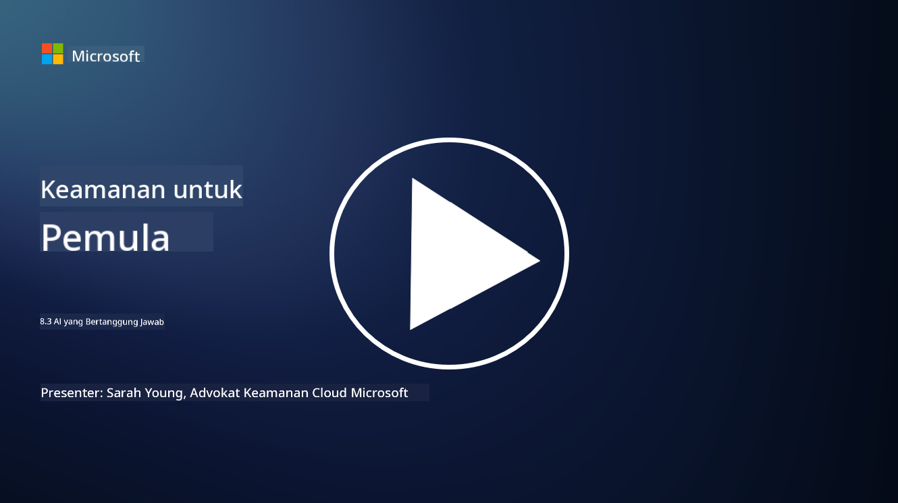

<!--
CO_OP_TRANSLATOR_METADATA:
{
  "original_hash": "5e9775ee91bde7d44577891d5f11c4c5",
  "translation_date": "2025-09-03T20:48:30+00:00",
  "source_file": "8.3 Responsible AI.md",
  "language_code": "id"
}
-->
# AI yang Bertanggung Jawab

## Apa itu AI yang bertanggung jawab dan bagaimana hubungannya dengan keamanan AI?

AI yang bertanggung jawab mengacu pada pengembangan dan penggunaan kecerdasan buatan dengan cara yang etis, transparan, dan selaras dengan nilai-nilai masyarakat. Ini mencakup prinsip-prinsip seperti keadilan, akuntabilitas, dan ketangguhan, memastikan bahwa sistem AI dirancang dan dioperasikan untuk memberikan manfaat bagi individu, komunitas, dan masyarakat secara keseluruhan.

Hubungan antara AI yang bertanggung jawab dan keamanan AI sangat penting karena:

- **Pertimbangan Etis**: AI yang bertanggung jawab melibatkan pertimbangan etis yang secara langsung memengaruhi keamanan, seperti privasi dan perlindungan data. Memastikan bahwa sistem AI menghormati privasi pengguna dan melindungi data pribadi adalah aspek utama dari AI yang bertanggung jawab.
- **Ketangguhan dan Keandalan**: Sistem AI harus tangguh terhadap manipulasi dan serangan, yang merupakan prinsip inti dari AI yang bertanggung jawab dan keamanan AI. Ini termasuk melindungi dari serangan adversarial dan memastikan integritas proses pengambilan keputusan AI.
- **Transparansi dan Penjelasan**: Bagian dari AI yang bertanggung jawab adalah memastikan bahwa sistem AI transparan dan keputusan mereka dapat dijelaskan. Hal ini penting untuk keamanan, karena para pemangku kepentingan perlu memahami bagaimana sistem AI beroperasi untuk mempercayai langkah-langkah keamanannya.
- **Akuntabilitas**: Sistem AI harus bertanggung jawab atas tindakan mereka, yang berarti harus ada mekanisme untuk melacak keputusan dan memperbaiki masalah. Ini selaras dengan praktik keamanan yang memantau dan mengaudit aktivitas sistem untuk mencegah dan merespons pelanggaran.

Pada dasarnya, AI yang bertanggung jawab dan keamanan AI saling terkait, dengan praktik AI yang bertanggung jawab meningkatkan keamanan sistem AI dan sebaliknya. Penerapan prinsip AI yang bertanggung jawab membantu menciptakan sistem AI yang tidak hanya secara etis baik tetapi juga lebih aman terhadap ancaman potensial.

## Bagaimana saya dapat memastikan sistem AI saya aman dan etis?

Memastikan bahwa sistem AI Anda aman dan etis melibatkan pendekatan multi-aspek yang mencakup langkah-langkah berikut:

- **Ikuti Prinsip Etis**: Patuhi pedoman etis yang menekankan kesejahteraan manusia, masyarakat, dan lingkungan; keadilan; perlindungan privasi; keandalan; transparansi; kemampuan untuk dipertanyakan; dan akuntabilitas.

- **Terapkan Langkah Keamanan yang Kuat**: Gunakan pengujian keamanan proaktif dan program manajemen kepercayaan, risiko, dan keamanan AI untuk melindungi dari ancaman dan kerentanan.

- **Libatkan Pemangku Kepentingan yang Beragam**: Libatkan berbagai peserta dalam proses pengembangan AI, termasuk ahli etika, ilmuwan sosial, dan perwakilan dari komunitas yang terdampak untuk memastikan perspektif dan nilai yang beragam dipertimbangkan.

- **Pastikan Transparansi dan Penjelasan**: Pastikan bahwa proses pengambilan keputusan AI transparan dan dapat dijelaskan, memungkinkan kepercayaan yang lebih besar dan identifikasi yang lebih mudah terhadap potensi bias atau kesalahan.

- **Jaga Privasi Data**: Lindungi privasi dan keaslian data melalui enkripsi dan langkah-langkah perlindungan data lainnya untuk menghormati hak privasi pengguna.

- **Aktifkan Pengawasan Manusia**: Terapkan mekanisme pengawasan manusia untuk memungkinkan keputusan yang dibuat oleh sistem AI dapat dipertanyakan dan memastikan akuntabilitas.

- **Tetap Terinformasi tentang Keamanan AI**: Ikuti perkembangan terbaru dalam penelitian dan diskusi tentang keamanan AI untuk memahami lanskap keamanan dan etika AI yang terus berkembang.

- **Patuhi Regulasi**: Pastikan bahwa sistem AI Anda mematuhi semua undang-undang dan regulasi yang relevan, yang mungkin mencakup undang-undang perlindungan data, undang-undang anti-diskriminasi, dan pedoman khusus industri.

## Bisakah Anda memberikan beberapa contoh masalah keamanan yang disebabkan oleh penggunaan AI yang tidak etis?

Berikut adalah beberapa contoh masalah keamanan yang dapat muncul dari penggunaan AI yang tidak etis:

- **Pengambilan Keputusan yang Bias**: Sistem AI dapat memperkuat dan memperbesar bias yang ada jika dilatih pada kumpulan data yang bias. Misalnya, jika mesin pencari dilatih pada data yang mencerminkan stereotip masyarakat, ia dapat menampilkan hasil pencarian yang bias, yang dapat menyebabkan perlakuan tidak adil atau diskriminasi.

- **AI dalam Sistem Peradilan**: Penggunaan AI dalam pengambilan keputusan hukum dapat menimbulkan kekhawatiran etis, terutama jika proses pengambilan keputusan AI kurang transparan atau dipengaruhi oleh data yang bias. Hal ini dapat menghasilkan hasil hukum yang tidak adil dan melanggar hak individu.

- **Manipulasi Sistem AI**: Sistem AI dapat rentan terhadap serangan adversarial, di mana sedikit modifikasi pada data input dapat menyebabkan hasil yang salah. Misalnya, kendaraan otonom dapat disesatkan untuk salah menafsirkan rambu lalu lintas, yang dapat menimbulkan risiko keselamatan.

- **Pengawasan yang Didukung AI**: Penggunaan AI untuk tujuan pengawasan dapat menyebabkan pelanggaran privasi, terutama jika digunakan tanpa persetujuan yang tepat atau dengan cara yang melanggar kebebasan individu. Hal ini dapat menjadi masalah khusus di rezim otoriter yang mungkin menggunakan AI untuk memantau dan menekan perbedaan pendapat.

Contoh-contoh ini menyoroti pentingnya pertimbangan etis dalam pengembangan dan penerapan sistem AI untuk mencegah masalah keamanan dan melindungi hak serta privasi individu.

## Bacaan lebih lanjut

 - [Microsoft Responsible AI Standard v2 General Requirements](https://query.prod.cms.rt.microsoft.com/cms/api/am/binary/RE5cmFl?culture=en-us&country=us&WT.mc_id=academic-96948-sayoung)
 - [Responsible AI (mit.edu)](https://sloanreview.mit.edu/big-ideas/responsible-ai/)
 - [13 Principles for Using AI Responsibly (hbr.org)](https://hbr.org/2023/06/13-principles-for-using-ai-responsibly)

---

**Penafian**:  
Dokumen ini telah diterjemahkan menggunakan layanan penerjemahan AI [Co-op Translator](https://github.com/Azure/co-op-translator). Meskipun kami berusaha untuk memberikan hasil yang akurat, harap diingat bahwa terjemahan otomatis mungkin mengandung kesalahan atau ketidakakuratan. Dokumen asli dalam bahasa aslinya harus dianggap sebagai sumber yang otoritatif. Untuk informasi yang bersifat kritis, disarankan menggunakan jasa penerjemahan profesional oleh manusia. Kami tidak bertanggung jawab atas kesalahpahaman atau penafsiran yang keliru yang timbul dari penggunaan terjemahan ini.