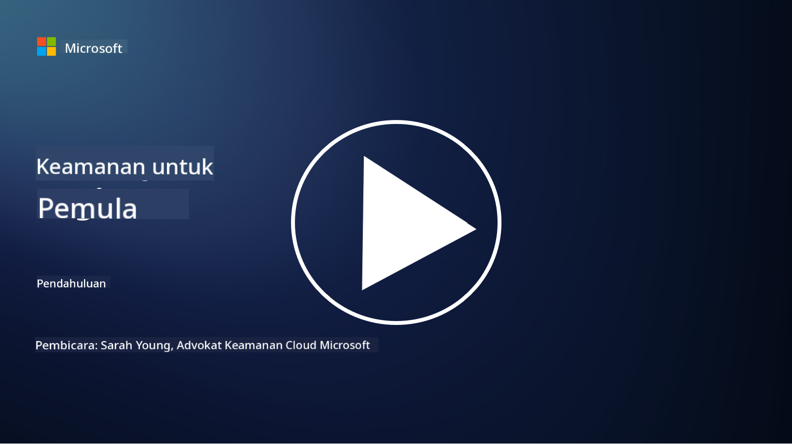

<!--
CO_OP_TRANSLATOR_METADATA:
{
  "original_hash": "fc3d47b5af0cc4fc954ae5d2ea2f7811",
  "translation_date": "2025-10-24T09:12:31+00:00",
  "source_file": "README.md",
  "language_code": "id"
}
-->

### 🌐 Dukungan Multi-Bahasa

#### Didukung melalui GitHub Action (Otomatis & Selalu Terbaru)

<!-- CO-OP TRANSLATOR LANGUAGES TABLE START -->
[Arab](../ar/README.md) | [Bengali](../bn/README.md) | [Bulgaria](../bg/README.md) | [Burma (Myanmar)](../my/README.md) | [Cina (Sederhana)](../zh/README.md) | [Cina (Tradisional, Hong Kong)](../hk/README.md) | [Cina (Tradisional, Makau)](../mo/README.md) | [Cina (Tradisional, Taiwan)](../tw/README.md) | [Kroasia](../hr/README.md) | [Ceko](../cs/README.md) | [Denmark](../da/README.md) | [Belanda](../nl/README.md) | [Estonia](../et/README.md) | [Finlandia](../fi/README.md) | [Prancis](../fr/README.md) | [Jerman](../de/README.md) | [Yunani](../el/README.md) | [Ibrani](../he/README.md) | [Hindi](../hi/README.md) | [Hungaria](../hu/README.md) | [Indonesia](./README.md) | [Italia](../it/README.md) | [Jepang](../ja/README.md) | [Korea](../ko/README.md) | [Lituania](../lt/README.md) | [Melayu](../ms/README.md) | [Marathi](../mr/README.md) | [Nepal](../ne/README.md) | [Norwegia](../no/README.md) | [Persia (Farsi)](../fa/README.md) | [Polandia](../pl/README.md) | [Portugis (Brasil)](../br/README.md) | [Portugis (Portugal)](../pt/README.md) | [Punjabi (Gurmukhi)](../pa/README.md) | [Rumania](../ro/README.md) | [Rusia](../ru/README.md) | [Serbia (Kiril)](../sr/README.md) | [Slovakia](../sk/README.md) | [Slovenia](../sl/README.md) | [Spanyol](../es/README.md) | [Swahili](../sw/README.md) | [Swedia](../sv/README.md) | [Tagalog (Filipina)](../tl/README.md) | [Tamil](../ta/README.md) | [Thai](../th/README.md) | [Turki](../tr/README.md) | [Ukraina](../uk/README.md) | [Urdu](../ur/README.md) | [Vietnam](../vi/README.md)
<!-- CO-OP TRANSLATOR LANGUAGES TABLE END -->

**Jika Anda ingin mendukung bahasa tambahan, daftar bahasa yang didukung tersedia [di sini](https://github.com/Azure/co-op-translator/blob/main/getting_started/supported-languages.md)**

#### Bergabunglah dengan Komunitas Kami 

# 🚀 Keamanan Siber untuk Pemula – Kurikulum

Di era adopsi teknologi AI yang terus berubah ini, semakin penting untuk memahami cara mengamankan sistem TI. Kursus ini dirancang untuk mengajarkan konsep dasar keamanan siber guna memulai pembelajaran Anda tentang keamanan. Kursus ini tidak bergantung pada vendor tertentu dan dibagi menjadi pelajaran-pelajaran kecil yang masing-masing memakan waktu sekitar 30-60 menit untuk diselesaikan. Setiap pelajaran dilengkapi dengan kuis singkat dan tautan untuk bacaan lebih lanjut jika Anda ingin mendalami topik tersebut.

Apa yang akan dipelajari dalam kursus ini 📚

- 🔐 Konsep dasar keamanan siber seperti triad CIA, perbedaan antara risiko, ancaman, dll.
- 🛡️ Memahami apa itu kontrol keamanan dan bentuk-bentuknya.
- 🌐 Memahami apa itu zero trust dan mengapa ini penting dalam keamanan siber modern.
- 🔑 Memahami konsep dan tema utama di bidang identitas, jaringan, operasi keamanan, infrastruktur, dan keamanan data.
- 🔧 Memberikan beberapa contoh alat yang digunakan untuk menerapkan kontrol keamanan.

Apa yang tidak dicakup oleh kursus ini 🙅‍♂️

- 🚫 Cara menggunakan alat keamanan tertentu.
- 🚫 Cara "meretas" atau melakukan red teaming/offensive security.
- 🚫 Belajar tentang standar kepatuhan tertentu.

Setelah menyelesaikan kursus ini, Anda dapat melanjutkan ke beberapa modul Microsoft Learn kami. Kami merekomendasikan Anda untuk melanjutkan pembelajaran dengan [Microsoft Security, Compliance, and Identity Fundamentals.](https://learn.microsoft.com/training/paths/describe-concepts-of-security-compliance-identity/?WT.mc_id=academic-96948-sayoung) 

Pada akhirnya, Anda dapat mempertimbangkan untuk mengikuti [Ujian SC-900: Microsoft Security, Compliance, and Identity Fundamentals.](https://learn.microsoft.com/credentials/certifications/exams/sc-900/?WT.mc_id=academic-96948-sayoung)

> 💁 Jika Anda memiliki masukan atau saran tentang kursus ini dan konten yang mungkin kurang, kami sangat ingin mendengar dari Anda!

## Ikhtisar Modul 📝 
| **Nomor Modul** | **Nama Modul**                           | **Konsep yang Diajarkan**                  | **Tujuan Pembelajaran**                                                                                          |
|-------------------|-------------------------------------------|--------------------------------------|-----------------------------------------------------------------------------------------------------------------|
| **1.1**           | Konsep dasar keamanan                   | [Triad CIA](https://github.com/microsoft/Security-101/blob/main/1.1%20The%20CIA%20triad%20and%20other%20key%20concepts.md)                        | Pelajari tentang kerahasiaan, ketersediaan, dan integritas. Juga autentisitas, non-repudiasi, dan privasi. |
| **1.2**           | Konsep dasar keamanan                   | [Ancaman keamanan siber umum](https://github.com/microsoft/Security-101/blob/main/1.2%20Common%20cybersecurity%20threats.md)        | Pelajari tentang ancaman keamanan siber umum yang dihadapi individu dan organisasi.                             |
| **1.3**           | Konsep dasar keamanan                   | [Memahami manajemen risiko](https://github.com/microsoft/Security-101/blob/main/1.3%20Understanding%20risk%20management.md)       | Pelajari tentang menilai dan memahami risiko – dampak/kemungkinan dan menerapkan kontrol.                                                                                                               | |
| **1.4**           | Konsep dasar keamanan                   | [Praktik dan dokumentasi keamanan](https://github.com/microsoft/Security-101/blob/main/1.4%20Security%20practices%20and%20documentation.md) | Pelajari tentang perbedaan antara kebijakan, prosedur, standar, dan regulasi/hukum.                         |
| **1.5**           | Konsep dasar keamanan                   | [Zero trust](https://github.com/microsoft/Security-101/blob/main/1.5%20Zero%20trust.md)                           | Pelajari tentang apa itu zero trust dan bagaimana pengaruhnya terhadap arsitektur? Apa itu pertahanan berlapis?                   |
| **1.6**           | Konsep dasar keamanan                   | [Model tanggung jawab bersama](https://github.com/microsoft/Security-101/blob/main/1.6%20Shared%20responsibility%20model.md)                           | Apa itu model tanggung jawab bersama dan bagaimana pengaruhnya terhadap keamanan siber?                  |
| **1.7**           | [Kuis akhir modul](https://github.com/microsoft/Security-101/blob/main/1.7%20End%20of%20module%20quiz.md)                        |                                      |                                                                                                                 |
| **2.1**           | Dasar-dasar manajemen identitas & akses | [Konsep utama IAM](https://github.com/microsoft/Security-101/blob/main/2.1%20IAM%20key%20concepts.md)                     | Pelajari tentang prinsip hak akses minimum, pemisahan tugas, bagaimana IAM mendukung zero trust.               |
| **2.2**           | Dasar-dasar manajemen identitas & akses | [Arsitektur zero trust IAM](https://github.com/microsoft/Security-101/blob/main/2.2%20IAM%20zero%20trust%20architecture.md)          | Pelajari tentang bagaimana identitas menjadi perimeter baru untuk lingkungan TI modern dan ancaman yang diatasi.          |
| **2.3**           | Dasar-dasar manajemen identitas & akses | [Kemampuan IAM](https://github.com/microsoft/Security-101/blob/main/2.3%20IAM%20capabilities.md)                     | Pelajari tentang kemampuan dan kontrol IAM untuk mengamankan identitas                                                  |
| **2.4**           | [Kuis akhir modul](https://github.com/microsoft/Security-101/blob/main/2.4%20End%20of%20module%20quiz.md)                        |                                      |                                                                                                                 |
| **3.1**           | Dasar-dasar keamanan jaringan             | [Konsep utama jaringan](https://github.com/microsoft/Security-101/blob/main/3.1%20Networking%20key%20concepts.md)              | Pelajari tentang konsep jaringan (alamat IP, nomor port, enkripsi, dll.)                                 |
| **3.2**           | Dasar-dasar keamanan jaringan             | [Arsitektur zero trust jaringan](https://github.com/microsoft/Security-101/blob/main/3.2%20Networking%20zero%20trust%20architecture.md)   | Pelajari tentang bagaimana jaringan berkontribusi pada arsitektur ZT end-to-end dan ancaman yang diatasi.                  |
| **3.3**           | Dasar-dasar keamanan jaringan             | [Kemampuan keamanan jaringan](https://github.com/microsoft/Security-101/blob/main/3.3%20Network%20security%20capabilities.md)        | Pelajari tentang alat keamanan jaringan – firewall, WAF, perlindungan DDoS, dll.                                    |
| **3.4**           | [Kuis akhir modul](https://github.com/microsoft/Security-101/blob/main/3.4%20End%20of%20module%20quiz.md)                        |                                      |                                                                                                                 |
| **4.1**           | Dasar-dasar operasi keamanan          | [Konsep utama SecOps](https://github.com/microsoft/Security-101/blob/main/4.1%20SecOps%20key%20concepts.md)                  | Pelajari tentang mengapa operasi keamanan itu penting dan bagaimana perbedaannya dengan tim operasi TI biasa.                  |
| **4.2**           | Dasar-dasar operasi keamanan          | [Arsitektur zero trust SecOps](https://github.com/microsoft/Security-101/blob/main/4.2%20SecOps%20zero%20trust%20architecture.md)       | Pelajari tentang bagaimana SecOps berkontribusi pada arsitektur ZT end-to-end dan ancaman yang diatasi.                      |
| **4.3**           | Dasar-dasar operasi keamanan          | [Kemampuan SecOps](https://github.com/microsoft/Security-101/blob/main/4.3%20SecOps%20capabilities.md)                  | Pelajari tentang alat SecOps – SIEM, XDR, dll.                                                                    |
| **4.4**           | [Kuis akhir modul](https://github.com/microsoft/Security-101/blob/main/4.4%20End%20of%20module%20quiz.md)                        |                                      |                                                                                                                 |
| **5.1**           | Dasar-dasar keamanan aplikasi         | [Konsep utama AppSec](https://github.com/microsoft/Security-101/blob/main/5.1%20AppSec%20key%20concepts.md)                  | Pelajari tentang konsep AppSec seperti desain yang aman, validasi input, dll.                                    |
| **5.2**           | Dasar-dasar keamanan aplikasi            | [Kemampuan AppSec](https://github.com/microsoft/Security-101/blob/main/5.2%20AppSec%20key%20capabilities.md)                  | Pelajari tentang alat AppSec: alat keamanan pipeline, pemindaian kode, pemindaian rahasia, dll.                 |
| **5.3**           | [Kuis akhir modul](https://github.com/microsoft/Security-101/blob/main/5.3%20End%20of%20module%20quiz.md)                        |                                      |                                                                                                                 |
| **6.1**           | Dasar-dasar keamanan infrastruktur       | [Konsep utama keamanan infrastruktur](https://github.com/microsoft/Security-101/blob/main/6.1%20Infrastructure%20security%20key%20concepts.md) | Pelajari tentang penguatan sistem, patching, kebersihan keamanan, keamanan kontainer.                          |
| **6.2**           | Dasar-dasar keamanan infrastruktur       | [Kemampuan keamanan infrastruktur](https://github.com/microsoft/Security-101/blob/main/6.2%20Infrastructure%20security%20capabilities.md) | Pelajari tentang alat yang dapat membantu keamanan infrastruktur seperti CSPM, keamanan kontainer, dll.         |
| **6.3**           | [Kuis akhir modul](https://github.com/microsoft/Security-101/blob/main/6.3%20End%20of%20module%20quiz.md)                        |                                      |                                                                                                                 |
| **7.1**           | Dasar-dasar keamanan data               | [Konsep utama keamanan data](https://github.com/microsoft/Security-101/blob/main/7.1%20Data%20security%20key%20concepts.md)           | Pelajari tentang klasifikasi dan retensi data serta mengapa hal ini penting bagi organisasi.                    |
| **7.2**           | Dasar-dasar keamanan data               | [Kemampuan keamanan data](https://github.com/microsoft/Security-101/blob/main/7.2%20Data%20security%20capabilities.md)           | Pelajari tentang alat keamanan data – DLP, manajemen risiko internal, tata kelola data, dll.                    |
| **7.3**           | [Kuis akhir modul](https://github.com/microsoft/Security-101/blob/main/7.3%20End%20of%20module%20quiz.md)                        |
| **8.1**           | Dasar-dasar keamanan AI                 | [Konsep utama keamanan AI](https://github.com/microsoft/Security-101/blob/main/8.1%20AI%20security%20key%20concepts.md)          | Pelajari tentang perbedaan dan kesamaan antara keamanan tradisional dan keamanan AI.                            |
| **8.2**           | Dasar-dasar keamanan AI                 | [Kemampuan keamanan AI](https://github.com/microsoft/Security-101/blob/main/8.2%20AI%20security%20capabilities.md)           | Pelajari tentang alat keamanan AI dan kontrol yang dapat digunakan untuk mengamankan AI.                        |
| **8.3**           | Dasar-dasar keamanan AI                 | [AI yang Bertanggung Jawab](https://github.com/microsoft/Security-101/blob/main/8.3%20Responsible%20AI.md)          | Pelajari tentang apa itu AI yang bertanggung jawab dan bahaya spesifik AI yang perlu diketahui oleh profesional keamanan. |
| **8.4**           | [Kuis akhir modul](https://github.com/microsoft/Security-101/blob/main/8.4%20End%20of%20module%20quiz.md)     

## 🎒 Kursus Lainnya 

Tim kami juga membuat kursus lainnya! Lihat:

<!-- CO-OP TRANSLATOR OTHER COURSES START -->
### Azure / Edge / MCP / Agen

---
 
### Seri AI Generatif

[-9333EA?style=for-the-badge&labelColor=E5E7EB&color=9333EA)](https://github.com/microsoft/Generative-AI-for-beginners-dotnet?WT.mc_id=academic-105485-koreyst)
[-C084FC?style=for-the-badge&labelColor=E5E7EB&color=C084FC)](https://github.com/microsoft/generative-ai-for-beginners-java?WT.mc_id=academic-105485-koreyst)
[-E879F9?style=for-the-badge&labelColor=E5E7EB&color=E879F9)](https://github.com/microsoft/generative-ai-with-javascript?WT.mc_id=academic-105485-koreyst)

---
 
### Pembelajaran Inti

---
 
### Seri Copilot

<!-- CO-OP TRANSLATOR OTHER COURSES END -->

## Mendapatkan Bantuan

Jika Anda mengalami kesulitan atau memiliki pertanyaan tentang membangun aplikasi AI, bergabunglah:

Jika Anda memiliki masukan produk atau menemukan kesalahan saat membangun, kunjungi:

---

**Penafian**:  
Dokumen ini telah diterjemahkan menggunakan layanan penerjemahan AI [Co-op Translator](https://github.com/Azure/co-op-translator). Meskipun kami berupaya untuk memberikan hasil yang akurat, harap diketahui bahwa terjemahan otomatis mungkin mengandung kesalahan atau ketidakakuratan. Dokumen asli dalam bahasa aslinya harus dianggap sebagai sumber yang otoritatif. Untuk informasi yang bersifat kritis, disarankan menggunakan jasa penerjemahan manusia profesional. Kami tidak bertanggung jawab atas kesalahpahaman atau penafsiran yang timbul dari penggunaan terjemahan ini.